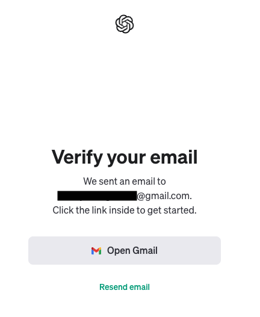

# Making Requests From ChatGPT

## Goals

With an idea of what LLMs are and how they’re used to create generative AI tools, we are well-equipped to dip our toes into investigating one of these tools, ChatGPT, and see how it can be of use to ourselves and others outside of programming. 

Our goals for this lesson are to:
- Get acquainted with specific uses for ChatGPT and other generative AIs outside of writing code
- Set up ChatGPT access & navigate the web interface
- Send our first prompt to ChatGPT

## Vocabulary and Synonyms

| Vocab | Definition | Synonyms | How to Use in a Sentence |
| ----- | ---------- | -------- | ------------------------ |
| Natural Language Processing | A form of artificial intelligence (AI) that focuses on the ways computers and people can interact using human language. Natural Language Processing techniques let us create tools that can analyze, understand, and respond to speech and written text, allowing us to interact with computers using natural modes of communication. | NLP | “I used Natural Language Processing techniques to analyze text from customer feedback and categorize it.” |
| Large Language Model | A type of AI algorithm that uses deep learning techniques and massively large data sets to perform a variety of natural language processing (NLP) tasks. They work by taking an input text and repeatedly predicting the next token or word. | LLM | “Large Learning models are the type of algorithm that powers many new creative AI tools.” |
| Generative Artificial Intelligence | Generative artificial intelligence is a term for algorithms (such as ChatGPT) that can be used to create new content, such as high-quality text, images, and other content based on the data they were trained on. | Generative AI | “I asked a generative AI to create a short story about my family.” |
| Prompt | A text description of the task that an AI should perform. | | “I wrote a prompt that asks for a 5 paragraph essay on Shirley Chisholm’s accomplishments” |
| Prompt Engineering | The process of structuring text to describe tasks to be more easily processed and understood by generative AI tools.  | | “My initial prompt didn’t return what I expected, so I’m practicing a few prompt engineering techniques and rewriting my prompt to get more complete results.” |

## How are People Using AI Assistance and Generative Tools?

The readings from the Generative AI Overview lesson outlined a handful of uses for Large Language Models in the business world, but how can they help us, right now, in our own lives? We’ve listed some more use cases below with examples of how folks have used them, but there are a couple caveats to think about before we dive into our own prompting:
- Like any website with unknown sources, if an AI tool like ChatGPT is generating concrete information like dates and names that we did not provide it, we want to do our own web searches to confirm those details are accurate and not fabricated or otherwise false. We’ll dive more into techniques for verifying responses shortly.
- There are legal considerations if we use AI tools for public work or businesses. Many tools have been trained on massive data sets with text, art and other works scraped from the internet without legal clearance. Using the art or text generated by an AI tool verbatim may be legally restricted unless the tool has been exclusively constructed with data that has been authorized for training and generation.

| Use Case | Example(s) or Explanation | 
| -------- | ------------------------- |
| Generating ideas | Given a description of a person, get ideas for a birthday gift. Given a particular dietary restriction, create a week of meal plans.  |
| Explaining terms | If an article has a word or phrase that is difficult to look up, we can provide some of the text as context and ask for an explanation. |
| Summarizing a long text into key points  | If we have an article or long email we can ask generative AI tools to generate a short description with the highlights. |
| Categorizing sentiment from text | If we ran a website or moderated for a forum, we could ask for user feedback to be categorized to learn which areas are painful to users. |
| Formatting information | Creating a table of javascript syntax for a study guide |
| Generating quizzes for study | Given notes on a particular subject, generate 5 questions based on the notes |
| First drafts of letters or emails | Given a list of information to include, we can ask an AI tool to craft the letter, then review and customize it to our needs. |
| Reviewing text or resumes for spelling, grammar, & consistency | AI tools can be an extra set of eyes for language features like punctuation as well as consistency in how you format information across the text. |
| Generating images with specific AI tools like DALL-E, Midjourney, Photoshop’s Firefly, and more | Creating art to go with a story for a personal gift. Generating a wallpaper with handy python commands |

## Accessing ChatGPT

We're readied with some background on what generative AI tools are and how we can use them, so let's sign up for ChatGPT to get hands-on experience!

### Signing up

1. Our first step is to visit [chat.openai.com](https://chat.openai.com) and press the "Sign Up" button to start creating an account. 

  
*Fig. ChatGPT landing page*

2. There are a few options, you can sign up with existing Google, Microsoft, or Apple accounts by using their buttons to follow their authentication flows, or you can enter an email in the "Email address" field and press continue.

  
*Fig. Options to sign up for ChatGPT*

3. If you choose to sign up by email, you'll be taken to a screen where you can update your email if necessary and choose a password.

  
*Fig. Create password screen for email sign up flow*

4. Once you submit your password, you'll be taken to a notification to check your email for a verification message. You'll need to open the link in the email they sent to verify and finish setting up your account.

  
*Fig. Email verification message*

5. You can log in with your new account at [chat.openai.com](https://chat.openai.com) once your email is verified. The first time you log in, you'll be asked to enter your first name, last name, and birth date to verify your age.

  
*Fig. First log-in information form*

6. After pressing Submit, you will be asked to enter a phone number that can be used to verify future log ins. 

  
*Fig. Form to submit phone number to receive a verification text*

7. You'll be taken to a new page where you need to enter a verification code after entering your phone number. A text will be sent to the phone number you submitted with your verification code.

   
*Fig. Form to submit verification code*

8. At this point you should be redirected a brand new chat page! We should see "ChatGPT 3.5" at the top, letting us know we are working with OpenAI's 3.5 model. 

### !callout-info

## ChatGPT Model Version
We will only be utilizing ChatGPT's 3.5 model in this curriculum, as it is available to work with at no cost for the uses we'll explore.  

### !end-callout

  
*Fig. Empty chat page in ChatGPT*

### Starting a new chat 

It can be helpful to send related prompts to the same chat to keep similar work or tasks organized. However, it can get cluttered and difficult to find particular responses if we use one chat for everything. If you want to start a new piece of work or try things out in a new chat, you can start a new chat at any time by using the "New chat" button at the top of the left side panel of the chat window. If you have created more than one chat, the left side panel is where you will see them listed to jump back to.

## Submitting your first prompt

At the bottom of the chat page, we should see a field labeled "Message ChatGPT..." for us to submit our prompts. 

For longer prompts, or prompts that require specific spacing, we recommend writing your prompt in a text editor and pasting it over to the chat window when ready.

For our first prompt, let's start with something simple that shows how creative generative AIs can be. Submit the following prompt and see what you get!

> Write a story about a frog.

Once you submit the prompt, you'll see ChatGPT construct the story, very quickly, a word or phrase at a time.

## Response tools

Once the response is finished, there is a bar of icons under the response that provides some helpful tools. 

  
*Fig. response tools after submitting a prompt*

In-order from left to right those tools are:
- Copy
- Thumbs Up
- Thumbs Down
- Regenerate

**Copy**

Super helpful when we have a very long response which we want to copy without scrolling around.

**Thumbs Up**

Used to indicate if the response generated by ChatGPT was satisfactory. When we click the thumbs up, a pop-up will be displayed asking if there is any feedback we'd like to share about why it was a good response.

  
*Fig. Form to submit positive feedback about a response*

**Thumbs Down**

We'll look at techniques we can apply to our prompts to help focus a generative AI's responses in the next lesson, but how can we let ChatGPT know it didn't perform as expected? Similar to the Thumbs Up tool, when we press the Thumbs Down button we'll see a pop-up with a field where we can explain the issue with the response, as well as some checkboxes for flagging harmful content.

  
*Fig. Form to submit negative feedback about a response*

**Regenerate**

Makes ChatGPT create a new response for the prompt that was submitted. Can be handy when we want ChatGPT to create several options for us to evaluate.

## More on Regenerating a Response

Let's go back to our initial prompt: "`Write a story about a frog.`" We didn't ask for any constraints on how long the story should be or subject matter other than it had to include a frog. Say that we wanted a different story about a frog – we could add to our prompt if we had specific things to include, but what if we just want another frog story?

One option would be to pose the prompt again again, retype and submit "`Write a story about a frog.`", but as we learned above, there's an even easier way – the "Regenerate" button! When we use the "Regenerate" button, just like when we first sent the prompt, we'll see the text being put together a word or phrase at a time until it's finished. The new response will replace the spot in the chat where the original response was, but the original isn't lost to us. 

If we take a look at the bottom of the response after regenerating, in front of our original toolbar we should see additional text and buttons that look like: `< 2 / 2 >`. 

  
*Fig. response tools after generating a second response*

The first number indicates how many versions of the response there are, and the second number is which version of the response we are currently viewing. The arrows are buttons that let us navigate forwards and backwards through the responses so we can see all of the versions.

## Summary

We now have an understanding of some of the many uses for Generative AIs outside of coding, how to get set up with ChatGPT, and where to start a chat and submit prompts 🎉. 

From here, it's up to you where you want to go with prompting! You can make changes to the frog story prompt to see how you can influence the tale, try out some of the example uses we listed out earlier, or follow your curiosity about other applications. As you try new prompts that you find interesting, feel free to share them in Slack with your classmates.

This is a great time to pause and think about what questions you have on writing prompts and reflect on how you might want to use LLMs and Generative AI tools now and in the future.

## Check for Understanding

<!-- prettier-ignore-start -->
### !challenge
* type: checkbox
* id: 4f5ad3cc-859f-11ee-b9d1-0242ac120002
* title: Using vocabulary

##### !question
Select the statements that are true.
##### !end-question

##### !options
* 'Large Learning Models' and 'Generative AIs' are synonymous
* We need to fact check responses from Generative AI tools
* Generative AIs can be used to create study aides, write drafts, and review text
* The responses a generative AI creates can be used as-is for any purpose
* Generative AIs can only output plain text without formatting
##### !end-options

##### !answer
* We need to fact check responses from Generative AI tools
* Generative AIs can be used to create study aides, write drafts, and review text
##### !end-answer

##### !explanation
1. 'Large Learning Models' and 'Generative AIs' are synonymous
   - Incorrect: All LLMs are a form of generative AI, however, not all generative AI tools are built on LLMs. Generative AIs are a broad category of AI, and refers to any artificial intelligence that can create new content. Generative AI tools are built on AI models, such as a large language model. LLMs are the text-generating part of generative AI.
2. We need to fact check responses from Generative AI tools
   - Correct: Generative AIs can fully fabricate information, so we need to be critical of any concrete information like names, places, and dates.
3. Generative AIs can be used to create study aides, write drafts, and review text
   - Correct: There are myriad applications for generative AI tools and folks keep coming up with new uses all the time!
4. The responses a generative AI creates can be used as-is for any purpose
   - Incorrect: Most tools are not built on datasets that have been fully cleared for public use. There are a few specialized generative AIs like Photoshop's Firefly that have ensured all of their training data has full permission to be used for both training and generating new materials.
5. Generative AIs can only output plain text without formatting
   - Incorrect: There are Generative AIs that output graphics, and tools built on LLMs like ChatGPT can handle complicated markdown formatting to structure output.
##### !end-explanation

### !end-challenge
<!-- prettier-ignore-end -->