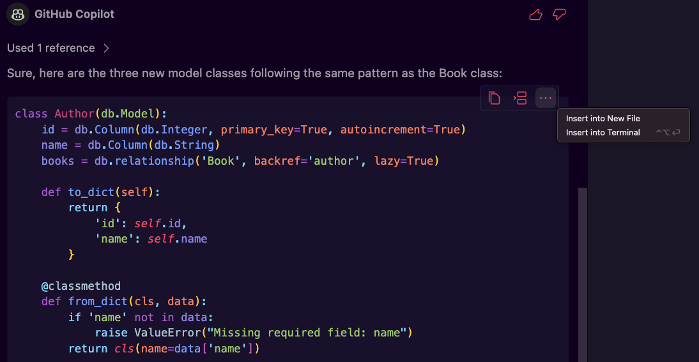
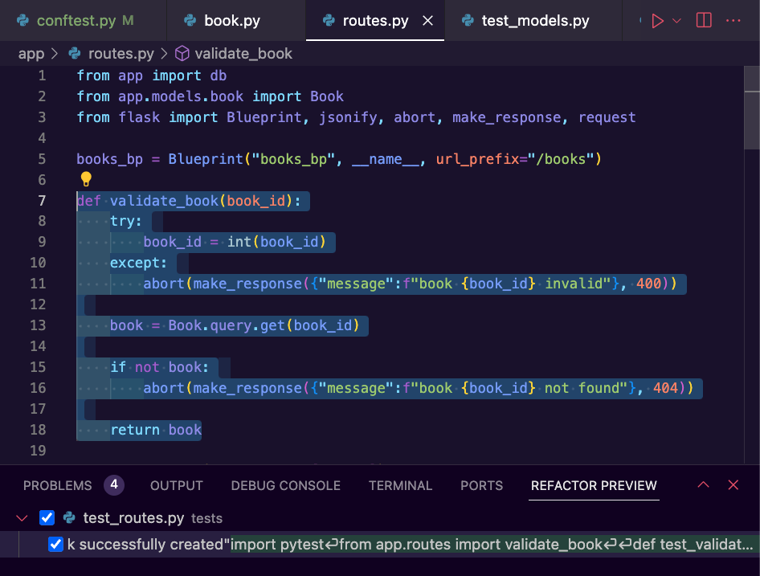

#  Copilot in Projects

## Goals

We know how to generate code, start a chat, and work with Copilot's tools in VS Code, but what does it look like to apply what we've learned in a project? We'll mosey back to the [hello-books example project](https://github.com/AdaGold/hello-books-api) from Unit 2 to see how we can use Copilot to increase our productivity.

Our goals for this lesson are to show how we can use Copilot to:
- quickly write new code that follows a consistent format
- help us with generating test cases 
- assist in updating code when refactoring 

## Writing new code with Copilot

We will not be following the same path as Unit 2 did with `hello-books`. To keep things shorter and focus on areas where we can benefit from Copilot we will check out a couple branches and use the code at that state as an example to work from.

For now, we're going to start at the branch [`03a-models-setup`](https://github.com/AdaGold/hello-books-api/tree/03a-models-setup) so that the database connection is set up for us in our `__init__.py` and we have a single model class `Book` already existing. 

Our plans in this section of the lesson are to:
- Add the convenience methods `from_dict` & `to_dict` to the existing `Book` model 
- Write tests for our new functions
- Create the `Author`, `Genre`, and `BookGenre` model classes.

### Adding convenience functions to `Book`

If we open up the `Book` class, we should have the bare bones of a model defining 3 properties: `id`, `title`, and `description`. Our first step will be to add our `to_dict` function. To make GET requests easier, we know we that we want a function that takes a `Book` model and converts it to a dictionary for us, so let's write a comment to that effect. Add the following comment to your `Book.py` file then press enter to see what Copilot suggests:

```
# An instance function that returns a  
# dictionary which represents the book model
```

In our case, Copilot immediately suggested a function signature and body that matched our needs for the moment:

  
*Fig. Our function description comment above with a suggestion for the `to_dict` function from Copilot in grey below*

We could use a comment to try generating our `from_dict` class method, but instead we'll use the inline chat to prompt Copilot. Let's use `CMD + i` to open an inline chat and enter the following:

> Please write a class function that takes in a dictionary and returns a new Book instance created from the input dictionary's contents

When we submit the prompt, we may see a response like:

  
*Fig. Our prompt entered in the Copilot inline chat with a suggestion for the `from_dict` function from Copilot in a temporary window below*

The suggestion is succinct and will create a new class instance for us from a dictionary, but is this what we actually want? What happens if the dictionary is missing `title` or `description` keys? Does this take advantage of the `autoincrement` feature of SQLAlchemy that we're using for the `id`?

No, this isn't what we want! We have no error handling for missing properties, and this one-liner will set a Book's `id` to whatever is in the `id` key of the dictionary if it exists – the `id` property's `autoincrement` flag will be ignored. 

We need a more robust function, so let's update our prompt. There are 2 significant features missing: error handling and utilizing `autoincrement`. 

<details>
  <summary>
    Take a moment to try adding to the original prompt yourself, then expand this section to see our updated prompt and what Copilot suggested.
  </summary>

**Updated prompt:**   
> Please write a class function that takes in a dictionary and returns a new Book instance created from the input dictionary's contents. The function should include error handling for missing values and should take advantage of the autoincrement feature.


**Suggestion from Copilot: ** 
```
@classmethod
def from_dict(cls, data):
    if 'title' not in data or 'description' not in data:
        raise ValueError("Missing required fields: title or description")
    return cls(title=data['title'], description=data['description'])
```

Our final prompt doesn't change our initial sentence; we were able to add one new sentence that encapsulated our requirements, and all of a sudden we have a suggestion that meets our current needs! The method may not look exactly as we might have written it out, but if it bothers us or doesn't follow our team or project's conventions, we can always update the code after accepting the suggestion.  
</details>

### Testing the Book class

These functions aren't very long, but it's still a good idea to test them in case of any future changes to this class or related code. We'll use Copilot to help us get started on brainstorming unit tests from the inline chat.

In our `Book.py` file, highlight the whole text, bring up the inline Copilot chat with `CMD + i`, then type in the shortcut `/tests`.

  
*Fig. Selected text in Book.py with the Copilot inline chat up to enter "/tests"*

Once we hit `Enter` Copilot will create a temporary section on the VS Code window with unit tests that we can review. 


*Fig. Copilot's UI to preview tests for the Book.py file*

If we feel like the tests presented are a good starting place, we can use the "Create" button to make a new file with those tests pre-populated. 

### !callout-warning

## Test File Location

The "Create" button will generate the new test file in the current folder, in our case, in the same folder as our `Book` model. This isn't really what we want, but we can click the arrow next to the "Create" button to see a drop down with a "Create As" option. This will let us change the default name of the file and choose where it gets saved so that we can keep all of our test files together, separate from our source code. If you don't use "Create As", you can drag and drop test files from where they were created to the test folder at any later time.

  
*Fig. "Create As" in the drop down next to the "Create" button*

### !end-callout

We want to carefully review the tests that Copilot generates for things like missing cases or tricky edge cases. We may get lucky and have all of our bases covered, but we'll often want to add or update the tests slightly. In our case, Copilot came up with 3 tests that nearly have us covered:

```
def test_book_to_dict():
    book_data = {
        'id': 1,
        'title': 'The Hobbit',
        'description': 'A book about a hobbit'
    }
    book = Book(**book_data)
    book_dict = book.to_dict()

    assert book_dict == book_data

def test_book_from_dict():
    book_data = {
        'title': 'The Hobbit',
        'description': 'A book about a hobbit'
    }
    book = Book.from_dict(book_data)

    assert book.title == 'The Hobbit'
    assert book.description == 'A book about a hobbit'

def test_book_from_dict_missing_fields():
    book_data = {
        'title': 'The Hobbit'
    }

    with pytest.raises(ValueError):
        Book.from_dict(book_data)
```

We have tests that ensure that for a given book model, the dictionary that `to_dict` creates contains the right data, and that a book created by `from_dict` stores the title and description from the input dictionary into the right properties. Our last test ensures that if the 'description' key is missing from the input dictionary that we raise an error, but what if the title is missing instead? 

To make our test suite as complete as possible, we can update the name of our last test to `test_book_from_dict_missing_description` and add one more test `test_book_from_dict_missing_title` to make sure we have that edge case covered. We can do this by hand, but feel free to try out highlighting the last test and asking Copilot to do that work for us!

<details>
  <summary>
    Try it out yourself, then expand this section to see how we asked Copilot to handle the test updates.
  </summary>

  **Updated prompt:** 
  > Please rename this test to reflect that it only tests what happens if the description field is missing. Next, add a new test for the from_dict function that tests the scenario where the title is missing but the description is present

  **Updated test and newly added test:**  
  ```
  def test_book_from_dict_missing_description():
      book_data = {
          'title': 'The Hobbit'
      }

      with pytest.raises(ValueError):
          Book.from_dict(book_data)

  def test_book_from_dict_missing_title():
      book_data = {
          'description': 'A book about a hobbit'
      }

      with pytest.raises(ValueError):
          Book.from_dict(book_data)
  ```
</details>

### Creating `Author`, `Genre`, and `BookGenre` models

We can ask Copilot to help us write something even if we don;t have a template or example, but it's easier for Copilot to reason about what we want if we have samples to show. Here, we have a `Book` model that we can use as a pattern when asking Copilot to help us create the `Author`, `Genre`, and `BookGenre` models. 

Before we ask Copilot for help, the first thing we need to do is gather the requirements for our new classes. If we recall back to the Unit 2 lessons, we want our models to have the following properties:

**Author**
- autoincrementing `id`
- string `name`
- a property to access `Books` associated with a particular `Author` instance

**Genre** 
- autoincrementing `id`
- string `name`

**BookGenre**
- foreign key connection to the `Book` model
- foreign key connection to the `Genre` model

Now that we're reminded ourselves of what the classes need to do, we can use these details to craft a prompt for Copilot. This time, let's use `CTRL + CMD + i` to open up the Copilot chat pane. We can type directly in the chat box, but it can be helpful to write up prompts in a text editor first, especially if they span multiple lines. 

<details>
  <summary>
    Before continuing, pause for a moment and try to write a prompt that uses our class requirements to describe what we want from Copilot. When you're done, expand this section to see the prompt we used. 
  </summary>
  
  **Our Prompt:**
  > I would like help creating three more model classes that follow the same pattern as the Book class.
  >  
  > The first new model should be named Author and have 3 properties: an auto incrementing `id`, a string `name`, and a relationship to the Book model that back populates a property named `author`.
  >  
  > The second new model should be named Genre and have 2 properties: an auto incrementing `id` and a string `name`.
  >   
  > The last new model should be named BookGenre and act as a join table between the Book and Genre models.
</details>

Being an AI tool, we will likely see slightly different responses, even with the same prompt. When we submit our prompt, Copilot will create suggestions for us in the chat pane, and we are given some controls of what to do with that code. In the screenshot below, the controls from left to right are:
- Copy - add all the code to the clipboard to paste where you'd like
- Insert at Cursor - will add the code directly to an open file where your cursor currently is
- More Actions - When clicked will show a dropdown with the options below
  - Insert into New File
  - Insert into Terminal

  
*Fig. Copilot Chat's controls for code suggestions*

Before we make any decisions about where we want to put the code, let's examine what Copilot suggested for us.

> Sure, here are the three new model classes following the same pattern as the Book class:
> 
> ```
> class Author(db.Model):
>     id = db.Column(db.Integer, primary_key=True, autoincrement=True)
>     name = db.Column(db.String)
>     books = db.relationship('Book', backref='author', lazy=True)
>  
>     def to_dict(self):
>         return {
>             'id': self.id,
>             'name': self.name
>         }
>  
>     @classmethod
>     def from_dict(cls, data):
>         if 'name' not in data:
>             raise ValueError("Missing required field: name")
>         return cls(name=data['name'])
>  
> class Genre(db.Model):
>     id = db.Column(db.Integer, primary_key=True, autoincrement=True)
>     name = db.Column(db.String)
>  
>     def to_dict(self):
>         return {
>             'id': self.id,
>             'name': self.name
>         }
> 
>     @classmethod
>     def from_dict(cls, data):
>         if 'name' not in data:
>             raise ValueError("Missing required field: name")
>         return cls(name=data['name'])
>  
> class BookGenre(db.Model):
>     book_id = db.Column(db.Integer, db.ForeignKey('book.id'), primary_key=True)
>     genre_id = db.Column(db.Integer, db.ForeignKey('genre.id'), primary_key=True)
>     book = db.relationship('Book', backref=db.backref('book_genres', cascade='all, delete'))
>     genre = db.relationship('Genre', backref=db.backref('book_genres', cascade='all, delete'))
> ```
> Please note that you need to add a foreign key field in the `Book` model to reference the `Author` model. Also, the `BookGenre` model is a many-to-many relationship table between `Book` and `Genre`. It has two primary keys, `book_id` and `genre_id`, which are foreign keys referencing `Book` and `Genre` respectively.

Overall, this is a solid start! The classes all meet the property requirements we outlined, the `Author` and `Genre` classes have the `to_dict` and `from_dict` convenience functions defined, and Copilot even gave us a heads up about the changes we'll need to make to the `Book` class for everything to work.

However, the code isn't perfect – the Author and BookGenre classes are using a deprecated keyword `backref` whenever creating a relationship with another model. We want to replace the uses of `backref` with the `back_populates` syntax, and we also still need to update our `Book` class to work with these new classes. 

We can get help from Copilot with both of these tasks at the same time with a prompt like:  

> Please show all of the model classes including Book with updates to use back_populates instead of backref

**Copilot's response:**
> Sure, here are all the model classes including `Book` with the updates to use `back_populates` instead of `backref`:
> ```
> from app import db
>  
> class Book(db.Model):
>     id = db.Column(db.Integer, primary_key=True, autoincrement=True)
>     title = db.Column(db.String)
>     description = db.Column(db.String)
>     author_id = db.Column(db.Integer, db.ForeignKey('author.id'))
>     author = db.relationship('Author', back_populates='books')
>     book_genres = db.relationship('BookGenre', back_populates='book')
>  
>     def to_dict(self):
>         return {
>             'id': self.id,
>             'title': self.title,
>             'description': self.description
>         }
>  
>     @classmethod
>     def from_dict(cls, data):
>         if 'title' not in data or 'description' not in data:
>             raise ValueError("Missing required fields: title or description")
>         return cls(title=data['title'], description=data['description'])
>  
> class Author(db.Model):
>     id = db.Column(db.Integer, primary_key=True, autoincrement=True)
>     name = db.Column(db.String)
>     books = db.relationship('Book', back_populates='author')
>  
>     def to_dict(self):
>         return {
>             'id': self.id,
>             'name': self.name,
>         }
>  
>     @classmethod
>     def from_dict(cls, data):
>         if 'name' not in data:
>             raise ValueError("Missing required field: name")
>         return cls(name=data['name'])
>  
> class Genre(db.Model):
>     id = db.Column(db.Integer, primary_key=True, autoincrement=True)
>     name = db.Column(db.String)
>     book_genres = db.relationship('BookGenre', back_populates='genre')
>  
>     def to_dict(self):
>         return {
>             'id': self.id,
>             'name': self.name
>         }
>  
>     @classmethod
>     def from_dict(cls, data):
>         if 'name' not in data:
>             raise ValueError("Missing required field: name")
>         return cls(name=data['name'])
>  
> class BookGenre(db.Model):
>     book_id = db.Column(db.Integer, db.ForeignKey('book.id'), primary_key=True)
>     genre_id = db.Column(db.Integer, db.ForeignKey('genre.id'), primary_key=True)
>     book = db.relationship('Book', back_populates='book_genres')
>     genre = db.relationship('Genre', back_populates='book_genres')
> ```
> Please note that the back_populates option is used in both sides of the relationship and must refer to the other side's attribute name that defines the relationship.

The updated code that Copilot displays is looking much better! The deprecated `backref` usage has been replaced and the `Book` suggestion has all the new properties we needed to create our one-to-many `Author` relationship and many-to-many `Genre` relationship. 

We can accept the code as-is, but there is still some room for improvement depending on our needs. There are properties like `name` that we might want to mark as required on some of our models. In the `to_dict` functions for `Book` and `Author`, we have some properties that aren't being included. 
- For the `Book` class, it would be nice to also include the author's name and genres in the return dictionary.
- For `Author`, it could be handy if the return dictionary included a list of the `title`s of the `Book` instances that the Author is associated with. 

We could make the changes manually after moving the code to a file, but we can also ask Copilot to make these updates.

<details>
  <summary>
    We will leave marking properties as required as a personal exercise, but feel free to try out asking Copilot to help with the changes to the <code>Book</code> and <code>Author</code> <code>to_dict</code> functions. When you're done, expand this section to see the prompt we used and what Copilot suggested.
  </summary>

  **Updated Prompt:**
  > Please update the Book to_dict function to include the name of the author and a list of the names of the genres associated in the return dictionary, only if those pieces of data exist. Please update the Author to_dict function to include the title of each item in the list books.

  **Copilot's Suggested Code:**
  ```
  class Book(db.Model):
    id = db.Column(db.Integer, primary_key=True, autoincrement=True)
    title = db.Column(db.String)
    description = db.Column(db.String)
    author_id = db.Column(db.Integer, db.ForeignKey('author.id'))
    author = db.relationship('Author', back_populates='books')
    book_genres = db.relationship('BookGenre', back_populates='book')

    def to_dict(self):
        data = {
            'id': self.id,
            'title': self.title,
            'description': self.description
        }
        if self.author:
            data['author'] = self.author.name
        if self.book_genres:
            data['genres'] = [bg.genre.name for bg in self.book_genres]
        return data

    @classmethod
    def from_dict(cls, data):
        if 'title' not in data or 'description' not in data:
            raise ValueError("Missing required fields: title or description")
        return cls(title=data['title'], description=data['description'])

  class Author(db.Model):
    id = db.Column(db.Integer, primary_key=True, autoincrement=True)
    name = db.Column(db.String)
    books = db.relationship('Book', back_populates='author')

    def to_dict(self):
        return {
            'id': self.id,
            'name': self.name,
            'books': [{'id': book.id, 'title': book.title} for book in self.books]
        }

    @classmethod
    def from_dict(cls, data):
        if 'name' not in data:
            raise ValueError("Missing required field: name")
        return cls(name=data['name'])
  ```
</details>

Once we are happy with the presented code we can copy our updated `Book` and new `Author`, `Genre`, and `BookGenre` classes from the Copilot chat to their own files. From there we should wrap up our changes by updating the tests for our Book model with our new scenarios, and create tests for our new models – all on our own or with Copilot's assistance!

## Refactoring with Copilot

Writing new code with Copilot is great, but a significant portion of software development involves refactoring and updating existing code. We got a little taste of updating code with the `Book` class, but we're going to revisit a scenario that we've seen before – refactoring the `validate_book` function into a more generic function that we can use for any model. 

For this section of the lesson, we're going to check out a different `hello-books` branch, [`07b-from-dict-refactor`](https://github.com/AdaGold/hello-books-api/tree/07b-from-dict-refactor), as the starting point.

### !callout-info

## Saving Project Changes

If we forked the `hello-books` repo and want to keep any local changes that we made in the previous part of the lesson, we recommend pausing to create a new branch from the current one then pushing that code up before checking out the `07b-from-dict-refactor` branch. 

### !end-callout

### Planning the `validate_book` Refactor

Our steps to plan a refactor with Copilot stay the same: we first need to identify our dependencies, then check if we have tests for code that will be affected. We will be refactoring the `validate_book` function in the `routes.py` file, so we should search the project for where the function is used to remind ourselves of our dependencies. 

This is a scenario where Copilot shouldn't be used, since Copilot has access to open files, but not all of the files in your project. Indeed, if we ask Copilot for help, it will warn us about this lack of access and give us suggestions on how to search the project for dependencies.

<details>
  <summary>
    If you're curious, feel free to try asking Copilot to identify dependencies for <code>`validate_book`</code> or expand this section to see our prompt and what Copilot suggested.
  </summary>

  **Prompt:**
  > What code in this project is dependent on the validate_book function?

  **Copilot's Response:**
  > As an AI, I don't have access to your entire project's codebase, so I can't directly identify all the places where `validate_book` function is used. However, typically, such a function would be used in routes that require a book ID as a parameter.
  >  
  > For example, you might have routes like `@books_bp.route("/<book_id>", methods=["GET", "PUT", "DELETE"])` where you would use `validate_book(book_id)` to ensure the provided book ID is valid before proceeding with the GET, PUT, or DELETE operation.
  >  
  > Please search your codebase for `validate_book` to find all its usages. In Visual Studio Code, you can do this by pressing `Ctrl+Shift+F` and typing `validate_book` in the search bar.
</details>

If we search our project, we have 4 dependencies: 
- the `validate_book` function definition
- usage in `read_one_book`
- usage in `update_book`
- usage in `delete_book`

Peeking at our test suite in `test_routes.py`, we do have tests for `read_one_book`, but we need to write tests for the remaining untested dependencies: `validate_book`, `update_book`, and `delete_book`. 

### Updating Our Test Suite

#### Testing `validate_book`

We'll start with testing the `validate_book` function. Before we begin, we're going to open several files to ensure Copilot has plenty of context around our code and test set up. Take a moment to ensure the following files are open in VS Code:
- `book.py`
- `routes.py`
- `conftest.py`
- `test_models.py`
- `test_routes.py`

We're going to start from `routes.py` and use our cursor to highlight the entire `validate_book` function. Next, bring up the inline Copilot chat and invoke the `/tests` shortcut. When Copilot is done thinking, we may see a slightly different UI than in previous scenarios:

  
*Fig. Copilot's `Refactor Preview` tab showing at the bottom of VS Code*

This time instead of showing changes to the current file in a temporary window, the bottom panel has opened to a `Refactor Preview` tab that has a single entry on it. If we click the entry, it will take us to a temporary file showing the changes Copilot is suggesting that we make to the `test_routes.py` file. 

  
*Fig. Temporary file in VS Code showing the test suggestions from Copilot*

Here we can review the tests cases Copilot generated and see if there are changes or further tests we need. We have "Apply" and "Discard" controls at the bottom of the screen in the `Refactor Preview` tab to either accept or reject the changes.

If we examine the code Copilot created, the scenarios identified are great – we have tests for the nominal case and a couple edge cases of invalid or non-existent book ids. However, there are a number of issues:
- imports were added in the middle of the file, one of which is tacked on to the last line of an existing test
- `test_validate_book_with_valid_id` doesn't use our `two_saved_books` test fixture to ensure that there are books in the database before the test runs 
- `test_validate_book_with_valid_id` thinks the result of `validate_book(book_id)` will be an integer rather than a `Book` instance  
- `test_validate_book_with_invalid_id` and `test_validate_book_with_nonexistent_id` are trying to read the error value from outside the `with pytest raises` block where it's out of scope

Since we want these test scenarios and the tests bodies are pretty close to what we're looking for, let's use the "Apply" button in the `Refactor Preview` tab to accept the changes. We'll address the issues listed above by adjusting the imports, adding the relevant test fixtures, and updating the assertions to ensure they are for the correct values and are located in scope of the objects they are trying to examine.

<details>
  <summary>
    Take a moment to adjust the test file for best practices and to make sure all tests are passing. Feel free to expand this section when done to our updated `test_routes.py` file. 
  </summary>

  **Updated test_routes.py**
  ```
  import pytest
  from app.routes import validate_book

  def test_get_all_books_with_no_records(client):
      # Act
      response = client.get("/books")
      response_body = response.get_json()

      # Assert
      assert response.status_code == 200
      assert response_body == []

  def test_get_all_books_with_two_records(client, two_saved_books):
      # Act
      response = client.get("/books")
      response_body = response.get_json()

      # Assert
      assert response.status_code == 200
      assert len(response_body) == 2
      assert response_body[0] == {
          "id": 1,
          "title": "Ocean Book",
          "description": "watr 4evr"
      }
      assert response_body[1] == {
          "id": 2,
          "title": "Mountain Book",
          "description": "i luv 2 climb rocks"
      }

  def test_get_all_books_with_title_query_matching_none(client, two_saved_books):
      # Act
      data = {'title': 'Desert Book'}
      response = client.get("/books", query_string = data)
      response_body = response.get_json()

      # Assert
      assert response.status_code == 200
      assert response_body == []

  def test_get_all_books_with_title_query_matching_one(client, two_saved_books):
      # Act
      data = {'title': 'Ocean Book'}
      response = client.get("/books", query_string = data)
      response_body = response.get_json()

      # Assert
      assert response.status_code == 200
      assert len(response_body) == 1
      assert response_body[0] == {
          "id": 1,
          "title": "Ocean Book",
          "description": "watr 4evr"
      }

  def test_get_one_book_missing_record(client, two_saved_books):
      # Act
      response = client.get("/books/3")
      response_body = response.get_json()

      # Assert
      assert response.status_code == 404
      assert response_body == {"message":"book 3 not found"}

  def test_get_one_book_invalid_id(client, two_saved_books):
      # Act
      response = client.get("/books/cat")
      response_body = response.get_json()

      # Assert
      assert response.status_code == 400
      assert response_body == {"message":"book cat invalid"}

  def test_get_one_book(client, two_saved_books):
      # Act
      response = client.get("/books/1")
      response_body = response.get_json()

      # Assert
      assert response.status_code == 200
      assert response_body == {
          "id": 1,
          "title": "Ocean Book",
          "description": "watr 4evr"
      }

  def test_create_one_book(client):
      # Act
      response = client.post("/books", json={
          "title": "New Book",
          "description": "The Best!"
      })
      response_body = response.get_json()

      # Assert
      assert response.status_code == 201
      assert response_body == "Book New Book successfully created"

  def test_create_one_book_no_title(client):
      # Arrange
      test_data = {"description": "The Best!"}

      # Act & Assert
      with pytest.raises(KeyError, match='title'):
          response = client.post("/books", json=test_data)

  def test_create_one_book_no_description(client):
      # Arrange
      test_data = {"title": "New Book"}

      # Act & Assert
      with pytest.raises(KeyError, match = 'description'):
          response = client.post("/books", json=test_data)

  def test_create_one_book_with_extra_keys(client, two_saved_books):
      # Arrange
      test_data = {
          "extra": "some stuff",
          "title": "New Book",
          "description": "The Best!",
          "another": "last value"
      }

      # Act
      response = client.post("/books", json=test_data)
      response_body = response.get_json()

      # Assert
      assert response.status_code == 201
      assert response_body == "Book New Book successfully created"

  def test_validate_book_with_valid_id(two_saved_books):
      # Arrange
      book_id = 1

      # Act
      result = validate_book(book_id)

      # Assert
      assert result.id == book_id

  def test_validate_book_with_invalid_id():
      # Arrange
      book_id = "cat"

      # Act & Assert
      with pytest.raises(Exception) as e:
          validate_book(book_id)
          assert str(e.value) == "book cat invalid"

  def test_validate_book_with_nonexistent_id():
      # Arrange
      book_id = 3

      # Act & Assert
      with pytest.raises(Exception) as e:
          validate_book(book_id)
          assert str(e.value) == "book 3 not found"
  ```
</details>

#### Testing `update_book`

With `validate_book` we were lucky and Copilot outlined all of the scenarios that we intended to test, but that will not always be the case. We won't go step by step again, but we want to take the same initial approach to testing our remaining dependencies `update_book` & `delete_book`. 

Let's use the Copilot inline chat to ask for help generating tests for the `update_book` function and take a look at what Copilot suggested below:
```
def test_update_book(client, two_saved_books):
    # Arrange
    book_id = 1
    data = {
        "title": "Updated Book",
        "description": "New description"
    }

    # Act
    response = client.put(f"/books/{book_id}", json=data)
    response_body = response.get_json()

    # Assert
    assert response.status_code == 200
    assert response_body == "Book #1 successfully updated"

def test_update_book_invalid_id(client, two_saved_books):
    # Arrange
    book_id = "cat"
    data = {
        "title": "Updated Book",
        "description": "New description"
    }

    # Act
    response = client.put(f"/books/{book_id}", json=data)
    response_body = response.get_json()

    # Assert
    assert response.status_code == 400
    assert response_body == {"message": "book cat invalid"}

def test_update_book_nonexistent_id(client, two_saved_books):
    # Arrange
    book_id = 3
    data = {
        "title": "Updated Book",
        "description": "New description"
    }

    # Act
    response = client.put(f"/books/{book_id}", json=data)
    response_body = response.get_json()

    # Assert
    assert response.status_code == 404
    assert response_body == {"message": "book 3 not found"}
```

This time Copilot did a great job writing tests that properly use our test fixtures and assert on the correct values! The tests above will run as-suggested, and we have a good range of scenarios:
- successfully update a book
- return an error if the book id is invalid
- return an error if a book with the id doesn't exist

However, there are other scenarios that are worth testing. What happens if the request dictionary is missing either the title or description keys? How will our code behave if the user adds extra keys to the dictionary in the request? We can open up the Copilot chat and ask for help generating the tests for these scenarios. 

<details>
  <summary>
    Take a moment to write a prompt for Copilot to generate tests for the missing scenarios mentioned above, then expand this section to see the prompt we used.
  </summary>

  **Prompt:**
  > Please write 3 more tests for the update_book function that cover the scenarios:
  > - where the request dictionary has extra keys other than the required ones
  > - Where the request dictionary is missing the title
  > - Where the request dictionary is missing the description
</details>

When we asked for help with testing these scenarios, Copilot gave us test suggestions, but they looked very different from our code in `test_routes.py`:
```
import pytest
from flask import json

def test_update_book_with_extra_keys(client):
    response = client.put('/books/1', data=json.dumps({
        "title": "New Title",
        "description": "New Description",
        "extra_key": "Extra Value"
    }), content_type='application/json')

    assert response.status_code == 200
    assert b"Book #1 successfully updated" in response.data

def test_update_book_without_title(client):
    response = client.put('/books/1', data=json.dumps({
        "description": "New Description"
    }), content_type='application/json')

    assert response.status_code == 400
    assert b"Title is required" in response.data

def test_update_book_without_description(client):
    response = client.put('/books/1', data=json.dumps({
        "title": "New Title"
    }), content_type='application/json')

    assert response.status_code == 400
    assert b"Description is required" in response.data
```

We could manually update the tests to match better, but Copilot can also reformat them to be closer to what we're looking for if we follow up with a prompt like:

> Please update the tests above to match the formatting used in test_routes.py

The resulting test code Copilot suggests still has issues we will address, but it is structured much closer to our other tests:

```
def test_update_book_with_extra_keys(client, two_saved_books):
    # Arrange
    book_id = 1
    data = {
        "title": "Updated Book",
        "description": "New description",
        "extra_key": "Extra Value"
    }

    # Act
    response = client.put(f"/books/{book_id}", json=data)
    response_body = response.get_json()

    # Assert
    assert response.status_code == 200
    assert response_body == "Book #1 successfully updated"

def test_update_book_without_title(client, two_saved_books):
    # Arrange
    book_id = 1
    data = {
        "description": "New description"
    }

    # Act
    response = client.put(f"/books/{book_id}", json=data)

    # Assert
    assert response.status_code == 400
    assert b"Title is required" in response.data

def test_update_book_without_description(client, two_saved_books):
    # Arrange
    book_id = 1
    data = {
        "title": "Updated Book"
    }

    # Act
    response = client.put(f"/books/{book_id}", json=data)

    # Assert
    assert response.status_code == 400
    assert b"Description is required" in response.data
```

If we paste these tests into our test file and run them, the test `test_update_book_with_extra_keys` passes without changes, but we need to take a deeper look at the tests for missing required data. 

The assertions for these test are assuming that a 400 status code will be sent in case of error and made an assumption about what the error message in the response would be. If we navigate over to the `update_book` function in `routes.py`, we don't actually have any error handling for this scenario. These tests fail because our application crashes with a `KeyError` when required data is missing from the request dictionary. 

Copilot could have written tests that expected a crash, but here it has helped us by highlighting error handling that would be useful to have. Rather than changing the tests to expect a crash, we're going to add error handling to `update_book` to make our app more robust, then update our test assertions to check for the correct message.


<details>
  <summary>
    Try out adding error handling and updating the test assertions, then expand this section to see how we changed <code>update_book</code>, <code>test_update_book_without_title</code>, and <code>test_update_book_without_description</code>. 
  </summary>

  **Updated `update_book` function:**
  ```
  @books_bp.route("/<book_id>", methods=["PUT"])
  def update_book(book_id):
      book = validate_book(book_id)

      request_body = request.get_json()

      try:
          book.title = request_body["title"]
      except:
          abort(make_response({"message":"title is required"}, 400))

      try:
          book.description = request_body["description"]
      except:
          abort(make_response({"message":"description is required"}, 400))

      db.session.commit()

      return make_response(jsonify(f"Book #{book.id} successfully updated"))
  ```

  **Updated tests:**
  ```
  def test_update_book_without_title(client, two_saved_books):
      # Arrange
      book_id = 1
      data = {
          "description": "New description"
      }

      # Act
      response = client.put(f"/books/{book_id}", json=data)
      response_body = response.get_json()

      # Assert
      assert response.status_code == 400
      assert response_body == {"message": "title is required"}

  def test_update_book_without_description(client, two_saved_books):
      # Arrange
      book_id = 1
      data = {
          "title": "Updated Book"
      }

      # Act
      response = client.put(f"/books/{book_id}", json=data)
      response_body = response.get_json()

      # Assert
      assert response.status_code == 400
      assert response_body == {"message": "description is required"}
  ```
</details>

Now that we've seen several facets of working with Copilot to write tests, we will leave it as a personal exercise to complete the test suite for our last untested dependency `delete_book`.

#### Executing the Refactor

Now that we have a solid test suite, we can get some help from Copilot to make this refactor go a little quicker. Let's review what needs to change in `validate_book` to make the function more flexible so we can use it with other models:
- take in a second parameter that represents a model class reference
- change any uses of the `Book` class to use our new parameter
- update the function name, variable names, and return messages so they reflect that the function is not specific to the `Book` class

The changes we need are pretty minimal and could be quick to perform manually, but for the practice, let's see how Copilot handles the change. If we highlight the `validate_book` function, open up the inline Copilot chat, and use the prompt:

> Please update this function so that we could use it for any model class

The response delivers exactly what we're looking for:
```
def validate_model(model_class, model_id):
    try:
        model_id = int(model_id)
    except:
        abort(make_response({"message": f"{model_class.__name__.lower()} {model_id} invalid"}, 400))

    model = model_class.query.get(model_id)

    if not model:
        abort(make_response({"message": f"{model_class.__name__.lower()} {model_id} not found"}, 404))

    return model
```

Our function is updated, now we just need to update our dependent functions and tests to use `validate_model` instead of `validate_book`, which includes passing in the new `model_class` parameter. We can do this manually using VS Code's Find & Replace tools then adding in our new parameter, or we can reach out to Copilot. 

One option is to open each file, select the whole file, and ask Copilot to change any instances of `validate_book` to `validate_model`. We need to carefully review the lines Copilot suggests changing to ensure nothing unexpected is altered, but it can save us a little time since we need to do slightly more than find and replace the function name.

In our experimentation, we found that in the `routes.py` file, we could use a prompt with very few details to get the changes that we wanted: 

> Please update any uses of validate_book to use validate_model instead

However, in the test_routes.py file, we had to add more detail for Copilot to recognize that there was a new class parameter that was required wherever the function was invoked and that we needed import the `Book` class:

> Please update all instances of validate_book(book_id) to use validate_model(model_class, model_id) instead. Import any required model classes.

## Summary

This hands-on experience in a project wraps up our whirlwind tour of GitHub's Copilot! Whether we're writing new code or working in an existing base Copilot can help us with tasks like generating ideas for tests, surfacing error handling we may have missed, and generally writing code quicker. Even if Copilot's suggestions look good at a glance, we always need to carefully proofread them both for correctness and completeness. Just because a code suggestion works does not mean it fits all of our needs, so we need to remain vigilant and critical of what Copilot provides. If you're interested in more practice with Copilot, we highly suggest revisiting Solar System, Task List, Inspo Board, or any other project that you're already familiar with so you know what the end product could look like and can focus on working with Copilot.

## Check for Understanding

What are things we need to look out for when using the `/tests` shortcut?
The tests being placed in the source file
If Copilot brought in the right imports when referencing other classes or files
The test file being generated in the source folder instead of test folder
Whether the test assertions are assuming the correct kind of data

<!-- Question 1 -->
<!-- prettier-ignore-start -->
### !challenge
* type: checkbox
* id: 9100b9a2-b806-4b0c-94d2-5f1af5acf54b
* title: Using `/tests`

##### !question
Select the options below that we need to look out for when using the `/tests` shortcut.
##### !end-question

##### !options
* The tests being placed in the source file when accepted
* If Copilot brought in the right imports when referencing other classes or files
* A test file being generated in the source folder instead of test folder
* Whether the test assertions are assuming the correct kind of data
##### !end-options

##### !answer
* If Copilot brought in the right imports when referencing other classes or files
* A test file being generated in the source folder instead of test folder
* Whether the test assertions are assuming the correct kind of data
##### !end-answer

### !end-challenge
<!-- prettier-ignore-end --> 

<!-- Question 2 -->
<!-- prettier-ignore-start -->
### !challenge
* type: checkbox
* id: b53afd64-55e1-4670-8d3b-bce1ca3b8872
* title: Refactoring with Copilot Concerns

##### !question
Select the refactoring steps below where Copilot may **not** be useful. 
##### !end-question

##### !options
* Gathering requirements
* Locating Dependencies
* Checking and expanding our test suite
* Executing the code change
##### !end-options

##### !answer
* Gathering requirements
* Locating Dependencies
##### !end-answer

##### !explanation
* Gathering requirements - Copilot has no way of knowing what it is we want to build and requirements like speed, memory, etc.; those need to be decided by people, ideally before we start building the software. 
* Locating Dependencies - Copilot doesn't automatically have access to every file in a project, so it can easily miss dependencies. 
##### !end-explanation

### !end-challenge
<!-- prettier-ignore-end -->