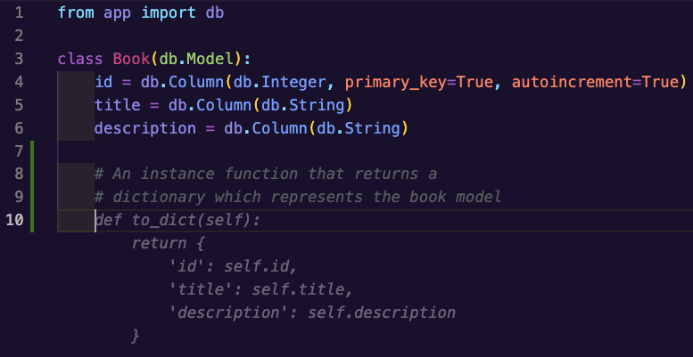
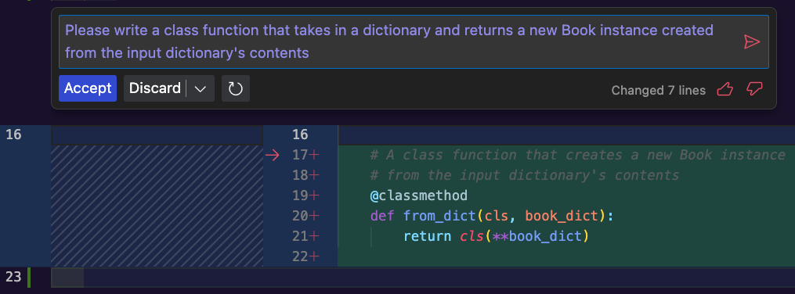
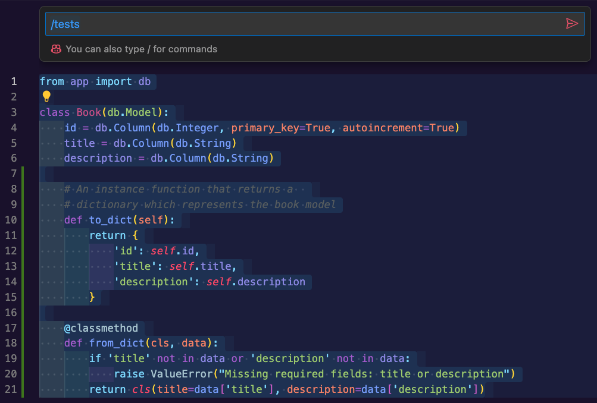
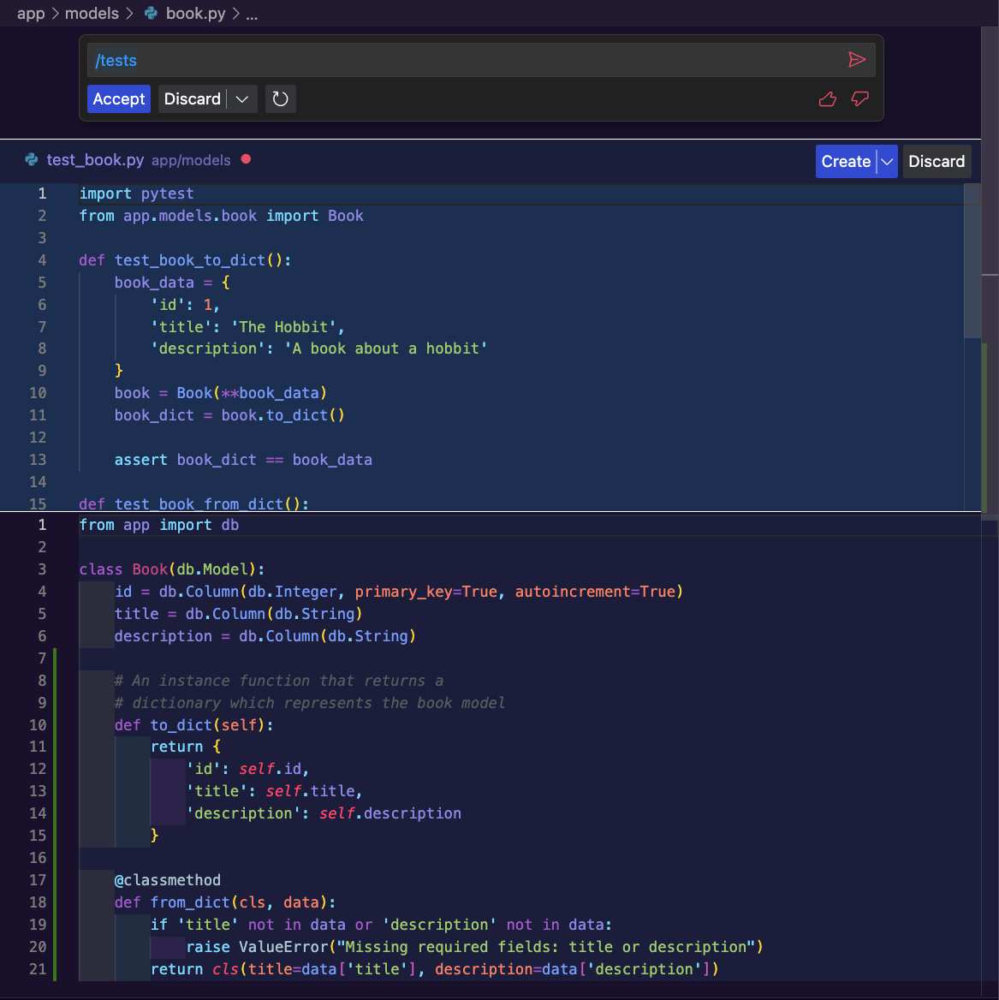
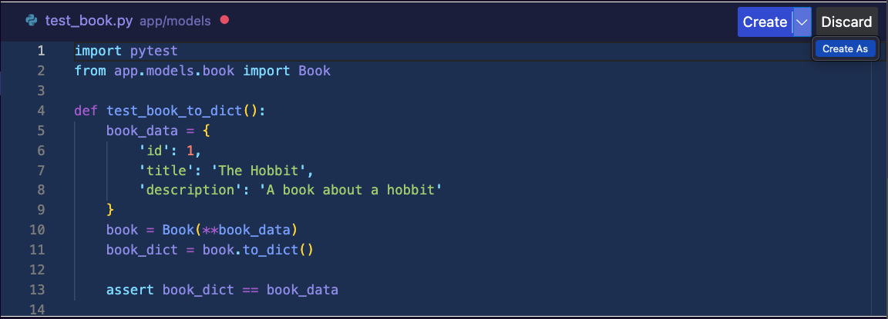

# Using Copilot in Projects

## Goals

We know how to generate code, start a chat, and work with Copilot's tools in VS Code, but what does it look like to apply what we've learned in a project? We'll mosey back to the [hello-books example project](https://github.com/AdaGold/hello-books-api) from Unit 2 to see how we can use Copilot to increase our productivity.

Our goals for this lesson are to show how we can use Copilot to:
- quickly write new code that follows a consistent format
- help us with tests and code when refactoring 

## Writing new code with Copilot

We will not be following the exact same path as Unit 2 did with `hello-books`. To keep things shorter and focus on areas where we can benefit from Copilot we will start at the branch [`03a-models-setup`](https://github.com/AdaGold/hello-books-api/tree/03a-models-setup) so that the database connection is set up for us in our `__init__.py` and we have a single model class `Book` already existing. 

Our plan in this section of the lesson is to add the convenience methods `from_dict` & `to_dict` to the existing `Book` model, then create the `Author` and `Genre` model classes. Lastly, we will generate tests to make sure all of our convenience methods perform as expected.

### Adding convenience functions to `Book`

If we open up the `Book` class, we should have the bare bones of a model defining 3 properties: `id`, `title`, and `description`. Our first step will be to add our `to_dict` function. To make GET requests easier, we know we that we want a function that takes a `Book` model and converts it to a dictionary for us, so let's write a comment to that effect. Add the following comment to your `Book.py` file then press enter to see what Copilot suggests:

```
# An instance function that returns a  
# dictionary which represents the book model
```

In our case, Copilot immediately suggested a function signature and body that matched our needs for the moment:

  
*Fig. Our function description comment above with a suggestion for the `to_dict` function from Copilot in grey below*

We could use a comment to try generating our `from_dict` class method, but instead we'll use the inline chat to prompt Copilot. Let's use `CMD + i` to open an inline chat and enter the following:

> Please write a class function that takes in a dictionary and returns a new Book instance created from the input dictionary's contents

When we submit the prompt, we may see a response like:

  
*Fig. Our prompt entered in the Copilot inline chat with a suggestion for the `from_dict` function from Copilot in a temporary window below*

The suggestion is succinct and will create a new class instance for us from a dictionary, but is this what we actually want? What happens if the dictionary is missing `title` or `description` keys? Does this take advantage of the `autoincrement` feature of SQLAlchemy that we're using for the `id`?

No, this isn't what we want! We have no error handling for missing properties, and this one-liner will set a Book's `id` to whatever is in the `id` key of the dictionary if it exists – the `id` property's `autoincrement` flag will be ignored. 

We need a more robust function, so let's update our prompt. There are 2 significant features missing: error handling and utilizing `autoincrement`. 

<details>
  <summary>
    Take a moment to try adding to the original prompt yourself, then expand this section to see our updated prompt and what Copilot suggested.
  </summary>

Updated prompt:   
> Please write a class function that takes in a dictionary and returns a new Book instance created from the input dictionary's contents. The function should include error handling for missing values and should take advantage of the autoincrement feature.


Suggestion from Copilot:  
```
@classmethod
def from_dict(cls, data):
    if 'title' not in data or 'description' not in data:
        raise ValueError("Missing required fields: title or description")
    return cls(title=data['title'], description=data['description'])
```

Our final prompt doesn't change our initial sentence; we were able to add one new sentence that encapsulated our requirements, and all of a sudden we have a suggestion that meets our current needs! The method may not look exactly as we might have written it out, but if it bothers us or doesn't follow our team or project's conventions, we can always update the code after accepting the suggestion.  
</details>

### Testing the Book class

These functions aren't very long, but it's still a good idea to test them in case of any future changes to this class or related code. We'll use Copilot to help us get started on brainstorming unit tests from the inline chat.

In our `Book.py` file, highlight the whole text, bring up the inline Copilot chat with `CMD + i`, then type in the shortcut `/tests`.

  
*Fig. Selected text in Book.py with the Copilot inline chat up to enter "/tests"*

Once we hit `Enter` Copilot will create a temporary section on the VS Code window with unit tests that we can review. 


*Fig. Copilot's UI to preview tests for the Book.py file*

If we feel like the tests presented are a good starting place, we can use the "Create" button to make a new file with those tests pre-populated. 

### !callout-warning

## Test File Location

The "Create" button will generate the new test file in the current folder, in our case, in the same folder as our `Book` model. This isn't really what we want, but we can click the arrow next to the "Create" button to see a drop down with a "Create As" option. This will let us change the default name of the file and choose where it gets saved so that we can keep all of our test files together, separate from our source code. If you don't use "Create As", you can drag and drop test files from where they were created to the test folder at any later time.

  
*Fig. "Create As" in the drop down next to the "Create" button*

### !end-callout

We want to carefully review the tests that Copilot generates for things like missing cases or tricky edge cases. We may get lucky and have all of our bases covered, but we'll often want to add or update the tests slightly. In our case, Copilot came up with 3 tests that nearly have us covered:

```
def test_book_to_dict():
    book_data = {
        'id': 1,
        'title': 'The Hobbit',
        'description': 'A book about a hobbit'
    }
    book = Book(**book_data)
    book_dict = book.to_dict()

    assert book_dict == book_data

def test_book_from_dict():
    book_data = {
        'title': 'The Hobbit',
        'description': 'A book about a hobbit'
    }
    book = Book.from_dict(book_data)

    assert book.title == 'The Hobbit'
    assert book.description == 'A book about a hobbit'

def test_book_from_dict_missing_fields():
    book_data = {
        'title': 'The Hobbit'
    }

    with pytest.raises(ValueError):
        Book.from_dict(book_data)
```

We have tests that ensure that for a given book model, the dictionary that `to_dict` creates contains the right data, and that a book created by `from_dict` stores the title and description from the input dictionary into the right properties. Our last test ensures that if the 'description' key is missing from the input dictionary that we raise an error, but what if the title is missing instead? 

To make our test suite as complete as possible, we can update the name of our last test to `test_book_from_dict_missing_description` and add one more test `test_book_from_dict_missing_title` to make sure we have that edge case covered. We can do this by hand, but feel free to try out highlighting the last test and asking Copilot to do that work for us!

<details>
  <summary>
    Try it out yourself, then expand this section to see how we asked Copilot to handle the updates we wanted to the tests.
  </summary>

  Updated prompt:  
  > Please rename this test to reflect that it only tests what happens if the description field is missing. Next, add a new test for the from_dict function that tests the scenario where the title is missing but the description is present

  Updated test and newly added test:  
  ```
  def test_book_from_dict_missing_description():
      book_data = {
          'title': 'The Hobbit'
      }

      with pytest.raises(ValueError):
          Book.from_dict(book_data)

  def test_book_from_dict_missing_title():
      book_data = {
          'description': 'A book about a hobbit'
      }

      with pytest.raises(ValueError):
          Book.from_dict(book_data)
  ```
</details>

### Creating the `Author` and `Genre` models


### Connecting the `Book` class to the new models

## Refactoring with Copilot