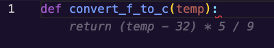
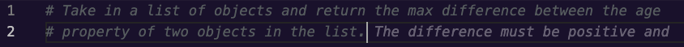
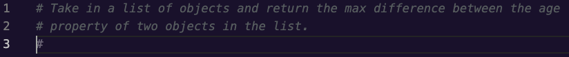
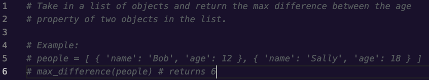

# Copilot Interface & Shortcuts

## Goals

We won't cover all of Copilot's capabilities and shortcuts in this lesson, but we want to share the ones that we think developers will use most when getting started. For more in-depth information check out GitHub's documentation on ["Configuring GitHub Copilot in your environment"](https://docs.github.com/en/copilot/configuring-github-copilot/configuring-github-copilot-in-your-environment?tool=vscode) or ["Getting started with GitHub Copilot"](https://docs.github.com/en/copilot/using-github-copilot/getting-started-with-github-copilot#seeing-alternative-suggestions-2)

Our goals for this lesson are to:
- Show multiple ways prompt Copilot for suggestions
- Review helpful commands and shortcuts
- Generate our first suggestions

## Getting Suggestions

There are several ways we can solicit Copilot to start writing code. Feel free to try these out as we go so you can experiment and learn how you prefer to get suggestions from Copilot!

### Starting with code

When Copilot is active, if we start typing a function definition in a code file, copilot will jump in and suggest the contents of the function in grey text. Let's type the following function definition into a python file to see what happens:
```
def convert_f_to_c(temp):
```
Copilot will suggest the body `return (temp - 32) * 5 / 9`, which in this case is exactly what we wanted.  
  
*Fig. A function definition we wrote with a suggestion from Copilot in grey below*

### Using a comment as a prompt

We can also use natural language to describe the function we want in a comment and Copilot will suggest code to meet those requirements. In this case, the more information we include, the more likely that Copilot will be able to respond with what we're looking for. For example, if we know that we'll be sorting inputs and want to use a particular algorithm, we should mention that in our comment. If we don't, Copilot will make a best guess at what we want and may choose a slower or otherwise less optimal algorithm.

Let's try out another example to show off creating code from a comment. This time, we'll start with the prompt:
```
# Take in a list of objects and return the max difference between the age 
# property of two objects in the list.
```

If we expect to immediately see code, we might be a little surprised by how Copilot reacts. While our cursor is still on the line with the comment and when we create a new line, copilot will try adding more to our comment, typically to describe edge cases for our function description. Why might this be happening?  
  
*Fig. A comment describing a function where Copilot is suggesting to add more to the comment*

  
*Fig. A comment describing a function where Copilot is suggesting to add another commented line*

We're going to travel back in time to our first readings about LLMs. There, we learned that LLMs are in many ways a incredibly powerful predictive text engines. When our cursor is on a line with a comment, Copilot has determined that the most likely thing we're going to do is continue writing the comment, so that's what it suggests. It isn't until we've created a few new lines from the comment that Copilot will reach a probability that we want code rather than descriptive information. Let's continue with this example until we see some code!

When we create another new line, copilot tries to generate example inputs and outputs for us as comments. These comment additions can be really handy for thinking about edge cases we missed or tests we may need to write, feel free to try it out and see what examples you get.   
  
*Fig. Copilot suggesting to add an example to the comment*

  
*Fig. An example input and output suggested by Copilot*

If create yet one more new line, that is when copilot realizes we aren't trying to add any further description and provides us with a function definition. Once we press `Tab` to accept the function definition suggested, Copilot will suggest an implementation for the function.  
  
*Fig. A function definition suggested by Copilot for the function described in our comment*

  
*Fig. A function body suggested by Copilot for the function described in our comment*

### Asking in a chat

## Seeing alternate suggestions

## Accepting and Rejecting Suggestions

## Shortcut Commands

## Summary

## Check for Understanding