# Copilot Interface & Shortcuts

## Goals

We won't cover all of Copilot's capabilities and shortcuts in this lesson, but we want to share the ones that we think developers will use most when getting started. For more in-depth information check out GitHub's documentation on ["Configuring GitHub Copilot in your environment"](https://docs.github.com/en/copilot/configuring-github-copilot/configuring-github-copilot-in-your-environment?tool=vscode) or ["Getting started with GitHub Copilot"](https://docs.github.com/en/copilot/using-github-copilot/getting-started-with-github-copilot#seeing-alternative-suggestions-2)

Our goals for this lesson are to:
- Show multiple ways prompt Copilot for suggestions
- Review helpful commands and shortcuts
- Generate our first suggestions

## Getting Suggestions

There are several ways we can solicit Copilot to start writing code. Feel free to open up a blank python file to try these out as we go. It can be helpful to experiment and learn how you prefer to get suggestions from Copilot!

### Starting with code

When Copilot is active, if we start typing a function definition in a code file, copilot will jump in and suggest the contents of the function in grey text. Let's type the following function definition into a python file to see what happens:
```
def convert_f_to_c(temp):
```
Copilot will suggest the body `return (temp - 32) * 5 / 9`, which in this case is exactly what we wanted.  
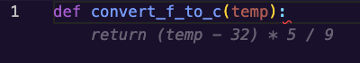  
*Fig. A function definition we wrote with a suggestion from Copilot in grey below*

### Using a comment as a prompt

We can also use natural language to describe the function we want in a comment and Copilot will suggest code to meet those requirements. In this case, the more information we include, the more likely that Copilot will be able to respond with what we're looking for. For example, if we know that we'll be sorting inputs and want to use a particular algorithm, we should mention that in our comment. If we don't, Copilot will make a best guess at what we want and may choose a slower or otherwise less optimal algorithm.

Let's try out another example to show off creating code from a comment. This time, we'll start with the prompt:
```
# Take in a list of objects and return the max difference between the age 
# property of two objects in the list.
```

If we expect to immediately see code, we might be a little surprised by how Copilot reacts. While our cursor is still on the line with the comment and when we create a new line, copilot will try adding more to our comment, typically to describe edge cases for our function description. Why might this be happening?  
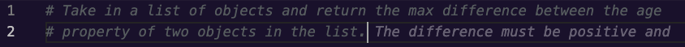  
*Fig. A comment describing a function where Copilot is suggesting to add more to the comment*

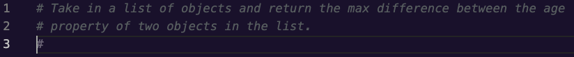  
*Fig. A comment describing a function where Copilot is suggesting to add another commented line*

We're going to travel back in time to our first readings about LLMs. There, we learned that LLMs are in many ways a incredibly powerful predictive text engines. When our cursor is on a line with a comment, Copilot has determined that the most likely thing we're going to do is continue writing the comment, so that's what it suggests. It isn't until we've created a few new lines from the comment that Copilot will reach a probability that we want code rather than descriptive information. Let's continue with this example until we see some code!

When we create another new line, copilot tries to generate example inputs and outputs for us as comments. These comment additions can be really handy for thinking about edge cases we missed or tests we may need to write, feel free to try it out and see what examples you get.   
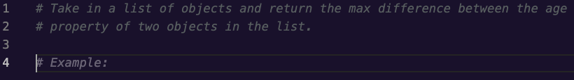  
*Fig. Copilot suggesting to add an example to the comment*

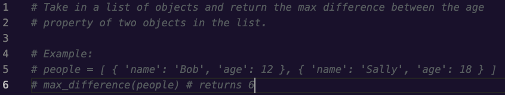  
*Fig. An example input and output suggested by Copilot*

If create yet one more new line, that is when copilot realizes we aren't trying to add any further description and provides us with a function definition. Once we press `Tab` to accept the function definition suggested, Copilot will suggest an implementation for the function.  
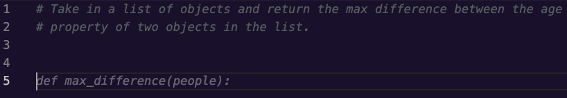  
*Fig. A function definition suggested by Copilot for the function described in our comment*

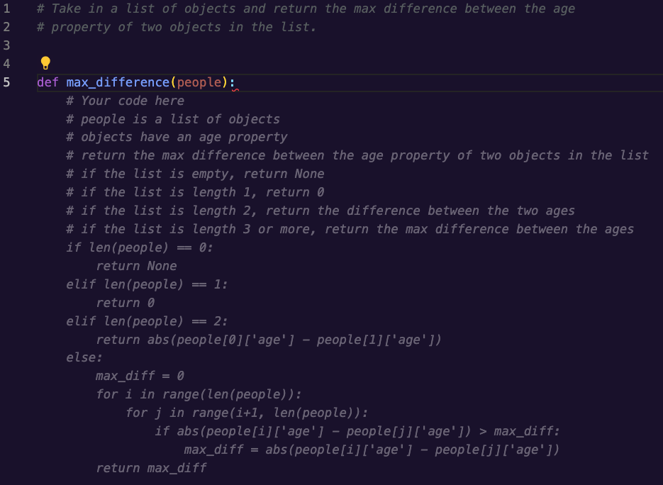  
*Fig. A function body suggested by Copilot for the function described in our comment*

### Asking in a chat

Copilot has a chat feature where you can write out questions or code prompts to Copilot, similarly to how we've interacted with ChatGPT for code. We'll see how we can use it to create a function, walk us through how the function works, and help us test it.

#### Starting a chat

There are 2 ways we can interact with the Copilot chat:

1. We can right click inside a file and select "Copilot > Start Inline Chat" or use the shortcut  `CMD + i` to open up a text box while we're still in a file.  
   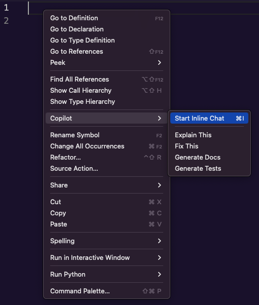  
   *Fig. The right-click menu in VS Code showing the Copilot options*

   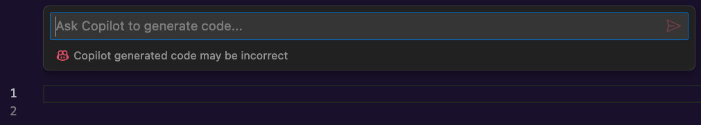  
   *Fig. A blank python file with an empty inline Copilot chat showing*

2. We can open the Copilot chat pane from the chat tab on the left icon menu, from the Copilot icon in the bottom bar, or by using the shortcut `CTRL + CMD + i`   
   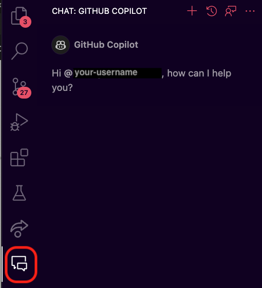  
   *Fig. Opening the Copilot chat pane from the left menu in VS Code*

   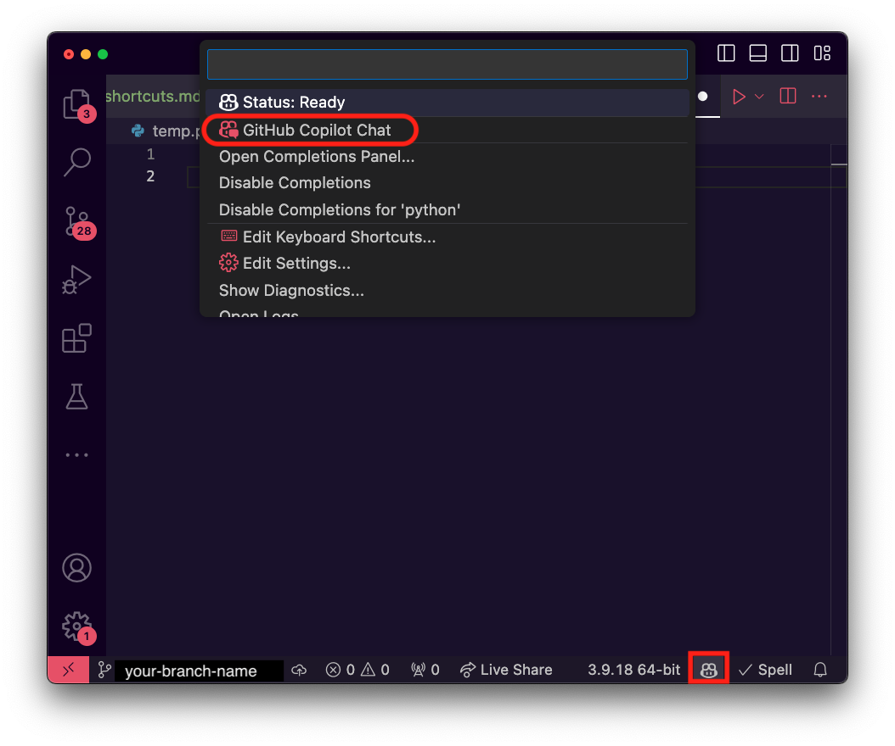  
   *Fig. Opening the Copilot chat pane from the Copilot Status Menu*

#### Using the Inline Chat

In an empty python file, let's bring up the inline chat then type in the prompt `Write a function that takes in a list of file names and returns the file names sorted by the sizes of the files.`  

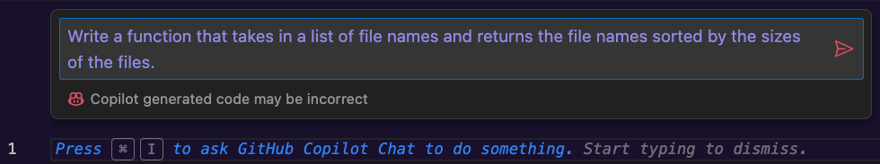  
*Fig. The inline Copilot chat with a prompt written but not submitted*

Copilot will fetch a response and we are given some tools in the UI that we may find similar to ChatGPT's response tools.

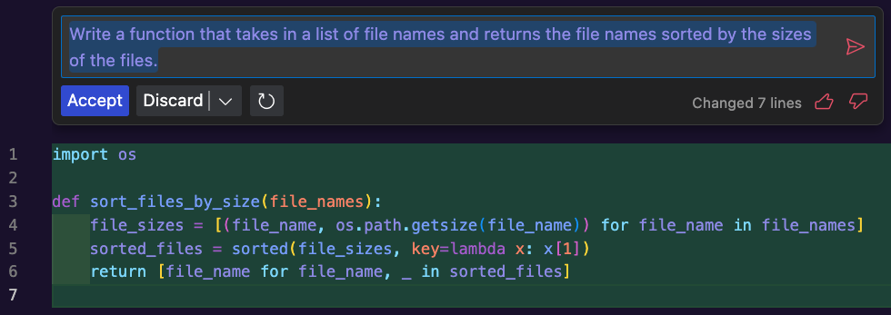  
*Fig. The updated UI after submitting a prompt in the inline chat*

We can see that on the right side of the UI, we have thumbs up and down buttons for rating if the response was useful. On the left side, we have options to accept the response, discard the response, or regenerate it. If we don't want to use the response but we want to save it to look at later, the "Discard" button has us covered - pressing it will open a drop down with choices to discard the code from this file and save it to the clipboard or discard and paste the code in a new file.   

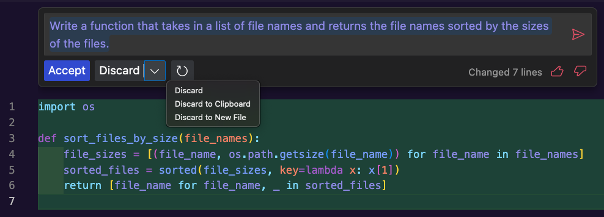  
*Fig. The discard options after submitting a code prompt in the inline chat*

We'll go ahead and use the "Accept" button which will add the function to the file and dismiss the inline chat. 

#### Using the Chat Window

Using the chat window may feel a bit closer to working with ChatGPT because, rather than adding suggestions directly to a code file, the code is written and discussed inside the chat pane.

If we open the Copilot Chat window and use the same prompt as before: `Write a function that takes in a list of file names and returns the file names sorted by the sizes of the files.`, we get a very different response from the Inline Chat.

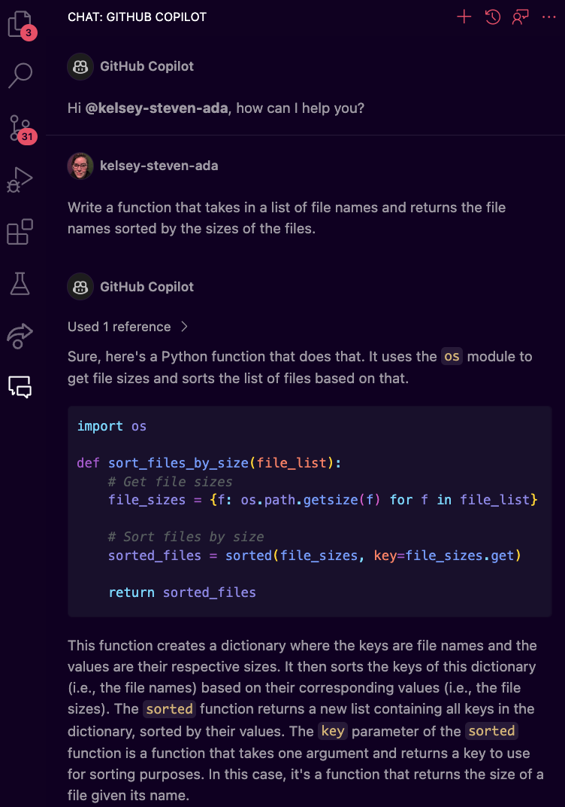  
*Fig. Copilot's response for our prompt showing an implementation and explanation*

From here we can ask further questions in the chat, requesting changes or a deeper explanation, or copy and paste the suggested function into a code file and update it as desired. We'll look at examples of other ways we can use the chat later in this lesson.

## Accepting and Rejecting Suggestions

We've seen a bunch of ways that we can ask copilot to generate code, but what do we do once the suggestion is showing? With the inline chat there's an "Accept" button, but if we're just typing a function definition or a comment in a code file, how do we choose to keep some or all of the code presented to us?

It turns out that we have a lot of control! We can accept an entire suggestion, the next line of a suggestion, or we can go word-by-word. There are default shortcuts for accepting a whole suggestion (`Tab`) or the next word of a suggestion (`CMD + left arrow`), but if we want to accept suggestions line-by-line we need to either set up our own shortcut in VS Code or hover over the suggestion to bring up the suggestion menu. In the image below we've clicked on the '3 dots' icon at the right of the suggestion menu to show all the available options, which includes "Accept Line". 

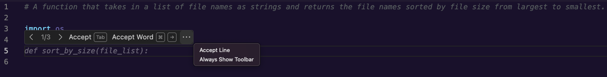
*Fig. Copilot's suggestion options UI with the overflow menu open so we can see all options*

## Seeing alternate suggestions

There are many reasons that we might want to see alternative suggestions from Copilot. We saw in the chat UIs that we had options to regenerate a response, similar to with CHatGPT, but how do we do it from a suggestion in a file?

## Other uses for Copilot Chat

### Shortcut Commands

## Summary

## Check for Understanding