# Setting up Our Workspace

We'll be using two tools to provide free access to large language models for coding agents.
- [Github Copilot](https://github.com/features/copilot), through the GitHub Student Develoepr Pack
- [OpenRouter](https://openrouter.ai/)

Once our accounts are set up, both of these will be used from inside VS Code, keeping our tools in one location so we don't need to leave our IDE to add agents to our workflow. We will also explore sandboxing as a way to secure agents, and look at what sandboxing controls VS Code provides.

## Lesson Goals

- Enable GitHub Copilot and configure access in VS Code.
- Create an OpenRouter account and connect it to VS Code.
- Explain the purpose of a sandbox in an agentic coding environment and describe when different levels of sandboxing and agent access are useful. 
- Enable agent sandboxing in VS Code.

## Vocabulary and Synonyms

| Vocab | Definition | Synonyms | How to Use in a Sentence |
| --------- | --------- | -------- | --------- |
| Sandbox | An isolated execution environment that constrains what an agent can access or modify, limiting the blast radius of unintended actions. | Isolated environment | "Running the agent in a sandbox meant that even when it attempted to modify a file outside the project directory, the operation was blocked." |
| Container | A lightweight, isolated runtime environment that packages an application with its dependencies and gives it its own view of the filesystem, network, and processes, separate from the host system. | Docker container, isolated environment | "We mounted only the project directory into the container, so the agent had no visibility into the rest of the host filesystem." |

## Copilot Set Up

Github's Copilot is a paid service that is free for students for a limited time through the Github Student Developer Pack. When redeeming the Student Developer Pack for any of the other benefits it provides, we also gain access to Copilot, but we need to turn on the service. 

### Enabling Copilot

To enable Copilot access:

1. Check if your Student Developer Pack is currently active.
   - Look for a "PRO" status under "Highlights" in your profile on GitHub. In the upper-right corner of any page, click your profile photo, then click "Your Profile".  
     
   *Fig. "Highlights" section of a profile on GitHub*
   - If you have issues accessing or activating your Student Developer Pack, please file a ticket with [GitHub Education Support](https://support.github.com/contact/education). The linked support page also has a button to troubleshoot with GitHub's Virtual Agent in case it can provide immediate help. 

2. Go to the account settings screen by clicking your profile photo in the upper-right corner of any page, then click "Settings". Under the "Code, planning, and automation" section of the "Settings" sidebar, click "Copilot".  
   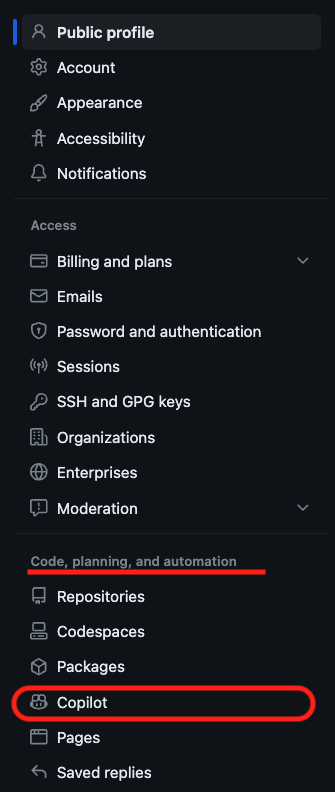  
   *Fig. "Copilot" option in the "Settings" menu*

3. Click “Enable Copilot”. A message will appear that we have access to Copilot for free, along with a new button “Continue to get access to Github Copilot” that we should click.

4. We will be taken to a preferences screen where we can choose some options about how Copilot will use public code and snippets it generates. Leaving the options on can help improve the overall quality of Copilot, but turning them off won't impact your ability to get recommendations.
   - Choose what you are most comfortable with, these choices can be updated at any time by navigating to "Settings" > "Copilot".

### Copilot in VS Code

To add Copilot to VS Code, we need to install the Copilot extension:

1. Open VS Code, then click the Extensions tab.
 
2. In the Extensions tab, search for "GitHub Copilot"  
   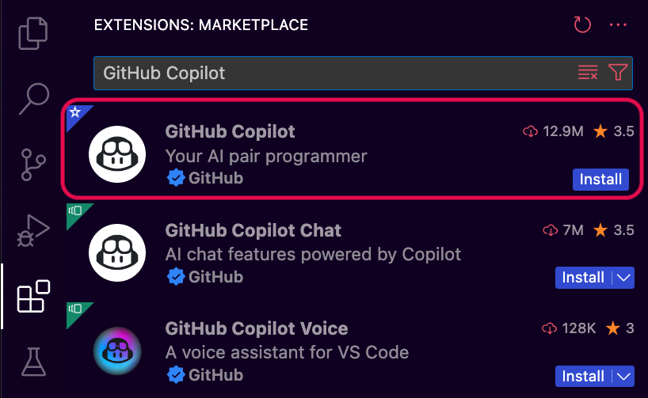  
   *Fig. "GitHub Copilot" in the VS Code Extension search results*

3. We can install GitHub Copilot using the "Install" button directly on the entry in the results list or click the "GitHub Copilot" result to go to their extension page and click "Install" from there.
   - When we install the "GitHub Copilot" extension it will automatically install the "GitHub Copilot Chat" extension and vice versa. These are both required for Copilot to work. 

   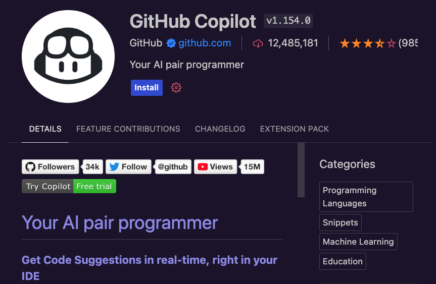  
   *Fig. "GitHub Copilot"'s extension page in VS Code*

4. If you haven't previously authorized VS Code in your GitHub account, you will be asked to sign in to GitHub inside VS Code. If you've previously authorized Visual Studio Code in your GitHub account, GitHub Copilot should automatically be authorized.
   - In your browser, GitHub will request the necessary permissions for GitHub Copilot. To approve these permissions, click Authorize Visual Studio Code.
   - In Visual Studio Code, in the "Visual Studio Code" dialog box, click "Open" to confirm the authentication.

For instructions to set up the Copilot extension in VS Code written another way, check out GitHub's ["Getting started with GitHub Copilot"](https://docs.github.com/en/copilot/get-started/quickstart?tool=vscode) documentation.

As mentioned earlier, we will be using Copilot and OpenRouter exclusively from VS Code in this curriculum, but feel free to follow your curiosity and look up whether plugins are available for any other IDEs you are interested in trying!

## OpenRouter Set Up

To use OpenRouter, we will need to:
1. Create an account
2. Create an API Key
3. Add the API key to VS Code

### OpenRouter Account and API Key

1. Browse to [OpenRouter](https://openrouter.ai/) and click the "Sign Up button".
    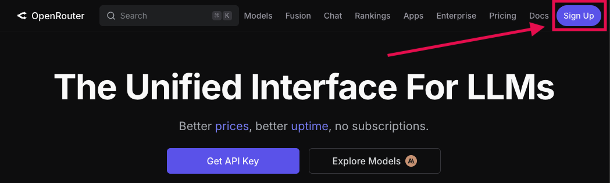
    *Fig. OpenRouter homepage*

2. This will open a pop-up that lets you create an account using a username & password or select from other auth options. Choose the option you prefer; once your information is filled out and submitted, you should receive and email to confirm your account.
    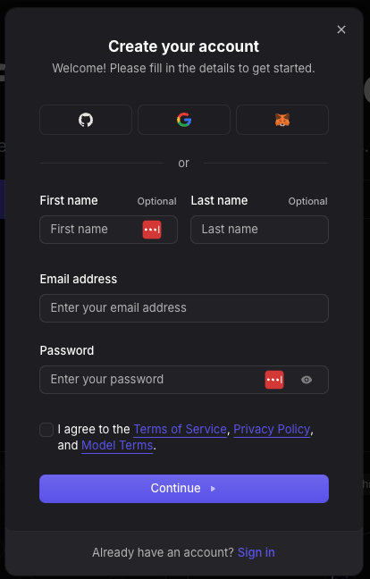
    *Fig. OpenRouter "Create Account" UI*

3. After clicking the link in your email to confirm your account you may be brought either to a home screen or directly to the "Credits" billing page. You are required to add payment information to your account, however, you are not required to add any credits to OpenRouter to access the free models they host. If you are not immediately brought to payment information, it can be accessed from the menu at the top right of the page:
    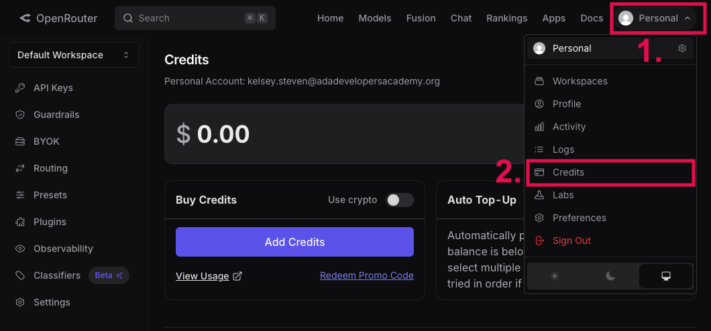
    *Fig. OpenRouter menu open with "Credits" section highlited ([Full Size Image](assets/set-up/openrouter_billing.png))*
    - There are tight request limits on free tier models (at the time of writing this, 50 requests per day if you have not added credits to your account). If you add $10 in credits to your account, OpenRouter increases the free tier request limit (up to 1,000 requests per day, at the time of writing this lesson). Check out OpenRouter's ["Limits"](https://openrouter.ai/docs/api/reference/limits) guide for updated information on current limitations.

4. Once billing information has been added, OpenRouter will generate a default API key for us that has no restrictions and display it for us to copy. We can use this key, but especially if you add credits and might experiment with paid models later, we recommend creating a new key. This is because there are guardrail options we can set when creating a key that limits how many credits the key can use before deactiviating to help control our spend. 
    - **Default Key**: If you'd like to use the default key, copy the value when it is shown, as the API key is only displayed once. We can always invalidate the current key and generate a new one if we forget to copy or lose it before adding it to VS Code.

    - **New API Key**: To create a new API key: 

        1. Click the top right menu and select "Workspaces" from the drop down. On the workspaces page there is a menu on the left of the page, click "API Keys". You can also view all of your existing API keys from this page and delete ones that are not in use.
            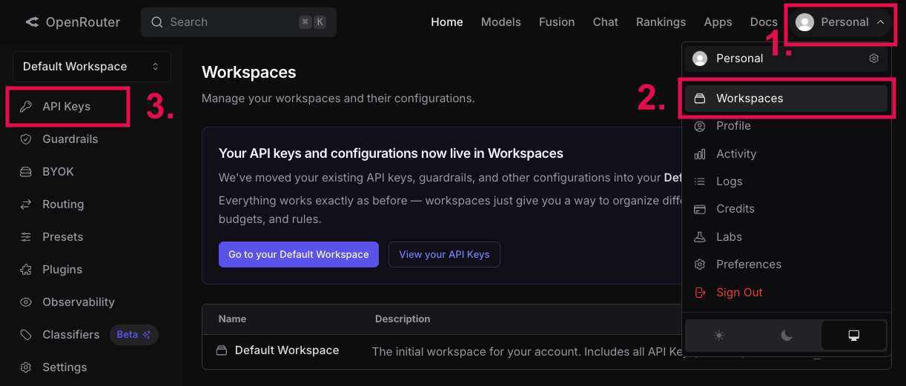
            *Fig. Navigation to the API Keys view in OpenRouter ([Full Size Image](assets/set-up/openrouter_workspaces.png))*
        
        2. On the "API Keys" page, click the "New Key" button towards the top right.
            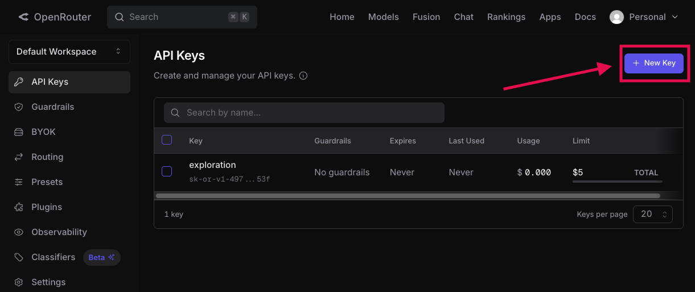
            *Fig. Where to create a new key on OpenRouter's "API Keys" page ([Full Size Image](assets/set-up/openrouter_new_key_button.png))*
        
        3. In the pop up that displays, you are required to choose a name to help you distinguish between your keys. Nothing else is required to create a key, but we recommend looking through the options, since this is where we could add restrictions like a spending limit to the API key. 
            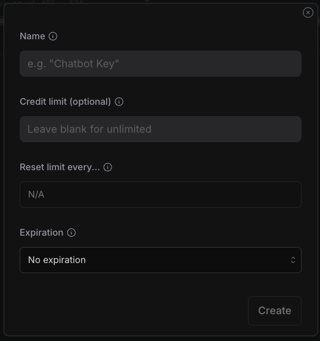
            *Fig. OpenRouter's form for creating a new API key*

        4. Once the key is created, it will only be displayed once. Copy the value and hold onto it securely since we'll need it in the next section!

### OpenRouter in VS Code

To add OpenRouter to VS Code so we can choose models they provide from inside our IDE, we need to add OpenRouter as a provider and supply our API key.

1. Inside of VS Code, use the shortcut "Shift" + "cmd" + "i" (`⌃⌘I`) to open the chat view. Click the model picker button at the bottom of the chat pane. This field will show the name of the currently selected model or "Auto" if the IDE is set to automatically pick from available models.
    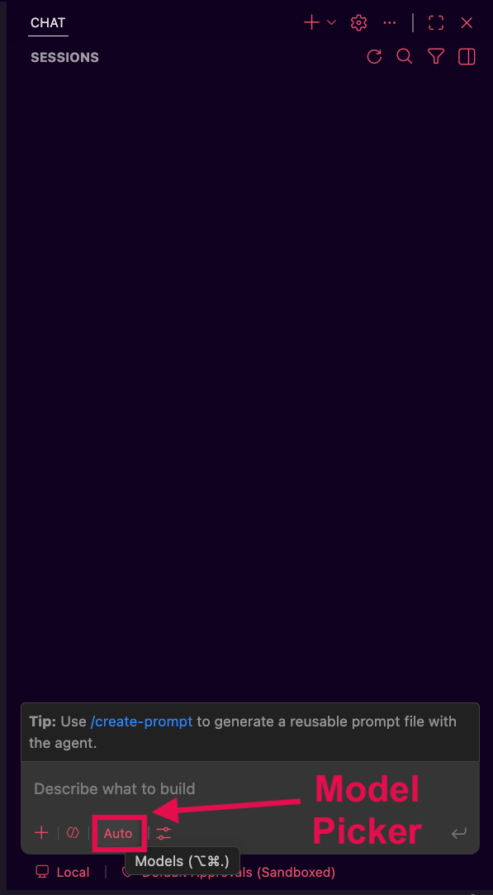
    *Fig. VS Code's model picker button in the chat UI*

2. In the pop up that displays, press the gear icon in the lower right corner to go to the model settings view.
    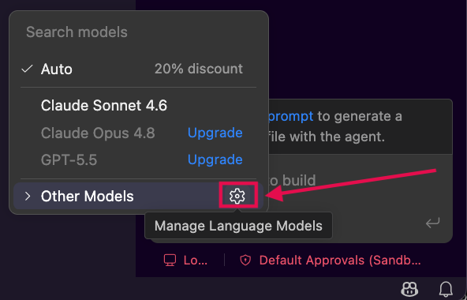
    *Fig. VS Code's model picker UI with the model settings icon highlighted*

3. From the model settings screen, press the "Add Models" button next to the search bar at the top of the frame, then select "OpenRouter" from the drop down that appears.
    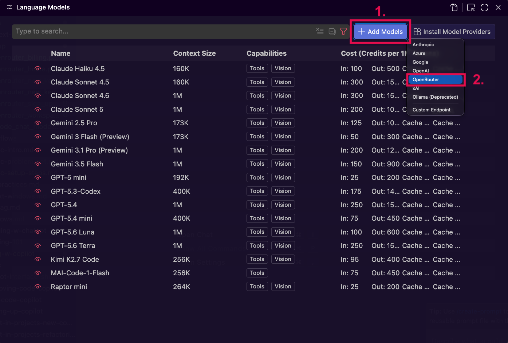
    *Fig. VS Code's drop down for choosing a provider when adding new models ([Full Size Image](assets/set-up/vscode_manage_models_view.png))*

4. A prompt will appear at the top of the screen asking for you to choose a name to group the OpenRouter models under in the UI. "OpenRouter" will be entered in the field by default, press enter to accept this name.
    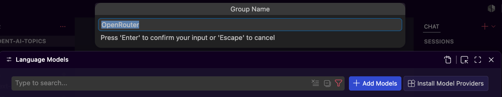
    *Fig. VS Code's text field for naming the model group ([Full Size Image](assets/set-up/vscode_name_provider_group.png))*

5. A new prompt will appear at the top of the screen asking for your API key. Paste in your OpenRouter API key and press enter.
    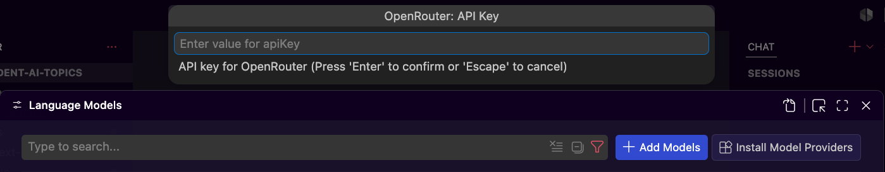
    *Fig. VS Code's text field for adding a provider's API key ([Full Size Image](assets/set-up/vscode_add_api_key.png))*

6. After a moment, the model settings ui should refresh and we should be able to see a new section and many more models that we now have access to. If at any point we need to update our API key or want to remove OpenRouter from VS Code, we can press the settings icon on the group name for options. 
    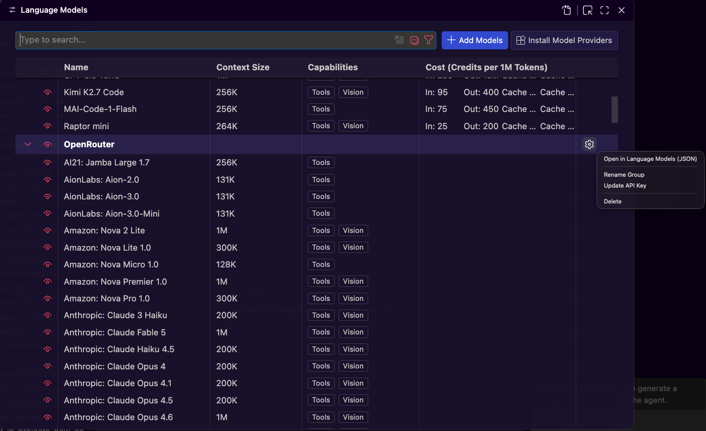
    *Fig. Updated screen showing OpenRouter models and settings to update or remove the model provider ([Full Size Image](assets/set-up/vscode_new_models_showing.png))*

### Choosing Models with OpenRouter

At this point we have access to multiple models and model providers! To see what models are curently free on OpenRouter, check out their "Models" page and use the filter options to select "Text" input and "Free" pricing. 
    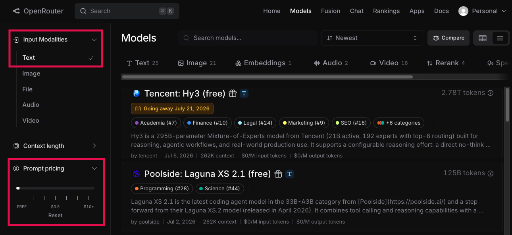
    *Fig. OpenRouter's "models" page with filters for input type and cost highlighted ([Full Size Image](assets/set-up/openrouter_models_page_filtered.png))*

When you see one that you like, we can search for that name under the model picker in VS Code!
    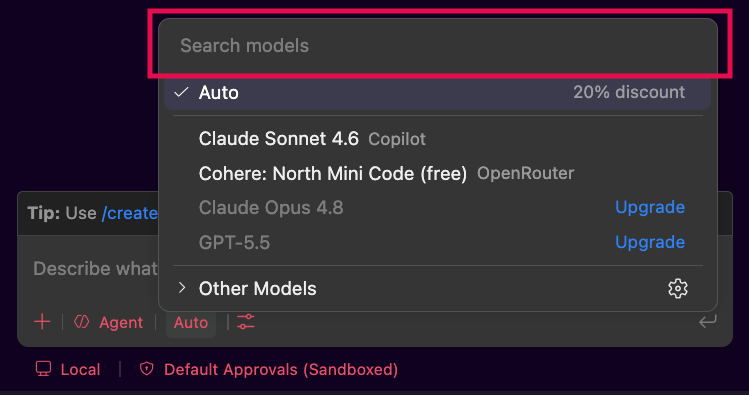
    *Fig. We can search models in VS Code using the search bar at the top of the model picker UI*

## Sandboxing and Scoping Access

We have access to agents in our IDE now, but before using them, let's talk a little about security. We've established that LLMs and agents built on them operate on statistical text prediction, not by reasoning about consequences. If an agent's context makes a particular file write or command statistically likely, the agent will produce it, whether or not it's actually safe to run. 

Sandboxing is how we enforce constraints that prompts alone cannot reliably maintain. A **sandbox** is an isolated environment that constrains what an agent can reach. By scoping the access that AI agents have, we limit the potential blast radius of unexpected agent actions. 

### Why We Sandbox Agents

Without sandboxing, an agent with file system access can write to any location our user account has permission to write to. An agent with shell access can run any command available in that shell. This is rarely what we want! The most common problems sandboxes protect against are:

- **Filesystem scope creep**: Without boundaries, an agent with file write access can write anywhere our user account has permission to write, including dotfiles, other project directories, or SSH keys.

- **Credential exposure**: Local environments often have API keys or cloud credentials sitting in environment variables or config files. An agent with unrestricted read access can pull these into its output or logs without any malicious intent behind it.

### The Sandboxing Spectrum

Sandboxing isn't one setting we turn on, it is a suite of tools that work on different levels of our set up. Each level of sandboxing trades more setup effort for a stronger guarantee about what is contained.

| Level | What it constrains | Setup effort |
|---|---|---|
| **Application permissions** | Categories of action: file reads, file writes, running commands, network access. Usually configurable as allow, deny, or ask. | Built into most agentic tools already, little to no setup |
| **OS-level isolation** | Specific file paths or system calls a process can use, enforced by the operating system itself (for example, macOS's `Seatbelt` or Linux's `seccomp`/`bubblewrap`). | Low to moderate, some tools ship this ready to enable |
| **Container isolation** | Everything outside an explicitly mounted directory. The agent's filesystem, network, and process view are fully separated from the host machine. | Highest, typically requires Docker or a similar runtime tool |

**Application-level permissions** are the coarsest tool: they draw lines around categories of action, not specific paths, so "allow file writes" means the agent can write anywhere our account can. 

**OS-level isolation** tightens this by enforcing specific file path or system-call boundaries below the application, so even a misbehaving tool can't bypass the restriction. 

**Container isolation** is the strongest option, fully separating the agent's environment from the host, at the cost of needing Docker and some setup around what gets mounted into the container (what folder or volumes are visible inside the container).

For most development work, the choice comes down to risk profile and workflow needs:

| Level | Good for | Limitations |
|---|---|---|
| Application permissions | Quick tasks, supervised sessions, low-sensitivity projects | Category-level only, below-application bypasses aren't blocked |
| OS tools (Seatbelt, seccomp, firejail) | Single-machine setups where containers add too much overhead | Setup complexity, misconfiguration risk |
| Container isolation | Autonomous runs, scripts from external sources, sensitive environments | Docker required, initial setup overhead including determining what should be accessible from the conatiner |

Starting with whatever sandbox our tool provides by default is a reasonable place to begin. As tasks run longer, touch more of the filesystem, or operate near sensitive credentials, moving up this spectrum becomes worth the added setup.

### A Practical Starting Point in VS Code

VS Code gives us tools at the first two levels without any extra setup, which makes it a good place to start before we consider anything container-based.

**Permission levels** control how much a session runs without pausing for our input. The default, "Default Approvals," shows a confirmation dialog before tool calls that modify files, run commands, or reach external resources. "Bypass Approvals" and "Autopilot" skip that dialog entirely. 
- For early agentic coding work, staying on Default Approvals gives us a chance to catch a command before it runs rather than after.

**Terminal auto-approve rules** let us pre-approve specific commands or patterns so we aren't confirming the same safe command repeatedly. This reduces friction, but it's worth knowing the limitation going in: VS Code parses commands using best-effort grammars, and shell tricks like quote concatenation can slip past the rules undetected. Auto-approve rules cut down on interruptions, they don't enforce a boundary the way OS-level isolation does.
- We should be very careful about what commands we auto-approve when we're getting started. As examples, a command that creates or enables a `venv` is pretty safe, but allowing new dependencies to be installed without your awareness could both bloat the project and bring in packages with security vulnerabilities.

**Agent sandboxing** is VS Code's OS-level option. It's the setting `chat.agent.sandbox.enabled` on macOS and Linux, or `chat.agent.sandbox.enabledWindows` on Windows. We can find it by searching "chat.agent.sandbox.enabled" inside VS Code's settings: 

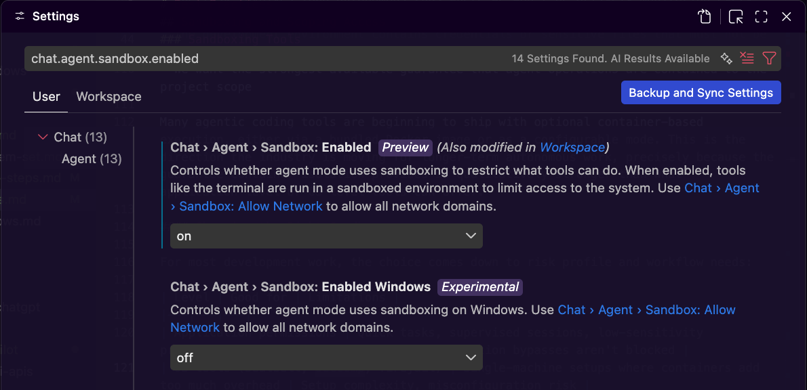
*Fig. The Sandbox setting enabled in VS Code's UI ([Full Size Image](assets/set-up/vscode_enable_sandbox.png))*

We recommend that folks turn this setting on to give some security and start getting some exposure to how we can scope access for our tools. With it enabled, terminal commands run inside a boundary enforced by the operating system:

- **File reads** are limited to our workspace folders and a few paths tools like `git` or `npm` need to function. Our home directory is off-limits by default, which keeps things like SSH keys and shell config out of reach.
- **File writes** are limited to the current working directory and its subdirectories.
- **Network access** is blocked by default, though we can allow specific domains if a command needs to reach one.

Because the boundary is enforced by the OS, commands that stay inside it run without a confirmation prompt. Anything that needs more than the sandbox allows surfaces a prompt asking whether to run it outside the sandbox instead. The isolation mechanism underneath differs by platform (Seatbelt on macOS, `bubblewrap` and `socat` on Linux, the `MXC runtime` on Windows), but VS Code manages those details once the setting is turned on.

For our first agentic coding sessions, a reasonable combination is: 
1. keep the permission level on Default Approvals
2. turn on agent sandboxing

This pairs a human checkpoint before risky actions with an OS-enforced boundary in case something proceeds that we didn't anticipate, at the cost of a single settings change. As we mentioned earlier in the lesson, over time our tasks may grow more autonomous or start running unattended for longer stretches. At that point container isolation becomes worth the added setup, but VS Code's built-in sandboxing is enough to get us started.

## Info & Resources

### VS Code Shortcuts

We won't be covering VS Code's UI shortcuts in depth, but there are a number of handy commands for actions like opening the AI chat view and starting a new agent session. 
- Check out VS Code's [AI Features Cheat Sheet](https://code.visualstudio.com/docs/agents/reference/ai-features-cheat-sheet) for a quick guide on commands
- Feel free to explore VS Code's documentation on [Coding with Agents](https://code.visualstudio.com/docs/agents/overview) if there are topics you want to dive deeper on!

### Other LLM Providers

We will only be working with these two model providers in the curriculum, but if you find other providers of free models, the same steps we used for OpenRouter can usually be followed to make their models available inside VS Code. 
- This can be a great way to get more agent usage if Copilot and OpenRouter's free tiers have been exhausted until the next refresh period. 
- Feel free to experiment and share useful tools and models with the class on Slack!

Students that already have or choose to later procure their own subscriptions to other LLM providers are welcome to use those, but instructor support for how to integrate those into the Ada toolset may be limited. 

## Summary

## Check for Understanding

