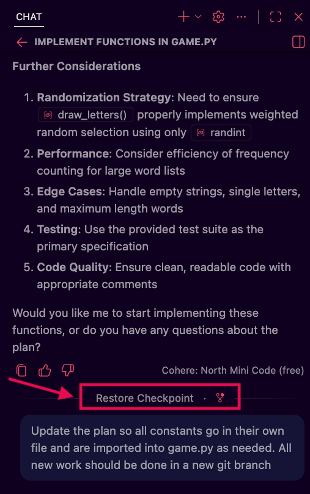
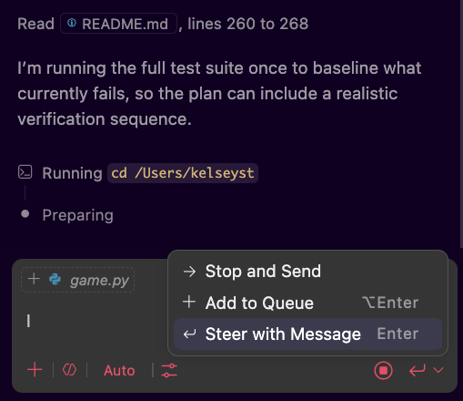

# Best Practices

We have some foundations under our belt now: what agents are and how they work, how context windows determine the output and usefulness of a session, and the shape of workflows that experienced practitioners tend to converge on. 

This lesson shifts focus from *what* to do toward *how* to do it well. Best practices don't exist independently of the systems they support, so we'll connect the practices described here back to the workflow we've already seen.

## Learning Goals

- Identify controls for adusting the course of an existing agent session
- Distinguish what belongs in a steering file versus a skill, and explain how that distinction affects context window usage.
- Define the structure of a skill and write a basic skill file.
- Explain how model selection affects workflow performance and cost.
- Identify when subagents are worth the added complexity and describe how to define one.

## Vocabulary and Synonyms

| Vocab | Definition | Synonyms | How to Use in a Sentence |
| --------- | --------- | -------- | --------- |
| YAML frontmatter | A structured block of metadata written in YAML syntax that appears at the top of a markdown file, enclosed between two lines of triple dashes (`---`). | Front matter, metadata block | "The YAML frontmatter in our skill file sets the name and description the agent uses to decide when to load it." |

## Course Correcting: Checkpoints and Influencing Execution

Sometimes we might see that our agent has veered off-path, or we forgot something in the original prompt. We don't have to wait until the agent is done processing to take action; especially if we can see that the work will not meet our needs, we can act immediately!

### Checkpoints

Every response an agent produces in a chat session can serve as a checkpoint for our workspace. If we want to undo an agent's changes, we can restore an earlier checkpoint, which returns our files to the state they were in at that moment and removes any conversation history and file changes that came after it. To do so, we can hover over a message in the chat, and "Restore Checkpoint" controls will appear.

These checkpoints give us a way to explore a direction with an agent and fully back out of it if the result isn't what we needed, rather than manually tracking and reversing each change ourselves.

   
*Fig. "Restore Checkpoint" button in the VS Code Chat UI ([Full Size Image](assets/best-practices/vscode_chat_checkpoint.png))*

### !callout-info

## Try it out!

The next time we're working with an agent and want to explore a direction we might not keep, try backing out of it with a checkpoint instead of undoing the changes ourselves.

1. Send a prompt to our agent and let it produce at least one full response.
2. Hover over that response in the chat history and look for the "Restore Checkpoint" control.
3. Restore the checkpoint and confirm our files and conversation return to the state they were in before that response.

### !end-callout

### Steering During Execution

While an agent is working, the send button in the chat pane becomes a drop down with options for how our message should be handled:
- "**Add to queue**" - Waits for the current response to finish, then send the message. Best used when the AI is mostly on track but we want to add something we forgot without stopping or changing the current progress.
- "**Steer with message**" - Tells the agent to pause after its current tool call and process our message immediately before continuing. This is useful when we want to adjust behavior without cancelling work that has already been done. 
- "**Stop and send**" - Cancels the current request, removing work done for this request that is not presisted to disk. This is the right option when we need to start over, typically when the AI is far off track and continuing would waste resources.

   
*Fig. VS Code Chat UI showing the Send options while an agent is creating a response*

### !callout-info

## Try it out!

The next time we're running an agent session, try each of the send options from the dropdown so we can feel the difference between them.

1. Start a task and, while the agent is still working, use "Add to queue" to send a small addition without interrupting its current progress.
2. On a separate task, use "Steer with message" to redirect the agent partway through once we notice it heading somewhere we don't want.
3. If we see an agent go far enough off track that the work in progress isn't worth keeping, try "Stop and send" to cancel and restart with a corrected prompt.

Compare how each option affects the agent's progress and note which situations call for which option.

### !end-callout

## Adding Instructions: Steering Files and Skills

Earlier we introduced steering files and skills at a high level, here, we'll look at how to use them effectively. Both steering files and skills are ways of providing agents with context and instructions. Understanding the distinction between them and when to add to a steering file or create a new skill matters a great deal for context window usage and overall agent performance.

### Steering Files: Always On, Always Cost

A steering file is loaded into every session at startup. From a context window perspective, it is always present. As we covered previously, anything present in the context window accumulates cost on every message throughout the session.

This shapes what should go in a steering file: only things that are universally relevant, across every session, every task, every phase of work. If a piece of content is relevant for API endpoint work but not for database migration work, it does not belong in the steering file.

Strong steering file candidates:
- Rules and prohibitions that apply to everything: branch naming, files that must never be modified, required tests before committing
- Project or team-specific conventions the model wouldn't know from training, like naming patterns or import conventions
- Pointers to canonical examples in the codebase the model should reference when producing similar work
- Project structure and folder organization 
    - Depending on the size of the mapping/our code base, this architectural information can be offloaded to it's own file if every agent does not need to know the structure of the code base at all times.

What often steers people wrong is treating the steering file like a knowledge base. Team members start adding edge case documentation, onboarding notes, guides for specific workflows, and the file grows to several thousand tokens. Because it's loaded on every message for the entire session, this overhead compounds continuously. 
- A bloated steering file is one of the most consistently expensive things we can do to our token usage.

Steering files often live at the root of a project repo and are named `AGENTS.md`, `CLAUDE.md`, or similar depending on the environment we are working in. As we get more comfortable with steering contents, we can look into settings to apply steering files at the workspace or user level if there is steering information we find useful to apply to all projects we work with.

Let's take a look at an example steering file, the one below is for a TypeScript project:

```markdown
# Project Conventions

This is a Node.js/TypeScript project using Express for routing and PostgreSQL via pg-promise. `package.json` contains the approved packages in use for this project.

## Structure
- `src/routes/` — API route handlers
- `src/services/` — Business logic layer
- `src/db/` — Query files and migration scripts
- `src/generated/` — Auto-generated types. Do not modify directly.

## Standards
- All public functions must have JSDoc comments
- Run `npm test` to execute the test suite and ensure all tests pass before committing
- Use the service layer for business logic; route handlers should stay thin
- Branch naming: `feat/<ticket>`, `fix/<ticket>`, `chore/<description>`
```

This file is short enough that it adds minimal overhead per message, but helps orient an agent picking up any task in the project so they can work within the team's norms.

A useful tactic to keep our steering file lean is to start by adding information as a skill. If we find that we're needing that skill for every task, then it could be worth migrating into the steering file. 

### !callout-info

## Try it out!

Let's create a steering file for a project we're currently working in, keeping it deliberately short.

1. In VS Code, find or create a file named `AGENTS.md` at the root of the project.
2. Write 1-2 lines describing something universally useful across every task in the project, for example a rule to create a new branch before starting any implementation work.
3. Start a new agent session and ask the agent what conventions it's aware of for the project, to confirm the steering content loaded.

### !end-callout

### Skills: On-Demand Procedural Knowledge

A quick refresher on what we learned about skills previously:

- Skills provide agents with step-by-step instructions for specific tasks that the agent can't reliably do from training data alone. 

- Unlike the steering file, skills load a light index at session start up and the full contents of skills are only loaded when an agent encounters a task that matches the skill's description. They allow a large library of team knowledge to be available to agents without deeply impacting token usage until that knowledge is needed.

- Skills are shareable across projects and agents. A code review skill, a deployment checklist skill, or an API documentation skill developed once can be reused across every project that benefits from it.

#### Skill Structure

Skill files may live in different locations depending on our IDE. 
1. Typically there will be a hidden folder in the root of a project named something like `.agents`, `.claude`, or `.cursor` where we can create a folder named `skills` to add our custom skills.
2. For each skill, we create a new folder named after the skill and create a file named `SKILL.md` in that folder
3. Each `SKILL.md` file must contain a name, a short description of the skill it provides, and the steps the AI must take to complete the described task.

The basic structure of a skill file looks like:

```markdown
---
name: database-migration
description: Use when creating a new Alembic migration, modifying the database 
             schema, or troubleshooting migration conflicts.
---

## Steps

1. Create the migration with `alembic revision --autogenerate -m "<description>"`.
2. Review the generated file in `migrations/versions/`. Autogenerate is not always accurate.
3. Check that `upgrade()` and `downgrade()` are both implemented correctly.
4. Test locally with `alembic upgrade head` before committing.
5. Note in the PR that a migration is included so reviewers know to run it.
```

The name and description fields act as the trigger mechanism: the description needs to be specific enough that the agent can reliably identify when the skill applies (i.e. ("use when creating a new API endpoint")). 
- A description that is too vague ("general coding help") will either never load or load when it doesn't apply. 

After the required name and description, we structure the steps for the agent to complete a task. Skill file sizes will range depending on what they describe, but in general, SKILL.md files should be focused on a single task and under roughly 500 lines.

##### Skills Can Include More Than Instructions

Beyond the main `SKILL.md` file, the skill folder structure supports:

- **References**: A `references/` subdirectory for supporting documentation like style guides, example input/output files, long configuration templates, and detailed references. These are also progressively disclosed, resources in the references folder are fetched on demand by the agent when it needs more depth on a step of a skill, they are not automatically loaded when the skill is used.
- **Scripts**: A `scripts/` subdirectory for executable code the agent can run as part of the skill workflow.

Scripts are particularly useful when a task involves a precise sequence of commands that needs to run the same way every time. Rather than relying on the agent to produce the command correctly from its training data, the script encodes exactly what runs. 
- Scripts should be treated with the same security awareness as any other executable code: they run in the agent's execution environment and belong inside a sandbox.

#### Writing New Skills

One approach to creating skills is to sit down and write out what you want from the start. A problem many developers run into with this tactic, is that they miss a lot of finer details in that first draft. This tends to produce skills that are either too abstract to be useful or that miss the specific decision points where an agent needs guidance. Skills built this way can require significant debugging and updates to catch edge cases and fill in any steps or information that weren't top of mind when the skill was written.

Writing instructions for a task we haven't watched an agent attempt is similar to writing a training guide for a job we've never observed being done. Rather than us trying to remember and document everything clearly without prompting, the most reliable method for writing a skill that consistently works is to go through the task that we want to build a skill for with an agent first. We observe where it succeeds and where it goes wrong, and then convert that proven interaction into a skill.

##### The Walkthrough Approach

The process starts with a fresh session and a real instance of the task. We give the agent the goal and watch what happens:
- Where does it make correct choices without instruction?
- Where does it go wrong or produce something inconsistent with what we want?
- What steps does it invent on its own that we don't actually want?
- Where does it get stuck or ask for clarification?

At each point where the agent deviates from what we want, we correct it in the session: "No, check the staging environment first before touching production configs" or "The output should be a markdown table, not a prose summary." We keep going until the agent completes the task in a way we'd be comfortable seeing repeated.

That corrected walkthrough becomes the skill! We've now observed the actual decision points that matter for this task in our specific environment, and we've identified which ones the agent won't get right on its own. 
- Everything we corrected becomes a step or a gotcha in the skill file.

**Ask the agent to document what it just did**

Once a walkthrough is complete and we're satisfied with the result, we can ask the agent to draft the skill file directly from the session: 

> "Review what you just did to complete this task. Write a SKILL.md that would guide an agent through the same process reliably."

The agent has the full session context and can produce a reasonable first draft of the steps, ordered as it executed them. We review this draft, add any steps it omitted, sharpen the description field, and move the file into the skills directory.

This is significantly faster than drafting instructions from memory and produces a skill that reflects how the task runs in reality rather than how we remember it.

**Scenario: a release notes skill**

Imagine a team that wants a consistent format for their release notes. A developer tries asking an agent to generate release notes from a set of merged pull requests and gets back something that's technically accurate but uses a different structure every time, includes internal ticket references that shouldn't be customer-facing, and buries breaking changes rather than calling them out at the top.

Rather than writing a skill based on their style preferences, the developer works through one release with the agent in a live session, correcting the output at each point: moving breaking changes to a dedicated section at the top, stripping internal ticket numbers, adjusting the summary format. Once the output matches what they'd actually ship, they ask the agent to generate a SKILL.md from the session.

The resulting skill includes the exact format they ended up with, a note that ticket numbers matching the internal pattern should be excluded, and a checklist step to verify breaking changes are surfaced first. 

**Refining the skill over time**

A walkthrough produces a first version, not a final one. Each time we run the skill and notice the agent making a mistake, we add the correction to the skill file. A "gotchas" section in the skill works well for this: concrete, environment-specific facts that contradict what the agent would assume by default.

```markdown
## Gotchas

- The `v2/` API endpoints require a `X-API-Version` header. The v1 endpoints 
  do not. Omitting this header on v2 calls returns a 200 with empty data, 
  not an error.
- Draft PRs are included in the GitHub API response for merged PRs. 
  Filter to `state: merged` and `draft: false` explicitly.
```

This kind of detail can be hard to derive from planning alone, it comes from running the task and observing where things break. The walkthrough approach builds those observations directly into the skill creation process rather than treating them as corrections to fix after the fact.

### !callout-info

## Try it out!

The "Token Usage & Context Windows" lesson covered end-of-session summaries as a way to preserve continuity between sessions. Rather than drafting a session-summary skill from memory, let's build it the way we just covered: through a walkthrough.

If you don't have a project with an active agent session open currently, open a project, start a session, and ask a few questions, so that there is some content in the chat to summarize.

1. At the end of an agent session, ask the agent to write a session summary to disk, using the categories from the "Token Usage & Context Windows" lesson as a starting point.
2. Review the result and correct anything missing or off-target directly in the session.
3. Once the summary reflects what we actually want, ask the agent to draft a `SKILL.md` from the session, using a prompt like the one covered above: 
    > "Review what you just did to complete this task. Write a SKILL.md that would guide an agent through the same process reliably."
4. Find or create a skills directory in the current project, then create a `session-summary` folder in that directory. Save the draft created by the agent as `SKILL.md`, and clarify the name and description fields if needed.
5. Run the skill at the end of your next agent session. If it misses something, add that correction to a "Gotchas" section rather than rewriting the skill from scratch.

### !end-callout

## Agents and Subagents in Practice

In the context of best practices, agents and subagents are primarily about *how we execute* our workflow efficiently at scale. There are three main levers we'll look at in this section: 
- which model we use for which task
- when subagents are worth spinning up
- when it's worth defining our own agents

### Model Selection

AI models vary significantly in cost, speed, and capability. A model optimized for extended analytical processing will generally produce better planning documents and architectural analysis than a smaller, faster model, but it also costs more per token and may be slower. Matching our AI models to what the task requires is one of the most effective ways to reduce cost without sacrificing the quality of important outputs.

A general framework for choosing models looks like:

| Task Type | Required Capabilities | Model Characteristics |
|-------|--------------|----------------------|
| Planning / architecture | Nuanced analysis, handling ambiguity, considering tradeoffs | Higher-capability models are worth the cost here; errors in the plan compound and are expensive to fix downstream |
| Implementation | Reliable code generation to spec | Mid-tier models are often sufficient for routine implementation given a given a clear and well-specified plan |
| Research / exploration | Reading and summarizing files, retrieving documentation | Smaller, faster models handle this well and cost significantly less |
| Boilerplate / scaffolding | Generating repetitive structures that follow a template | Smallest capable model; A lighter model that can follow an existing pattern is sufficient for this kind of work. |

Model choice doesn't require active management for every task. Many practitioners choose a default model for their primary session and a lighter model for subagents doing routine work. Some IDEs even have auto-model selection options that try to match appropriate models for a task based on our prompt. 
- As we get more experience with how our workflow runs, we can refine our agent choices further!

As an example of how this can look in practice, let's assume we have a team that is building out a new notification service. They might map AI models to the tasks in the project like so: 
1. A higher-capability model is used to draft the architecture and implementation plan with a human reviewing the results at each step.
2. As part of planning, a research subagent uses a smaller model to pull documentation for the notification library and summarize existing related code in the project. 
3. Once the plan is finalized, the team has a subagent using a mid-tier model implement the code. 
4. The orchestrating session, still running the higher-capability model, coordinates results from subagents and keeps track of the progress through project tasks.

### Using Subagents

The reality is that as IDEs and agent harnesses continue to develop, they are getting more sophisticated around when to spin work off to subagents without us directly saying "Do some task in a subagent session". More and more frequently, using a subagent is not an explicit choice we are making, but is what's happening with our agentic coding tool set under the hood. 
- If you have experimented with agentic coding before, it's possible that you've already experienced working with subagents in a way that abstracted away the subagent sessions!

When sitting down to work in an agentic set up, we may not be instructing the primary agent to spin up a specific subagent for a task often, but it's useful for our understanding of the systems to know when subagents are useful, and when a system is likely to spin up a subagent session that will impact our usage and costs. 

Subagents are usually not necessary for short, simple tasks where the cost of creating an isolated context exceeds the benefit of isolation. Splitting off work to subagents is worth the cost and coordination when:
- The task will generate significant context that isn't useful to the primary session afterward (research, exploration, debugging a specific module)
- Multiple independent tasks can run in parallel, and running them sequentially in the primary session would be slower without any benefit
- We're doing adversarial review, where structural separation between the agent that wrote the code and the agent that reviews it is the point
- The primary session is deep into a long-running project and we want implementation of a distinct phase to happen in a clean context

### !callout-info

## A Note on How Much to Think About Subagents

Experienced practitioners frequently note that once we've established a workflow we're comfortable with, we don't need to actively manage subagent configuration day-to-day. The tooling handles a lot of this, so we should think more actively about our agent and subagent setup when:

- We are experimenting with a new model and want to compare its output to our current default
- We notice performance degradation that could be addressed by changing which model handles which task
- We are scaling up to a larger or more complex project where the default setup is showing strain

The goal is to understand the system well enough to tune it when necessary, we should not need to micromanage it constantly.

### !end-callout

### Creating Custom Agents

Most agentic coding tools ship with a default general-purpose agent. That default is a reasonable starting point, but as our workflows mature, we may find that certain tasks benefit from having specific configurations locked in at start up. 

A custom agent is a saved profile that combines a name, a model preference, a set of permitted tools, and a system prompt. We define the agent file once and activate it by name whenever the same kind of work comes up. This allows us to switch roles rather than rebuild configurations from scratch!

#### Agent Files

Custom agents are typically defined as markdown files. The file location varies by tool but is usually a project-level folder like `.github/agents/`, `.claude/agents/`, or a user-level directory for agents that should be available across all projects.
- Project-level agents live in the repository and are available to the whole team. 
- User-level agents are stored in a personal directory and follow us across projects. 

For team workflows, project-level is generally preferred: the agent configuration versions alongside the code, updates are shared automatically, and new team members get the configuration without setup.

An agent definition has two parts: 
1. a YAML frontmatter block that sets configuration
2. a body that contains the system prompt

For example, a custom agent for code reviewing might look something like:

```markdown
---
name: code-reviewer
description: Reviews implementation for correctness, edge cases, and security issues.
tools: ['search/codebase', 'search/usages']
model: claude-sonnet-4-6
---

You are reviewing code that has been implemented against a specification. Your job is
to identify problems, not to rewrite the code.

Focus your review on:
- Whether the implementation satisfies the requirements in the spec
- Missing edge case handling
- Security concerns (injection risks, credential handling, input validation)
- Anything that would be caught in a team code review but might be missed otherwise

Write your findings to `docs/reviews/<branch-name>-review.md` with a PASS or FAIL
verdict and an itemized list of issues.
```

The key fields:

- **`name`**: How we refer to and activate this agent
- **`description`**: What the agent is for; some tools surface this in the UI
- **`tools`**: The specific tools this agent is allowed to use. Restricting tools here is how we enforce phase-appropriate access without relying on the agent to self-limit.
- **`model`**: The model to use for this agent's sessions. This is where we can pin a higher-capability model for planning work and a lighter one for agents doing routine tasks.
- **`body`**: The prompt loaded on start up that defines the agent's behavior and any specific instructions. The body prompt should be specific enough that the agent behaves consistently without us restating context every time we activate it.

**When a custom agent is the right tool**

A one-off task rarely justifies a custom agent. The overhead of defining a custom agent pays off when a workflow recurs often enough that rebuilding its configuration manually each time becomes a friction point. 
- When we find ourselves repeatedly selecting the same model, enabling the same tools, and restating the same framing before getting to work, that's the strongest signal that a custom agent would serve us better. 

Another signal is when the stakes of misconfiguration are high enough that we don't want to rely on getting it right each time. A planning agent that accidentally has write access, or a review agent that's running a smaller model than the task warrants, produces subtly worse results in ways that aren't always obvious in the moment. Encoding the right model and the right tool permissions into a named agent removes that variability. 

As we mentioned briefly earlier, custom agents become particularly valuable when they're shared across a team. A project-level agent file that everyone uses means the whole team is running planning sessions with the same model, the same tool constraints, and the same base instructions. That consistency matters more than it might seem: 
- it makes workflow outputs more predictable
- it makes it easier to identify when something goes wrong
- it means improvements to the agent benefit everyone automatically rather than requiring each team member to update their own setup

A few practical scenarios where custom agents can be useful:
- A **planning agent** configured with read-only tools and a more capable model, instructed to output a structured spec file, so there's no risk of it writing code during a research-heavy planning phase and a plan is saved to disk for review.
- An **adversarial review agent** with read-only access and explicit instructions to look for violations and edge cases the implementation agent might have missed.
- A **documentation agent** scoped to write only within `docs/` directories, preventing it from touching source files even if given a broad prompt.
- A **migration agent** for a specific recurring task, like schema migrations, with the relevant skill pre-loaded and tool access scoped to the database migration toolchain.

### !callout-info

## Try it out!

The "Recommended Workflows" lesson introduced adversarial review, where a separate agent with a clean context evaluates finished work against a specification. Let's encode that reviewer as a custom agent!

1. Create a new agent file in our project's custom agent directory, following the frontmatter and body structure covered above.
2. Doing some outside research where necessary, set the `tools` field to only read-only tools, like file reads and search, so the agent can't make any edits during a review.
3. Write a body prompt instructing the agent to compare an implementation against a specification and return an itemized list of findings, drawing on the review focus areas covered in the "Recommended Workflows" lesson.
4. Activate the agent against a recent implementation and specification, and compare its findings to our own review.
    - As always, note down what went well, and what didn't perform as expected to help decide what you want to keep and what should be updated for the future.

### !end-callout

## Summary

When a session is already in progress, we need a way to quickly undo work if we start down a path that will not meet our requirements. Each response from an agent creates a *checkpoint* in our conversation history that we can roll back to, removing context and undoing work produced by the agent. 

If we don't need to roll back in time, but we need to update an instruction or influence an agent while it is processing, we have three modes available to us to send a message:
- "**Add to queue**", which waits for the current response to finish before sending.
- "**Steer with message**", which has the agent pause after its current tool call and process our message immediately.
- "**Stop and send**", which cancels the current request and work in progress, then sends our new request.

Steering files and skills are complementary tools with distinct cost profiles. Everything in a steering file is paid for continuously, throughout every session, because it's present in the context window at all times. Skills shift that cost to on-demand: the agent pays for a skill's contents only when it encounters a task that matches the skill's description. 
- Keeping steering files lean and moving task-specific knowledge into skills is one of the most direct ways to reduce ongoing token costs. 
- Building skills through live walkthroughs rather than from memory produces more accurate instructions because it captures the actual failure points an agent will encounter, not just the steps we think to document in advance.

Model selection shapes both cost and output quality. The most expensive model is not always the right one:
- They are most defensible for planning work where downstream errors compound.
- The cost is typically not worthwhile for research or boilerplate tasks where lighter, less-costly, models perform well. 

Custom agents make model choice persistent, encoding the right model alongside the right tool permissions and a base system prompt into a named configuration that can be activated by that name and shared across a team.

## Check for Understanding

<!-- prettier-ignore-start -->
### !challenge
* type: multiple-choice
* id: k3ZqW8bNpX1yT6mRvJ4cL9dQaF
* title: Best Practices
##### !question

After several exchanges with an agent, we notice the direction taken won't meet our needs. We want to return our files to an earlier state and remove the conversation history and file changes that came after that point. What should we do?

##### !end-question
##### !options

a| Manually track and reverse each file change we believe the agent made.
b| Hover over the message from the point we want to return to and select "Restore Checkpoint."
c| Close the session and start an entirely new one with a fresh prompt.
d| Wait for the agent to finish its current response before taking any action.

##### !end-options
##### !answer

b|

##### !end-answer
##### !explanation

Every response an agent produces serves as a checkpoint. Restoring a checkpoint returns our files to the state they were in at that point and removes any conversation history and file changes that came after it. This gives us a way to fully back out of a direction we explored, rather than manually tracking and reversing each change ourselves.

##### !end-explanation
### !end-challenge
<!-- prettier-ignore-end -->

<!-- prettier-ignore-start -->
### !challenge
* type: multiple-choice
* id: H7tY2sVbK9mQwL4xN0pR6cJ3zB
* title: Best Practices
##### !question

While an agent is actively working through a task, we realize we forgot to include a constraint in our original prompt. The agent's progress so far still looks correct, and we don't want to stop or change the work already in progress. Which option should we choose from the send button's dropdown?

##### !end-question
##### !options

a| "Add to queue," which waits for the current response to finish before sending our message.
b| "Steer with message," which pauses the agent after its current tool call to process our message right away.
c| "Stop and send," which cancels the current request and removes any unsaved work.
d| Restore an earlier checkpoint from the conversation history.

##### !end-options
##### !answer

a|

##### !end-answer
##### !explanation

"Add to queue" waits for the current response to finish before sending our message, so it doesn't stop or alter the work already underway. "Steer with message" is better suited to adjusting behavior mid-task since it pauses the agent after its current tool call, and "Stop and send" cancels the current request entirely, which would discard unsaved progress we want to keep. Restoring a checkpoint addresses undoing past work, not adding a missing instruction to work still in progress.

##### !end-explanation
### !end-challenge
<!-- prettier-ignore-end -->

<!-- prettier-ignore-start -->
### !challenge
* type: multiple-choice
* id: m7TsA1eWqN5bUjXcF0rKgY4vP
* title: Best Practices
##### !question

A team's steering file has grown to include onboarding documentation, API workflow guides, and edge case notes for several features. What is the most significant problem with this approach?

##### !end-question
##### !options

a| Steering files do not support markdown formatting, so the content will not render correctly.
b| The steering file contents are loaded on every session and re-processed on every message, so the added content increases token costs continuously throughout every session.
c| Agents will ignore content in a steering file that exceeds 500 lines.
d| Steering files can only be read by one agent at a time, so multiple team members working simultaneously will encounter conflicts.

##### !end-options
##### !answer

b|

##### !end-answer
##### !explanation

Steering file contents are present in the context window for the full duration of every session, and that context is re-processed on every message. Content that is not universally relevant to every task compounds token costs without providing benefit for sessions where it doesn't apply. Task-specific knowledge is better placed in skills, which are only loaded when a relevant task is encountered.

##### !end-explanation
### !end-challenge
<!-- prettier-ignore-end -->

<!-- prettier-ignore-start -->
### !challenge
* type: multiple-choice
* id: P6nT1dJqBzX8mWkYsC4rHvL0a
* title: Best Practices
##### !question

A developer writes a skill for a deployment checklist by documenting the steps from memory before testing it. During the first few runs, the agent repeatedly makes the same mistake at one specific step where a choice needs to be made. What practice would have been most likely to prevent this?

##### !end-question
##### !options

a| Writing a longer skill description so the agent has more context about when to load it.
b| Running a live session where the actual deployment task is performed and correcting the agent's output at each misstep, then building the skill from that session.
c| Adding examples of the desired final outputs in a `references/` subdirectory.
d| Writing a second skill for just the step where the agent has issues.

##### !end-options
##### !answer

b|

##### !end-answer
##### !explanation

The walkthrough approach works through the task with a live agent session and corrects missteps as they happen. Those corrections become steps and gotchas in the skill file. Writing a skill from memory skips this discovery process, which means edge cases and environment-specific failure points, like the one this developer encountered, often don't get documented until they surface during actual use.

Adding examples of desired output in a `references/` subdirectory might help, but it's not a guarantee, depending on how many steps there are and where the AI is failing before producing that final output. Writing a longer skill description or creating a new skill do not address the core issue of the AI failing to correctly predict what it should do next with the given steps.

##### !end-explanation
### !end-challenge
<!-- prettier-ignore-end -->

<!-- prettier-ignore-start -->
### !challenge
* type: multiple-choice
* id: G9wMpK2xNqB5rJcYtS7hZnL3v
* title: Best Practices
##### !question

A team wants to ensure their code review agent always runs with read-only tool access and a specific higher-capability model, regardless of who activates it. What is the most reliable way to accomplish this?

##### !end-question
##### !options

a| Add a note to the steering file reminding team members to select the correct model before starting a review session.
b| Create a custom agent file with the model, permitted tools, and a base prompt around code reviewing, and store it in the project repository.
c| Document the correct configuration in the project README so team members can manually apply it each session.
d| Configure the review settings in each team member's personal user preferences.

##### !end-options
##### !answer

b|

##### !end-answer
##### !explanation

A custom agent file encodes model preference and tool access directly into a named configuration that anyone on the team activates by name. Storing it as a project-level agent file means it versions alongside the code, is automatically available to new team members, and any improvements to the configuration apply to everyone. Relying on documentation, README notes, or personal preferences introduces variability and depends on team members remembering to apply settings correctly each time.

##### !end-explanation
### !end-challenge
<!-- prettier-ignore-end -->