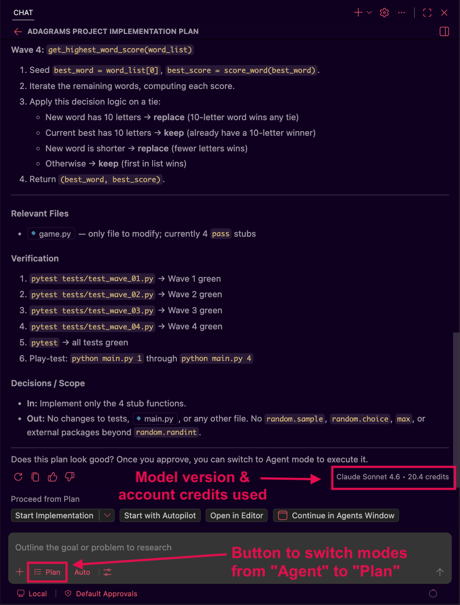
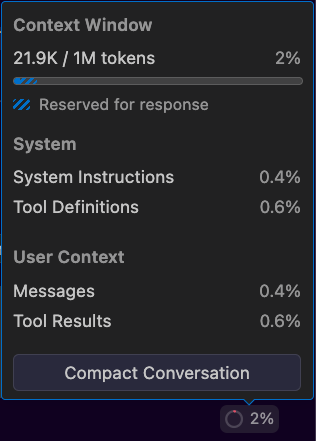
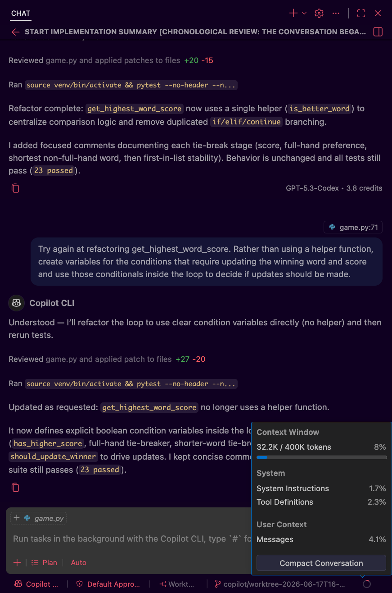

# Token Usage & Context Windows

So far, we introduced agents, subagents, and skills at a high level. Before we step into workflows and best practices for these components, it can be helpful to have a clear picture of the resource model underlying everything an AI coding agent does. 

Every action an agent takes, whether reading a file, generating code, or processing a plan, has a cost: tokens. Understanding where those tokens go, and how the space available for them shapes agent behavior, gives us the foundation we need to keep AI agents performing well and reduce our costs where possible.

## Learning Goals

- Identify the different sources of token consumption in an agentic coding session
- Explain what a context window is and describe what contributes to filling it
- Describe how agent behavior changes as the context window approaches capacity
- Apply strategies for managing the context window to get more out of a session

## Vocabulary and Synonyms

| Vocab | Definition | Synonyms | How to Use in a Sentence |
| --------- | --------- | -------- | --------- |
| Context Compaction | An automatic or manual process where an agent summarizes its conversation history to free up space in the context window without losing the most essential information. | Context compression, summarization | "When compaction triggered, the agent condensed the earlier part of our session into a summary so we could keep working without starting over." |

## Where Tokens Get Spent

We already know from previous lessons that tokens are the unit of measure for how much text an AI model processes. What we're exploring in this lesson is *where* those tokens come from in a typical agentic session, because the sources add up quickly and aren't always obvious.

The primary sources of token usage in an agentic session are:

### Startup content: system prompt, steering configuration, and tool definitions

Before we type our first message, the agent's session comes pre-loaded with context: instructions that define the agent's behavior, any steering document like a project configuration file, and descriptions of available tools and skills. 
- This foundational layer can range from a few hundred to several thousand tokens depending on how much guidance has been configured. 
- Notably, this entire layer is re-sent with every message in the session, which means a bloated steering file or a large number of connected tool definitions compounds in cost over the course of a session.

### Our messages and the full conversation history

Unlike a simple search query, an agent session is cumulative. Every message we send and every response the model returns stays in the context window for the duration of the session. Crucially, each new message doesn't just add to a running tab: the model re-reads the entire conversation from the start on every turn. 
- A session that has grown to 30 exchanges can cost exponentially more per turn than the same exchange made in a fresh session, because the earlier content is re-processed each time.

### Tool calls and their results

When an agent takes an action such as reading a file, running a shell command, or calling a search tool, the results of those actions come back into the context window. A single tool call that returns the full contents of a large source file can consume thousands of tokens at once. 
- Shell commands are a particularly easy source of invisible bloat: a verbose test suite, a long build log, or a `git log` with hundreds of commits can flood the context with output that lingers for the rest of the session.

### Extended processing passes

Some AI models support a mode where the model performs additional passes over the input before producing a final output. In this mode, the model generates a series of intermediate outputs that guide what it produces next, similar to how working through a problem on a scratch pad generally produces better results than jumping straight to an answer. 
- These intermediate outputs also consume tokens and count against the context window, so this feature is best reserved for truly complex problems rather than routine tasks.

### Generated output

The plans, explanations, code, and any other content the agent produces are all output tokens, which typically cost more than input tokens with most providers. 

As we can see, an agentic session contains vastly more content than our back and forth conversation with the AI. It is an accumulating record of everything that has happened, and that record grows with every step!

## A Deeper Look at the Context Window

### What the Context Window Actually Contains

We can think of the context window as the agent's working memory. It is everything the model can actively process at a given moment. When an agent is mid-session on a coding task, that window contains all of the types of content we listed above:
- System prompt
- Steering documentation
- Skill index
- Connected RAG and MCP server definitions
- All messages and responses of the current conversation
- The full contents of any skills loaded during the session
- The results of every file read, search, or command run so far, including any code the agent has written or reviewed in this session

*Fig. Our account credits and tokens used by agent context windows are tightly linked. Different models bill our credits at different rates per token. Over a billing period, our account credits are used by the individual agent sessions we run. Each of those agent sessions uses tokens to represent the data that fills their context windows. ([Full Size Image](assets/context-windows/token_pool_and_context_windows.png))*

This is a fundamentally different model from how we might think about human memory: 
- A developer working on a task can recall what they did last week, set aside information that isn't immediately relevant, and pull in context from many sources over time. 
- A model, by contrast, can only process what is currently inside its context window. Information outside that window might as well not exist from the model's perspective.

### How the Window Fills Up

In a straightforward back-and-forth conversation, a context window fills gradually and predictably. In an agentic coding session, it tends to fill faster and less evenly. A couple common patterns accelerate the fill rate:

**File exploration** - When an agent reads source files or searches documentation, each file's contents enters the window in full. Reading a handful of long files early in a session can consume a significant portion of the available space before any code has been written. Free-range exploration, where the model reads files one by one to find what it needs, is especially costly; targeted searches that return only matching lines are far more efficient.

**Iterative debugging cycles** - When a fix doesn't work on the first try, the error output, the attempted fix, the follow-up error, and the next attempt all accumulate. A debugging loop that takes five or six tries doesn't just cost more time: it costs significantly more tokens with each round.

### How Behavior Degrades as the Window Fills

This is the part that catches many developers off guard. Context windows have a hard ceiling, but behavioral degradation often begins well before that ceiling is hit. Research and practitioner experience point to the same pattern: as the total content in a context window grows, models tend to lose track of information buried in the middle of the conversation.

The effect is somewhat like trying to remember something from the middle of a very long lecture. Information near the start and end tends to be more accessible than what came between. For an agent working through a long coding session, this can manifest as:

- Forgetting constraints or decisions established early in the conversation
- Repeating work that was already completed
- Producing code that contradicts earlier design decisions
- Giving generic or less precise outputs as earlier context becomes effectively inaccessible

Most systems begin automatic compaction somewhere around 80–95% of the window's capacity. But by that point, some degradation is likely already occurring. This is why we want to develop habits to proactively manage context rather than waiting for automatic intervention. 
- A useful rule of thumb is to check context usage frequently and around the 60% mark, take action before quality starts to drift.

### Context Window Usage Example

How does this context usage look in a standard workflow? Let's look at a familiar example before trying it out ourselves: say that we want to use Copilot AI agents in VS Code to help us complete the [Adagrams project](https://github.com/AdaGold/adagrams-py). 

The first thing we'll do is open up the code locally, start a new agent session, and set the session to planning mode using the mode switcher at the bottom of the chat text box (see the "mode" button highlighted in the image below). If we then send a prompt like:

> Help me create a structured approach to complete the Adagrams project. The requirements are outlined in 'README.md'. Only the file 'adagrams/game.py' is allowed to be changed to complete this project. 'adagrams/game.py' contains 4 function definitions that need to be fully implemented. These functions must pass the tests located in the 'tests' folder. The functions should follow PEP8 best practices for Python. Only the packages in the file 'requirements.txt' are allowed to be used for this project.

We should pretty shortly see some plan generated, along with information on the model version and how many account credits were used by the response.

*Fig. Copilot agent chat in planning mode showing part of a plan for implementing the Adagrams project. ([Full Size Image](assets/context-windows/adagrams_planning_chat.png))*

If we click on the session usage tracker at the bottom of the screen, we can see details on the context window contents like our current usage, how the contents are divided up, and options for compacting the conversation:

*Fig. Session usage tracker for the copilot planning agent working on the adagrams implementation plan. ([Full Size Image](assets/context-windows/adagrams_planning_context_use.png))*

The model used for this planning session has a 1 million token context window size. The single request and response combined used up 21.9 thousand tokens of that total 1 million limit, and that's without any back and forth, no asking for explanation, requesting changes, etc. 

Once we have reviewed and approved the plan, we can press the "Start Implementation" button shown at the bottom of the chat window screenshot above, it will open a new agent session to begin implementing the outlined plan. In our run through, the implementation was started using a different model from planning, `GPT-5.3-Codex` which has a 400,000 token limit for its context window. 

After the initial implementation, we reviewed what was created and asked for 3 changes:
1. create a venv and install requirements before trying to run pytest
2. move constants to their own file and import them into `game.py`
3. refactor the last function to reduce repetition and make the function easier to follow
    - We needed to ask for this to be refactored twice, since the initial refactor used a nested helper function and made the code harder to follow.

*Fig. Part of the implementation response along with the session usage tracker for the copilot implementation agent after Adagram's changes were completed. ([Full Size Image](assets/context-windows/adagrams_impl_context_usage.png))*

The prompt & response cycle for the implementation plan and our requested changes, without any further discussion or code explanations, used about 8% of the context window for the implementation agent. 

Adagrams is a smaller scale project, we only altered two files, and only needed to read around seven files in total (test files, README.md & the two implementation files). As our project size and the amount of context required to do a task increases, proactively managing our context window becomes increasingly more important.

### !callout-info

## Try it out!

Using Adagrams or another project you're familiar with, start a new chat, set it to "Plan" mode, and ask an agent to help you create an implementation plan. 
1. Use the same steps above to examine the agent's context window usage. 
2. Ask a question or two and see how many tokens are used beyond the initial prompt.

As always with AI, we will get a slightly different responses, even when working with the same project. One session might require more or less changes, at different steps in the process to get to an implemetation that meets our needs. You may also see different asks from the agent, like requests for clarifications or tool permisions that did not come up in our example.

### !end-callout

## Managing the Context Window

Understanding that the window fills and behavior degrades is only useful if we know what to do about it. There are a variety of strategies, and we get the most out of our sessions by using them in combination:

### Compaction

When a context window grows too full, most agentic tools offer a mechanism, sometimes automatic and sometimes manually triggered, that compresses the conversation history by replacing it with a structured summary. The agent generates a compact account of what has happened so far, preserving the most important decisions, findings, and state, and then continues from that summary rather than the full transcript.

It can be worth manually triggering compaction when the option is available. Most tools that offer manual compaction let you add a prompt to give some guidance around what information is okay to lose and what topics must keep as much context as possible. 

Compaction is useful and often necessary, but it comes with the tradeoff that some context is still forgotten. Any information that wasn't captured in the summary is lost. If a subtle constraint from early in the session doesn't make it into the summary, the agent won't have access to it going forward. This is why other strategies, such as keeping context lean, are often preferable. Compaction should be treated as a recovery mechanism, more than a workflow strategy.

### Passing Summaries and File Paths Instead of Full Content

One of the most effective habits we can develop is resisting the urge to load large files directly into the conversation. Instead of asking an agent to read and hold an entire codebase, we can be more surgical:

- Reference a file by its path and ask the agent to load only the relevant sections
  - For example, we can tell an agent something like "The file located at `./src/routes/user_routes.py` can be used as an example, the file to implement is located at `./src/routes/admin_routes.py`" over copy & pasting one or both of the contents of those files into the context.
- Summarize what a file or module does rather than pasting its full contents
- Provide the agent with a high-level map of the codebase and let it pull in details on demand

The same principle applies to plans and documents. Rather than re-pasting a long planning document into every message, we can write it to a file, tell the agent where that file lives, and let it read it when needed. The file reference itself costs almost nothing in tokens; the full document only enters the context when the agent needs it.

Being precise with what we reference also matters at a smaller scale. For example: 
- If a bug is in one function, pointing the agent at that function is *far* cheaper than sharing the whole file. 
- If an error is in the last ten lines of a log, those ten lines are all the agent needs.

### Treating Files as External Memory

This leads to a broader habit: using disk storage to extend the effective memory of a session. The context window is a scarce resource, but disk storage is not. Anything that has been figured out, decided, or produced during a session is a candidate for writing to a file:

- Planning documents and architecture decisions
- Implementation notes and testing choices
- Research findings
- Implementations that are complete and don't need revisiting

When we write important outputs to files rather than relying on conversation history to retain them, we free up context for the work happening right now. We also protect that information from compaction: a file on disk survives a context compression, while a detail buried mid-conversation may not. 

Conversely, we should be thoughtful about when we read files back in. Loading something into context has a cost. If an agent doesn't need the full contents of a file to complete the current step, there's no reason to pay for it.

This is a habit that supports us outside of AI as well. These same files that help keep AI agents oriented and on track can help us or our teammates, days, weeks, or months down the road when we may not remember details of an implementation plan or reasoning behind specific decisions in the architecture.

### !callout-info

## Try it out!

Continuing the agent session from the context window usage example earlier, we can ask for the agent to persist this plan to disk for us. Use the prompt below as-is or update it to fit your needs or desired project structure:

> Create a new file at the path "./project_docs/implementation_plan.md" and write the implementation plan to that file.

We now have a record of our implementation plan that persists across agent sessions and that we can review or share at any time!

### !end-callout

#### Concrete ways to put this in practice

1. Next time we work on a project with agents, when planning is done and we're ready to implement, we should ask the agent to save our plan to disk before getting started.

2. As we go, if decisions are made, ask the AI to keep track of those in the implementation plan file or a separate "decisions" file.

3. We should think about what kinds of decisions and documentation we find useful to review for our learning. As we come up with questions, topics we want to review, or other thoughts we don't want to lose track of, ask the AI to save them to a file that we can look over later.
    - This can be great for helping organize questions and topics to ask about in #study-hall or office hours!

#### End-of-Session Summaries

A practice that makes new agent sessions feel less disruptive is building a summary step into the end of each session. Before closing a session, we ask the agent to write a brief summary file capturing:

- The decisions made and their rationale 
- Any constraints or patterns that came up that should inform future work
- Which files were modified and why
- Open questions or blockers
- What the next session should start with

This summary file becomes the starting context for the next session. It can be loaded alongside any relevant plan documents to give the new session the essential continuity without the clutter of the full prior history.

As a side benefit, over the course of a longer project, these session summaries build into a chronological record of how the project evolved, which decisions were made and why, and what was tried and abandoned. This kind of record is useful for project retrospectives, onboarding new team members, or revisiting a decision that was made months earlier.

### !callout-info

## Try it out!

In the current session where we generated an implementation plan and saved it to disk, use the prompt below, or create your own that captures the details you are most interested in, to ask the AI to write a summary to disk:

> Please create a session summary at the file path <your_chosen_filepath>. Output the response exactly in the following structured format:
>
> 1. Intent & Progress
>     - **Primary Request:** What was the overarching goal of this coding session?
>     - **Current State:** Exactly what was accomplished, and what state is the codebase in right now?
>     - **Pending Tasks:** What are the next immediate work items to do?
>
> 1. Technical Concepts & Architecture
>     - **Tech Stack:** Key frameworks, libraries, and design patterns used.
>     - **Conventions & Rules:** Specific architectural or coding standards we established in this session that future agents MUST follow (e.g., naming conventions, error-handling patterns).
>
> 3. Files & Codebase
>     - **Files Modified/Created:** Bulleted list of exact file paths.
>     - **Key Code Additions:** High-level overview or snippets of the most critical logic or APIs recently added.
>
> 4. Errors & Troubleshooting
>     - **Errors Resolved:** Brief summary of bugs encountered and how they were fixed.
>     - **Known Issues/Warnings:** Any unresolved issues, edge cases to watch out for, or pending technical debt.
>
> 5. Verification & Testing
>     - **Verification Commands:** List exact commands (e.g., `npm run test`, `pytest`) that can be run to validate this project's integrity.
>     - **Edge Cases Tested:** Scenarios already accounted for.
>
> 6. Actionable Next Steps
>     - Provide a concise, 1-2 sentence command or paragraph we can feed to the next agent to get it up to speed with the right context.

Review the summary and note what went well, where information may have been vauge, and what you might want to tweak in the prompt for next time to get a summary that meets your needs. 

We can save this prompt to reuse, but we can also think about turning this into a skill file that we can reuse and share with other teammates. More on skills in a later lesson!

### !end-callout

### Starting a Fresh Session

Often times, the most effective move is to begin a new session entirely. When a current session has accumulated a lot of history like failed attempts, exploratory tangents, and superseded plans, carrying it forward can work against us. 

A fresh context gives the model a clean slate, and if we've been writing important decisions and outputs to files, we lose almost nothing by closing a session and opening a new one. We can re-orient the new session quickly by pointing it at those files rather than trying to summarize or compress a cluttered history.

Imagine this scenario: a team has been in a planning session for several hours, iterating on an implementation plan for a new authentication flow. 
- The session includes several rounds of "what if we approached it this way instead" exchanges, a long tangent about a library they eventually decided not to use, and an early version of the plan that was significantly revised. 
- They now have a final plan written to `docs/auth-implementation-plan.md`.

Rather than passing this implementation plan to the current session with its full history, they open a fresh session, load the plan document, and begin implementation. The agent starts with exactly what's needed, without any knowledge of or influence from the exploratory paths we went down while planning.

#### Recognizing When to Switch

Common signals that a new session would serve us better:

**Phase transitions**: Moving from planning to implementation is often a natural point to start fresh. The planning session produced a specification; the implementation session loads that specification and the codebase. There's no benefit to bringing the planning discussion along.

**Completed topics**: If a session included significant investigation into an issue that's now resolved, the context from that investigation doesn't help with the next task. It just adds to the overhead the model processes on every message.

**Output quality drift**: Agents don't flag when context saturation is affecting their outputs. If we notice outputs becoming less specific, more generic, or less consistent with instructions that were clear earlier in the session, this is often a sign that the context window is working against us.

**A genuinely new task**: Starting a different feature, a separate bug fix, or a task in a different part of the codebase is almost always better done in a fresh session. There's no reason to pay for unrelated context on every message.

None of these are hard rules, sometimes it could makes sense to continue! But if we find that we are by default choosing to continue existing sessions because starting fresh feels like lost work, we should question this. If the important outputs are in files, the "lost work" is mostly accumulated noise.

### Managing What Gets Connected

Startup content loads on every message, so anything connected to the agent that isn't actively needed is a recurring cost. MCP server tool definitions in particular can run into the tens of thousands of tokens per server. 

Disconnecting servers we aren't using in a given session, and configuring exclusion rules so the agent skips build artifacts, dependency directories, and generated files, can eliminate a significant portion of background overhead without changing anything about how we work. We'll look at where to connect and disconnect MCP servers in VS Code in a later lesson.

### Subagents as a Context Management Tool

All of the strategies above help us be more careful with a single session's context. Once we're confident that we have strong habits in place to manage a single session, the most powerful step up is to delegate isolated tasks to subagents.

As we covered in a previous lesson, a subagent is a separate agent instance with its own fresh context window. When a primary agent spawns a subagent, it gives it a focused task: do this research, implement this function, run these tests. The subagent works in its own clean context, completes its job, and returns a summary of what it found or produced to the primary agent.

This means all the file exploration, intermediate steps, and failed attempts that happened inside the subagent stay there. None of that accumulates in the main session's context. From the primary agent's perspective, the subagent's work appears as a single compact result.

This is especially valuable for research and exploration tasks, which are among the fastest ways to fill a context window. Delegating "go read these files and tell me what's relevant" to a subagent lets us gather information without taking over the context window in our primary session. We'll dig into subagents more deeply as we talk about workflows and best practices.

## Summary

Managing a context window is less about memorizing a set of rules and more about developing a mental model of where tokens go and why that matters. Everything we put in it costs something in tokens, and costs compound across the full session because earlier content is re-processed on every new turn.

The context window is the agent's working memory: it can only contain so much information and as it fills, compaction will cause it to lose details over time. Session degradation is gradual and tends to sneak up on us. We don't get a sudden drop in quality when the window fills. We get a slow drift toward less precise, less consistent outputs. Catching this early means watching for the signs: 
- ignoring earlier constraints
- repeating work
- generic outputs where specific ones are expected

Keeping the window lean as we work is a better practice than cleaning it up after it fills. Our goal at each step is to provide models with exactly the context they need to do work that meets our requirements. Providing extra content that isn't immediately useful can actually hurt us by filling context windows faster and driving sessions towards degradation sooner.

Files are persistent, while an agent's session context is not. Decisions, plans, and outputs written to disk are safe from context pressure. Practices around externalizing information, writing things down and referencing files by path rather than pasting full contents, all work together to allow us to get the most out of individual sessions.

Subagents are context isolation in action. Once we have built up practices for managing context in a single agent's session, subagents let us scale that discipline across parallel or sequential workstreams without filling up the main session context. As we'll see in upcoming lessons, this is important in workflows where a primary agent is often responsible for organizing tasks, orchestrating subagents to perform them, and tracking the overall project progress.

## Check for Understanding

<!-- prettier-ignore-start -->
### !challenge
* type: multiple-choice
* id: m4Rk9pLxQ2nBv7Yw3Jf8Dc1Tz5As6Ge
* title: Token Usage & Context Windows
##### !question

A developer has been working in the same coding agent session all day. By message 40, they notice the agent has started ignoring a constraint they set up in message 5. What most likely explains this behavior?

##### !end-question
##### !options

a| The model's weights are updated during long sessions and the original constraint was overwritten.
b| Content buried in the middle of a long context window receives less effective attention from the model, making earlier constraints less likely to influence later outputs.
c| The constraint was invalid and the model determined it should be skipped.
d| Agent sessions expire after a set number of messages, resetting the context automatically.

##### !end-options
##### !answer

b|

##### !end-answer
##### !explanation

Models tend to pay less attention to content that is buried in the middle of a long context window, a pattern sometimes called "lost in the middle." As a session grows longer, earlier instructions, constraints, and decisions become progressively less likely to influence the model's outputs even though they are technically still present in the context. 

This is why proactive context management matters: keeping the window lean, writing important decisions to files, and using compaction or fresh sessions before degradation sets in are all more effective than hoping a long context stays coherent.

##### !end-explanation
### !end-challenge
<!-- prettier-ignore-end -->

<!-- prettier-ignore-start -->
### !challenge
* type: multiple-choice
* id: Hn6Wq8kRpY1Lc4Mv2Xt7Bs3Jf9Dz5Au
* title: Token Usage & Context Windows
##### !question

A team is working on a large codebase. At the start of each session, their agent reads every source file in the project directory to build context. What is the primary problem with this approach?

##### !end-question
##### !options

a| Reading files at session start prevents the agent from writing to those files later.
b| File reads are billed at a higher token rate than conversation history.
c| Loading large volumes of content upfront consumes a significant portion of the context window before any useful work begins, and all of that content is re-processed on every subsequent turn.
d| Agents can only read files that are explicitly listed in the steering document.

##### !end-options
##### !answer

c|

##### !end-answer
##### !explanation

Because an agent re-reads the entire context window on every turn, files loaded at the start of a session aren't a one-time cost: they recur with every message. Loading an entire codebase upfront can consume the majority of the available context before any code is written, and that overhead compounds throughout the session. 

A more effective pattern is to reference files by path and have the agent load only the sections it actually needs for the current step, keeping the context focused on active work.

##### !end-explanation
### !end-challenge
<!-- prettier-ignore-end -->

<!-- prettier-ignore-start -->
### !challenge
* type: multiple-choice
* id: Qp3Lz7Xv9Fw2Nt5Bm8Yk1Cj4Rg6Dh0
* title: Token Usage & Context Windows
##### !question

A developer working on a multi-day project wants to end their current session without losing important context. Which approach best preserves useful information while keeping the next session's starting context lean?

##### !end-question
##### !options

a| Leave the session open overnight so the context window stays populated.
b| Paste the full conversation history into the new session's first message.
c| Ask the agent to write a summary file capturing key decisions, files touched, and open questions, then start a fresh session that loads that file.
d| Trigger compaction immediately before ending the session so the history is compressed in place.

##### !end-options
##### !answer

c|

##### !end-answer
##### !explanation

Writing a summary to a file before ending a session lets us start the next session with only what's actually needed: the conclusions, decisions, and open loops. Loading that file in a fresh session costs far fewer tokens than re-loading a full conversation history, and unlike relying on compaction, we have direct control over what the summary captures. 

Leaving a session open or pasting the full history into a new session both preserve the bloat we're trying to avoid. Triggering compaction at the end of a session helps, but produces output that lives in the session's history rather than in a portable file that we could load into a new context.

##### !end-explanation
### !end-challenge
<!-- prettier-ignore-end -->