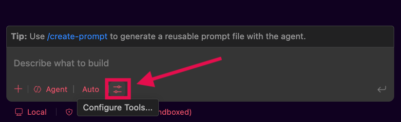
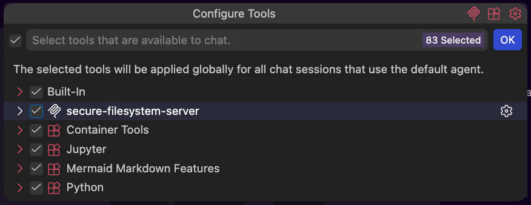

# MCP & RAG: Adding Outside Knowledge

At this point, we know that a model on its own knows two things: what was in its training data and whatever currently sits in its context window. A model can't natively query a production database, open a ticket in our project tracker, or read a document we wrote last week. Two mechanisms close that gap in different ways:
- Model Context Protocol (MCP) gives an agent a way to reach external tools and services.
- Retrieval-Augmented Generation (RAG) gives an agent a way to pull in relevant knowledge from a large external source without loading all of it upfront.

In this lesson, we'll look more closely at how each of these works, what connecting to one looks like in practice, and how they affect the token usage and costs we've talked about previously.

## Learning Goals

- Describe how an MCP server exposes tools to an agent and what happens when we connect one.
- Describe how a RAG system retrieves and injects relevant knowledge into a context window.
- Identify the token and cost tradeoffs introduced by MCP servers and RAG systems.
- Apply judgment about when adding an MCP server or RAG system is worth its overhead.

## Vocabulary and Synonyms

| Vocab | Definition | Synonyms | How to Use in a Sentence |
| --------- | --------- | -------- | --------- |
| Model Context Protocol (MCP) | An open standard that defines how an agent connects to external tools and services, and how those tools describe themselves to the agent. | MCP | "We used MCP to connect the agent to our internal deployment system." |
| MCP Server | A program that exposes a defined set of tools, and their schemas, to an agent over the Model Context Protocol. | Tool server | "We connected a Slack MCP server so the agent could post updates to our team channel without us copying and pasting them manually." |
| Tool Schema | The structured definition of a tool's name, description, and expected inputs and outputs, provided by an MCP server. | Tool spec | "The tool schema specified that the `create_ticket` tool required a title and a priority level as inputs." |
| Chunk | A smaller piece of a larger document, broken up so it can be individually embedded and retrieved by a RAG system. | Passage, segment | "The onboarding guide was split into chunks by section, so retrieval could return just the relevant section instead of the whole guide." |
| Embedding | A numeric representation of a piece of text that captures its meaning, used to compare how similar two pieces of text are. | Vector representation | "The retrieval system converted our question into an embedding so it could be compared against the embeddings stored for each document chunk." |
| Vector Database | A database designed to store embeddings and quickly find the ones most similar to a given query. | Embedding store | "The support team's RAG system stores their help articles in a vector database so relevant chunks of articles can be retrieved in milliseconds." |

## Reaching External Tools: MCP Servers

An **MCP server** is a program that exposes a set of tools to an agent using a shared, open protocol.

**MCP** (Model Context Protocol) is a protocol standardizing how AI applications (built on models) connect to external data sources and tools, so that relevant information can be pulled into a model's context on demand. It also defines how an agent can call a tool and receive its results back.

So instead of every AI tool vendor building its own custom way for agents to talk to Slack, GitHub, or a database, MCP defines one standard so a server built once can be used by any compatible agent.

Connecting to an MCP server looks a little different depending on where that server runs, but the underlying steps are the same in either case.

### Local Servers

A local server runs as a process on our own machine, alongside whatever agent tool we're using. We typically set one up by editing a configuration file that tells our agent host what command to run to start the server. That configuration usually specifies:
- A name for the server, so we can identify it in our tool's interface
- The command used to launch it, along with any arguments it must be supplied to run successfully
- Any environment variables the server needs, like an API key it uses to reach a service on our behalf

Once that configuration is saved and our agent host is restarted, it starts the server process and communicates with it using standard input and output, often referred to as **stdio** (usually read as either "standard input output" or "standard I O").
- **stdio** is the same mechanism command-line programs have long used to pass text back and forth!

#### Local MCP Configuration

The exact name and location of our MCP configuration file will depend on our IDE, but they typically use a similar JSON format. To make the local server setup more concrete, let's break down a real configuration file we could use to register a filesystem MCP server. 

The local server in the configuration below is installed as an `npm` package ([npm docs here](https://www.npmjs.com/package/@modelcontextprotocol/server-filesystem)). It is an example server provided by the stewards of [modelcontextprotocol.io](https://modelcontextprotocol.io/) and gives an agent tools for reading and managing files in specific folders:

```json
{
  "servers": {
    "filesystem": {
      "command": "npx",
      "args": [
        "-y",
        "@modelcontextprotocol/server-filesystem",
        "/Users/username/Desktop",
        "/Users/username/Downloads"
      ]
    }
  }
}
```

Here's what each part is doing:

- **`"servers"`**: The top-level key our agent host looks for in this file. The exact key name can vary between agent hosts, some use `"servers"`, others use `"mcpServers"`. Everything nested inside it is a server we want available in our sessions and a single file can list more than one server here.

- **`"filesystem"`**: A name we're choosing for this server. This is just a label, it's how the server shows up in our agent host's interface, and it doesn't need to match the package name or anything else in the configuration.

- **`"command": "npx"`**: The command our agent host should run to start the server. `npx` is a tool that comes with Node.js, and its job here is to fetch and run a JavaScript package without us having to install it separately first.

- **`"args"`**: The list of arguments passed to that command, in order, exactly as if we'd typed them into a terminal ourselves:
  - **`"-y"`**: Tells `npx` to install the package automatically if it isn't already available locally, rather than pausing to ask us to confirm.
  - **`"@modelcontextprotocol/server-filesystem"`**: The specific package to run. This is the filesystem server itself, the code that knows how to read files, list directories, and so on.
  - **`"/Users/username/Desktop"` and `"/Users/username/Downloads"`**: These last two arguments aren't flags for `npx`, they're arguments given to the filesystem server when it launches. These are read to determine which directories the server is allowed to touch. Every argument from this point in the array onward is handled by the server's logic rather than by `npx`.

A couple notes about this server and its definition:

- **The directory paths are also the security boundary.** This server will only be able to read or modify files inside `/Users/username/Desktop` and `/Users/username/Downloads`, because that's what its own tools were configured to allow. Adding or removing paths here is how we widen or narrow what the server can reach, without needing to change any code.
- **Nothing here mentions our agent or model at all.** This configuration is entirely about how to launch and scope a program that happens to speak MCP. The agent doesn't know these tools exist until our host restarts and completes tool discovery against this running server.

### !callout-info

## Try it out!

Let's connect a local MCP server in VS Code and confirm that its tools show up where we expect.

1. Inside a project run **MCP: Open User Configuration** from the Command Palette to open the MCP configuration file.
2. Add a `filesystem` server entry using the configuration we walked through above by copy & pasting the configuration then updating the directory paths (`"/Users/username/Desktop"`, `"/Users/username/Downloads"`) to point at folders on our own machine.
3. Save the file. 
    1. VS Code may try to start the server immediately after saving. If so, it may ask us to confirm that we trust the server before it starts, since local servers can run code on our machine.
4. Open the Chat view and select **Configure Tools** in the chat input. The name may not immediately default to the specific name we gave the server, but we should see the tools VS Code discovered from our new server listed there.  
       
    *Fig. "Configure Tools" button in the VS Code Chat UI*

    
    *Fig. `secure-filesystem-server` tools showing in the VS Code "Configure Tools" menu*

5. Give the agent a prompt that would use one of those tools, such as asking it to list the files in one of the directories we configured, and confirm we're prompted to approve the tool call before it runs.

### !end-callout

### Remote Servers

A remote MCP server runs somewhere other than our own machine. These servers are commonly hosted by teams or companies to facilitate integrating their products into AI workflows. A few examples of the many companies that host their own MCP servers are: 
- [GitHub](https://github.com/github/github-mcp-server)
- [Figma](https://help.figma.com/hc/en-us/articles/32132100833559-Guide-to-the-Figma-MCP-server)
- [Notion](https://developers.notion.com/guides/mcp/overview)
- [Stripe](https://docs.stripe.com/mcp)

We typically add remote MCP server connections in 2 ways:
- Add a new entry our MCP server configuration file. A remote server connection typically includes the server name, the communication type (how an agent should communicate with this server), and the URL to access the server
- Using our IDE's UI to add a new connection, which will vary from tool to tool

Because the server isn't running under our own user account, most remote servers require an authentication step, commonly OAuth or an API key, before they'll accept requests on our behalf. Remote servers communicate over HTTP rather than stdio, allowing them to be accessed from anywhere with an internet connection.

#### Remote MCP Configuration

Let's take a look at our MCP server configuration from earlier, this time with a remote server connection added to the top of the `servers` list. 

The new connection points at [GitHub's hosted MCP server](https://github.com/github/github-mcp-server), giving an agent tools for working with repositories, issues, and pull requests:

```json
{
  "servers": {
    "github": {
      "type": "http",
      "url": "https://api.githubcopilot.com/mcp/"
    },
    "filesystem": {
      "command": "npx",
      "args": [
        "-y",
        "@modelcontextprotocol/server-filesystem",
        "/Users/username/Desktop",
        "/Users/username/Downloads"
      ]
    }
  }
}
```

Here's what is happening in the newly added code:

- **`"github"`**: A name we're choosing for this server, just like in the local example. It's a label for our own reference, not something the server itself requires.

- **`"type": "http"`**: This tells our agent host how to talk to the server. Rather than launching a program and communicating over standard input and output the way a local server does, our agent host sends requests to this server over HTTP.

- **`"url"`**: The address of the server itself. This is the one piece of information our agent host actually needs to reach it, since there's no command to run or package to install. The server is already running, hosted by GitHub, and we're pointing to it.

A few things worth noting:

- **There's no command, no package, and no arguments passed.** Unlike a local server, we're not launching anything. The server already exists elsewhere, and our configuration is just an address.
- **Authentication isn't shown in this file.** Most remote servers require us to log in or provide credentials before they'll act on our behalf, but that step usually happens through a separate sign-in flow in our agent host rather than being written into this configuration. Once we've authenticated, our agent host holds onto that authorization for future sessions.
- **The security boundary shifts.** With a local server, what it can touch is defined by our user permissions that it is running with or by the arguments we give it at start up. With a remote server, what it can touch is defined by our account permissions on whatever service it's connected to, since the server is acting on our behalf through that authenticated session rather than through our machine's file system.

**Local vs. Remote, at a Glance**

| | Local Server | Remote Server |
| --- | --- | --- |
| Where it runs | Our own machine | Hosted elsewhere, reached over the internet |
| How we connect | Configuration pointing to a command | A URL added through connector settings |
| Authentication | Usually none, runs as us | Typically required, OAuth or API key |
| Good fit for | Local file access, local dev tools | Hosted services and team tools |

### What Happens After We Connect

Regardless of whether a server is local or remote, connecting it triggers the same sequence:

1. **Tool discovery**: Our agent host asks the server what tools it offers, and the server responds with each tool's name, description, and input schema.
2. **Loading into context**: That information gets added to the context window, ready for the model to reference when deciding whether a tool applies to the current request.

From there, when our request matches something a connected tool can do, the agent's output includes a tool call: a structured request naming the tool and supplying the required inputs. The server executes that call against the real system it's connected to and returns a result, which gets added back into the context for the next step.

Most agent hosts don't let a connected server act freely. The first time a tool would be used, we're often shown what it wants to do and asked to approve it. 
- Many tools let us configure which specific commands are allowed to run without asking each time, however, we should be cautious about auto approving tool actions until we are comfortable with our sandbox set up and how those particular tools operate.

### Practical Scenario

Consider an on-call engineer using an agent connected to 2 servers: a monitoring MCP server and an incident-tracking MCP server. 
- When a service starts throwing errors, the engineer can ask the agent to pull recent error logs and open an incident ticket summarizing what it found.
- The agent doesn't have any built-in knowledge of the monitoring platform's API. What it has is a tool called `query_logs` attached to the monitoring MCP server and a tool called `create_incident` from the incident-tracking MCP server, along with descriptions telling it what each one does and what inputs each expects.

A useful way to frame MCP is that it expands *reach*, not *judgment*. The server exposes what's possible. Whether a given tool gets used, and how its results get interpreted, still comes from the model matching the current request against the tool descriptions available to it. 
- This is why, just like with skills, inaccurate or overly broad descriptions cause real problems. If two tools have similar descriptions, or a description is vague about what a tool actually does, the wrong tool is likely to get selected.

### !callout-warn

## A Note on Trust

Because a local server runs with our own machine's permissions, it can do anything we could do manually: read files, make changes, or reach out over the network. A remote server acts within whatever access we grant it during authentication. 

In both cases, we should only connect servers from sources we trust, and review what a server's tools claim to do before approving repeated or sensitive actions. This is the same caution we'd apply to installing any other piece of software that runs code on our behalf.

### !end-callout

## Reaching External Knowledge: RAG

**Retrieval-Augmented Generation (RAG)** is about reaching external knowledge. RAG solves a specific problem: a model's training data has a cutoff date and never included our private codebase, internal wiki, or last month's incident reports. We can't paste an entire internal knowledge base into a context window for every question, so RAG is a system that enables finding and retrieving only the relevant information.

A RAG setup has two phases:

**Building the knowledge base (done ahead of time):**

1. Source material gets broken into chunks, smaller pieces of text like a paragraph or section.
2. Each chunk is converted into an embedding, a numeric representation of its meaning.
3. Those embeddings are stored in a vector database for fast comparison later.

**Answering a query (done at request time):**

1. **Querying**: When we ask a question, our query is converted into an embedding using the same process used on the original text we are searching.
2. **Retrieval**: The vector database is searched, comparing our query's embedding against the stored chunk embeddings. The chunks with the closest matches are returned (the chunks whose meaning is most similar to what we asked).
3. **Injection**: Those retrieved chunks get added into the context window alongside our original question, and the model generates its answer using that added context.

How we actually interact with RAG systems is typically through MCP, which is why we've presented these topics together. 
- A RAG system creates the infrastructure to provide relevant knowledge, and we interact with that system either as a locally running service, or remotely through an API.
- Whether local or remote, in order for our agents to use a RAG knowledge base, we would connect to that running service using MCP as mentioned in the section above.

### Practical Scenario

A company's legal team maintains thousands of pages of internal compliance policies. When someone asks an agent whether a new vendor contract needs a specific data-handling clause, a RAG system searches that policy library and returns the handful of paragraphs most relevant to the question. The model then answers using those specific paragraphs, rather than guessing based on general knowledge of what compliance policies tend to say. 
- RAG is useful here because contract terms are specific to the organization; there's no way general training data would reflect all of a company's current policies.

We'll revisit RAG in later cloud-focused materials. For now, the key idea to hold onto is that RAG's job is to provide specific knowledge, relevant to a prompt, at the time it is requested.

## Effects on Token Usage, Context Windows, and Cost

Both of these mechanisms extend what an agent can accomplish, but neither one is free, and they spend tokens in different places.

**MCP's cost shows up upfront.** Every tool definition from every connected server gets loaded into the context window at the start of a session, whether or not that tool ends up being used. A server that exposes a small handful of focused tools might only add a few hundred tokens. A server that exposes dozens of tools, each with a detailed input schema, can add tens of thousands of tokens before we start working. If we connect several MCP servers "just in case," we can end up paying a steady token tax across every single message in the session.

**RAG's cost shows up per query.** Rather than loading an entire knowledge base upfront, RAG only injects the specific chunks retrieved for a given question, typically a few hundred to a couple thousand tokens depending on how many chunks are returned. The tradeoff is that retrieval isn't perfect. If the wrong chunks get retrieved, we've spent tokens on unhelpful context and may still get an inaccurate answer.

The table below summarizes the comparisons above:

| | MCP | RAG |
| --- | --- | --- |
| What it adds | The ability to call external tools and services | Relevant reference knowledge from a large source |
| When cost is paid | Upfront, at session start, for every connected server | Per query, based on how many chunks are retrieved |
| How it scales | Cost grows with the number of connected servers and tools, regardless of use | Cost grows with the number of chunks retrieved per question |
| Main risk of overuse | Context window fills with unused tool schemas on every turn | Irrelevant chunks get retrieved, adding cost without adding accuracy |

How tokens are used by these systems means our setup decisions matter, and that those set up decisions are another way that we control our agent context windows and our costs. Some best practices are to:

- **Only connect the MCP servers a project actually needs.** A server we connect out of curiosity but rarely use is pure overhead on every message.
- **Prefer focused servers over broad ones when we have a choice.** A server with five well-scoped tools is cheaper to keep connected than one with fifty tools we mostly ignore.
- **Tune how much RAG retrieves.** Most RAG systems allow us some control over how much information is returned. Pulling back ten chunks "to be safe" costs more tokens than pulling back three well-matched ones, and can also dilute the model's context with less relevant material.
- **Reach for RAG over stuffing full documents into context.** If we find ourselves in a pattern of needing to reference a large document or set of documents frequently, and we end up pasting the entire reference document into a conversation when we only need a single section or page, that is a strong sign that a retrieval setup could serve us better long term.

### !callout-info

## Try it out!

Let's look at how to disable tools from a server, shut down a local MCP server, and remove the server entirely, so we know how to disable tools we aren't actively using.

First, we'll check that the server is running: 
1. Run `MCP: List Servers` from the Command Palette  
2. Look for the `filesystem` server in the dropdown list. It will say "Running" next to the name if it is currently active.
    - If the server says "Stopped", click on it and choose the "Start Server" action.

To disable tools from a server without stopping the local server:
1. Open the Chat view and select "**"Configure Tools**"
2. Uncheck the box next to `secure-filesystem-server` to disable all tools available on the server. 
    - We can also choose to disable individual tools from the server from this view by unchecking the box next to a specific tool's name.

To turn off the running `filesystem` MCP server:
1. Run `MCP: List Servers` from the Command Palette  
2. Select the `filesystem` server from the drop down that appears, and choose "**Stop Server**". 

To fully remove the MCP Server we can either:
- Use the UI: 
    1. Click the settings icon at the top of the VS Code Chat pane
    2. Select "MCP Servers" from the menu on the left
    3. Right click on the `filesystem` server and select "Uninstall" from the drop down
- Edit the MCP configuration file:
    1. Run **MCP: Open User Configuration** from the Command Palette to open the MCP configuration file.
    2. Delete the `filesystem` key and value pair from the `servers` object
    3. Save the updated configuration file

### !end-callout

## Summary

Agents don't come pre-loaded with access to our tools or our private data, so we need mechanisms to extend what they can reach. 
- **MCP** gives an agent a standard way to call external tools, whether those tools run locally on our machine or are hosted remotely by a service we authenticate into. 
- **RAG** gives an agent a way to pull in relevant knowledge from a large external source by searching stored embeddings and injecting only the closest matches into the context window. 

Both add further capabilities to our agents, but neither is free: 
- MCP's cost is paid upfront every session for each connected server's tool definitions.
- RAG's cost is paid per query based on how many tokens are used by the chunks retrieved. 

Unless we are explicitly experimenting, each server and knowledge base we connect should earn its place in the context window through necessity or measured value. Being deliberate about which servers we connect and how aggressively we retrieve documentation helps us keep sessions efficient.

## Check for Understanding

<!-- prettier-ignore-start -->
### !challenge
* type: multiple-choice
* id: jq9T09LhzxzH82fcGiN8q4U3
* title: Adding Outside Knowledge: MCP & RAG
##### !question

After connecting to an MCP server, what has to happen before an agent can use one of that server's tools in response to a request?

##### !end-question
##### !options

a| The agent must complete tool discovery, loading the tool's name, description, and input schema into its context window
b| The agent automatically gains the ability to use the tool with no additional setup required
c| The server must be restarted every time the agent wants to use a tool
d| The tool must be converted into an embedding before it can be referenced

##### !end-options
##### !answer

a|

##### !end-answer
##### !explanation

Connecting to a server triggers tool discovery: the agent host asks the server what tools it offers, and the server responds with each tool's name, description, and input schema. That information gets loaded into the context window, which is what allows the model to match a request against an available tool and generate a tool call. Restarting the server isn't required for every use, and embeddings are part of how RAG systems compare text, not how MCP tools get referenced.

##### !end-explanation
### !end-challenge
<!-- prettier-ignore-end -->

<!-- prettier-ignore-start -->
### !challenge
* type: multiple-choice
* id: banJGcorNlyh3zO6CJ4abrlF
* title: Adding Outside Knowledge: MCP & RAG
##### !question

A company's legal team wants an agent to answer questions using their internal compliance policy documents, which total thousands of pages. They don't want to paste the entire policy library into every conversation. Which approach best fits this need, and why?

##### !end-question
##### !options

a| MCP, because MCP servers are designed to store and search large volumes of text
b| RAG, because it retrieves only the chunks most relevant to a given question instead of loading the whole library
c| A local MCP server, because local servers can hold large documents in memory for free
d| Neither approach helps here, since neither can work with documents outside of training data

##### !end-options
##### !answer

b|

##### !end-answer
##### !explanation

RAG is built for exactly this problem: breaking a large source into chunks, storing their embeddings, and retrieving only the closest matches to a given question at request time. This keeps token usage far lower than loading an entire knowledge base into context. MCP is focused on giving an agent access to external tools and services, not on searching and retrieving relevant passages from a large body of text.

##### !end-explanation
### !end-challenge
<!-- prettier-ignore-end -->

<!-- prettier-ignore-start -->
### !challenge
* type: multiple-choice
* id: OvskqtuDY7Nh14tmfqQT9O7e
* title: Adding Outside Knowledge: MCP & RAG
##### !question

An agent has a `query_logs` tool from a monitoring MCP server and a `create_incident` tool from an incident-tracking MCP server. When an engineer asks it to investigate an error spike and open a ticket, what determines which tools actually get used and how their results get applied?

##### !end-question
##### !options

a| The order in which the servers were connected during setup
b| The model matching the request against the available tool descriptions, since MCP expands reach rather than judgment
c| The MCP servers themselves decide which tools are relevant and run automatically
d| Whichever tool has the shortest input schema is always selected first

##### !end-options
##### !answer

b|

##### !end-answer
##### !explanation

MCP expands what's reachable, but it doesn't determine what gets used. The model still has to match the current request against the tool descriptions available to it to decide whether a tool applies and how to interpret its results. This is also why vague or overly similar tool descriptions can cause the wrong tool to be selected.

##### !end-explanation
### !end-challenge
<!-- prettier-ignore-end -->
