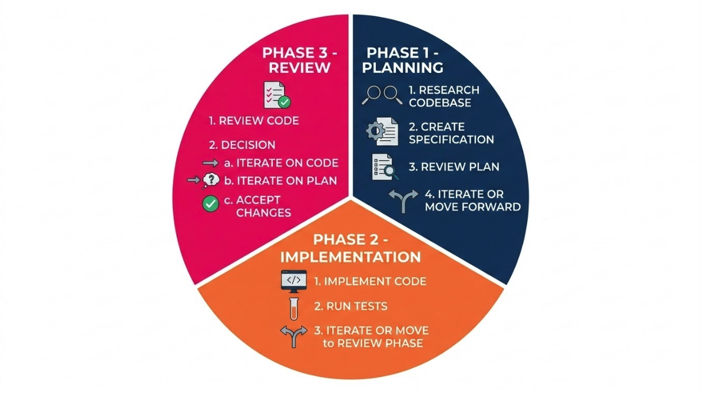

# Recommended Workflows

In the previous lessons we established what agents are and how their context windows work. Now we can put those ideas to use by looking at how to structure a coding session: what phases we move through, where human review belongs in that sequence, and what patterns experienced practitioners reach for when the work scales up.

## Learning Goals

- Describe the planning, implementation, and review phases of an agentic coding workflow and explain the purpose of each.
- Identify where human review checkpoints belong in the workflow and explain why they're necessary.
- Describe the adversarial review pattern and explain what problem it's designed to solve.
- Describe the fan-out pattern and identify when it offers a meaningful advantage over single-session work.

## Vocabulary and Synonyms

| Vocab | Definition | Synonyms | How to Use in a Sentence |
| --------- | --------- | -------- | --------- |
| Adversarial review | A workflow pattern in which a separate agent session evaluates output produced by a previous session, without access to the original session's context. | Critic agent, independent review | "Running an adversarial review on the generated auth module caught several edge cases the original agent didn't handle." |
| Fan-out | A workflow pattern in which an orchestrating agent delegates subtasks to multiple subagents running in parallel, then synthesizes their results. | Parallel delegation, subagent fan-out | "The team used fan-out to run security, architecture, and test coverage reviews simultaneously rather than sequentially." |
| Orchestrator | An agent responsible for managing the overall plan of a complex task and delegating subtasks to subagents. | Primary agent, coordinating agent | "The orchestrator reviewed the approved plan and assigned separate subagents to handle research, implementation, and testing." |
| Human-in-the-loop | A design principle in which a human reviews and approves agent output at defined checkpoints before work continues. | Human oversight, review gate | "The team followed a human-in-the-loop approach, reviewing the full implementation plan before giving the agent permission to begin writing code." |

## The Core Workflow

There is no single universal workflow for agentic coding, but practitioners across the industry tend to converge on the same basic shape: 
1. plan first
2. implement next
3. then review & iterate until we reach a stopping point

It's important to note that, though we explicitly mention reviewing in the last phase, it is not the only place where reviews are necessary.
- If we as humans don't review and approve an implementation plan before sending it to an agent to write code, then that planning step loses much of its purpose. 

We'll talk a bit more about what it means to keep a human in the loop, then dive into the workflow phases in more detail!

### Human-in-the-Loop

The phrase "human-in-the-loop" refers to the principle that human judgment should sit at defined checkpoints in any agentic workflow, rather than allowing the agent to run autonomously from prompt to completion.

This matters for the same reasons we've brought up previously: agents operate on statistical text prediction, not judgment. The outputs they produce can be sophisticated and superficially correct while containing subtle errors, missing edge cases, or violating architectural constraints that weren't fully specified. Because the AI loop runs without human awareness between steps, problems can compound before we have a chance to catch them if we do not build explicit checkpoints into our flows.

The practical implication is that our role in an agentic session is not just to write the initial prompt. It is to review plans before they become code, to monitor implementation for signs the agent is drifting or stuck, and to evaluate output before accepting it. The agent handles the mechanical work between our checkpoints; we remain responsible for the decisions at each transition.

There are a few common places in a workflow where developers tend to build in checkpoints to write plans or decisions to disk and pause for human review:
- During planning: After the initial research phase, before writing the specification
- During planning: After the specification is complete, before implementation begins
- During Implementation/Review: After implementation reaches a logical milestone or completes a phase
- During Implementation/Review: Before any changes are committed to version control

The act of writing outputs to disk at these checkpoints also makes them durable across sessions, which connects back to what we've learned about managing context and ensuring important decisions persist.

### Phase 1: Planning

The planning phase establishes what we're building and how, before any code is written. This is standard practice for writing code in development environments whether or not AI is involved. The clearer our requirements and constraints are ahead of time, the less likely we are to lose time following leads that don't meet requirements or match our existing patterns.

This matters more with AI agents than it does when handing a coding task off to another human. Agents aren't able to reason about a project and may not ask questions for clarification if something in the design doesn't make sense or conflicts with itself. 
- Once an agent begins generating code, it is working from statistical patterns over the context it has been given. A vague or incomplete plan leads to implementations that have to be substantially revised.

A strong planning session typically involves two distinct activities: **research** and **specification**.

#### Research

During research, an agents gathers the information it will need to work *well*. This might be reading through existing codebase structure, reviewing relevant documentation, understanding the constraints or edge cases involved, or exploring multiple possible approaches before committing to one. 

Research is a context-window-intensive activity. As we covered previously, exploration fills context windows quickly. Keeping research in its own focused session or delegating it to a subagent prevents research overhead from degrading the context available for implementation.

Artifacts from research might look like a mapping of the code base or information about structural patterns that will influence the specification. 
- To avoid burning through tokens on repeated research tasks, these artifacts are typically useful to save to disk so that future agents can read them when relevant.

#### Specification 

The "specification" portion of planning means producing a concrete, written description of what we're going to build: 
- the requirements
- the approach
- the architecture
- the testing strategy
- any other constraints or guidelines

Writing this to a file rather than keeping it in the conversation serves two purposes: 
1. It makes the plan durable: it persists beyond any single session and can be shared with colleagues for review. 
2. It gives us a concrete artifact to review, share with our team, and push back on if necessary before any code is written. A vague agreement is much easier to spot when it's written down as a specific plan vs. when it is buried in a context window.

The goal of the planning phase is not to produce an acceptable specification on the first pass. One more time, because this is so vital to take with us: the intent of a planning phase is not to ask an AI to create a plan and accept the first or even second implementation plan presented to us. 

The purpose of a planning phase is to produce a plan we are genuinely confident in after scrutiny. This is the phase where we should ask the hardest questions: What are the edge cases? What would break this approach? Is there a simpler mechanism? 
- The time we spend interrogating a plan pays off by reducing the rework that results from discovering a flaw during implementation.

The planning phase ends with a human checkpoint: do we proceed with this plan or do we iterate? If we still have concerns or areas that are not well defined, we iterate until we feel confident in the specification. This is the first of the workflow's meaningful human review moments, and arguably the most important one.

### Phase 2: Implementation

With a reviewed plan in hand, implementation can proceed. An agent works through the plan, writing code, running tests, and handling errors. Compared to implementation without a plan, this phase is substantially more predictable: the agent has clear instructions, the scope is defined, and there are testable success criteria to work against.

A few practices keep implementation sessions productive:

- Writing the implementation plan to a file before the session starts means any agent can reference it by file path rather than by relying on it being fully retained in a long context window. 
- Including testing in the implementation scope, rather than treating it as a separate phase, helps the agent catch errors while the relevant context is still fresh. When we leave testing for a separate follow-up, we often find ourselves reconstructing context that would have been cheaper to maintain.
- Committing working segments frequently provides recovery points. Agents working through long implementation tasks can drift, produce inconsistent code, or cycle on a failing approach. Frequent commits mean we can roll back to a known-good state rather than trying to untangle changes across many files.

It's worth noting that agents working through a long implementation plan will often cycle between attempts: they produce output, run tests, encounter failures, and iterate – this is normal! Where it becomes a problem is when an agent gets stuck in a loop, iterating on the same failing approach repeatedly without making progress. 
- If we are present, we can watch for this pattern and interrupt the session to reorient the agent.
- When an agent is acting fully autonomously, we can limit the number of iteration attempts to force the AI to pause for guidance rather than continuing to burn through tokens when stuck.

When the implementation has reached the criteria defined in the plan, or when we have hit a defined stopping point, we move to review.

### Phase 3: Review & Iterate

The review phase evaluates what was produced against what was planned. It's not just proofreading for syntax or style. A thorough review asks: does this implementation actually satisfy the requirements? Does it handle edge cases? Are there security implications? Does it follow the architectural approach we decided on?

Review is where the limitations of single-session agents become most apparent: an agent that is asked to review its own work will often miss the problems that the code introduced. This is because the agent is working from the same context that produced the code, and those problems don't register as anomalies against the context that generated them. Having another agent with a clean context reviewing outputs against the specification helps us catch discrepancies that the authoring agent is likely to miss.
- These kinds of issues are the motivation for the adversarial review pattern, covered in the next section!

After automated or AI-assisted review, the final step in this phase is human review of the output. This is the checkpoint where we decide whether the work is ready to commit, or whether it needs further iteration. 
- If the work needs revision, we return to implementation and repeat the loop. 
- If the plan itself was flawed, we may return all the way to planning!

*Fig. The steps of the recommended workflow showing how the planning, impementation, and review phases flow into each other. ([Full Size Image](assets/workflows/workflow_phases.png))*

## Patterns to Know

The plan-implement-review loop works well for many tasks. As projects becomes more complex, two complementary patterns that extend the same loop come up frequently in practice: **adversarial review** and **fan-out**.

### Adversarial Review

When a single agent session writes code and then reviews it, the review has a structural problem: the reviewer has access to the same reasoning path that produced the original output. Because statistical outputs tend to validate patterns that match their own training context, an agent reviewing its own code will often confirm that the code looks correct even when it contains errors or omissions.

The adversarial review pattern addresses this by separating the reviewer from the author. A fresh agent session, with no access to the original session's conversation history or reasoning, is given the specification and the output and asked to evaluate whether the output satisfies the spec. This "critic" agent has fresh eyes: it can only evaluate what it's given, without any attachment to how the original session arrived at the output. 
- In general, this is a strategy that helps solve for correctness and accuracy.

In practice, teams often run multiple critic sessions in parallel, each focused on a specific review dimension. One might evaluate architectural conformance, another looks for security issues, a third checks edge case coverage. Different models can be matched to different review roles: more capable, higher-reasoning models for architectural and security review; smaller, faster models for tasks like reading through existing code to understand how it's structured. Each critic session returns structured findings based on their role rather than general impressions, which helps make the feedback actionable and specific.

When a critic session identifies violations or gaps, those findings are returned to implementation as a concrete list of issues to address. Implementation fixes them, and the review runs again. This creates a structured iteration loop that runs until the critics return a pass or we hit some threshold of tries.

As always, there is a tension between our finite resources (tokens) and what we can do with agents. Adversarial review costs more in tokens than single-session review, because we are running additional sessions. The tradeoff is that it tends to catch a category of errors that single-session review misses, and is more likely to produce specific and targeted feedback. 

### Fan-Out

The fan-out pattern addresses a different challenge: some tasks involve a large number of independent subtasks that can be completed in parallel rather than in sequence.

In the fan-out pattern, an orchestrating agent receives an approved plan and delegates portions of the work to multiple subagents, each in their own isolated session. The subagents work independently on their assigned pieces, then return results to the orchestrator, which synthesizes them into a unified output.

The tradeoff is velocity versus cost. Running multiple subagents in parallel is fast, but it burns tokens across all active sessions simultaneously. For a task where sequential single-session work would be adequate, fan-out may not be worth the cost. For research-heavy or large-scale implementation tasks, it often can be.
- For example, a research phase is a natural candidate for fan-out: multiple subagents can search and read in parallel, each returning a summary of their findings, without any one agent's context filling up with all the research from all the threads.

Good judgment about when to use fan-out comes from experience with how quickly a single session's context fills relative to the scope of the task, so this is a strategy that we recommend folks try out after getting comfortable with managing the context of a single session. 

Fan-out is useful when:
- The work can be clearly decomposed into independent units (separate modules, separate files, separate research threads)
- Those units don't need to exchange information with each other during their execution
- The volume of work would otherwise cause a single session's context window to fill before completion

Because each subagent works in a clean context window focused on a single task, their outputs tend to be more consistent and easier to synthesize than what a single session produces when juggling many concerns at once.

#### Beyond Fan-out: Managing Multiple Agent Sessions

Once we get really comfortable with our workflow on a single project, we can branch out further, and run multiple agent sessions in parallel, each working on their own feature or task.

Working on multiple tasks with agents brings higher complexity to our workflow; something we need to consider in multi-agent workflows is our workspace itself. In the fan out pattern we talked about multiple agents dividing up independent pieces of the same task in different files, which can share a single repo. But what about different projects or features that might touch the same tests or source files? 

Without separate copies of the repo, everything works in the same directory. Changes for different projects could conflict with each other while the agents are still trying to make updates! 

The most common solution to this problem is [git worktrees](https://git-scm.com/docs/git-worktree), which allows us to have multiple copies of a repo with different checked out branches. Many AI coding tools and IDEs automatically create new branches using worktrees when moving from planning to implementation, but this can be something we need to configure or ask the AI to do (or put in our steering documentation to bake into our process).

So, depending on our tooling, we may not need to take specific action to use worktrees when working with agents, but it's good for us to know about so we can understand the full picture of how and where our agents are working, and where we should look if there are issues to debug. 

Even when we're working on a single feature at a time, using worktress for AI agents is a great idea, because it gives the AI their own copy of the repo to work in, preserving the original branch. 

### Using Adversarial Review and Fan-Out Together

These two patterns solve different common issues, so they compose naturally. Some common structures are to: 
- use fan-out during planning for research, then run adversarial review passes on the specification before human review.
- use fan-out for the implementation phase (delegating separate modules or files to parallel subagents) and adversarial review for the review phase (running a critic session against each subagent's output before synthesizing). 

This combination separates the concerns cleanly: fan-out handles scale during generation; adversarial review handles verification before integration. However, the combination adds cost at both stages. The judgment call is whether the task is complex enough to make that investment worthwhile. For smaller, well-scoped work, the basic loop without either pattern is usually sufficient.

## Externalizing Work

One practical habit that cuts across all phases of this workflow is writing important outputs to disk. This came up when discussing context window management, and it applies here as a workflow discipline as well. When a phase of the workflow produces something important, write it down and store it somewhere both our agents and our team can find it.

Plans, architecture decisions, research findings, and implementation notes written to files are durable across sessions. They don't disappear when a context is compacted or a session ends. They can be shared with colleagues for review. They can be passed to a new session as a reference point rather than having to be reconstructed from memory.

Some practitioners maintain files specifically for this purpose: an architecture document that captures structural guidelines for the project, a decisions file that records major choices and their rationale as they're made. These documents help ensure that the knowledge built up over multiple sessions is preserved and accessible to any future agent or human working on the project.

## Summary

Our recommended workflow looks like:

1. **Plan** by researching and writing a concrete specification, then having a human review the plan before anything gets executed.

2. **Implement** from the written plan, with testing included and incremental commits as checkpoints.

3. **Review** against the spec, using adversarial review if independent verification is warranted, and culminating in a human decision to commit or iterate.

4. **Iterate** by returning to implementation (or planning, if the plan was the problem) with specific documented feedback, not just "try again."

Fan-out and adversarial review are patterns that sit within this loop. Fan-out scales the implementation or research phases when the work is parallelizable. Adversarial review strengthens the review phase by structurally separating reviewer from author.

AI agents handle the mechanical work between our checkpoints. Our role is to provide the plan it works from, review the outputs it produces, and make the go/no-go decisions at each transition.

## Check for Understanding

<!-- prettier-ignore-start -->
### !challenge
* type: checkbox
* id: K3nR8qWm2Lx7Vp4Bt9Yc1Js6Fh0Ae5D
* title: Recommended Workflows
##### !question

A team is about to begin using an AI agent to implement a new feature. One developer suggests skipping a detailed planning phase and letting the agent figure out the approach as it writes code, arguing that the agent can always revise if something doesn't work. 

Select all options that are significant risks of this approach.

##### !end-question
##### !options

a| The agent will refuse to write code without a formal specification document.
b| The agent may produce sophisticated-looking output that contains errors or misses requirements.
c| Without a planning phase, the agent cannot access tools like file reads or test runners.
d| Agents can only run one implementation attempt per session, so there is no opportunity to revise.
e| Revising after the fact is substantially more costly than catching problems during planning.

##### !end-options
##### !answer

b|
e|

##### !end-answer
##### !explanation

Agents generate output based on statistical patterns over the context they're given. A vague or incomplete description of the goal produces output that reflects that vagueness, often in ways that aren't immediately visible. Because the agent is working from statistical prediction rather than judgment, it won't flag when it has misunderstood requirements. Discovering a flawed approach during implementation is substantially more expensive than interrogating the plan before any code is written. Agents are also not blocked from running without a spec, and tool access is independent of whether planning happened.

##### !end-explanation
### !end-challenge
<!-- prettier-ignore-end -->

<!-- prettier-ignore-start -->
### !challenge
* type: multiple-choice
* id: 9Qz4Hw6Nb1Yt3Uf8Rm2Xk7Gv5Ld0Pc
* title: Recommended Workflows
##### !question

During a code review, a developer asks their coding agent to check whether the implementation it just produced matches the project's requirements. The review comes back clean, but a colleague looking at the same code spots a missing edge case almost immediately. What best explains why the agent's review missed it?

##### !end-question
##### !options

a| The agent ran out of available tokens and truncated the review.
b| Code review is not a capability that current agents support.
c| An agent reviewing its own output is unlikely to identify patterns that didn't register as problems when the code was generated.
d| The colleague used a different version of the specification than the agent had access to.

##### !end-options
##### !answer

c|

##### !end-answer
##### !explanation

This is a limitation of single-session review. An agent reviewing output it produced is working from the same context that generated that output. Statistical text prediction tends to validate patterns consistent with the context it came from, so an agent is unlikely to flag gaps it didn't notice when producing the code. This is the motivation for the adversarial review pattern, which separates the reviewer from the author by using a fresh session with no access to the original session's reasoning.

##### !end-explanation
### !end-challenge
<!-- prettier-ignore-end -->

<!-- prettier-ignore-start -->
### !challenge
* type: multiple-choice
* id: 5Px2Ab7Uf1Qn3Lw9Rk6Tv8Mz0Hd4Yj
* title: Recommended Workflows
##### !question

A developer finishes a planning session and has produced a detailed specification. Rather than saving it to a file, they plan to keep the spec in the conversation history and reference it by describing what they discussed earlier. What is the most significant problem with this approach?

##### !end-question
##### !options

a| Agents cannot read prior conversation history after the first message, so the spec would be inaccessible immediately.
b| As the session grows, content from earlier in the conversation becomes less reliably referenced, and the spec is unavailable to other sessions, collaborators, or agents entirely.
c| Specifications written in conversation history automatically expire after 24 hours.
d| Agents are only able to follow instructions written in a dedicated file format, not plain conversational text.

##### !end-options
##### !answer

b|

##### !end-answer
##### !explanation

Keeping a specification only in conversation history creates two problems. First, as a context window grows, earlier content becomes less reliably attended to by the model, meaning details from an early spec may not influence later implementation steps as intended. Second, a spec that exists only in one session's conversation history is completely inaccessible to other sessions, teammates, or any future agent working on the same project. Writing the spec to a file makes it durable across context compaction, shareable with colleagues for review, and referenceable by path in any future session without paying the token cost of pasting it in full.

##### !end-explanation
### !end-challenge
<!-- prettier-ignore-end -->

<!-- prettier-ignore-start -->
### !challenge
* type: multiple-choice
* id: 7Th1Eq6Ow3Rz9Kj5Md2Yl4Vb8Nc0Sf
* title: Recommended Workflow for Agentic Coding
##### !question

A team is implementing a large feature that involves updating twelve independent service modules. Each module's changes are self-contained and don't depend on the others being completed first. Which workflow pattern is best suited for this situation, and why?

##### !end-question
##### !options

a| Fan-out, because multiple subagents can work on the independent modules in parallel.
b| Single-session implementation, because switching to subagents adds complexity without meaningful benefit for tasks under twenty files.
c| Adversarial review, because independent modules require a separate critic session for each one before implementation begins.
d| Fan-out, because it eliminates the need for a planning phase when the work is clearly defined.

##### !end-options
##### !answer

a|

##### !end-answer
##### !explanation

Fan-out is well-suited to work that can be decomposed into independent units that don't need to exchange information during execution. Here, twelve self-contained modules fits that shape exactly: subagents can work in parallel, each with a clean context window focused on a single module. This is faster than sequential single-session work and avoids the context management problems that would arise from one session holding the full scope of all twelve modules. Fan-out does not eliminate the planning phase, and adversarial review is a verification pattern used after implementation, not before it.

##### !end-explanation
### !end-challenge
<!-- prettier-ignore-end -->