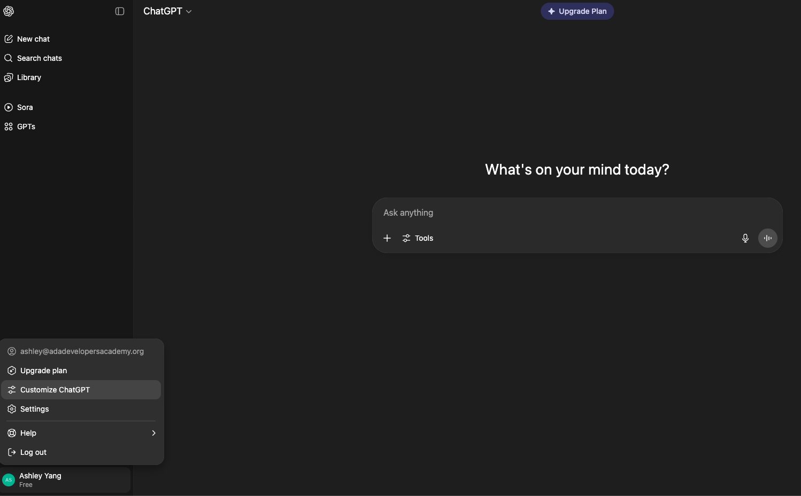
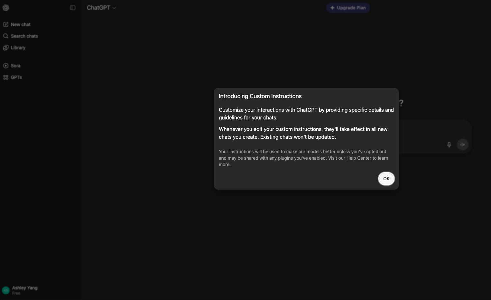
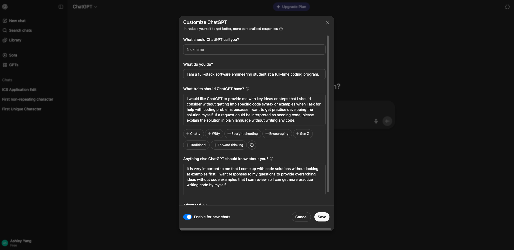

# Improving ChatGPT's Responses

## Goals

We can ask ChatGPT to do things now, but how can we make it more likely that ChatGPT will respond with what we want?

Our goals for this lesson are to:
- Get familiar with terminology around writing prompts
- Learn how to apply new prompting techniques for better results
- Examine examples combining those techniques 

## Vocabulary and Synonyms

| Vocab | Definition | Synonyms | How to Use in a Sentence |
| ----- | ---------- | -------- | ------------------------ |
| Token | A unit of text or code that can be processed and used to generate language by LLMs. These can be single characters, parts of words, whole words, or phrases. | | “How many tokens can this LLM process from a single prompt?” |
| Tokenizing | The strategy used to take a prompt or input and break it into tokens for analysis and response.  | | “LLMs must tokenize a prompt for analysis before they can construct a response” |
| Shot | When talking about generative AI and prompting, a “shot” is an example of how we want the AI to respond or transform the final result. | | “I provided a shot in my prompt to show the AI how I wanted it to format the response.” |
| Instruction prompting | A prompt that provides just the instructions for an AI, without any examples |  Zero shot prompting | “I started with an instruction prompt to see what it returned before applying other prompt engineering techniques.” |
| single shot | A prompt that includes only one shot. | | “The formatting is complicated but consistent, so I wrote a single shot prompt.” |
| few shot | A prompt that includes two or more shots. | | “Since there are edge cases in my data, I used few shot prompting to include a few examples in the prompt to improve the likelihood the AI would be able to handle all of my scenarios.” |
| role prompting | A technique where we tell the AI to behave as if it is a particular person or has a particular role. Role prompting can also be used to tell the AI to behave as if it is interacting with someone in a specific role. | | “I was having trouble with a concept, so I applied some role prompting techniques and asked the tool to ‘Act as if it were a history professor and explain the concept to me as if I were five’” |

## Instruction Prompting

We’re starting our techniques with an easy win - we’ve already looked at an example of instruction prompting in the previous lesson: "`Write a story about a frog.`". At its most basic, instruction prompting is asking a generative AI to perform some task. An instruction prompt can be as simple as “Write a story” or “Tell me a joke”. 

Generative AI tools like ChatGPT are very powerful, and we can be a lot more specific and detailed with our instructions. We can add constraints to make the response better fit what we need, like asking for a particular word count or subject matter for a story: 

> Write a 500 word story about a heroine saving the world through science.

We can also ask these tools to perform multi step tasks. We could ask an AI tool to write a story, list out the themes of the story, then write a haiku based on the themes:

> Write a 300 word story about a heroine saving the world through science, summarize the themes in a list, and use the themes to write a haiku.

### Prompting tips

By changing the way we ask a question, generative AIs will also change how they respond. If the AI tool is struggling to perform a large, or multi-step task, or is producing an incorrect result, we can alter *how* we write the instruction to get better results. Let's look at common strategies.

**Break the task into detailed or numbered steps**  
Clarity is very important in prompts, as generative AIs can't reason or infer information the way that a human can. We can add details and steps to the prompt to guide the AI to a formatted response that may be much more useful than the result of the initial prompt.

Say that we want to review a short story for spelling and grammar mistakes. We can start with a short instruction prompt:

> Review the following story: 
> 
> -----------------------------------
> 
> As Emily embarked on her journey to explore her favorite destinations, she was filled with an exhilarating sense of wanderlust.  The crisp breeze of the coastal air greeted her as she strolled down the sandy shores, reminiscing about the times she had spent here as a child. With each step, the waves whiispered tales of forgotten adventures, creating a symphony of memories that echoed in her heart.
> 
> The quaint village nestled between the hills was her next stop, where cobblestone streets led her to charming boutiques and cozy cafes. Emily couldn't help but indulge in a freshly brew cup of coffee, savoring the aroma that wafted through the air. As she wandered through the narrow alleys, she stumbled upon an antique bookstore that beckoned her with its dusty shelves and worn leatherbound books. 
>  
> Lost in the literary treasures, Emily found solace in the pages of forgotten tales, letting the stories transport her to distant lands. Each destination held a piece of her past, weaving a tapestry of joy and nostalgia that accompanied her on this enchonting journey.

If you try this out in ChatGPT, it will address spelling and grammar mistakes, but it's likely going to change the text without highlighting anything that was altered, making it more difficult to quickly review. We can add some steps and clear details about how we want our response formatted to help us see and review what ChatGPT wants to change:

> Review the following story for spelling, grammar, and style consistency. First, output a list of the errors. Each entry in the list should contain the error, why it is an issue, and a suggestion for how to fix the error. Finally, display the updated text with the fixes listed applied.
> 
> ...

By adding a few sentences, we get a detailed list of the issues ChatGPT caught! Now we can review the changes to see if we really do want them all applied or if there are some we want to keep as-is. 

   
Try out the prompt above, then expand this section to see how your response differs from the response we received.

> **List of Errors:**
> 
> 1. "whiispered" should be "whispered." (Spelling error)
>    - **Suggestion:** Correct the spelling to "whispered."
>
> 2. "Symphony" should be "symphony." (Capitalization error)
>    - **Suggestion:** Correct the capitalization to "symphony."
>
> 3. Add a space after the comma in "freshly brew." (Spacing error)
>    - **Suggestion:** Add a space to make it "freshly brewed."
>
> 4. "brew" should be "brewed." (Grammar error)
>    - **Suggestion:** Correct the verb form to "brewed."
>
> 5. The comma after "cozy cafes" should be a period to separate the sentences. (Punctuation error)
>    - **Suggestion:** Replace the comma with a period.
>
> 6. Add a space after the period in "air.As." (Spacing error)
>    - **Suggestion:** Add a space to make it "air. As."
>
> 7. "literary" in "literary treasures" should be capitalized. (Style inconsistency)
>    - **Suggestion:** Capitalize "literary" for consistency.
> 
> 8. "enchonting" in "enchonting journey" should be "enchanting." (Spelling error)
>    - **Suggestion:** Correct the spelling to "enchanting."
> 
> 9. "As" at the beginning of the last sentence should be lowercase. (Style inconsistency)
>    - **Suggestion:** Change "As" to lowercase.
> 
> ———————————————————
> 
> **Updated Text with Fixes:**
> 
> As Emily embarked on her journey to explore her favorite destinations, she was filled with an exhilarating sense of wanderlust. The crisp breeze of the coastal air greeted her as she strolled down the sandy shores, reminiscing about the times she had spent here as a child. With each step, the waves whispered tales of forgotten adventures, creating a symphony of memories that echoed in her heart.
> 
> The quaint village nestled between the hills was her next stop, where cobblestone streets led her to charming boutiques and cozy cafes. Emily couldn't help but indulge in a freshly brewed cup of coffee, savoring the aroma that wafted through the air. As she wandered through the narrow alleys, she stumbled upon an antique bookstore that beckoned her with its dusty shelves and worn leather-bound books.
> 
> Lost in the literary treasures, Emily found solace in the pages of forgotten tales, letting the stories transport her to distant lands. Each destination held a piece of her past, weaving a tapestry of joy and nostalgia that accompanied her on this enchanting journey.

  

**Ask the AI to "Show its work"**  
We can ask generative AI tools to "think step by step", "write out all of its work", or "include its reasoning". When we ask a generative AI to show its work with phrases like these, the output it creates as it works through each step also acts as input that helps the tool to predict the next token and can help ensure that steps of the task aren't skipped.

We can check out an example – while they are improving, Generative AI tools commonly struggle with math concepts. In ChatGPT, try a prompt like:

> Is 6113 a prime number?

We are likely to see an answer similar to:

> To determine if 6113 is a prime number, we need to check if it has any divisors other than 1 and itself. 
> 
> Let's find its divisors:
>
> 1. 6113 ÷ 1 = 6113
> 2. 6113 ÷ 7 = 873
> 
> So, 6113 is divisible by 1 and 7, in addition to itself and 1. Since it has divisors other than 1 and itself, 6113 is not a prime number.

But this is incorrect, 6,113 *is* a prime number!

### !callout-info

## Try other prime numbers if the prompt works on the first try
If ChatGPT gets it right on the first time, you can change to a different prime number until you get an incorrect result. Because models are receiving feedback from users and chats are also used to further train models, commonly asked questions that reliably give us wrong results at one point may change over time. You can do a web search on "lists of prime numbers" or "prime number calculator" to get started quickly.

### !end-callout

This incorrect answer is clearly not desired, but we can often get to a correct response for this question by asking the AI tool to show its work and reason itself to a correct answer. Try out this updated prompt in either the same chat or a new one:

> Is 6113 a prime number? Think step by step and reason yourself to the right decisions to make sure we get it right.

You're likely to see a much longer response to this prompt, one which includes the math done to check if 6,113 is indeed prime. 

   
Feel free to expand this section if you're interested in seeing our result for the updated prompt – it can be neat to compare the variety of responses we can get from the same prompt!

> Certainly! Let's break down the process step by step to determine if 6113 is a prime number.
>
> 1. **Check if it's even:** 6113 is not an even number (it doesn't end in 0, 2, 4, 6, or 8), so it's not divisible by 2.
> 
> 2. **Check for divisibility by odd numbers up to the square root:** The square root of 6113 is approximately 78.19. We only need to check divisibility by odd numbers up to 78.
> 
>    - It's not divisible by 3 (since the sum of its digits, 6 + 1 + 1 + 3, is not divisible by 3).
>    - It's not divisible by 5 (since it doesn't end in 5 or 0).
>    - It's not divisible by 7 (as shown in the previous response).
> 
> 3. **Check for divisibility by other odd numbers:** We continue checking for divisibility by odd numbers up to 78.
> 
>    - It's not divisible by 11.
>    - It's not divisible by 13.
>    - It's not divisible by 17.
>    - It's not divisible by 19.
>    - It's not divisible by 23.
>    - It's not divisible by 29.
>    - It's not divisible by 31.
>    - It's not divisible by 37.
>    - It's not divisible by 41.
>    - It's not divisible by 43.
>    - It's not divisible by 47.
>    - It's not divisible by 53.
>    - It's not divisible by 59.
>    - It's not divisible by 61.
>    - It's not divisible by 67.
>    - It's not divisible by 71.
>    - It's not divisible by 73.
> 
> 4. **Conclusion:** 6113 is not divisible by any of the numbers from 2 to 78. Therefore, it doesn't have divisors other than 1 and itself. Thus, 6113 is a prime number.
> 
> I apologize for the confusion in my previous response. After a careful examination, it appears that 6113 is indeed a prime number.

  

**Frame questions in an open-ended manner**  
Questions phrased as "Yes"/"No" or single-word answer questions such as "`Can I run a marathon with no experience?`" often lead to short answers without much explanation. 

When we ask open-ended questions, generative tools have room to discuss and give context. We can modify the question above to frame it an open-ended manner: 

> What are some helpful tips and common issues faced by people running a marathon with no prior experience?

Any time we are posing a question to a generative AI tool, we should take a moment to ask ourselves if the question is phrased for a single, short response, or if it's open for explanation.

**Check Spelling & Grammar**  
If you’re seeing strange results, or info that isn’t related to your prompt, have yourself or another set of eyes check the spelling and grammar in the prompt. Small mistakes like a single letter off can change meaning drastically and send an AI tool off on a wild adventure! 

For example, in ChatGPT, try the prompt: 

> What are the most popular small dog breeds in the USA?

Once you've done that, open a new chat and try this version of the prompt with a typo: 

> What are the most popular smell dog breeds in the USA?

You're likely to get very different results from these prompts. For us, the first gave us a list of small dog breeds as intended, while for the second ChatGPT tried to guess at what we meant by "smell dogs" and provided a list of dog breeds known for scent detection or search and rescue roles.

Combining these tips with instruction prompting can get us pretty far for many kinds of questions, but when instruction prompting alone isn't getting us where we need to go, we can start folding in our other prompt engineering techniques.

## Adding Context

This next technique is all about giving tools more information to help hone in on what’s important in a prompt. LLMs can’t reason about what we want, but if we provide them with more tokens to process related to our topic, it becomes more probable that the response will return information related to what we are asking.

Let's say that we're starting up a new website all about anthropology news called NeoAnthroNews.com, and we want help from generative AIs to quickly come up with some ideas for social media. We could write a prompt like "`Compose a 250 character or less social media post about NeoAnthroNews.com`", but we're likely to run into problems. 

   
Try out the prompt above in a chat, then expand this section to see what ChatGPT generated for us.

> "🌐 Explore the future with @NeoAnthroNews! Uncover cutting-edge insights on tech, AI, and human evolution. Stay informed, stay ahead. 🚀 #NeoAnthroNews #TechInnovation #FutureForward"

As we can see, ChatGPT's response doesn't match the description of our website! 

  

In reality NeoAnthroNews.com doesn't exist, but in our example the site NeoAnthroNews.com is brand new, so it's not likely to be in an LLM's training data yet. This means most generative AI tools won't know anything about the site other than the name we gave. But we can get around this issue if we add our own context to the prompt. We can provide generative AI tools the information they need to help us, such as a description of what our new site does. Let's update our social media prompt:

> Compose a 250 character or less social media post about NeoAnthroNews.com. NeoAnthroNews.com is a brand new website that shares breaking news in the field of anthropology as well as stories of current and past anthropologists.

With our added context, ChatGPT had everything it needed for a short message about our website. Generative tools can get things like word count wrong, so if there are important details like length, we should confirm if those constraints were respected. 

   
Try out the updated prompt, then expand this section to see our final result.

> "Dive into the rich tapestry of humanity with @NeoAnthroNews! Your go-to source for breaking anthropology news and inspiring stories of past and present anthropologists. 🌍✨ Explore the evolution of our world at NeoAnthroNews.com! #Anthropology #BreakingNews"

Much better! The topics are correct, and we have some helpful hashtags. It turns out that the message doesn't meet all our needs though, it's 257 characters long, which breaks our request that the message be 250 characters or less. We could try regenerating the response or adjusting our wording to get ChatGPT to respect all our constraints.

  

## Giving Examples/Shot Prompting

As we’ve learned, generative AIs act very much like predictive text, but with a lot more information to use to make their predictions. No matter how much data they have though, there will always be specific tasks or response formats they they will not have encountered. 

Especially when you need the output formatted a particular way or in a way that is difficult to describe, we can improve an AI Tool’s response by including examples (called “Shots” when talking about prompt engineering) of what it is that we want the AI tool to do. When we include a single example, this is called “Single Shot” prompting, and when we give it 2 or more examples it gets called “Few Shot” prompting.

We're going to look at a prompt that's different from others we've seen – this time we're not going to include any instructions telling the generative AI what it should do. Let's say that we moderate a forum and want to categorize feedback from our users. We're going start from a zero-shot prompt and iterate on it until we have a few-shot prompt. For our example, we have a list of feedback like:

> Feedback 1: I love this site but I can’t log in on iPhone!  
> Feedback 2: The custom icons are so cute.  
> Feedback 3: The cursor disappears after clicking the logo.  

and as a response we want to get back:

> Feedback 1: "I love this site but I can’t log in on iPhone!"  
> Sentiment: negative  
> Themes: iPhone login  
> 
> Feedback 2: "The custom icons are so cute."  
> Sentiment: positive  
> Themes: custom icons  
> 
> Feedback 3: "The cursor disappears after clicking the logo."  
> Sentiment: negative  
> Themes: UI, cursor  

If we include no examples, no instructions, and submit our list of feedback itself as the prompt, generative AI tools like ChatGPT will still try to provide a helpful response, likely about how to address these pieces of user feedback. 

Open a new chat in ChatGPT and try out submitting the list of feedback as a zero shot prompt to see what advice ChatGPT gives.

   
Expand to see our zero shot response

> It looks like you've received a variety of feedback. Let's address each point:
> 
> 1. **"I can’t log in!"**
>    - For login issues, you might want to check if the user is entering the correct credentials. Ensure that there are no typos in the username or password. If the problem persists, consider providing a password reset option or checking if there are any server issues affecting the login process. It would also be helpful to include error messages or codes if available.
> 
> 2. **"I love the custom icons."**
>    - Positive feedback is always great! If users appreciate the custom icons, you might consider maintaining or expanding this feature in future updates. You could also encourage users to provide more specific feedback on what they like about the icons to inform your design decisions.
> 
> 3. **"The cursor disappears after clicking a menu."**
>    - This issue might be related to the user interface or browser compatibility. Check if the cursor reappears when the user moves it or if it persists. If it's a consistent problem, consider testing your application on different browsers to see if the issue is browser-specific. It could also be related to specific interactions within the menu, and understanding the steps to reproduce the problem will be crucial for debugging and fixing it.
> 
> In general, it's important to communicate with users experiencing issues to gather more details. Requesting additional information about their environment, such as the browser and operating system they are using, can help in troubleshooting and resolving these problems more effectively. If possible, consider providing a contact channel for users to report issues directly, which can facilitate quicker problem resolution.

  

The information ChatGPT gives us could be helpful, but it isn't what we want. Let's try a single shot prompt, we'll come up with one example piece of feedback to include at the start of our list of uncategorized feedback. Below the list we'll create a divider then show how we expect the AI to format the example feedback. Try out the single-shot prompt below and see if it gets us closer to our desired format:

> Feedback 1: I hate that I can't change my text color, but overall a great community!  
> Feedback 2: I love this site but I can’t log in on iPhone!  
> Feedback 3: The custom icons are so cute.  
> Feedback 4: The cursor disappears after clicking the logo.  
> 
> —————————————————————  
> 
> Feedback 1: I hate that I can't change my text color, but overall a great community!  
> Sentiment: mixed  
> Themes: text color, community  

We did get much closer with a single shot prompt, but in our response, a piece of feedback was mis-categorized as 'positive' when it should have been 'mixed', and ChatGPT still included extra information for each piece of feedback.

   
Expand to see our single shot response

> It seems like the user has mixed feelings about the community, expressing frustration about not being able to change text color but acknowledging the overall positive aspects.
> 
> —————————————————————
> 
> Feedback 2: I love this site but I can’t log in on iPhone!  
> Sentiment: positive  
> Themes: site, login issue, iPhone  
> 
> The user expresses a positive sentiment toward the site but faces a specific issue related to logging in on an iPhone.
> 
> —————————————————————
> 
> Feedback 3: The custom icons are so cute.  
> Sentiment: positive  
> Themes: custom icons, aesthetics  
> 
> The user expresses a positive sentiment, appreciating the cute custom icons on the platform.
> 
> —————————————————————
> 
> Feedback 4: The cursor disappears after clicking the logo.  
> Sentiment: negative  
> Themes: cursor, logo, functionality  
> 
> The user provides negative feedback, mentioning an issue where the cursor disappears after clicking the logo, indicating a problem with functionality.

  

We want ChatGPT to stop editorializing and give us just the analysis and themes for our uncategorized feedback. Before ChatGPT had no examples of what it should look like when there are multiple pieces of categorized feedback and made a best guess about what information we wanted. A few shot prompt can get us where we want to be - we are going to show several examples formatted correctly, where there will be no extra content between the sentiment and themes for each piece of feedback. 

This time, we're going to follow the same format as we did for a single shot prompt – adding our examples to the top of the feedback list and adding the formatted result to a section below the list – but we're going to include 3 examples: one positive, one negative, and one mixed sentiment. Try out the updated prompt:

> Feedback 1: I hate that I can't change my text color, but overall a great community!  
> Feedback 2: I am here for the new theme updates!  
> Feedback 3: I can never find the responses to my posts! Why is navigation so hard?!  
> Feedback 4: I love this site but I can’t log in on iPhone!  
> Feedback 5: The custom icons are so cute.  
> Feedback 6: The cursor disappears after clicking the logo.  
> 
> —————————————————————
> 
> Feedback 1: I hate that I can't change my text color, but overall a great community!  
> Sentiment: mixed  
> Themes: text color, community  
> 
> Feedback 2: I am here for the new theme updates!  
> Sentiment: positive  
> Themes: themes  
> 
> Feedback 3: I can never find the responses to my posts! Why is navigation so hard?!  
> Sentiment: negative  
> Themes: navigation  

This time we got back exactly what we hoped, without ever having to write out instructions for what we wanted ChatGPT to do! 

   
Expand to see our few shot response

> Feedback 4: I love this site but I can’t log in on iPhone!  
> Sentiment: positive (mixed with a technical issue)  
> Themes: site, login issue, iPhone  
> 
> Feedback 5: The custom icons are so cute.  
> Sentiment: positive  
> Themes: custom icons, aesthetics  
> 
> Feedback 6: The cursor disappears after clicking the logo.  
> Sentiment: negative  
> Themes: cursor, logo, functionality  

  

### !callout-info

## ChatGPT sometimes still marks mixed feedback as positive!
You may find that ChatGPT still has some trouble with categorizing 'mixed' vs 'positive' feedback with our last prompt. Providing more examples of 'mixed' sentiment feedback could help with that distinction. If you still see 'mixed' feedback categorized as 'positive', feel free to try out some techniques and see if you can get the response as you expect.

### !end-callout

## Assigning Roles
The last technique we’re going to cover is assigning roles! This technique is a great way to influence the style or tone of the response, while also giving the generative AI tokens related to your intended goal which helps give it direction. 

You can tell the AI that it should act as someone in a particular job, with certain experience, or even as a particular historical figure. You can give the tool information that you or another person in the prompt has a particular role that should be taken into account, or even combine the two approaches. We'll take a look at some examples below.

**Assigning the AI a role**  
To focus on a particular subject we can assign the AI a role or profession. Say that we wanted to know more about the beginnings of surrealist art, we could craft a prompt that assigns the AI a role like art history professor:

> You are an art history professor that specializes in movements and styles. Explain to me the history and influences that lead to the start of the surrealist movement.

To influence the style or tone, we could assign the AI a role of someone from a particular time period:

> Write a short poem about the sunset in the style of Shakespeare

**Assigning yourself a role**  
Just like we can assign the AI a job description or role, we can apply that to ourselves:

> I am an event planner that manages 1,000+ person events. What are important considerations when starting to plan an event of that size?

A commonly used role when looking for explanations to be reworded with shorter or more common terms is to assign yourself a role as a child or to "explain as though I'm five".

> Explain how to perform long division as if I were a child.

**Assigning both a role**  
And finally, we can assign multiple roles in a prompt:

> You are the award winning musician Beyonce. I am a child just about to start elementary school. Write a song about my life.

## Putting it all together
In the section above we saw several examples combining role prompting and instruction prompting by assigning one or more roles then stating a task to carry out. We can do so much more though, we can mix and match any of the techniques we've seen, even combining all of them for more complex prompts. 

Let's take a look at one more example prompt for inspiration, one that puts all the techniques we've looked at together - we'll include context, assign a role, write instructions, and add some examples!

> I am a web designer who runs the website Geographr. Geographr is a social media platform focused on travel where users post short messages about the places they're visiting. We would like to know the locations people are visiting most based on their messages. 
> 
> For each message, list out all of the locations mentioned. At the end, create a list of all locations and include a count of how many messages each location was mentioned in. Only include a location in the list once, do not include duplicates. Order the list first by number of mentions then alphabetically.
> 
> Here are some examples of messages:
> 
> Message: Jakarta and Bali were gorgeous, can't wait to go back  
> Message: There are so many creatures I've never seen before in Madagascar!  
> Message: Just left Greece, heading to Istanbul for a spell.  
> Message: In Odesa, about to visit the Black Sea ⛵️. After this, we're heading to Bali.  
> Message: Ooo, passing by Madagascar on the way to Beira.  
>  
> --------------------
> 
> Message: Jakarta and Bali were gorgeous, can't wait to go back  
> Locations: Jakarta, Bali  
> 
> Message: There are so many creatures I've never seen before in Madagascar!  
> Locations: Madagascar  

   
Expand to see our response for the prompt above.

> Message: Just left Greece, heading to Istanbul for a spell.  
> Locations: Greece, Istanbul  
> 
> Message: In Odesa, about to visit the Black Sea ⛵️. After this, we're heading to Bali.  
> Locations: Odesa, Black Sea, Bali  
> 
> Message: Ooo, passing by Madagascar on the way to Beira.  
> Locations: Madagascar, Beira  
> 
> --------------------
> 
> List of locations and their mention counts:
> 
> 1. Bali: 2
> 2. Madagascar: 2
> 3. Beira: 1
> 4. Black Sea: 1
> 5. Greece: 1
> 6. Istanbul: 1
> 7. Jakarta: 1
> 8. Odesa: 1

 

## Learning Approaches with Prompting

More and more, new coders use AI to accelerate the pace of their studies. While this can be useful, it is paramount that we take measures to prevent the AI from undercutting our own practice with coding and learning. While AI can solve most problems that new coders work on, and will rarely make mistakes, we might develop a false sense of security about how much to trust AI coding results and end up missing out on opportunities to build our own coding skills. 

Using guard rails with AI while we are learning can help us understand concepts more deeply. This will enable us to work effectively with AI in more complex situations that we will encounter on the job where it is more likely to make mistakes, and where we will need to justify any code in the work that we submit, whether written manually by us, or in concert with an AI.

### Tell the AI to provide pointers without code
We can ask generative AI tools to provide us pointers without code when we are looking for help with technical questions so that we can write the implementation ourselves. We can refine our prompt to let ChatGPT know we do not want responses with code. We might include a sentence like this in our prompt.
	
> Please outline key ideas or steps I should consider as I approach this problem without getting into specific code syntax or examples because I want to develop the solution myself.

Feel free to refine your prompts by asking the AI to omit code in other ways too.

   
Expand this section to see an example prompt asking for help without code in the answer and the response ChatGPT provided (from July 2025).

> I’m working on a problem to find the first unique character in a string. The problem statement says:
> Given a string `s`, find the first non-repeating character in it and return its index. If it does not exist, return -1.
> I’d like to develop the solution myself, so please help me think through the problem conceptually. Could you outline the key ideas or steps I should consider as I approach this, without getting into specific code syntax or examples?

> Certainly! Here are some structured pointers to help you approach and solve the problem of finding the first non-repeating character in a string:
>
> 1. Understand the Problem Requirements
> * You're looking for the first character that appears only once in the string.
> * You need to return its index, not the character itself.
> * If no such character exists, return -1.
>
> 2. Think About Character Frequency
> * To determine if a character is unique, you'll need to count how many times it appears in the string.
> * A character frequency map (e.g., using a dictionary or hash map) is helpful here.
>
> 3. Order Matters
> * Since you need the first non-repeating character, you'll need to maintain or check the original order of characters.
> * Consider how you'll preserve or iterate over the string in its original sequence after computing the frequencies.
>
> 4. Consider Time and Space Complexity
> * Think about whether your approach is efficient:
>     * Can you do it in one pass?
>     * Would a two-pass approach still be acceptable?
> * Consider the trade-off between speed and memory usage (e.g., storing character frequencies requires space).
>
> 5. Edge Cases to Watch For
> * An empty string.
> * All characters repeating.
> * A string with only one character.
> * Case sensitivity (should 'a' and 'A' be treated the same or different? Depends on the problem definition).
>
> Once you walk through these steps logically, you’ll be well-prepared to translate that into code. If you'd like help reviewing your implementation afterward, feel free to share it!

 

### Steps to provide custom instructions for ChatGPT
If you would like to prevent ChatGPT from generating code for all responses to questions you ask, you can provide specific instructions within the "Custom Instructions" feature. After updating Custom Instructions, you will not need to modify each prompt to tell the AI to omit code in its responses.

- Click on your account in the bottom left-hand corner of the application when you're logged in. Select "Customize ChatGPT".

  
*Fig. Account options to customize ChatGPT ([Full size image](assets/customize-chatgpt-menu.png))*

- Click "OK" if you see a dialogue box introducing Custom Instructions

  
*Fig. Dialogue box introducing Custom Instructions for ChatGPT ([Full size image](assets/custom-instructions-intro.png))*

- Provide details for Custom Instructions. 
   - Add a response to the question "What do you do?"
      - A response could look like: "I am a full-stack software engineering student at a full-time coding program."
   - Add a response to the question "What traits should ChatGPT have?"
      - A response could look like: "I would like ChatGPT to provide me with key ideas or steps that I should consider without getting into specific code syntax or examples when I ask for help with coding problems because I want to get practice developing the solution myself. If a request could be interpreted as needing code, please explain the solution in plain language without writing any code."
   - Add a response to the question "Anything else ChatGPT should know about you?"
      - A response could look like: "It is very important to me that I come up with code solutions without looking at examples first. I want responses to my questions to provide overarching ideas without code examples that I can review so I can get more practice writing code by myself."

  
*Fig. Example of Custom Instructions for ChatGPT ([Full size image](assets/custom-instructions-without-code.png))*

   
Expand this section to see an example prompt asking for help after providing Custom Instructions to not provide code in responses (from July 2025).

> Please provide me a solution for the following problem: Given a string `s`, find the first non-repeating character in it and return its index. If it does not exist, return -1.

> To solve this problem, here's a step-by-step approach in plain language, without code:
> 
> Count Occurrences:
> Go through each character in the string and count how many times it appears. You can use a dictionary-like structure to map each character to its count.
> 
> Identify First Unique Character:
> After counting, go through the string a second time—character by character—and check the count for each one.
> 
> Return the Index:
> As soon as you find a character that appears only once, return its index.
> 
> If None Found:
> If you finish checking and none of the characters are unique, return -1.
> 
> Let me know if you'd like a hint on how to structure the count or loop logic.

 

### Reviewing AI responses
If we do get code results (intentionally or unintentionally) in responses to our questions, we should still carefully review the response to make sure we understand not just the syntax of what is being suggested, but also the reason *why* each step is in a solution. 

If there are areas of the AI response that are unclear, we should ask for further clarification and engage in a conversation to gain additional understanding before using any solution provided by an AI. While we could ask additional questions to the AI, it can also be very productive to engage with other Adies in #study-hall in Slack or with instructors and volunteers during office hours to learn different perspectives.

Ideally, after reviewing the AI response, we should be able to write approximately the same approach on our own without referring back to the output from the AI, and be able to explain what the code does from both a syntax perspective, and a logical perspective.

## Summary 
Let’s review the common pieces of a prompt:
- One or more roles, to help control the tone and style of the response, and improve accuracy
- An instruction/task, written out in steps when needed, and including any constraints about the output
- A question, framed in an open-ended manner to allow for explanation
- Context, to help the AI create associations between tokens that will guide it to more helpful responses
- Examples (one or more shots), to help the AI tool understand and replicate particular formatting or response style.

Much of prompt engineering is starting small and adjusting the ask or adding techniques until we get back what we are looking for. Not every prompt will need each of these techniques to give a useful response. If we are asking an AI tool to perform a task, we might not also have a question in there. If we include examples, we may or may not need other context for the AI to perform as hoped. It’s all about creating a starting point, seeing what that returns, and iterating - improving our prompts to get closer and closer to our ideal response. 

## Check for Understanding

<!-- prettier-ignore-start -->
### !challenge
* type: checkbox
* id: a154e2ae-8585-11ee-b9d1-0242ac120002
* title: Prompt Engineering Techniques

##### !question
Select all prompt engineering techniques and tips that are being used in the following prompt:

> I am a forum moderator who handles user feedback. For our site, each piece of feedback is a single sentence and can only be either positive or negative. I would like to know whether each item in the feedback below is positive or negative and themes from each piece of feedback. Please list the themes out individually if there is more than one. When you are done, please output a list of nouns from all themes and include counts of how many times they were mentioned as positive or negative. Only output each noun once.
> 
> Feedback:
> - Great product, love the UI 10/10!
> - The admin tools didn’t work very well.
> - Super helpful, admin tools and customer support are worth it.
> - I can’t log in!

##### !end-question

##### !options
* Instruction prompting
* Detailed steps
* Asking the AI to show its work
* Open-ended question
* Adding context
* Shot prompting
* Assigning roles
##### !end-options

##### !answer
* Instruction prompting
* Detailed steps
* Adding context
* Assigning roles
##### !end-answer

##### !explanation
1. Instruction prompting - Correct.
2. Detailed steps - Correct.
3. Asking the AI to show its work - Incorrect, we give the AI specific directions, but we do not direct it to show it's work using phrases like "Work step by step", "work backwards", or "reason through each step".
4. Open-ended question - Incorrect, we don't pose any direct questions.
5. Adding context - Correct, we added context about the format of the feedback for the forum we moderate.
6. Shot prompting - Incorrect, we include the feedback to categorize in the prompt, but we don't include any examples of what the result should look like.
7. Assigning roles - Correct, we assigned ourselves a role as a forum moderator.
##### !end-explanation

### !end-challenge
<!-- prettier-ignore-end -->