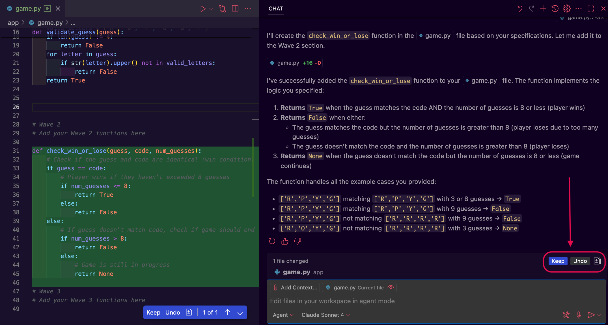
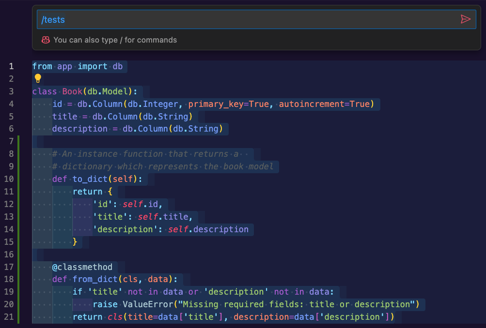
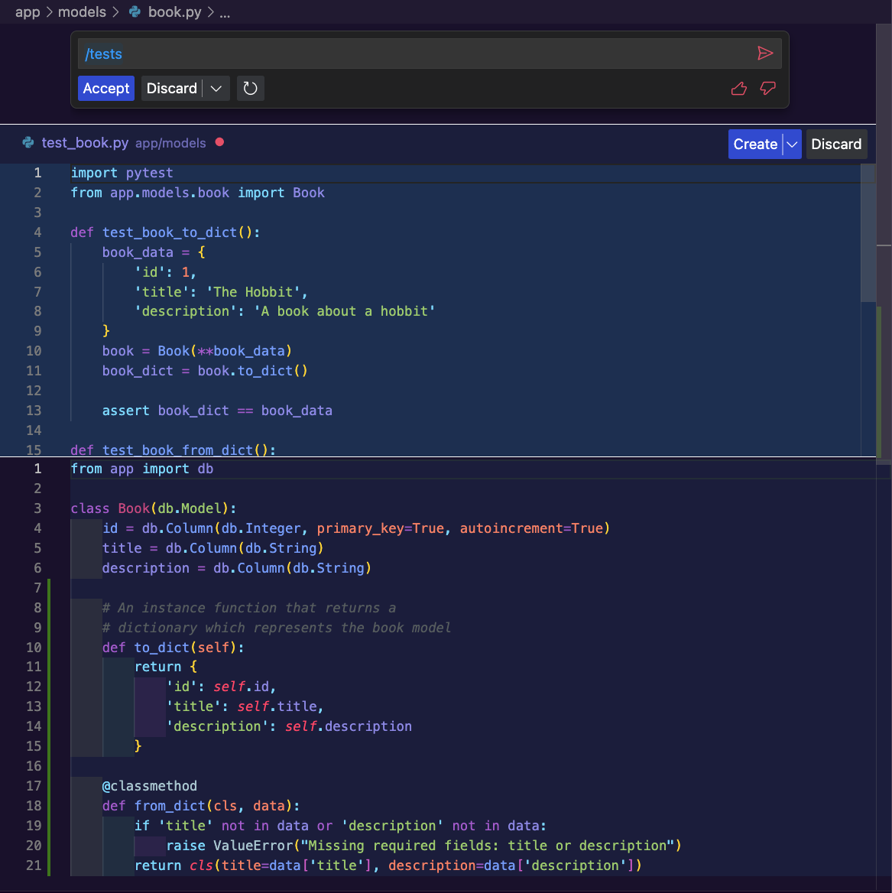

#  Copilot in Projects Pt. 1 - Writing New Code

## Goals

We know how to generate code, start a chat, and work with Copilot's tools in VS Code, so now let's see what it looks like to apply what we've learned in a project. We'll take a look at a new project, [the Mastermind puzzle game in Python](https://github.com/Ada-Activities/mastermind-copilot), to see how we can use Copilot to increase our productivity.

Our goals for this lesson are to show how we can use Copilot to:
- quickly write new code that follows best practices
- help us with generating test cases

### !callout-info

## Generative tools will give you different responses

As you work through this lesson, you will likely get different results from the prompts you submit than what we show through the lesson. This is expected!

<br>

We are working with a generative AI tool and they are not guaranteed to return the same or even a similar response for the same input. Part of adjusting to working with AI tools is getting comfortable with the variability of their responses and then fine tuning our prompts, regenerating responses, and manually updating generated code until we have something that meets our needs.

<br>

Even the Copilot extension itself is updated regularly, so the way the UI looks or where certain features are located may differ from that shown in this lesson. So if a screenshot looks a little different from what you see in your own VS Code, try to find the equivalent feature in your version of the extension.

### !end-callout

## Getting Started with `Mastermind`

There is a lot we could do with the Mastermind project, but to keep us focused on areas where we can benefit from Copilot, we will use the project scaffold on the `main` branch as a starting point. 

To get started:
- Fork the [`mastermind-copilot` repo](https://github.com/Ada-Activities/mastermind-copilot)
- Clone the repo down
- Create and activate a virtual environment
- Use `pip` to install `requirements.txt`
- Read through the `README.md` to get an understanding of the requirements of the functions we will write

Since `main` is the default branch of the repo, it should already be checked out when we clone the project down. 

There are 4 Waves of the Mastermind project
- These Copilot lessons will walk through Wave 1
- Completing Wave 2 is left as practice for the reader. 
- We will tackle Wave 3 together during class
- We will work on Wave 4 in small groups to complete the `mastermind` function in `mastermind.py` and finish our game!

Our plan in this lesson is to:
- Write new code to complete Wave 1 of the project directions 
    - We will do this by adding the functions described in Wave 1 of the `README.md` to the file `app/game.py`
- Write new tests for our functions to cover missing edge cases

## Wave 1: `generate_code`, `validate_guess`, and `check_win_or_lose`

Opening `app/game.py`, we have a mostly empty file with some markers for adding our functions for each wave. Our first step will be to create the `generate_code` function.

### Implement `generate_code`

Based on the README, our function should generate a random 4 letter code for the user to guess. The function should:
- take no parameters
- return a list data structure with 4 elements
    - each element in the list should be a single character 
    - the characters in the list must be one of the following letters: "R", "O", "Y", "G", "B", "P"

To get Copilot's help, let's write a comment that summarizes this information. This step of taking in the function description and synthesizing our own summary helps ensure that we truly understand the problem and requirements before reaching to an AI tool. We need this understanding as developers to be able to check if the code produced by Copilot actually meets our needs. In theory we could copy & paste the text of the README into the comment without ever reading it and we _might_ get something that works, but how could we even be certain if we don't have a full understanding of what is being asked for?

To start generating our function, add the following comment to `app/game.py` then press enter to see what Copilot suggests:

```py
# generate_code 
# - takes no arguments  
# - returns a list of 4 letters
# - each letter must be one of: R, O, Y, G, B, P
```

In our case, Copilot immediately suggests some additions to our comment as well as a function signature and body that _nearly_ matches our needs for the moment:


*Fig. Our function description comment above with a suggestion for the `generate_code` function from Copilot in grey below ([Full size image](assets/new-code-copilot/generate_code_first_suggestion.png))*

If we accept this suggestion, the function itself looks good, but for some reason `random` is underlined by VS Code. Why might that be?


*Fig. Our function description comment with the suggestions from Copilot accepted into the file. ([Full size image](assets/new-code-copilot/generate_code_random_underlined.png))*

Copilot suggested that we use `choice` from the `random` module, but Copilot didn't add code to import the `random` module. If we tried to run this code we would get an error until we add the import statement `import random` to the file. 

To wrap up this function, let's:
1. add `import random` to the top of the file so we see the issue marker resolve
2. run our Wave 1 tests in `tests/test_wave_1.py` to ensure that the tests for `generate_code` are now passing.

### !callout-info

## Running the test files as we work

The test files for each wave import all of the functions for the wave at the top of the file. Until we impement all the functions for a wave, we'll see test discovery errors in the VS Code testing Panel. To run our tests as we complete functions, we will need to comment out and uncomment some imports and tests in the wave files so we can see our relevant tests passing.

<br>

Since `validate_guess` and `check_win_or_lose` have not been implemented yet, in `tests/test_wave_1.py` we will need to comment out those names in the import line and comment out their tests in order to run the `generate_code` tests.

### !end-callout

At this point, both `generate_code` tests should pass and we can move on to the `validate_guess` function!

### Implement `validate_guess`

We could use a comment to try generating our `validate_guess` class method, but instead we'll use the inline chat to prompt Copilot. Let's use `⌘I` (`CMD + i`) to open an inline chat and enter the following prompt that summarizes our function requirements:

> Please write a function named validate_guess that takes in 1 parameter named guess. The input guess is a list of single characters. The function should return True if guess has a length of 4 and every element is one of the following letters: R, O, Y, G, B, P. If these conditions are not true, the function should return False. The function should be case insensitive, both the inputs ['R','Y','G','B'] and ['r','y','g','b'] should return True.

When we submit the prompt, we are likely to receive a response similar to the following:

  
*Fig. Our prompt entered in the Copilot inline chat with a suggestion for the `validate_code` function from Copilot displayed below ([Full size image](assets/new-code-copilot/inline_prompt_validate_guess.png))*

The suggestion is succinct! The function checks `guess` for length and exits early if it can, then it uses `all` and a comprehension to check if the elements of the list are valid. But is there anything about the suggestion that is incorrect or breaking best practices? 

If we take a close look, what is the indentation like for the function? For some reason Copilot indented the function one tab further than it should have. This would create a nested function inside of `generate_code`, rather than the stand alone function we're looking for. 

Let's also take a look at the return line. The return line is 76 characters total, so it isn't breaking the PEP8 guideline of 79 characters or less for length, but we are doing a lot in that one line. We could make the function easier to read by breaking it apart. 

We could use the regenerate button to request a new response and see if Copilot fixes those issues. In our case, running the prompt a couple more times didn't fix any issues, it only moved the lines around:

  
*Fig. Our prompt entered in the Copilot inline chat with a new suggestion for the `validate_code` function from Copilot displayed below. ([Full size image](assets/new-code-copilot/inline_prompt_validate_guess_regenerated.png))*

We could add a follow up to our original request in the inline prompt to try to get the fixes desired:

> Please update the function so that the function definition is not indented. Please break up the last line so that it is easier to read and we are not doing so much work on one line.

Once we submit the prompt we may see something like:

  
*Fig. Our update to the prompt entered in the Copilot inline chat with a new suggestion for the `validate_code` function from Copilot displayed below. ([Full size image](assets/new-code-copilot/inline_prompt_follow_up_validate_guess.png))*

The last line was broken up as we asked for, but the function is still indented inside of `generate_code`! We could take more time going back and forth with Copilot, but since we know the changes we want to see, this is a case where maytbe it wasn't worth regenerating the response or trying to ask Copilot to make the changes for us. The starting point was close enough to what we wanted that we would have been done by now if we made the changes ourselves at the start. 

As we work with tools like Copilot, it's important for us to consistently evaluate where we are spending our time. If we are spending more time trying to get a tool to do what we want than it would take for us to make the change and move on, then we are not using our time or the tool to our best advantage. Copilot is not meant to replace our critical thinking, but it can help us get started on the right path!

To wrap up this function, let's:
1. accept the change
2. highlight the `validate_guess` function 
3. use `⌘[` (`CMD + [`) to move the function one tab left
4. run the tests for `validate_guess` in `tests/test_wave_1.py`

At this point, the tests for `validate_guess` should be passing! 

Our final code for `validate_guess` looks like:
```py
def validate_guess(guess):
    valid_letters = {'R', 'O', 'Y', 'G', 'B', 'P'}
    if len(guess) != 4:
        return False
    for letter in guess:
        if str(letter).upper() not in valid_letters:
            return False
    return True
```

### !callout-info

## Potential Refactoring

We'll talk more in-depth about refactoring with Copilot in the next lesson, but we want to note something worth observing now. Both of the functions we wrote so far need access to a representation of the valid letters for the game (R, O, Y, G, B, P). 

<br>

Rather than sharing that list through a global variable, that information is duplicated in both a list and a set. Especially if there are more functions that need access to this data, we should consider D.R.Ying our code!

### !end-callout

### Implement `check_win_or_lose`

Before we ask Copilot for help, the first thing we need to do is gather information for our last Wave 1 function prompt.

We can ask Copilot to help us write something even if we don't have a template or example, but Copilot tends to produce more relevant results if we have samples to show. In the `README`, the section for `check_win_or_lose` contains a table of example inputs and outputs in addition to the function description, all of which we can share to help guide Copilot's response.

 We will use these details to craft a prompt for Copilot. This time, let's use `⌃⌘I` (`CTRL + CMD + i`) to open up the Copilot chat pane. We can type directly in the chat box, but it can be helpful to write up prompts in a text editor first, especially if they span multiple lines.

<br>

<details>
  <summary>
    Before continuing, pause for a moment and try to write a prompt that uses our function requirements and examples to describe what we want from Copilot. When you're done, expand this section to see the prompt we used.
  </summary>

  **Our Prompt:**
  > Create a function named check_win_or_lose in app/game.py. The function will determine if the user making a guess has won or lost the game. should take in 3 parameters:
  >     - guess, a 4 element list representing the user's guess
  >     - code, a 4 element list representing the code the user is guessing
  >     - num_guesses, an integer that represents how many guesses a user has already made
  >
  > The function should return:
  >     - True if num_guesses is 8 or less and the inputs guess and code are identical lists.
  >     - False if num_guesses greater than 8 and the inputs guess and code are not identical lists.
  >     - None if the game is still in progress
  >
  > Here are some example inputs and outputs for the function:
  > ```
  > | guess | code | num_guesses | output |
  > |:-----:|:----:| :---------: | :----: |
  > | ['R','P','Y','G'] | ['R','P','Y','G'] | 3 | True |
  > | ['R','P','Y','G'] | ['R','P','Y','G'] | 8 | True |
  > | ['R','P','Y','G'] | ['R','P','Y','G'] | 9 | False |
  > | ['R','P','Y','G'] | ['R','R','R','R'] | 9 | False |
  > | ['R','O','Y','G'] | ['R','R','R','R'] | 3 | None |
  > ```
</details>

Being an AI tool, we will likely see slightly different responses, even with the same prompt. When we submit our prompt, Copilot will create a suggestion for us in the file we identified, `app/game.py`, and we have a couple buttons to decide if we want to keep this option or remove it from this file. In the screenshot below, the controls from left to right are:
- **Keep** - Adds the suggested content to the `app/game.py` file
- **Undo** - Removes the suggestion from `app/game.py`
- **View Diff** - Moves to a view where we can see just the changed lines of `app/game.py`. This can be handy in larger files where there might be more code to sift through to see Copilot's changes.

  
*Fig. Copilot Chat's controls for code suggestions ([Full size image](assets/new-code-copilot/chat_pane_check_win_lose_first_pass.png))*

Before we make any decisions about keeping or removing the code, let's examine what Copilot suggested for us.

**Copilot's response**
> I'll create the check_win_or_lose function in the game.py file based on your specifications. Let me add it to the Wave 2 section.
> game.py+16-0
> 
> I've successfully added the check_win_or_lose function to your game.py file. The function implements the logic you specified:
> 1. Returns True when the guess matches the code AND the number of guesses is 8 or less (player wins)
> 2. Returns False when either:
>     - The guess matches the code but the number of guesses is greater than 8 (player loses due to too many guesses)
>     - The guess doesn't match the code and the number of guesses is greater than 8 (player loses)
> 3. Returns None when the guess doesn't match the code but the number of guesses is 8 or less (game continues)
> 
> The function handles all the example cases you provided:
> - ['R','P','Y','G'] matching ['R','P','Y','G'] with 3 or 8 guesses → True
> - ['R','P','Y','G'] matching ['R','P','Y','G'] with 9 guesses → False
> - ['R','P','Y','G'] not matching ['R','R','R','R'] with 9 guesses → False
> - ['R','O','Y','G'] not matching ['R','R','R','R'] with 3 guesses → None

**`game.py` with Suggested Code**
```py
import random

# Wave 1
# generate_code 
# - takes no arguments  
# - returns a list of 4 letters
# - each letter must be one of: R, O, Y, G, B, P
# - letters can be repeated
# - the list is randomly generated

def generate_code():
    valid_letters = ['R', 'O', 'Y', 'G', 'B', 'P']
    return [random.choice(valid_letters) for _ in range(4)]


def validate_guess(guess):
    valid_letters = {'R', 'O', 'Y', 'G', 'B', 'P'}
    if len(guess) != 4:
        return False
    for letter in guess:
        if str(letter).upper() not in valid_letters:
            return False
    return True

# Wave 2
# Add your Wave 2 functions here

def check_win_or_lose(guess, code, num_guesses):
    # Check if the guess and code are identical (win condition)
    if guess == code:
        # Player wins if they haven't exceeded 8 guesses
        if num_guesses <= 8:
            return True
        else:
            return False
    else:
        # If guess doesn't match code, check if game should end
        if num_guesses > 8:
            return False
        else:
            # Game is still in progress
            return None

# Wave 3
# Add your Wave 3 functions here
```

The initial code that Copilot displays looks okay, but it doesn't quite meet our needs. We forgot to mention that the comparision should be case insensitive, and we didn't include examples that would guide the tool to that information. As-is, the function does not meet the requirements of the project. 

Additionally, we didn't tell Copilot where in the file to place `check_win_or_lose`. Rather than placing the function in Wave 1 where we want it, Copilot placed the code in Wave 2.

We could make the changes manually after moving the code to a file, but we can also ask Copilot to make these updates. Let's continue our conversation with Copilot in the chat pane to try to fix these issues.

<br>

<details>
  <summary>
    Feel free to try out asking Copilot to help with the changes to the <code>check_win_or_lose</code> function. When you're done, expand this section to see the prompt we used.
  </summary>

  **Follow Up Prompt:**
  > Please move the check_win_or_lose function in game.py up to the section for Wave 1 functions. Please also update check_win_or_lose to use a case insensitive comparison for guess and code.
</details>

Once we submit our prompt, we have a new version of code to examine:
```py
 def check_win_or_lose(guess, code, num_guesses):
    # Convert both guess and code to uppercase for case-insensitive comparison
    guess_upper = [str(letter).upper() for letter in guess]
    code_upper = [str(letter).upper() for letter in code]

    # Check if the guess and code are identical (win condition)
    if guess_upper == code_upper:
        # Player wins if they haven't exceeded 8 guesses
        if num_guesses <= 8:
            return True
        else:
            return False
    else:
        # If guess doesn't match code, check if game should end
        if num_guesses > 8:
            return False
        else:
            # Game is still in progress
            return None
 
# Wave 2
```

As we often will when reviewing generated code, we have a few things to consider. 
- One optimization we could make is to remove converting `code` to uppercase if we know `code` will always be created and stored in uppercase. 
- We could also restructure `check_win_or_lose` to use a guard clause and exit as early as possible if the number of guesses is too large _before_ we convert `guess` to uppercase and iterate through `guess` and `code` to compare them.
- At the very end of the suggestion, can remove the newly added comment `# Wave 2` which duplicates a comment that already exists.

For this lesson's example, we will accept the updated code as-is and make these last changes manually. Once we make these updates, we can run our full Wave 1 test suite to ensure the existing tests are passing.

<br>

<details>
  <summary>
    Try out making the final updates to `check_win_or_lose` yourself! When you're done, expand this section to see our final version of the function.
  </summary>

  ```py
  def check_win_or_lose(guess, code, num_guesses):
      # Exit early if the number of guesses exceeds 8
      if num_guesses > 8:
          return False
      
      # Convert guess to uppercase for case-insensitive comparison
      guess_upper = [letter.upper() for letter in guess]
      
      # Check if the guess and code are identical (win condition)
      # The guard clause guarantees the number of guesses is 8 or less
      if guess_upper == code:
          return True
      
      # Game is still in progress
      return None
  ```
</details>

From here we should wrap up our Wave 1 changes by updating the Wave 1 test file with missing scenarios or edge cases. We'll see how one of Copilot's shortcuts can help with that work!

### Increasing Wave 1 Testing

These functions aren't very long, but it's still a good idea to test them as a baseline for any future changes to this class or related code. We'll use Copilot to help us get started on brainstorming unit tests from the inline chat.

In our `book.py` file, highlight the whole text, bring up the inline Copilot chat with `⌘I` (`CMD + i`), then type in the shortcut `/tests`.

  
*Fig. Selected text in* `book.py` *with the Copilot inline chat up to enter "/tests" ([Full size image](assets/copilot-in-projects/book-slash-tests-start.png))*

Once we hit `Enter`, Copilot will add a new pane in the VS Code window with our copilot chat at the top and a temporary file with unit tests that we can review.

  
*Fig. Copilot's UI to preview tests for the* `book.py` *file ([Full size image](assets/copilot-in-projects/book-slash-tests-suggestion.png))*

If we feel like the tests presented are a good starting place, we can take steps to save the generated code. Since this branch doesn't have a `tests` folder yet, we should create a `tests` directory and an empty `__init__.py`. 

Once we have our file structure set up, we should  click "Accept" in the copilot chat to dismiss the chat window, then use `⌘S` (`CMD + S`) to save the new test file. We should see a pop up that allows us to choose the folder where we want to save the test file.

We must carefully review the tests that Copilot generates for things like missing cases or tricky edge cases. We may get lucky and have all of our bases covered, but we'll often want to add or update the tests slightly. In our case, Copilot came up with 3 tests that nearly have us covered:

```py
import pytest
from .book import Book

def test_to_dict():
    book = Book(id=1, title="Test Title", description="Test Description")
    expected = {
        'id': 1,
        'title': "Test Title",
        'description': "Test Description"
    }
    assert book.to_dict() == expected

def test_from_dict_success():
    data = {
        'title': "Test Title",
        'description': "Test Description"
    }
    book = Book.from_dict(data)
    assert book.title == "Test Title"
    assert book.description == "Test Description"

def test_from_dict_missing_title():
    data = {
        'description': "Test Description"
    }
    with pytest.raises(ValueError, match="Missing required fields: title or description"):
        Book.from_dict(data)
```

### !callout-warning

## Creating `Book` instances in tests
In our first test, `test_book_to_dict`, the `Book` class is instantiated from a dictionary with an explicit `id`, even though we discussed avoiding setting `id`s ourselves when creating the `from_dict` method. 

<br />

In this specific case, we're testing the `to_dict` method, which is isolated from our routes code or other database access. However we arrange the `Book` for testing this particular method is fine, but there are many instances where we need to use our fixtures to create Book instances that are tracked by SQLAlchemy and exist in our database for routes to retrieve. 

<br />

When we use Copilot to create tests, we should always evaluate if the data is being set up correctly in the `Arrange` step for all of the actions we will be taking.

### !end-callout

We have tests to ensure that for a given book model, the dictionary that `to_dict` creates contains the right data, and that a book created by `from_dict` stores the title and description from the input dictionary into the right properties. Our last test ensures that if the `"title"` key is missing from the input dictionary, we raise an error. But what if the `"description"` key is missing instead?

To make our test suite as complete as possible, we can add one more test `test_book_from_dict_missing_description` to make sure that we have this edge case covered. We can write the additional test by hand, but we can also try highlighting the last test and asking Copilot to do that work for us!

<br />

<details>
  <summary>
    Try it out yourself, then expand this section to see how we asked Copilot to handle the test updates.
  </summary>

  **Prompt:**
  > Please add a new test for the from_dict function that tests the scenario where the description is missing but the title is present

  **Newly added test:**
  ```py
  def test_from_dict_missing_description():
    data = {
        'title': "Test Title"
    }
    with pytest.raises(ValueError, match="Missing required fields: title or description"):
        Book.from_dict(data)
  ```
</details>


## Summary

Copilot can help make many code tasks move faster, as long as we use it with caution. There are many ways to prompt Copilot to suggest code, but no matter how we access Copilot in the UI, we need to make sure that we give Copilot enough context to meaningfully help us. That might mean making sure we have files open that Copilot can use as examples, or writing detailed prompts that cover the requirements of the code we want to generate. Copilot can help us with brainstorming test cases, but there is no guarantee that Copilot will suggest a complete suite that covers all of our important edge cases, so we need to review what's presented critically and expand the suite if necessary.

## Check for Understanding

<!-- prettier-ignore-start -->
### !challenge
* type: checkbox
* id: 9100b9a2-b806-4b0c-94d2-5f1af5acf54b
* title: Copilot in Projects Pt. 1 - Writing New Code

##### !question
What are some points to look out for when using the `/tests` shortcut.
##### !end-question

##### !options
a| Do the tests cover all of the edge cases we need?
b| Are the right imports included when referencing other classes or files?
c| Was the test file generated in the source folder instead of the test folder?
d| Do the test assertions assume the correct kind of data?
##### !end-options

##### !answer
a|
b|
c|
d|
##### !end-answer

### !end-challenge
<!-- prettier-ignore-end -->
