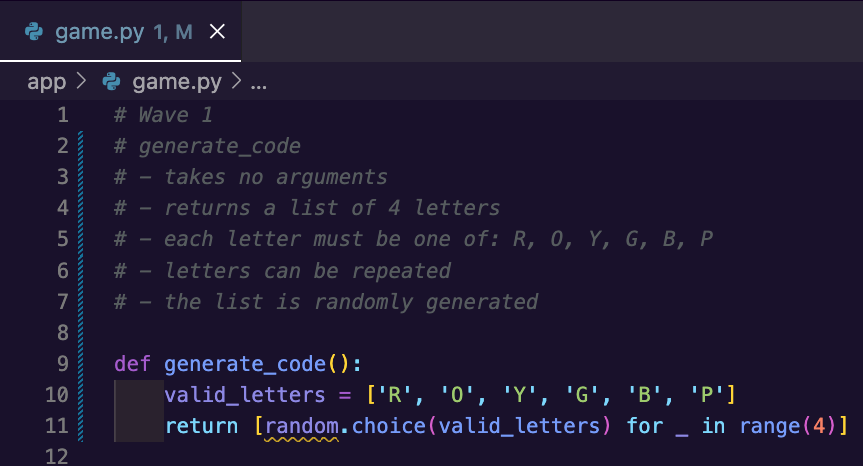

#  Copilot in Projects Pt. 1 - Writing New Code

## Goals

We know how to generate code, start a chat, and work with Copilot's tools in VS Code, so now let's see what it looks like to apply what we've learned in a project. We'll take a look at a new project, [the Mastermind puzzle game in Python](https://github.com/Ada-Activities/mastermind-copilot), to see how we can use Copilot to increase our productivity.

Our goals for this lesson are to show how we can use Copilot to:
- quickly write new code that follows best practices
- help us with generating test cases

### !callout-info

## Generative tools will give you different responses

As you work through this lesson, you will likely get different results from the prompts you submit than what we show through the lesson. This is expected!

<br>

We are working with a generative AI tool and they are not guaranteed to return the same or even a similar response for the same input. Part of adjusting to working with AI tools is getting comfortable with the variability of their responses and then fine tuning our prompts, regenerating responses, and manually updating generated code until we have something that meets our needs.

<br>

Even the Copilot extension itself is updated regularly, so the way the UI looks or where certain features are located may differ from that shown in this lesson. So if a screenshot looks a little different from what you see in your own VS Code, try to find the equivalent feature in your version of the extension.

### !end-callout

## Getting Started with `Mastermind`

There is a lot we could do with the Mastermind project, but to keep us focused on areas where we can benefit from Copilot, we will use the project scaffold on the `main` branch as a starting point. 

To get started:
- Fork the [`mastermind-copilot` repo](https://github.com/Ada-Activities/mastermind-copilot)
- Clone the repo down
- Create and activate a virtual environment
- Use `pip` to install `requirements.txt`
- Read through the `README.md` to get an understanding of the requirements of the functions we will write

Since `main` is the default branch of the repo, it should already be checked out when we clone the project down. 

There are 4 Waves of the Mastermind project
- These Copilot lessons will walk through Wave 1
- Completing Wave 2 is left as practice for the reader. 
- We will tackle Wave 3 together during class
- We will work on Wave 4 in small groups to complete the `mastermind` function in `mastermind.py` and finish our game!

Our plan in this lesson is to:
- Write new code to complete Wave 1 of the project directions 
    - We will do this by adding the functions described in Wave 1 of the `README.md` to the file `app/game.py`
- Write new tests for our functions to cover missing edge cases

## Wave 1: `generate_code`, `validate_guess`, and `check_win_or_lose`

Opening `app/game.py`, we have a mostly empty file with some markers for adding our functions for each wave. Our first step will be to create the `generate_code` function.

### Implement `generate_code`

Based on the README, our function should generate a random 4 letter code for the user to guess. The function should:
- take no parameters
- return a list data structure with 4 elements
    - each element in the list should be a single character 
    - the characters in the list must be one of the following letters: "R", "O", "Y", "G", "B", "P"

To get Copilot's help, let's write a comment that summarizes this information. This step of taking in the function description and synthesizing our own summary helps ensure that we truly understand the problem and requirements before reaching to an AI tool. We need this understanding as developers to be able to check if the code produced by Copilot actually meets our needs. In theory we could copy & paste the text of the README into the comment without ever reading it and we _might_ get something that works, but how could we even be certain if we don't have a full understanding of what is being asked for?

To start generating our function, add the following comment to `app/game.py` then press enter to see what Copilot suggests:

```py
# generate_code 
# - takes no arguments  
# - returns a list of 4 letters
# - each letter must be one of: R, O, Y, G, B, P
```

In our case, Copilot immediately suggests some additions to our comment as well as a function signature and body that _nearly_ matches our needs for the moment:


*Fig. Our function description comment above with a suggestion for the `generate_code` function from Copilot in grey below ([Full size image](assets/new-code-copilot/generate_code_first_suggestion.png))*

If we accept this suggestion, the function itself looks good, but for some reason `random` is underlined by VS Code. Why might that be?


*Fig. Our function description comment with the suggestions from Copilot accepted into the file. ([Full size image](assets/new-code-copilot/generate_code_random_underlined.png))*

Copilot suggested that we use `choice` from the `random` module, but Copilot didn't add code to import the `random` module. If we tried to run this code we would get an error until we add the import statement `import random` to the file. 

To wrap up this function, let's:
1. add `import random` to the top of the file so we see the issue marker resolve
2. run our Wave 1 tests in `tests/test_wave_1.py` to ensure that the tests for `generate_code` are now passing.

### !callout-info

## Running the test files as we work

The test files for each wave import all of the functions for the wave at the top of the file. Until we impement all the functions for a wave, we'll see test discovery errors in the VS Code testing Panel. To run our tests as we complete functions, we will need to comment out and uncomment some imports and tests in the wave files so we can see our relevant tests passing.

<br>

Since `validate_guess` and `check_win_or_lose` have not been implemented yet, in `tests/test_wave_1.py` we will need to comment out those names in the import line and comment out their tests in order to run the `generate_code` tests.

### !end-callout

At this point, both `generate_code` tests should pass and we can move on to the `validate_guess` function!

### Implement `validate_guess`

We could use a comment to try generating our `validate_guess` class method, but instead we'll use the inline chat to prompt Copilot. Let's use `⌘I` (`CMD + i`) to open an inline chat and enter the following prompt that summarizes our function requirements:

> Please write a function named validate_guess that takes in 1 parameter named guess. The input guess is a list of single characters. The function should return True if guess has a length of 4 and every element is one of the following letters: R, O, Y, G, B, P. If these conditions are not true, the function should return False. The function should be case insensitive, both the inputs ['R','Y','G','B'] and ['r','y','g','b'] should return True.

When we submit the prompt, we are likely to receive a response similar to the following:

  
*Fig. Our prompt entered in the Copilot inline chat with a suggestion for the `validate_code` function from Copilot displayed below ([Full size image](assets/new-code-copilot/inline_prompt_validate_guess.png))*

The suggestion is succinct! The function checks `guess` for length and exits early if it can, then it uses `all` and a comprehension to check if the elements of the list are valid. But is there anything about the suggestion that is incorrect or breaking best practices? 

If we take a close look, what is the indentation like for the function? For some reason Copilot indented the function one tab further than it should have. This would create a nested function inside of `generate_code`, rather than the stand alone function we're looking for. 

Let's also take a look at the return line. The return line is 76 characters total, so it isn't breaking the PEP8 guideline of 79 characters or less for length, but we are doing a lot in that one line. We could make the function easier to read by breaking it apart. 

We could use the regenerate button to request a new response and see if Copilot fixes those issues. In our case, running the prompt a couple more times didn't fix any issues, it only moved the lines around:

  
*Fig. Our prompt entered in the Copilot inline chat with a new suggestion for the `validate_code` function from Copilot displayed below. ([Full size image](assets/new-code-copilot/inline_prompt_validate_guess_regenerated.png))*

We could add a follow up to our original request in the inline prompt to try to get the fixes desired:

> Please update the function so that the function definition is not indented. Please break up the last line so that it is easier to read and we are not doing so much work on one line.

Once we submit the prompt we may see something like:

  
*Fig. Our update to the prompt entered in the Copilot inline chat with a new suggestion for the `validate_code` function from Copilot displayed below. ([Full size image](assets/new-code-copilot/inline_prompt_follow_up_validate_guess.png))*

The last line was broken up as we asked for, but the function is still indented inside of `generate_code`! We could take more time going back and forth with Copilot, but since we know the changes we want to see, this is a case where maytbe it wasn't worth regenerating the response or trying to ask Copilot to make the changes for us. The starting point was close enough to what we wanted that we would have been done by now if we made the changes ourselves at the start. 

As we work with tools like Copilot, it's important for us to consistently evaluate where we are spending our time. If we are spending more time trying to get a tool to do what we want than it would take for us to make the change and move on, then we are not using our time or the tool to our best advantage. Copilot is not meant to replace our critical thinking, but it can help us get started on the right path!

To wrap up this function, let's:
1. accept the change
2. highlight the `validate_guess` function 
3. use `⌘[` (`CMD + [`) to move the function one tab left
4. run the tests for `validate_guess` in `tests/test_wave_1.py`

At this point, the tests for `validate_guess` should be passing! 

Our final code for `validate_guess` looks like:
```py
def validate_guess(guess):
    valid_letters = {'R', 'O', 'Y', 'G', 'B', 'P'}
    if len(guess) != 4:
        return False
    for letter in guess:
        if str(letter).upper() not in valid_letters:
            return False
    return True
```

### !callout-info

## Potential Refactoring

We'll talk more in-depth about refactoring with Copilot in the next lesson, but we want to note something worth observing now. Both of the functions we wrote so far need access to a representation of the valid letters for the game (R, O, Y, G, B, P). 

<br>

Rather than sharing that list through a global variable, that information is duplicated in both a list and a set. Especially if there are more functions that need access to this data, we should consider D.R.Ying our code!

### !end-callout

### Implement `check_win_or_lose`

We can ask Copilot to help us write something even if we don't have a template or example, but Copilot tends to produce more relevant results if we have samples to show. In the `README`, the section for `check_win_or_lose` contains a table of example inputs and outputs in addition to the function description, all of which we can share to help guide Copilot's response.

Before we ask Copilot for help, the first thing we need to do is gather the requirements and examples for our last Wave 1 function. We will use these details to craft a prompt for Copilot. This time, let's use `⌃⌘I` (`CTRL + CMD + i`) to open up the Copilot chat pane. We can type directly in the chat box, but it can be helpful to write up prompts in a text editor first, especially if they span multiple lines.

<br>

<details>
  <summary>
    Before continuing, pause for a moment and try to write a prompt that uses our function requirements and examples to describe what we want from Copilot. When you're done, expand this section to see the prompt we used.
  </summary>

  **Our Prompt:**
  > 
</details>

Being an AI tool, we will likely see slightly different responses, even with the same prompt. When we submit our prompt, Copilot will create suggestions for us in the chat pane, and we are given some controls for what to do with that code. In the screenshot below, the controls from left to right are:
- **Apply In Editor** - replaces the contents of the current file with the generated code
- **Insert at Cursor** - adds the code directly to an open file where the cursor currently is
- **Copy** - adds all the code to the clipboard to paste where you'd like
- **More Actions** - shows a dropdown with the options below
  - **Insert into Terminal**
  - **Insert into New File**

  
*Fig. Copilot Chat's controls for code suggestions ([Full size image](assets/copilot-in-projects/copilot-chat-pane-code-controls.png))*

Before we make any decisions about where we want to put the code, let's examine what Copilot suggested for us.

> Sure, here are the three new model classes following the same pattern as the Book class:
> 
> ```py
> from sqlalchemy.orm import Mapped, mapped_column, relationship
> from ..db import db
> 
> class Author(db.Model):
>     id: Mapped[int] = mapped_column(primary_key=True, autoincrement=True)
>     name: Mapped[str]
>     books: Mapped[list["Book"]] = relationship("Book", back_populates="author")
> 
>     def to_dict(self):
>         return {
>             'id': self.id,
>             'name': self.name,
>             'books': [book.to_dict() for book in self.books]
>         }
> 
>     @classmethod
>     def from_dict(cls, data):
>         if 'name' not in data:
>             raise ValueError("Missing required field: name")
>         return cls(name=data['name'])
> 
> 
> class Genre(db.Model):
>     id: Mapped[int] = mapped_column(primary_key=True, autoincrement=True)
>     name: Mapped[str]
> 
>     def to_dict(self):
>         return {
>             'id': self.id,
>             'name': self.name
>         }
> 
>     @classmethod
>     def from_dict(cls, data):
>         if 'name' not in data:
>             raise ValueError("Missing required field: name")
>         return cls(name=data['name'])
> 
> 
> class BookGenre(db.Model):
>     book_id: Mapped[int] = mapped_column(db.ForeignKey('book.id'), primary_key=True)
>     genre_id: Mapped[int] = mapped_column(db.ForeignKey('genre.id'), primary_key=True)
> 
>     book: Mapped["Book"] = relationship("Book", back_populates="genres")
>     genre: Mapped["Genre"] = relationship("Genre", back_populates="books")
> 
>     def to_dict(self):
>         return {
>             'book_id': self.book_id,
>             'genre_id': self.genre_id
>         }
> 
>     @classmethod
>     def from_dict(cls, data):
>         if 'book_id' not in data or 'genre_id' not in data:
>             raise ValueError("Missing required fields: book_id or genre_id")
>         return cls(book_id=data['book_id'], genre_id=data['genre_id'])
> ```
> Please note that you need to add a foreign key field in the `Book` model to reference the `Author` model. Also, the `BookGenre` model is a many-to-many relationship table between `Book` and `Genre`. It has two primary keys, `book_id` and `genre_id`, which are foreign keys referencing `Book` and `Genre` respectively.

Overall, this is a solid start! The classes all meet the property requirements we outlined, the `Author` and `Genre` classes have the `to_dict` and `from_dict` convenience functions defined, and Copilot even gave us a heads up about the changes we'll need to make to the `Book` class for everything to work.

We could implement those changes ourselves, but we can get help from Copilot with this task with a prompt like:

> Please update the Book model class to add foreign keys and relationship attributes to create the one to many relationship between Authors and Books and to create the many to many relationship between books and genres.

**Copilot's response:**
> Sure, here is the updated `Book` model class with the necessary foreign keys and relationship attributes:
> ```py
> from sqlalchemy.orm import Mapped, mapped_column, relationship
> from ..db import db
> 
> class Book(db.Model):
>     id: Mapped[int] = mapped_column(primary_key=True, autoincrement=True)
>     title: Mapped[str]
>     description: Mapped[str]
>     author_id: Mapped[int] = mapped_column(db.ForeignKey('author.id'))
>     author: Mapped["Author"] = relationship("Author", back_populates="books")
>     genres: Mapped[list["BookGenre"]] = relationship("BookGenre", back_populates="book")
> 
>     def to_dict(self):
>         return {
>             'id': self.id,
>             'title': self.title,
>             'description': self.description,
>             'author': self.author.to_dict() if self.author else None,
>             'genres': [genre.to_dict() for genre in self.genres]
>         }    
> 
>     @classmethod
>     def from_dict(cls, data):
>         if 'title' not in data or 'description' not in data:
>             raise ValueError("Missing required fields: title or description")
>         return cls(title=data['title'], description=data['description'])
> ```
> This code adds the `author_id` foreign key and the relationships to the `Author` and `BookGenre` models, establishing the one-to-many relationship between `Author` and `Book` and the many-to-many relationship between `Book` and `Genre`.

The updated code that Copilot displays is looking pretty good, the `Book` suggestion has all the new properties we needed to create our one-to-many `Author` relationship and many-to-many `Genre` relationship.

We can accept the code as is, but there is still some room for improvement depending on our needs. In the `to_dict` functions for `Book` and `Author`, we may want to limit what information is sent forward about our newly added relationships. Right now, `to_dict` is called on the new relationship objects so all of their information including ids and information about _their_ relationships gets packaged up in the response. 
- For the `Book` class, it would be nice to include only the author's name and the names of the genres associated with the book in the return dictionary.
- For `Author`, it could be handy if the return dictionary included only the `title`s of the `Book` instances that the Author is associated with. 

### !callout-warning

## Consider Including List Values Carefully

In this case, we're expecting that a particular book will have only a few genres related to it, and any given author will have written only so many books. If we were working with data where we expected a large number of related items, we might not want to include them in the basic `to_dict` function, which primarily serves the purpose of making it easier to return data for a GET request.

<br />

Instead, we might wait to return those lists until we're specifically asked for them from a related endpoint. In the GET response, we might include a count of the number of related items, and then the client could make a separate request to get the full list of related items if they wanted to.

### !end-callout

We could make the changes manually after moving the code to a file, but we can also ask Copilot to make these updates.

<br />

<details>
  <summary>
    Feel free to try out asking Copilot to help with the changes to the <code>Book</code> and <code>Author</code> <code>to_dict</code> functions. When you're done, expand this section to see the prompt we used and what Copilot suggested.
  </summary>

  **Updated Prompt:**
  > Please update the Book to_dict function to include only the name of the author and a list of the names of the genres associated in the return dictionary, if those pieces of data exist. Please update the Author to_dict function to include only the title of each item in the list books.

  **Copilot's Suggested Code:**
  > ```py
  > from sqlalchemy.orm import Mapped, mapped_column, relationship
  > from ..db import db
  > 
  > class Book(db.Model):
  >     id: Mapped[int] = mapped_column(primary_key=True, autoincrement=True)
  >     title: Mapped[str]
  >     description: Mapped[str]
  >     author_id: Mapped[int] = mapped_column(db.ForeignKey('author.id'))
  >     author: Mapped["Author"] = relationship("Author", back_populates="books")
  >     genres: Mapped[list["BookGenre"]] = relationship("BookGenre", back_populates="book")
  > 
  >     def to_dict(self):
  >         return {
  >             'id': self.id,
  >             'title': self.title,
  >             'description': self.description,
  >             'author': self.author.name if self.author else None,
  >             'genres': [genre.genre.name for genre in self.genres] if self.genres else []
  >         }    
  >     
  >     @classmethod
  >     def from_dict(cls, data):
  >         if 'title' not in data or 'description' not in data:
  >             raise ValueError("Missing required fields: title or description")
  >         return cls(title=data['title'], description=data['description'])
  > ```
  > ```py
  > from sqlalchemy.orm import Mapped, mapped_column, relationship
  > from ..db import db
  > 
  > class Author(db.Model):
  >     id: Mapped[int] = mapped_column(primary_key=True, autoincrement=True)
  >     name: Mapped[str]
  >     books: Mapped[list["Book"]] = relationship("Book", back_populates="author")
  > 
  >     def to_dict(self):
  >         return {
  >             'id': self.id,
  >             'name': self.name,
  >             'books': [book.title for book in self.books]
  >         }
  > 
  >     @classmethod
  >     def from_dict(cls, data):
  >         if 'name' not in data:
  >             raise ValueError("Missing required field: name")
  >         return cls(name=data['name'])
  > ```
</details>

There may yet be further things to consider, one we can see is that the `Book` model's `from_dict` method could be updated to handle an `author_id` or `genre_id` value. However, once we are happy with the presented code we can copy our updated `Book`, and new `Author`, `Genre`, and `BookGenre` classes from the Copilot chat to their own files. From there we should wrap up our changes by updating the tests for our Book model with our new scenarios, and create tests for our new models—all on our own or with Copilot's assistance!

### Testing the Book class

These functions aren't very long, but it's still a good idea to test them as a baseline for any future changes to this class or related code. We'll use Copilot to help us get started on brainstorming unit tests from the inline chat.

In our `book.py` file, highlight the whole text, bring up the inline Copilot chat with `⌘I` (`CMD + i`), then type in the shortcut `/tests`.

  
*Fig. Selected text in* `book.py` *with the Copilot inline chat up to enter "/tests" ([Full size image](assets/copilot-in-projects/book-slash-tests-start.png))*

Once we hit `Enter`, Copilot will add a new pane in the VS Code window with our copilot chat at the top and a temporary file with unit tests that we can review.

  
*Fig. Copilot's UI to preview tests for the* `book.py` *file ([Full size image](assets/copilot-in-projects/book-slash-tests-suggestion.png))*

If we feel like the tests presented are a good starting place, we can take steps to save the generated code. Since this branch doesn't have a `tests` folder yet, we should create a `tests` directory and an empty `__init__.py`. 

Once we have our file structure set up, we should  click "Accept" in the copilot chat to dismiss the chat window, then use `⌘S` (`CMD + S`) to save the new test file. We should see a pop up that allows us to choose the folder where we want to save the test file.

We must carefully review the tests that Copilot generates for things like missing cases or tricky edge cases. We may get lucky and have all of our bases covered, but we'll often want to add or update the tests slightly. In our case, Copilot came up with 3 tests that nearly have us covered:

```py
import pytest
from .book import Book

def test_to_dict():
    book = Book(id=1, title="Test Title", description="Test Description")
    expected = {
        'id': 1,
        'title': "Test Title",
        'description': "Test Description"
    }
    assert book.to_dict() == expected

def test_from_dict_success():
    data = {
        'title': "Test Title",
        'description': "Test Description"
    }
    book = Book.from_dict(data)
    assert book.title == "Test Title"
    assert book.description == "Test Description"

def test_from_dict_missing_title():
    data = {
        'description': "Test Description"
    }
    with pytest.raises(ValueError, match="Missing required fields: title or description"):
        Book.from_dict(data)
```

### !callout-warning

## Creating `Book` instances in tests
In our first test, `test_book_to_dict`, the `Book` class is instantiated from a dictionary with an explicit `id`, even though we discussed avoiding setting `id`s ourselves when creating the `from_dict` method. 

<br />

In this specific case, we're testing the `to_dict` method, which is isolated from our routes code or other database access. However we arrange the `Book` for testing this particular method is fine, but there are many instances where we need to use our fixtures to create Book instances that are tracked by SQLAlchemy and exist in our database for routes to retrieve. 

<br />

When we use Copilot to create tests, we should always evaluate if the data is being set up correctly in the `Arrange` step for all of the actions we will be taking.

### !end-callout

We have tests to ensure that for a given book model, the dictionary that `to_dict` creates contains the right data, and that a book created by `from_dict` stores the title and description from the input dictionary into the right properties. Our last test ensures that if the `"title"` key is missing from the input dictionary, we raise an error. But what if the `"description"` key is missing instead?

To make our test suite as complete as possible, we can add one more test `test_book_from_dict_missing_description` to make sure that we have this edge case covered. We can write the additional test by hand, but we can also try highlighting the last test and asking Copilot to do that work for us!

<br />

<details>
  <summary>
    Try it out yourself, then expand this section to see how we asked Copilot to handle the test updates.
  </summary>

  **Prompt:**
  > Please add a new test for the from_dict function that tests the scenario where the description is missing but the title is present

  **Newly added test:**
  ```py
  def test_from_dict_missing_description():
    data = {
        'title': "Test Title"
    }
    with pytest.raises(ValueError, match="Missing required fields: title or description"):
        Book.from_dict(data)
  ```
</details>


## Summary

Copilot can help make many code tasks move faster, as long as we use it with caution. There are many ways to prompt Copilot to suggest code, but no matter how we access Copilot in the UI, we need to make sure that we give Copilot enough context to meaningfully help us. That might mean making sure we have files open that Copilot can use as examples, or writing detailed prompts that cover the requirements of the code we want to generate. Copilot can help us with brainstorming test cases, but there is no guarantee that Copilot will suggest a complete suite that covers all of our important edge cases, so we need to review what's presented critically and expand the suite if necessary.

## Check for Understanding

<!-- prettier-ignore-start -->
### !challenge
* type: checkbox
* id: 9100b9a2-b806-4b0c-94d2-5f1af5acf54b
* title: Copilot in Projects Pt. 1 - Writing New Code

##### !question
What are some points to look out for when using the `/tests` shortcut.
##### !end-question

##### !options
a| Do the tests cover all of the edge cases we need?
b| Are the right imports included when referencing other classes or files?
c| Was the test file generated in the source folder instead of the test folder?
d| Do the test assertions assume the correct kind of data?
##### !end-options

##### !answer
a|
b|
c|
d|
##### !end-answer

### !end-challenge
<!-- prettier-ignore-end -->
