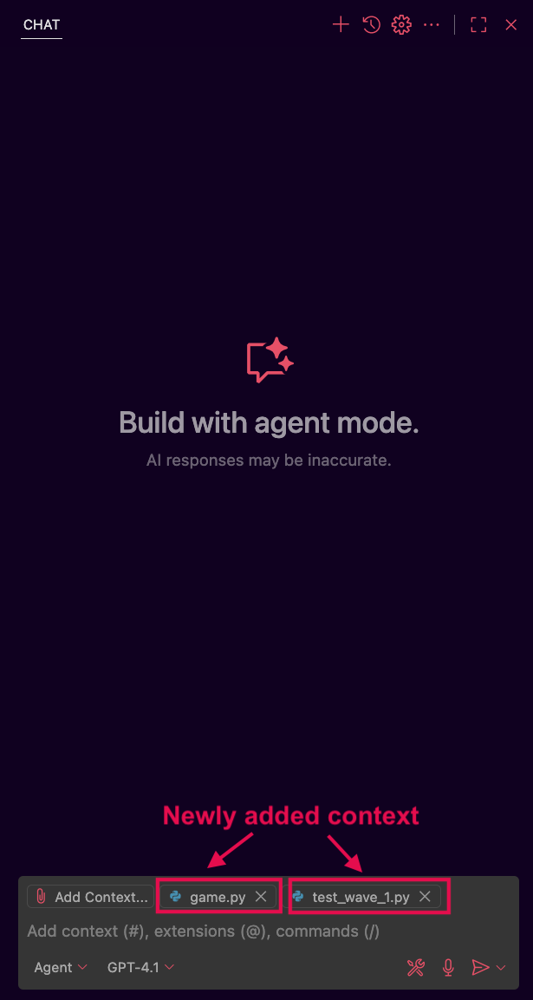

#  Copilot in Projects Pt. 1 - Writing New Code

## Goals

We know how to generate code, start a chat, and work with Copilot's tools in VS Code, so now let's see what it looks like to apply what we've learned in a project. We'll take a look at a new project, [the Mastermind puzzle game in Python](https://github.com/Ada-Activities/mastermind-copilot), to see how we can use Copilot to increase our productivity.

Our goals for this lesson are to show how we can use Copilot to:
- quickly write new code that follows best practices
- help us with generating test cases

### !callout-info

## Generative tools will give you different responses

As you work through this lesson, you will likely get different results from the prompts you submit than what we show through the lesson. This is expected!

We are working with a generative AI tool and they are not guaranteed to return the same or even a similar response for the same input. Part of adjusting to working with AI tools is getting comfortable with the variability of their responses and then fine tuning our prompts, regenerating responses, and manually updating generated code until we have something that meets our needs.

Even the Copilot extension itself is updated regularly, so the way the UI looks or where certain features are located may differ from that shown in this lesson. So if a screenshot looks a little different from what you see in your own VS Code, try to find the equivalent feature in your version of the extension.

### !end-callout

## Getting Started with `Mastermind`

There is a lot we could do with the Mastermind project, but to keep us focused on areas where we can benefit from Copilot, we will use the project scaffold on the `main` branch as a starting point. 

To get started:
- Fork the [`mastermind-copilot` repo](https://github.com/Ada-Activities/mastermind-copilot)
  - When forking, uncheck "Copy the main branch only" to ensure that all branches are copied to your fork
    
    *Fig. An excerpt from the page to fork projects showing "Copy the main branch only" is unchecked. ([Full size image](assets/new-code-copilot/new_code_fork_repo_uncheck_main_only.png))*
- Clone the repo down
- Create and activate a virtual environment
- Use `pip` to install `requirements.txt`
- Read through the `README.md` to get an understanding of the requirements of the functions we will write

Since `main` is the default branch of the repo, it should already be checked out when we clone the project down. 

There are 4 waves of the Mastermind project.
- Wave 1 will be covered in these Copilot lessons.
- Wave 2 is designated as the Problem Set for this topic, and should be completed prior to class.
- Wave 3 will be tackled together during class.
- Wave 4 we'll try out in small groups to complete the `mastermind` function in `mastermind.py` and finish our game!

### !callout-info

## Preparing for Collaborative Classwork

The project accompanying this lesson has some portions to be done on your own, and some to be done in class in collaboration with others. There is no expectation that you will have prepared any materials for waves 3 or 4 prior to class, but feel free to do so if that helps you feel more ready. However, please leave space during class for others to think through how to tackle those waves in the classroom setting and be cooperative in how you share your own ideas about how to approach the challenge! ✨

### !end-callout

Our plan in this lesson is to:
- Write new code to complete Wave 1 of the project directions 
    - We will do this by adding the functions described in Wave 1 of the `README.md` to the file `app/game.py`
- Write new tests for our functions to cover missing edge cases

## Wave 1: `generate_code`, `validate_guess`, and `check_code_guessed`

Opening `app/game.py`, we have a mostly empty file with some markers for adding our functions for each wave. Our first step will be to create the `generate_code` function.

### Implement `generate_code`

Based on the README, our function should generate a random 4 letter code for the user to guess. The function should:
- take no parameters
- return a list data structure with 4 elements
    - each element in the list should be a single character 
    - the characters in the list must be one of the following letters: "R", "O", "Y", "G", "B", "P"

To get Copilot's help, let's write a comment that summarizes this information. This step of taking the function description and synthesizing our own summary helps ensure that we truly understand the problem and requirements before reaching for an AI tool. We need this understanding as developers to be able to check whether the code produced by Copilot actually meets our needs. 

### !callout-info

## Copilot Doesn't Replace Critical Thinking

In theory we could copy & paste the text of the `README` into the comment without ever reading it and we _might_ get something that works, but how could we even be certain if we don't have a full understanding of what is being asked for? Copilot is not meant to replace our critical thinking, but it can help us get started on the right path!

### !end-callout

To start generating our function, add the following comment to `app/game.py` then press enter to see what Copilot suggests:

```py
# generate_code 
# - takes no arguments  
# - returns a list of 4 letters
# - each letter must be one of: R, O, Y, G, B, P
```

While writing the lesson, Copilot suggested some additions to our comment as well as a function signature and body that _nearly_ matches our needs for the moment. 
- In further experimenting, Copilot didn't always start generating suggestions with this example and folks may find that they need to start writing the function definition to get Copilot to kick in.


*Fig. Our function description comment above with a suggestion for the `generate_code` function from Copilot highlighted below ([Full size image](assets/new-code-copilot/generate_code_first_suggestion.png))*

If we accept this suggestion, the function itself looks good, but for some reason `random` is underlined by VS Code. Why might that be?


*Fig. Our function description comment with the suggestion from Copilot accepted into the file. ([Full size image](assets/new-code-copilot/generate_code_random_underlined.png))*

Copilot suggested that we use `choice` from the `random` module, but Copilot didn't add code to import the `random` module. If we tried to run this code we would get an error until we add the import statement `import random` to the file. 

To wrap up this function, let's:
1. add `import random` to the top of the file so we see the issue marker resolve
2. run our Wave 1 tests in `tests/test_wave_1.py` to ensure that the tests for `generate_code` are now passing.

### !callout-info

## Running the test files as we work

The test files for each wave import all of the functions for the wave at the top of the file. Until we implement all the functions for a wave, we'll see test discovery errors in the VS Code testing Panel. To run our tests as we complete functions, we will need to comment out and uncomment some imports and tests in the wave files so we can see our relevant tests passing.

Since `validate_guess` and `check_code_guessed` have not been implemented yet, in `tests/test_wave_1.py` we will need to comment out those names in the import line and comment out their tests in order to run the `generate_code` tests.

Note that even with those tests commented out, if we run our tests through VS Code it will still show some test discovery errors due to the tests for waves 2 and 3. As long as the wave 1 tests are shown, you can run them and ignore the other test discovery issues. Or to avoid the errors, you can either temporarily comment out the contents of the wave 2 and 3 test files (you'll need to remember to uncomment them when you reach those waves), or stick to running the tests using `pytest`.
### !end-callout

At this point, both `generate_code` tests should pass and we can move on to the `validate_guess` function!

### Implement `validate_guess`

We could use a comment to try generating our `validate_guess` class method, but instead we'll use the inline chat to prompt Copilot. Let's use `⌘I` (`CMD + i`) to open an inline chat and enter the following prompt that summarizes our function requirements:

> Please write a function named validate_guess that takes in 1 parameter named guess. The input guess is a list of single characters. The function should return True if guess has a length of 4 and every element is one of the following letters: R, O, Y, G, B, P. If these conditions are not true, the function should return False. The function should be case insensitive, both the inputs ['R', 'Y', 'G', 'B'] and ['r', 'y', 'g', 'b'] should return True.

When we submit the prompt, we are likely to receive a response similar to the following:

  
*Fig. Our prompt entered in the Copilot inline chat with a suggestion for the `validate_code` function from Copilot displayed below ([Full size image](assets/new-code-copilot/inline_prompt_validate_guess.png))*

The suggestion is succinct! The function checks `guess` for length and exits early if it can, then it uses `all` and a comprehension to check whether the elements of the list are valid. But is there anything about the suggestion that is incorrect or breaking best practices? 

If we take a close look, we might notice something odd about the function's indentation. For some reason Copilot indented the function one tab further than it should have. This would create a nested function inside of `generate_code`, rather than the standalone function we're looking for. 

Let's also take a look at the return line. The return line is 76 characters total, so it isn't breaking the PEP8 guideline of 79 characters or less for length, but we are doing a lot in that one line. We could make the function easier to read by breaking it apart. 

We could use the regenerate button to request a new response and see if Copilot fixes those issues. In our case, running the prompt a couple more times didn't fix any issues, it only moved the lines around:

  
*Fig. Our prompt entered in the Copilot inline chat with a new suggestion for the `validate_code` function from Copilot displayed below. ([Full size image](assets/new-code-copilot/inline_prompt_validate_guess_regenerated.png))*

We could add a follow up to our original request in the inline prompt to try to get the fixes desired:

> Please update the function so that the function definition is not indented. Please break up the last line so that it is easier to read and we are not doing so much work on one line.

Once we submit the prompt we may see something like:

  
*Fig. Our update to the prompt entered in the Copilot inline chat with a new suggestion for the `validate_code` function from Copilot displayed below. ([Full size image](assets/new-code-copilot/inline_prompt_follow_up_validate_guess.png))*

The last line was broken up as we asked for, but the function is still indented inside of `generate_code`! We could take more time going back and forth with Copilot, but since we know the changes we want to see, this is a case where maybe it wasn't worth regenerating the response or trying to ask Copilot to make the changes for us. The starting point was close enough to what we wanted that we would have been done by now if we made the changes ourselves at the start. 

As we work with tools like Copilot, it's important for us to consistently evaluate where we are spending our time. If we are spending more time trying to get a tool to do what we want than it would take for us to make the change and move on, then we are not using our time or the tool to our best advantage. 

To wrap up this function, let's:
1. accept the change
2. highlight the `validate_guess` function 
3. use `⌘[` (`CMD` + `[`) or `Shift` + `Tab` to move the function one tab left
4. run the tests for `validate_guess` in `tests/test_wave_1.py`

At this point, the tests for `validate_guess` should be passing! 

While your version may look different, our final code for `validate_guess` looks like:
```py
def validate_guess(guess):
    valid_letters = {'R', 'O', 'Y', 'G', 'B', 'P'}
    if len(guess) != 4:
        return False
    for letter in guess:
        if str(letter).upper() not in valid_letters:
            return False
    return True
```

### !callout-info

## Potential Refactoring

We'll talk more in-depth about refactoring with Copilot in the next lesson, but we want to note something worth observing now. Both of the functions we wrote so far need access to a representation of the valid letters for the game (R, O, Y, G, B, P). 

Rather than sharing that list through a global variable, that information is duplicated in both a list and a set. Especially if there are more functions that need access to this data, we should consider D.R.Ying our code!

### !end-callout

### Implement `check_code_guessed`

Before we ask Copilot for help, the first thing we need to do is gather information for our last Wave 1 function prompt.

We can ask Copilot to help us write something even if we don't have a template or example, but Copilot tends to produce more relevant results if we have samples to show. In the `README`, the section for `check_code_guessed` contains a table of example inputs and outputs in addition to the function description, all of which we can share to help guide Copilot's response.

We will use these details to craft a prompt for Copilot. This time, let's use `⇧⌘I` (`Shift + CMD + i`) to open up the Copilot chat pane in "Agent" mode. While we do this, we want to make sure that `app/game.py` is still open. 
- The Copilot chat window will use the file currently focused in the editor as context to help inform its response, so we want that file open to help Copilot place the code where we want it.
 
For this next step, we can type directly in the Copilot chat box, but it can be helpful to write up prompts in a text editor first, especially if they span multiple lines. 

<br>

<details>
  <summary>
    Before continuing, pause for a moment and try to write a prompt that uses our function requirements and examples to describe what we want from Copilot. When you're done, expand this section to see the prompt we used.
  </summary>

  **Our Prompt:**
  > Create a function named check_code_guessed in app/game.py. The function will determine if the user making a guess has won the game. It should take in 2 parameters:
  > - guess, a 4 element list representing the user's guess
  > - code, a 4 element list representing the code the user is guessing
  >
  > The function should return:
  > - True if the inputs guess and code match
  > - False otherwise
  > 
  > Here are some example inputs and outputs for the function:
  > ```
  > | guess | code | output |
  > |:-----:|:----:| :----: |
  > | ['R', 'P', 'Y', 'G'] | ['R', 'P', 'Y', 'G'] | True |
  > | ['R', 'P', 'Y', 'G'] | ['R', 'R', 'R', 'R'] | False |
  > ```

  **Note:** The table in the prompt uses Markdown (MD) formatting. AI agents tend to be able to understand MD formatting in inputs, so if you can get at the raw markdown for a table of examples (such as by using the raw view of a MD file in Github), that can be an easy and convenient way to provide examples in a way that preserves their structure. 

</details>

Being an AI tool, we will likely see slightly different responses, even with the same prompt. When we submit our prompt, Copilot will create a suggestion for us in the file we identified, `app/game.py`, and we have a couple buttons to decide if we want to keep this option or remove it from this file. In the screenshot below, the controls from left to right are:
- **Keep** - Adds the suggested content to the `app/game.py` file
- **Undo** - Removes the suggestion from `app/game.py`
- **View Diff** - Moves to a view where we can see just the changed lines of `app/game.py`. This can be handy in larger files where there might be more code to sift through to see Copilot's changes.

  
*Fig. Copilot Chat's controls for code suggestions ([Full size image](assets/new-code-copilot/chat_pane_check_code_guessed_first_pass.png))*

Before we make any decisions about keeping or removing the code, let's examine what Copilot suggested for us.

**Copilot's response**
> The function `check_code_guessed` has been added to `game.py`. It returns `True` if the `guess` and `code` lists match, and `False` otherwise, as specified. Let me know if you want to add tests or need further changes.

**`game.py` with Suggested Code**
```py
# Function to check if the guess matches the code
def check_code_guessed(guess, code):
    """
    Determines if the user's guess matches the code.
    Args:
        guess (list): A 4-element list representing the user's guess.
        code (list): A 4-element list representing the code to guess.
    Returns:
        bool: True if guess matches code, False otherwise.
    """
    return guess == code
import random

# Wave 1
# generate_code 
# - takes no arguments  
# - returns a list of 4 letters
# - each letter must be one of: R, O, Y, G, B, P
# - letters can be repeated
# - the list is randomly generated
def generate_code():
    valid_letters = ['R', 'O', 'Y', 'G', 'B', 'P']
    return [random.choice(valid_letters) for _ in range(4)]


def validate_guess(guess):
    valid_letters = {'R', 'O', 'Y', 'G', 'B', 'P'}
    if len(guess) != 4:
        return False
    for letter in guess:
        if str(letter).upper() not in valid_letters:
            return False
    return True


# Wave 2
# Add your Wave 2 functions here

# Wave 3
# Add your Wave 3 functions here
```

The initial code that Copilot displays looks okay, but it doesn't quite meet our needs. We forgot to mention that the comparison should be case insensitive, and we didn't include examples that would guide the tool to that information. As-is, the function does not meet the requirements of the project. 

Additionally, we didn't tell Copilot where in the file to place `check_code_guessed`. Rather than placing the function in Wave 1 where we want it, Copilot placed the code at the top of the file above the existing import.

We could make the changes manually after moving the code to a file, but we can also ask Copilot to make these updates. Let's continue our conversation with Copilot in the chat pane to try to fix these issues.

<br>

<details>
  <summary>
    Feel free to try out asking Copilot to help with the changes to the <code>check_code_guessed</code> function. When you're done, expand this section to see the prompt we used.
  </summary>

  **Follow Up Prompt:**
  > Please move the check_code_guessed function in game.py down below validate_guess in the section for Wave 1 functions. Please also update check_code_guessed to use a case insensitive comparison for guess and code.
</details>

Once we submit our prompt, we have a new version of code to examine:
```py
# Function to check if the guess matches the code (case-insensitive)
def check_code_guessed(guess, code):
    """
    Determines if the user's guess matches the code (case-insensitive).
    Args:
        guess (list): A 4-element list representing the user's guess.
        code (list): A 4-element list representing the code to guess.
    Returns:
        bool: True if guess matches code (case-insensitive), False otherwise.
    """
    return [str(g).upper() for g in guess] == [str(c).upper() for c in code] 
```

As we often will when reviewing generated code, we have a few things to consider. 
- One optimization we could make is to remove converting `code` to uppercase if we know `code` will always be created and stored in uppercase. 
- The function is a single line with a lot happening that makes it harder to parse quickly. It also uses single letter variable names to try to stay under 79 characters. This makes it harder to read and understand, so we can break up the line.

For this lesson's example, we will accept the updated code as-is and make these last changes manually. Once we make these updates, we can run our full Wave 1 test suite to ensure the existing tests are passing.

<br>

<details>
  <summary>
    Try out making the final updates to <code>check_code_guessed</code> yourself! When you're done, expand this section to see our final version of the function.
  </summary>

  ```py
  # Function to check if the guess matches the code (case-insensitive)
  def check_code_guessed(guess, code):
      """
      Determines if the user's guess matches the code (case-insensitive).
      Args:
          guess (list): A 4-element list representing the user's guess.
          code (list): A 4-element list representing the code to guess.
      Returns:
          bool: True if guess matches code (case-insensitive), False otherwise.
      """
      upper_guess = [letter.upper() for letter in guess]
      return upper_guess == code
  ```
</details>

From here we should wrap up our Wave 1 changes by updating the Wave 1 test file with missing scenarios or edge cases!

### Increasing Wave 1 Testing

These functions aren't very long, but it's still a good idea to test them as a baseline for any future changes to this class or related code. We already have some tests in `tests/test_wave_1.py`, so we're looking to make sure we aren't missing important nominal or edge cases. We'll use Copilot to help us get started on brainstorming unit tests from the inline chat.

#### Testing `generate_code` with `/tests`

For `generate_code` we'll use the `/tests` shortcut from Copilot to help us expand our test suite.

In our `app/game.py` file: 
1. highlight the first function we created `generate_code`
2. bring up the inline Copilot chat with `⌘I` (`CMD + i`)
3. type in the shortcut `/tests`

  
*Fig. `generate_code` selected in* `app/game.py` *with the Copilot inline chat up to enter "/tests" ([Full size image](assets/new-code-copilot/slash_tests_generate_code_unsubmitted.png))*

Once we hit `Enter`, Copilot will add a new pane in the VS Code window with our Copilot chat at the top and a temporary file filled with unit tests for `generate_code` that we can review.

  
*Fig. Copilot's UI to preview tests for the* `generate_code` *function ([Full size image](assets/new-code-copilot/slash_tests_generate_code_submitted.png))*

This is a great way to look at many ideas for test scenarios, but it doesn't take into account the tests that already exist. If we were starting our testing from scratch, we might want to save this whole file in our `tests` folder. For this lesson and function, let's review the suggested unit tests and see if there are any that we want to copy over to the existing `tests/test_wave_1.py` file.

Let's refresh ourselves on the existing tests for `generate_code`:
- `test_generate_code_length_four`, which confirms the code returns is 4 characters in length
- `test_generate_code_uses_valid_letters`, which confirms the code only uses valid letters: "R", "O", "Y", "G", "B", and "P".

Copilot suggested four tests: 
```py
def test_generate_code_returns_list():
    result = generate_code()
    assert isinstance(result, list)

def test_generate_code_length_is_four():
    result = generate_code()
    assert len(result) == 4

def test_generate_code_contains_only_valid_letters():
    valid_letters = {'R', 'O', 'Y', 'G', 'B', 'P'}
    result = generate_code()
    for letter in result:
        assert letter in valid_letters

def test_generate_code_randomness():
    # Run generate_code multiple times and check for different outputs
    codes = {tuple(generate_code()) for _ in range(10)}
    # There should be more than one unique code generated
    assert len(codes) > 1
```

Two of the Copilot suggestions, `test_generate_code_length_is_four` and `test_generate_code_contains_only_valid_letters` cover the same scenarios that we mentioned above. However, there is an optimization from one of the duplicate scenarios that we could implement! 
- The existing test `test_generate_code_uses_valid_letters` uses a list to hold the valid letters that we check the new code against. Searching this list is an `O(n)` operation that we need to take for every letter in the generated code. 
- Copilot's suggested test for the same scenario, `test_generate_code_contains_only_valid_letters`, uses a `set` to hold the valid letters instead. 

Since `set`s have an `O(1)` look up time, we could make our test more efficient by updating our test with this improvement! Let's make that change in `tests/test_wave_1.py` and keep moving!

### !callout-info

## Building an Efficiency Mindset

In this test case, will it really matter whether the valid letters are stored in a `list` or a `set`? Absolutely not!

We can also recall that from a Big O standpoint, while the general time complexity to search a list is `O(n)`, if a list is always fixed size, we can consider that search to be a fixed cost, effectively becoming `O(1)`. Of course, the _absolute_ performance of using a `set` could be faster, but it's also possible that it could run slower! We must remember that Big O only tells us how performance changes with the input size, not the absolute performance for a particular size. But for code the size of the test, we're not really going to notice a difference.

We pointed out this change to highlight that complexity and performance is something that we should be thinking about no matter what code we're writing, whether application logic or tests. It's possible we could consider this case and still decide to leave it as a `list`, but it's important that we notice that this situation is something to think about in the first place.

### !end-callout

The two new test cases from Copilot are:
- `test_generate_code_returns_list`, which confirms the return value from `generate_code` is a list data type
- `test_generate_code_randomness`, which calls `generate_code` 10 times and checks that all the results are not identical.

Since the `README` does require that `generate_code` returns a list, we can bring the first new test into our `tests/test_wave_1.py` file as-is. The second test, `test_generate_code_randomness` requires a little more investigation.
- Does `test_generate_code_randomness` actually guarantee randomness?
- Would this test pass if we hardcoded 2 different codes that the program randomly chose between?

If we contemplate questions like this, we'll find that `test_generate_code_randomness` doesn't quite do what the title says. 
- It cannot guarantee randomness like the title implies.
- It only checks if the `set` of created codes is larger than 1. This means that we could oscillate between two hardcoded values and the test would still pass. 
- It could be updated to be more stringent, but if we say the code must be different every run, the test might fail unexpectedly. 
    - We are randomly generating a code from a small pool of values, so there is a real chance we will see duplicates! 

Depending on our scenario and requirements, it could still be worth checking if across several tries the function generates different codes, but we would want the test contents and title to reflect that purpose, and to know we wouldn't get random failures if chance happened to mean that there were some duplicate codes generated. For our example, we will keep this test, but update it in a couple ways:
- Rename the test to `test_generate_code_half_or_less_duplicates_over_10_runs`
- Add a variable to track the number of runs we perform in the test
- Update the comprehension expression to use the run count variable rather than a hard coded number
- Change the assertion to expect the `set` length to be at half the number of runs

Using a variable to hold the number of runs enables the test to be written so that the runs and assertion check will always remain in sync, even if we come back and change the number of runs at some later date!

Once we bring these updates and new tests into `tests/test_wave_1.py`, we can close the suggestion pane that Copilot opened since we do not want to create a new file for the `generate_code` tests.

<br>

<details>
  <summary>
    Feel free to try out the <code>/tests</code> shortcut with <code>generate_code</code> and examine the tests it generates to see which would be valuable to take as-is or update. When you're done, expand this section to see our updated test suite for <code>generate_code</code>!
  </summary>

  ```py
  # --------------------------test generate_code------------------------------------

  def test_generate_code_returns_list():
      #Arrange/Act
      result = generate_code()

      #Assert
      assert isinstance(result, list)


  def test_generate_code_length_four():
      #Arrange/Act
      result = generate_code()

      #Assert
      assert len(result) == 4


  def test_generate_code_uses_valid_letters():
      #Arrange
      valid_letters = {'R', 'O', 'Y', 'G', 'B', 'P'}

      #Act
      result = generate_code()

      #Assert
      for letter in result:
          assert letter in valid_letters


  def test_generate_code_half_or_less_duplicates_over_10_runs():
      # Arrange/Act
      # Run generate_code multiple times and check for different outputs
      runs = 10
      codes = {tuple(generate_code()) for _ in range(runs)}
      
      # Assert
      # At least half of the codes generated should be unique
      assert len(codes) > runs / 2
  ```
</details>

#### Testing `validate_guess` and `generate_code` 

We saw an issue with using `/tests` from the inline chat when we already have a test suite. Rather than taking our existing tests into account and only suggesting new scenarios, we were given some duplicate test cases for `generate_code`. 

To help us save time and avoid reviewing test cases that won't be helpful, we want a way to interact with Copilot that ensures it has context about what we are working on and what already exists in the project. This time we'll open the Copilot Chat pane and use the "Add Context" feature to provide Copilot with more information. 

Before we jump into prompting, the first thing we should do is review our tests so we know what we have and can get an idea of what we might be missing. 

<br>

<details>
  <summary>
    Check out the tests in VS Code, or open this drop down to see the current test suites for <code>validate_guess</code> and <code>check_code_guessed</code>.
  </summary>

  ```py
# --------------------------test validate_guess------------------------------------

def test_validate_guess_false_length_greater_than_four():
    # Arrange
    guess = ['R', 'R', 'R', 'R', 'R']

    # Act
    result = validate_guess(guess)

    # Assert
    assert result is False


def test_validate_guess_true_valid_letters_rygp():
    # Arrange
    guess = ['R', 'Y', 'G', 'P']

    # Act
    result = validate_guess(guess)

    # Assert
    assert result is True


def test_validate_guess_true_valid_letters_bp():
    # Arrange
    guess = ['B', 'B', 'P', 'P']

    # Act
    result = validate_guess(guess)

    # Assert
    assert result is True


def test_validate_guess_false_invalid_letters():
    # Arrange
    guess = ['R', 'S', 'Y', 'P']

    # Act
    result = validate_guess(guess)

    # Assert
    assert result is False


def test_validate_guess_true_lowercase_letters():
    # Arrange
    guess = ['b', 'b', 'p', 'p']

    # Act
    result = validate_guess(guess)

    # Assert
    assert result is True

# --------------------------test check_win_or_lose------------------------------------

def test_check_code_guessed_true():
    # Arrange
    guess = ['R', 'B', 'B', 'P']
    code = ['R', 'B', 'B', 'P']

    # Act
    result = check_code_guessed(guess, code)

    # Assert
    assert result


def test_check_code_guessed_false_if_game_ongoing():
    # Arrange
    guess = ['R', 'B', 'B', 'P']
    code = ['R', 'B', 'B', 'O']

    # Act
    result = check_code_guessed(guess, code)

    # Assert
    assert not result
  ```
</details>

Reviewing the test suite, something that stands out is that `validate_guess` should be case insensitive – though we have tests with all capitalized and all lowercased letters, we don't have a test for a mixed case guess. Let's keep this in mind as we work with Copilot to explore possible additional tests!

Now that we are refreshed on our test suites, let's use the "`+`" button at the top of the Copilot chat pane to start a new chat.

  
*Fig. The "New Chat" button in the Copilot chat pane's UI ([Full size image](assets/new-code-copilot/chat_pane_new_chat.png))*

Depending on the mode, the Copilot chat may select the currently focused file as context for the conversation, or it may only suggest it. Even if you have multiple panes and tabs open, only the file with current editing focus will be given this treatment. 

  
*Fig. By default, only the open file with editor focus is considered for context in a new Copilot chat. ([Full size image](assets/new-code-copilot/chat_pane_tests_default_context.png))*

This is great when you are only asking questions about a single file, however, we want the chat to know about the functions in `app/game.py` _and_ our existing tests in `tests/test_wave_1.py`. Under "Add Context" Copilot's chat has an "Open Editors" option that will add all currently open files as context, even if they are not in editor focus. Let's use this to our advantage!

1. With our new chat open, open both `app/game.py` and `tests/test_wave_1.py` in the editor pane.
2. In the Copilot chat window, press "Add Context".
3. From the dropdown that appears, select "Open Editors".

  
*Fig. VS Code's UI for adding all open editors as context to Copilot Chat. ([Full size image](assets/new-code-copilot/chat_pane_add_context_open_editor.png))*

Once "Open Editors" is selected, we'll see both `app/game.py` and `tests/test_wave_1.py` show up in the context section of the Copilot chat. 
- In the Copilot chat UI, the "`X`" button next to each file name in the context section will let you remove a file from context. 
- Whichever file has focus will show up twice in the list, since there is always a "`Current File`" context bubble. 

  
*Fig. `app/game.py` and `tests/test_wave_1.py` added as context to Copilot Chat. ([Full size image](assets/new-code-copilot/tests_chat_pane_after_adding_context.png))*

Now that Copilot can see our code and tests, let's start prompting! We can write a shorter prompt and may still get okay results, but to be effective with our time we can be clear with instructions for:
- What we want help with
- Where specific relevant code exists
- Where we want changes made
- Explaining suggestions to ensure we grow our understanding and have that knowledge for the future 

<br>

<details>
  <summary>
    Using what we've learned about prompting so far and the points above as a template, try out writing a prompt to update the test suites for <code>validate_guess</code> and <code>check_code_guessed</code>. When you're done, expand this section to see our prompt.
  </summary>

  **Prompt:**
  > I would like to expand the test suites for the functions validate_guess and check_code_guessed in game.py to cover missing edge or nominal test cases. 
  > 
  > The current tests live in test_wave_1.py. I would like any new tests added to test_wave_1.py in the relevant sections of the file. 
  > 
  > What other test cases would be useful? For any suggested tests, please describe why they would be useful and what specific missing scenario they are accounting for.

</details>

Once we press enter, exact responses will vary, but Copilot should respond with information around:
- analyzing `validate_guess` and `generate_code` in `app/game.py`
- analyzing current test coverage or cases for each function in `tests/test_wave_1.py`
- describing what the current tests cover and what scenarios are missing

Copilot might also generate the unit tests for the new tests cases it identified inside `tests/test_wave_1.py` for us to preview, but we might need to direct it to do so after reviewing the scenarios it proposes. In our case, we were shown a list of cases and explanations to review.

We should carefully look through this information and check it against our needs and the requirements in the `README.md`. We should keep in mind the data and expectations for each scenario to ensure they are useful and testing what we expect.
- This process also helps to reinforce the kinds of test cases we might want to keep top of mind for the future. 

With this in mind, let's review into the tests Copilot suggested for us.

  **Copilot's Response**
  > Here are some useful additional test cases for `validate_guess` and `check_code_guessed`, along with explanations for each:
  > 
  > ### For `validate_guess`
  > 
  > 1. **Empty Guess List**
  >    - Test: `validate_guess([])`
  >    - Why: Ensures the function returns `False` for an empty input, which is an invalid guess.
  > 
  > 2. **Guess with Length Less Than Four**
  >    - Test: `validate_guess(['R', 'O', 'Y'])`
  >    - Why: Ensures the function returns `False` for guesses that are too short.
  > 
  > 3. **Guess with Mixed Case Letters**
  >    - Test: `validate_guess(['R', 'o', 'Y', 'p'])`
  >    - Why: Confirms that the function is case-insensitive and accepts valid letters in any case.
  > 
  > 4. **Guess with Non-String Elements**
  >    - Test: `validate_guess(['R', 1, 'Y', 'P'])`
  >    - Why: Checks that the function handles non-string input gracefully and returns `False`.
  >
  > 5. **Guess with None**
  >    - Test: `validate_guess(['R', None, 'Y', 'P'])`
  >    - Why: Ensures the function rejects guesses containing `None`.
  > 
  > ### For `check_code_guessed`
  > 
  > 1. **Guess and Code with Different Cases**
  >    - Test: `check_code_guessed(['r', 'b', 'b', 'p'], ['R', 'B', 'B', 'P'])`
  >    - Why: Verifies that the function is case-insensitive and matches guesses regardless of letter case.
  > 
  > 2. **Guess and Code with Same Letters, Different Order**
  >    - Test: `check_code_guessed(['R', 'B', 'P', 'B'], ['R', 'B', 'B', 'P'])`
  >    - Why: Ensures the function only returns `True` for exact order matches, not just matching letters.
  > 
  > 3. **Guess and Code with Different Lengths**
  >    - Test: `check_code_guessed(['R', 'B', 'B'], ['R', 'B', 'B', 'P'])`
  >    - Why: Checks that the function handles mismatched lengths and returns `False`.
  > 
  > 4. **Guess and Code Both Empty**
  >    - Test: `check_code_guessed([], [])`
  >    - Why: Ensures the function returns `False` (or possibly `True` if empty is considered a match, but this should be clarified) for empty inputs.
  > 
  > 5. **Guess with Non-String Elements**
  >    - Test: `check_code_guessed([1, 2, 3, 4], ['R', 'B', 'B', 'P'])`
  >    - Why: Checks robustness against non-string input.
  >
  > Would you like me to add these tests to `test_wave_1.py`? If so, I will place them in the relevant sections and ensure they are clearly labeled as edge or nominal cases.

As we noted earlier in the lesson when reviewing our existing test suite, we have no mixed casing test for `validate_guess`. Copilot created a scenario for that, along with a host of other edge cases to consider. 
- Since this function is meant to provide a layer of validation for us before we try to take other actions with a guess, these test scenarios have value and help reinforce that our project works at the boundaries of our game. 

Taking a look at the options presented for `check_code_guessed`: 
- The first two tests would provide some extra security since we did not have a mixed case test or one for the edge case where all correct letters are present in the guess, but in the wrong order. 
- We wouldn't necessarily need options 3-6 since they handle validation that does not belong to this function's responsibilities. We should be validating a guess with our `validate_guess` function before calling `check_code_guessed`.

We will ask Copilot to generate just theses tests that we identified as useful and relevant to their functions.

<details>
  <summary>
    Expand this section to see the full code for the new tests Copilot generated for the test cases we want to keep.
  </summary>

  **Suggested Tests:**
  ```py
  # ----validate_guess tests----

  def test_validate_guess_false_empty_list():
      #Arrange
      guess = []

      #Act
      result = validate_guess(guess)

      #Assert
      assert result is False


  def test_validate_guess_false_length_less_than_four():
      #Arrange
      guess = ['R', 'O', 'Y']

      #Act
      result = validate_guess(guess)

      #Assert
      assert result is False


  def test_validate_guess_true_mixed_case_letters():
      #Arrange
      guess = ['R', 'o', 'Y', 'p']

      #Act
      result = validate_guess(guess)

      #Assert
      assert result is True


  def test_validate_guess_false_non_string_types():
      #Arrange
      guess = ['R', 1, 'Y', 'P']

      #Act
      result = validate_guess(guess)

      #Assert
      assert result is False


  def test_validate_guess_false_with_none_value():
      #Arrange
      guess = ['R', None, 'Y', 'P']

      #Act
      result = validate_guess(guess)

      #Assert
      assert result is False

  # ----check_code_guessed tests----

  def test_check_code_guessed_true_with_mixed_case_guess():
      # Arrange
      guess = ['r', 'B', 'b', 'P']
      code = ['R', 'B', 'B', 'P']

      # Act
      result = check_code_guessed(guess, code)

      # Assert
      assert result


  def test_check_code_guessed_all_letters_in_wrong_order_false():
  # Arrange
  guess = ['R', 'B', 'P', 'B']
  code = ['R', 'B', 'B', 'P']

  # Act
  result = check_code_guessed(guess, code)

  # Assert
  assert not result
  ```
</details>

To see our version of the `mastermind-copilot` repo with Wave 1 completed, check out the branch [`wave_1_complete`](https://github.com/Ada-Activities/mastermind-copilot/tree/wave_1_complete).

## Summary

Copilot can help make many code tasks move faster, as long as we use it with caution. There are many ways to prompt Copilot to suggest code, but no matter how we access Copilot in the UI, we need to make sure that we give Copilot enough context to meaningfully help us. That might mean adding files to Copilot's context in chat and writing detailed prompts that cover the requirements of the code we want to generate. 

We must carefully review the tests that Copilot generates for things like missing cases or tricky edge cases. We may get lucky and have all of our bases covered, but we'll often want to add or update the tests slightly. There is no guarantee that Copilot will suggest a complete suite that covers all of our important edge cases, so we need to review what's presented critically and update or expand the suite if necessary.

## Check for Understanding

<!-- prettier-ignore-start -->
### !challenge
* type: checkbox
* id: 9100b9a2-b806-4b0c-94d2-5f1af5ac7dj
* title: Copilot in Projects Pt. 1 - Writing New Code
##### !question

What are some points to look out for when reviewing code suggested by Copilot?

Select all that apply.

##### !end-question
##### !options

a| Can I read and explain the code generated?
b| Does the implementation of the function meet the requirements for what was requested?
c| Does the function name reflect the actions taken in the function body?
d| Are the right imports included when referencing other code such as modules, classes, or files?
e| Is the code generated in the right file and correct location within the file?

##### !end-options
##### !answer

a|
b|
c|
d|
e|

##### !end-answer
### !end-challenge
<!-- prettier-ignore-end -->

<!-- prettier-ignore-start -->
### !challenge
* type: checkbox
* id: 9100b9a2-b806-4b0c-94d2-5f1af5acf54b
* title: Copilot in Projects Pt. 1 - Writing New Code
##### !question

What are some points to look out for when asking Copilot for help with tests?

Select all that apply.

##### !end-question
##### !options

a| Do I understand why these tests were suggested and what makes them useful? 
b| Do the tests cover all of the edge cases that are relevant to our problem space?
c| Are the necessary imports included for functions, classes, etc. being tested?
d| Does the test suite provide 100% code coverage?
e| Do the test assertions assume the correct kind of data?

##### !end-options
##### !answer

a|
b|
c|
e|

##### !end-answer
##### !hint

Does testing our main scenarios and edge cases mean that we will definitely exercise 100% of the lines of code in our project?

##### !end-hint
### !end-challenge
<!-- prettier-ignore-end -->
