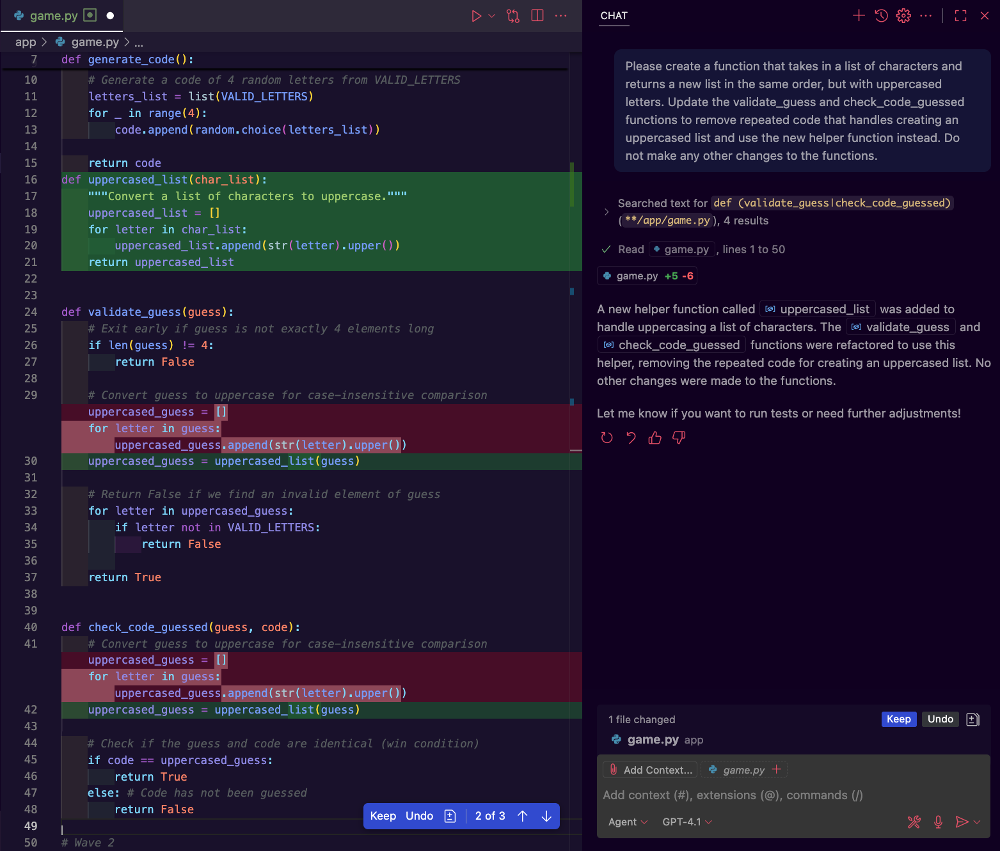
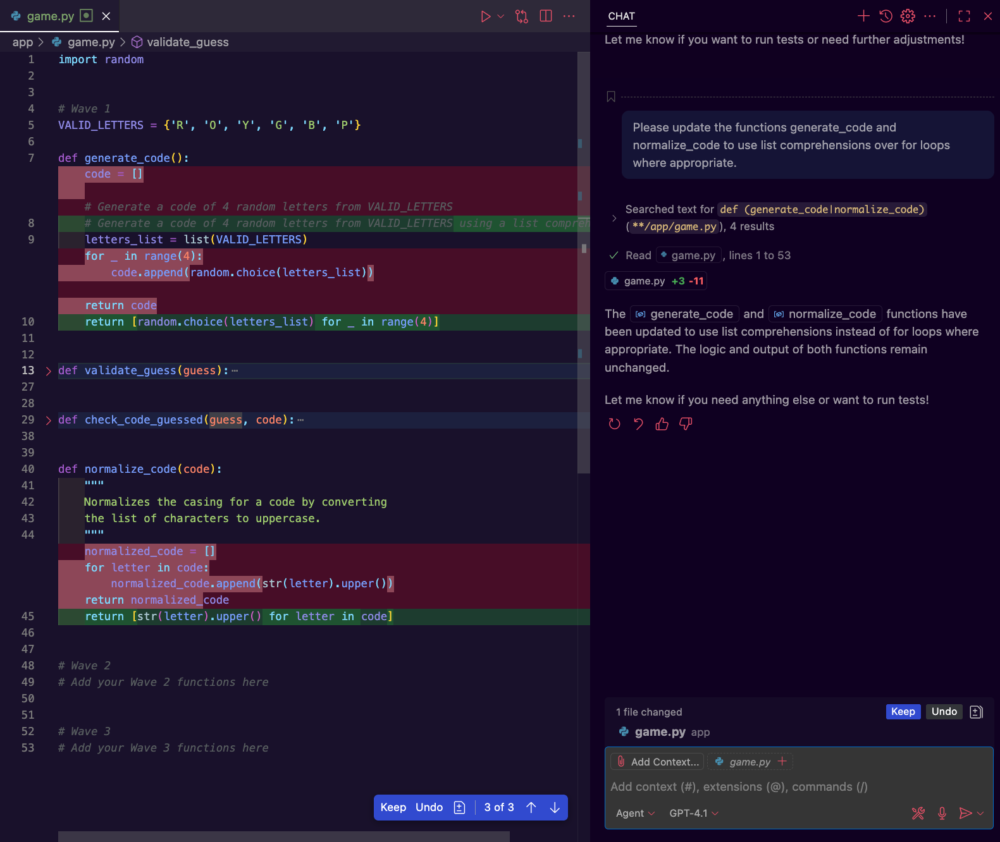

#  Copilot in Projects Pt. 2 - Improving Wave 1

## Goals

We've used Copilot to generate new code in a project, but we saw examples where the code generated wasn't following best practices, especially around avoiding repetition. 

Our goal for this lesson is to identify where Copilot can help us more closely follow coding best practices, specifically:
- writing cleaner code with the D.R.Y. (Don't Repeat Yourself) principle
- writing more Pythonic code by using patterns like list comprehensions 

### !callout-info

## Generative tools will give you different responses

As you work through this lesson, you will likely get different results from the prompts you submit than what we show through the lesson. This is expected!

We are working with a generative AI tool and they are not guaranteed to return the same or even a similar response for the same input. Part of adjusting to working with AI tools is getting comfortable with the variability of their responses and then fine tuning our prompts, regenerating responses, and manually updating generated code until we have something that meets our needs.

Even the Copilot extension itself is updated regularly, so the way the UI looks or where certain features are located may differ from that shown in this lesson. So if a screenshot looks a little different from what you see in your own VS Code, try to find the equivalent feature in your version of the extension.

### !end-callout

## Set Up & Tests

Writing new code with Copilot is great, but a significant portion of software development involves reviewing and updating existing code. We're going to revisit Wave 1 of `mastermind-copilot`, starting from a branch with Wave 1 completed. 
- We have the same test suite in `tests/test_wave_1.py` that we ended with in the prior lesson, but the function implementations in `app/game.py` are slightly different.

Before we make changes to working code, we want to make sure that we have tests for any code that could be affected by our updates. 
- Running the tests before and after we make changes gives us confidence that our functions still behave as expected. 
- If anything does go wrong, we can debug the functions using our tests to help us identify what broke. 

Happily, we not only have tests for each function in Wave 1, but we added more test scenarios in the last lesson to cover missing edge cases! We can move forward with our code changes using the existing test suite to give us some security.

As with the `main` branch, only the tests in `tests/test_wave_1.py` should be discoverable and running currently, since we do not have placeholders in `app/game.py` for the remaining waves. Before we start a conversation with Copilot or change any code, we should ensure that we can run all the Wave 1 tests and see them pass.

To get started:
1. using your fork of the repo, checkout the branch [improvements-start](https://github.com/Ada-Activities/mastermind-copilot/tree/improvements-start) 
2. ensure you can run the wave 1 tests and see them pass

### !callout-info

## Saving Project Changes

If we want to keep any local changes that we made in the previous lesson, we recommend pausing to create a new branch from `main` and commit your changes before checking out the `improvements-start` branch. Git will not allow us to switch branches if we have uncommitted changes that would be overwritten by the destination branch.

1. To create a new branch from the current branch we are on, we can run the command: 
    `$ git checkout -b new-branch-name`
2. From there we can commit and push changes to the new branch the same way we have in prior projects. 
3. Once we're ready to switch to the branch for this lesson, we can run: 
    `$ git checkout improvements-start`

### !end-callout

## Identifying Code for Improvement

Let's review these altered implementations of the functions for Wave 1 on the `improvements-start` branch to get familiar with what has changed and start looking for places where we could be more mindful of best practices.

```py
import random


# Wave 1
def generate_code():
    valid_letters = ['R', 'O', 'Y', 'G', 'B', 'P']
    code = []
    
    # Generate a code of 4 random letters from valid_letters
    for _ in range(4):
        code.append(random.choice(valid_letters))

    return code


def validate_guess(guess):
    valid_letters = {'R', 'O', 'Y', 'G', 'B', 'P'}

    # Exit early if guess is not exactly 4 elements long
    if len(guess) != 4:
        return False
    
    # Convert guess to uppercase for case-insensitive comparison
    uppercased_guess = []
    for letter in guess:
        uppercased_guess.append(str(letter).upper())

    # Return False if we find an invalid element of guess
    for letter in uppercased_guess:
        if letter not in valid_letters:
            return False
        
    return True


def check_code_guessed(guess, code):
    # Convert guess to uppercase for case-insensitive comparison
    uppercased_guess = []
    for letter in guess:
        uppercased_guess.append(str(letter).upper())

    # Check if the guess and code are identical (win condition)
    # The guard clause guarantees the number of guesses is 8 or less
    if code == uppercased_guess:
        return True
    else: # Code has not been guessed
        return False
```

Taking a look at these implementations, they work as they are supposed to – our tests pass after all! – but there are areas that could use some polish.

<br>

<details>
  <summary>
    Take a few minutes to examine the functions above, and identify areas of code that could be improved with respect to best practices or readability. Expand this section to see the issues we noted.
  </summary>

  **Areas for Improvement**
  1. `generate_code` and `validate_guess` require similar data about valid letters, but that data is duplicated in each function instead of being shared.
  2. `validate_guess` and `check_code_guessed` duplicate work by creating uppercased versions of the input in each function without using a shared helper function.
  3. All of the functions create lists of data that do not require significant processing or data manipulation, but they are not using list comprehensions. List comprehensions are considered more pythonic, and better practice when working in Python 

We could choose to note one other potential area for improvement: `validate_guess` declares the `valid_letters` set before the guard clause that checks the length of `guess`, so the set is created even if it will never be used.  
- Since we already identified that we want `generate_code` and `validate_guess` to share a list of valid letters, this change will already be handled during the updates to share the letter data. 

</details>

We will investigate and update the 3 issues we identified throughout the rest this lesson. If you came up with more items than we listed, feel free to explore those as practice!

## D.R.Y. - Sharing Data Structures in `generate_code` and `validate_guess`

Once we see our Wave 1 tests passing using the current implementations of `generate_code` and `validate_guess`, we can move over to `app/game.py`. 

### Organizing the Prompt

Before we send anything to Copilot, let's organize our information. We know:
- `generate_code` and `validate_guess` require similar data about valid letters
- we want to move the similar data structures out of each function and share them through something like a global variable

<br>

<details>
  <summary>
    Take a moment to write up a prompt that requests the changes for these functions. When you're done, expand this section to see the prompt we will use.
  </summary>

  **Prompt:**
  > Please update the generate_code and validate_guess functions to share a single data structure to represent valid_letters. The data structure should be a set type and should be placed where both functions have access to it. Do not make any other changes to the functions.

  We specifically chose to add _"Do not make any other changes to the functions."_ to our prompt because in testing, we saw that Copilot would often try to make several changes to the function at the same time. This makes it less clear which changes are related to our initial ask vs what Copilot thought would improve the code. 

  Changing code is an error-prone process. To avoid potential confusion and bugs, we want to focus on a single change at a time and see it successfully completed before updating another aspect of the code. 

</details>

### Updating `generate_code` and `validate_guess`

Let's use the inline Copilot chat again, this time highlighting both `generate_code` and `validate_guess` then pressing `⌘I` (`CMD + i`) to bring up the Copilot textbox.

  
*Fig. Inline Copilot chat opened with both `generate_code` and `validate_guess` highlighted ([Full size image](assets/improving-code-copilot/dry-inline-chat-select-generate-code-and-validate-guess.png))*

Once we submit our prompt, we have some changes to review. Let's take a closer look at the revised code from Copilot:

```py
VALID_LETTERS = {'R', 'O', 'Y', 'G', 'B', 'P'}

def generate_code():
    code = []
    
    # Generate a code of 4 random letters from VALID_LETTERS
    for _ in range(4):
        code.append(random.choice(list(VALID_LETTERS)))

    return code


def validate_guess(guess):
    # Exit early if guess is not exactly 4 elements long
    if len(guess) != 4:
        return False
    
    # Convert guess to uppercase for case-insensitive comparison
    uppercased_guess = []
    for letter in guess:
        uppercased_guess.append(str(letter).upper())

    # Return False if we find an invalid element of guess
    for letter in uppercased_guess:
        if letter not in VALID_LETTERS:
            return False
        
    return True
```

This is close to what we want! 
- We have a shared data structure that's a set like we wanted
- No unrelated sections of code were changed

As we look at this code, we need to ask ourselves, "Is this new code following best practices and acting efficiently?" 
- Examining how the loops were changed, `validate_guess` looks fine, but how does Copilot's code use the shared data structure `VALID_LETTERS` in `generate_code`'s loop? 

There's something interesting happening with the changes in `generate_code`. `random.choice` does not work with set data structures, so in the code Copilot generated, every iteration of the loop creates a new list from the `VALID_LETTERS` set. 
- The loop would be more efficient if the function only created a list from `VALID_LETTERS` once before the loop starts. 

We could ask Copilot to make this change for us, but it would be quicker to accept the code as-is, then make this small adjustment ourselves. We'll do just that, then run our Wave 1 test suite to ensure we see the tests pass and both of our functions still work as expected.

Our new version of `generate_code` will look like:

```py
VALID_LETTERS = {'R', 'O', 'Y', 'G', 'B', 'P'}

def generate_code():
    code = []
    
    # Generate a code of 4 random letters from VALID_LETTERS
    letters_list = list(VALID_LETTERS)
    for _ in range(4):
        code.append(random.choice(letters_list))

    return code
```

## D.R.Y. - Helper Function for `validate_guess` and `check_code_guessed`

In this next change, we'll follow a similar pattern as before, but this time we'll work from the Copilot Chat pane.

We will:
1. Gather our information and create a prompt
2. Ensure `app/game.py` is open and has editor focus so it is added to the Copilot chat's context
3. Press `⇧⌘I` (`Shift + CMD + i`) to open up the Copilot chat pane in "Agent" mode 
4. Start a new chat and enter our prompt
5. Critically review the code Copilot generates 
6. Make updates as necessary manually or through the Copilot interface until the code meets our needs
7. Run our Wave 1 test suite and ensure we see all tests passing

### Organizing the Prompt

First, we need to gather the information we have about our next update. For this task, we want to: 
1. Create a helper function that: 
    - takes in a list of characters
    - returns a list characters in the same order as the input, but in all uppercase
2. Replace the identical loops in `validate_guess` and `check_code_guessed` with a call to the new helper function

<br>

<details>
  <summary>
    Take a moment to write up a prompt that requests the changes for <code>validate_guess</code> and <code>check_code_guessed</code>. When you're done, expand this section to see the prompt we will use.
  </summary>

  **Prompt:**
  > Please create a function that takes in a list of characters and returns a new list in the same order, but with uppercased letters. Update the validate_guess and check_code_guessed functions to remove repeated code that handles creating an uppercased list and use the new helper function instead. Do not make any other changes to the functions.

</details>

### Updating `validate_guess` and `check_code_guessed`

Next we're going to bring up the Copilot Chat UI and submit our prompt. 

  
*Fig. Copilot previewing a helper function and updates for `validate_guess` and `check_code_guessed`. ([Full size image](assets/improving-code-copilot/dry-copilot-chat-create-helper-function.png))*

When Copilot has finished generating suggestions, we can examine the updated code:

```py
def uppercased_list(char_list):
    """Convert a list of characters to uppercase."""
    uppercased_list = []
    for letter in char_list:
        uppercased_list.append(str(letter).upper())
    return uppercased_list


def validate_guess(guess):
    # Exit early if guess is not exactly 4 elements long
    if len(guess) != 4:
        return False
    
    # Convert guess to uppercase for case-insensitive comparison
    uppercased_guess = uppercased_list(guess)

    # Return False if we find an invalid element of guess
    for letter in uppercased_guess:
        if letter not in VALID_LETTERS:
            return False
        
    return True


def check_code_guessed(guess, code):
    # Convert guess to uppercase for case-insensitive comparison
    uppercased_guess = uppercased_list(guess)

    # Check if the guess and code are identical (win condition)
    if code == uppercased_guess:
        return True
    else: # Game is still in progress
        return False
```

Copilot generated exactly what we asked for in this case!
- We have a new helper function `uppercased_list` that creates an uppercased list from the input
- Both functions now call `uppercased_list` instead of duplicating list creation code

There are a few clean up steps that we will choose to take:
1. Rename the new function `uppercased_list` to something that represents its responsibility in the project. The current name `uppercased_list` describes *what* the function does, but not its role in the system.
    - Here we will choose a new function name `normalize_code` since the role of that function is to "normalize" our input by taking in a code using any mixture of letter casings and returning the code with all capital letters. 
    - We will also update the name of variables to better describe what's happening in our specific context. We will change the parameter from `char_list` to `code` and `uppercased_list` to `normalized_code`.
    - We should also update the function description to describe the function's role. Feel free to come up with your own description!
2. Move `normalize_code` down in the file to below `validate_guess` and `check_code_guessed`. Different engineering teams will have different style guides that might define where helper functions are placed. 
    - For our example, we want to keep the functions required by the project in the README together, so we will accept the changes as-is and manually move `normalize_code` down where we want it.

If we perform these actions, our cleaned up functions now look like:
```py
def validate_guess(guess):
    ... # Unchanged lines truncated
    # Convert guess to uppercase for case-insensitive comparison
    uppercased_guess = normalize_code(guess)


def check_code_guessed(guess, code):
    # Convert guess to uppercase for case-insensitive comparison
    uppercased_guess = normalize_code(guess)
    ... # Unchanged lines truncated


def normalize_code(code):
    """
    Normalizes the casing for a code by converting 
    the list of characters to uppercase.
    """    
    normalized_code = []
    for letter in code:
        normalized_code.append(str(letter).upper())
    return normalized_code
```

Now that our code is looking how we'd like, let's wrap up these changes by running the Wave 1 test suite and seeing those checkmarks stay green!

## Pythonic Code - Using List Comprehensions

For code to be considered "Pythonic" it should use the features of the Python language to be concise, readable, and performant. We should also focus on using Python language features in a way that the majority of other Python programmers would expect to see them used. This reasoning is a large part of why list comprehensions have been widely accepted by the Python community as the preferred way to create and fill a list, as long as the code still meets other style and readability best practices. 

After our improvements, we still have two places in `app/game.py` where we create and fill a list, and neither function is using a list comprehension:
- `generate_code`
- `normalize_code`

Since we already have the Copilot Chat pane open, we'll use it to ask for Copilot's help on this last update.

### Organizing the Prompt

Our final update needs to replace the for loops in `generate_code` and `normalize_code` with a list comprehension.

<br>

<details>
  <summary>
    Take a moment to write up a prompt that requests the changes for <code>generate_code</code> and <code>normalize_code</code>. When you're done, expand this section to see the prompt we used.
  </summary>

  **Prompt:**
  > Please update the functions generate_code and normalize_code to use list comprehensions over for loops where appropriate.

</details>

### Updating `generate_code` and `normalize_code`

In the past, we've opened new chats with Copilot when starting a significant new ask. This time we're working in the same file and on one of the same functions that was created in the current Copilot chat, so we'll continue to work in the existing chat.

We'll submit our prompt and take a look at our last suggested updates for Wave 1!

  
*Fig. Copilot previewing changes to use list comprehensions in `generate_code` and `normalize_code`. ([Full size image](assets/improving-code-copilot/comprehensions-copilot-chat-generate-code-validate-guess.png))*

The suggested updates for `generate_code` and `normalize_code` look like:

```py
def generate_code():
    # Generate a code of 4 random letters from VALID_LETTERS using a list comprehension
    letters_list = list(VALID_LETTERS)
    return [random.choice(letters_list) for _ in range(4)]

...

def normalize_code(code):
    """
    Normalizes the casing for a code by converting 
    the list of characters to uppercase.
    """    
    return [str(letter).upper() for letter in code]
```

Comprehensions can take some adjusting to, but once comfortable with them, they provide a great way to concisely perform the same work we do in a loop! Here we can see that our code is shorter, but we are still following PEP8 best practices like keeping our line lengths 79 characters or less. 

These comprehensions faithfully represent the loops we had before, nothing else was changed or added, so we will accept these changes, then run our Wave 1 test suite for the last time (in this lesson 😉).

To check out the final version of our Wave 1 code all in one place, take a look at the [`improvements-end`](https://github.com/Ada-Activities/mastermind-copilot/tree/improvements-end) branch of the `mastermind-copilot` repo.

## Summary

This hands-on experience in a project wraps up our whirlwind tour of GitHub's Copilot! Whether we're writing new code or working in an existing codebase, Copilot can help us with tasks like generating ideas for tests, surfacing scenarios we may have missed, and generally writing code more quickly. Even when Copilot's suggestions look good at a glance, we always need to carefully proofread them both for correctness and completeness. Just because a code suggestion works does not mean it fits all of our needs, so we need to remain vigilant and critical of what Copilot provides.

For more practice with Copilot, think about revisiting familiar projects! When we already have a reasonable idea of what the end product could look like, we can devote more focus to practicing new skills.

## Check for Understanding

<!-- prettier-ignore-start -->
### !challenge
* type: ordering
* id: b53afd64-55e1-4670-8d3b-bce1ca3b8872
* title: Copilot in Projects Pt. 2 - Improving Wave 1
##### !question

Based on the process we followed for updating code with Copilot in this lesson, place the steps below for updating code with Copilot in order.

##### !end-question
##### !answer

1. Ensure tests exist for code that will change
2. Run the test suite and ensure that tests pass
3. Gather requirements for the code changes
4. Write a prompt that represents our requirements
5. Open the Copilot UI and submit our prompt
6. Critically review the code Copilot generates
7. Update suggested code as necessary either manually or through the Copilot interface
8. Run the test suite and ensure that tests pass

##### !end-answer
##### !hint

- Can we start making any changes confidently if we don't have tests?
- It is intentional that `Run the test suite and ensure that tests pass` is included twice.
- What information does each step need? 
    - Is there a step that would have to occur first to get that data?

##### !end-hint
##### !explanation

1. Before we make any changes to working code, we should ensure we have tests that confirm the expected behavior of the code and those tests should be passing. 
2. If we don't have tests or the tests are not passing, it's harder for us to make changes and be confident that the results are what we intended.
3. Before we write a prompt, we need to be clear on what we are asking for so Copilot has the greatest change to suggest relevant and useful code with minimal back and forth discussion.
4. Once the requirements are clearly understood we can summarize them in a prompt 
5. We need to interact with Copilot & submit our prompt to get suggestions.
6. Copilot will not always generate code that meets our needs or that is as efficient as we would like. We need to consider if the code suggestions:
    - meet our requirements
    - are following best practices
    - impact the overall time and space complexity
7. Using the analysis from step 6, we can update the code. Depending on the scope of what needs to be changed, it might be quicker to accept the changes and update them manually.
8. Once we've updated the code, we need to run our test suite at the end to ensure all tests are still passing after our changes. 

##### !end-explanation
### !end-challenge
<!-- prettier-ignore-end -->