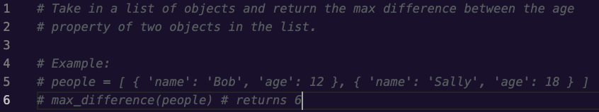
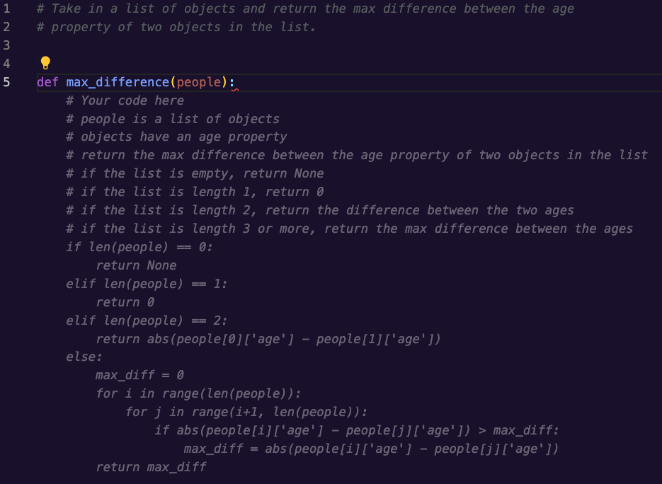
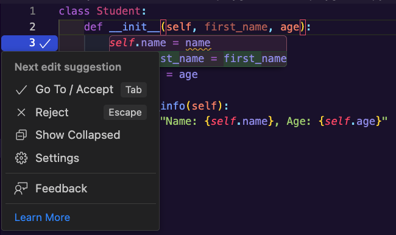
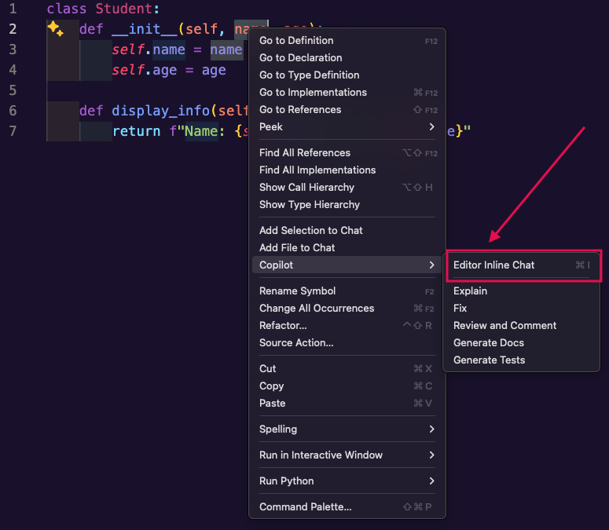
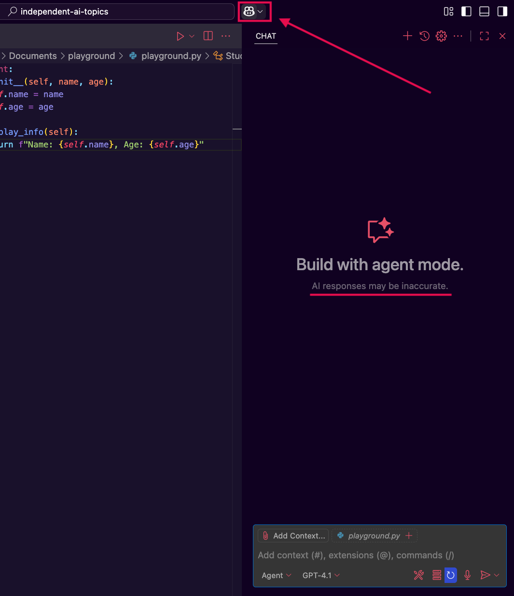
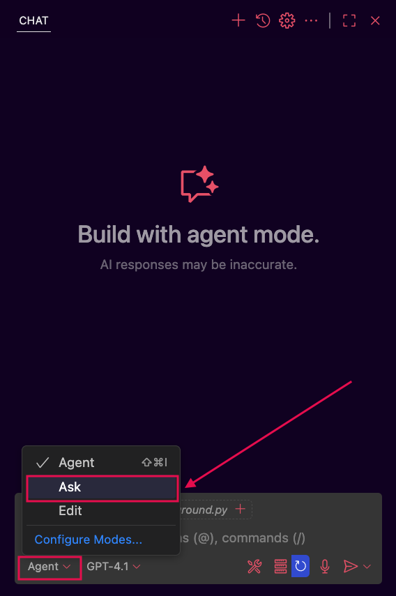
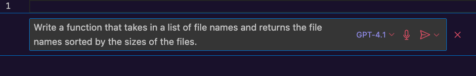
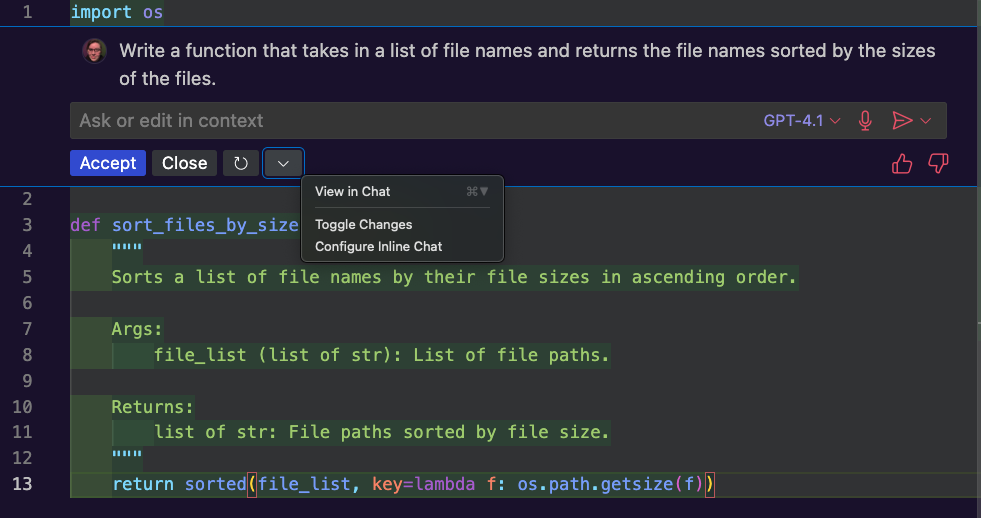
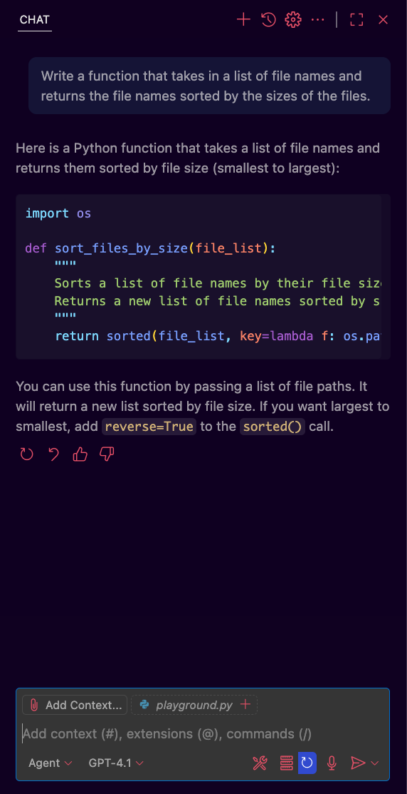
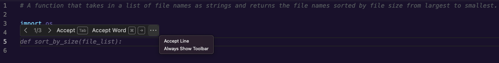

# Copilot Interface & Shortcuts

## Goals

While we won't cover all of Copilot's capabilities and shortcuts in this lesson, we will take a look at the ones developers tend to use most when getting started. For more in-depth information check out GitHub's documentation on ["Configuring GitHub Copilot in your environment"](https://docs.github.com/en/copilot/configuring-github-copilot/configuring-github-copilot-in-your-environment?tool=vscode) or ["Getting started with GitHub Copilot"](https://docs.github.com/en/copilot/using-github-copilot/getting-started-with-github-copilot#seeing-alternative-suggestions-2)

Our goals for this lesson are to:
- Show multiple ways to prompt Copilot for suggestions
- Review helpful commands and shortcuts
- Generate our first suggestions

## Getting Suggestions

There are several ways we can prompt Copilot to start writing code. Feel free to open up a blank Python file to try these out as we go. It can be helpful to experiment and learn how you prefer to get suggestions from Copilot!

### !callout-info

## Trying the same prompts will generate different results
Copilot may give drastically different responses for the same prompts, just as we saw with other LLM tools like ChatGPT. There is no need to be concerned if you are following along and code Copilot suggests code that looks nothing like our examples. This is okay and expected! 

### !end-callout

### Starting with code

When we start typing a function definition in a code file with Copilot activated, Copilot will jump in and suggest the contents of the function in grey text. Let's type the following function definition into a Python file to see what happens:
```py
def convert_f_to_c(temp):
```
Copilot will suggest the body `return (temp - 32) * 5 / 9`, which in this case is exactly what we wanted. We can use `Tab` to accept the presented code, which moves it from a greyed-out suggestion to code in the file that we can navigate and edit.  

  
*Fig. A function definition we wrote, with a suggestion from Copilot in grey below ([Full size image](assets/copilot-interface-shortcuts/copilot-temperature-example.png))*  

### Using a comment as a prompt

We can also use natural language to describe the function we want in a comment and Copilot will suggest code to meet those requirements. In this case, the more information we include, the more likely it is that Copilot will be able to respond with what we're looking for. For example, if we know that we'll be sorting inputs and want to use a particular algorithm, we should mention that in our comment. If we don't, Copilot will make a best guess at what we want and may choose a slower or otherwise less optimal algorithm.

Let's try out another example to show off creating code from a comment. This time, we'll start with the prompt:
```py
# Take in a list of objects and return the max difference between the age 
# property of two objects in the list.
```

If we expect to immediately see code, we might be a little surprised by how Copilot reacts. While our cursor is still on the line with the comment and when we create a new line, copilot will try adding more to our comment, typically to describe edge cases for our function description. Why might this be happening?  

  
*Fig. A comment describing a function where Copilot is suggesting to add more to the comment ([Full size image](assets/copilot-interface-shortcuts/copilot-comment-prompt-adds-to-comment.png))*

  
*Fig. A comment describing a function where Copilot is suggesting to add another commented line ([Full size image](assets/copilot-interface-shortcuts/copilot-comment-prompt-newline-adds-to-comment.png))*

We're going to travel back in time to our first readings about LLMs. There, we learned that LLMs are, in many ways, incredibly powerful predictive text engines. When our cursor is on a line with a comment, Copilot has determined that the most likely thing we're going to do is continue writing the comment, so that's what it suggests. It isn't until we've created a few new lines from the comment that Copilot will reach a probability that we want code rather than descriptive information. Let's continue with this example until we see some code!

When we create another new line, copilot tries to generate example inputs and outputs for us as comments. These comment additions can be really handy for thinking about edge cases we missed or tests we may need to write. Feel free to try it out and see what examples you get!

  
*Fig. Copilot suggesting to add an example to the comment ([Full size image](assets/copilot-interface-shortcuts/copilot-comment-prompt-example-text.png))*

  
*Fig. An example input and output suggested by Copilot ([Full size image](assets/copilot-interface-shortcuts/copilot-comment-prompt-example-completed.png))*

If we create yet one more new line, that is when copilot realizes we aren't trying to add any further description and provides us with a function definition. Once we press `Tab` to accept the function definition suggested, Copilot will suggest an implementation for the function. 

  
*Fig. A function definition suggested by Copilot for the function described in our comment ([Full size image](assets/copilot-interface-shortcuts/copilot-comment-prompt-function-definition.png))*

  
*Fig. A function body suggested by Copilot for the function described in our comment ([Full size image](assets/copilot-interface-shortcuts/copilot-comment-prompt-full-function.png))*

### Editing Code: "Next Edit Suggestions"

In addition to writing new code, Copilot has features to help us out when we need to update code. Let's take a look at how Copilot's "Next Edit Suggestion" feature can improve editing code. 

Let's say that we have a class, `Student`:

```py
class Student:
    def __init__(self, name, age):
        self.name = name
        self.age = age

    def display_info(self):
        return f"Name: {self.name}, Age: {self.age}"
```

Right now there is a single `name` variable, but we want to separate that out into a `first_name` and `last_name` to prepare for future enhancements. 

If we edit the function definition and change `name` to `first_name` Copilot will jump in with some slightly different UI than we've seen previously:
  
*Fig. Copilot's "Next Edit Suggestion" UI in VS Code suggesting changing an occurrence of the variable `name` to `first_name`. ([Full size image](assets/copilot-interface-shortcuts/next_edit_suggestion_first_name_1.png))*

If we hover over the blue marker on the line number, we can see the options for this edit suggestion:
  
*Fig. The "Next Edit Suggestion" menu for Copilot in VS Code. ([Full size image](assets/copilot-interface-shortcuts/next_edit_suggestion_first_name_1_menu.png))*

Our options are:
| Option | Shortcut | Action |
| ------ | -------- | ------ |
| Accept | `Tab` | Adds the edit suggestion to our code. |
| Reject | `Esc` | Ignore the suggestion and dismiss the Next Edit Suggestion UI. |
| Show Collapsed | N/A | Hide the suggestion from view without dismissing the suggestion. |
| Settings | N/A | Takes us to the VS Code Settings page for Next Edit Suggestions. Feel free to follow your curiosity about the options here! |
| Feedback | N/A | Provide feedback on the "Next Edit Suggestion" feature. |
| Learn More | N/A | Takes you to [the "Next Edit Suggestions" documentation](https://code.visualstudio.com/docs/copilot/ai-powered-suggestions#_next-edit-suggestions). |

Let's use `Tab` to accept this change. When we do, the Copilot UI will move down to the next occurrence of `name` and offer to update that as well:


*Fig. Copilot's "Next Edit Suggestion" UI in VS Code suggesting changing the second occurrence of the variable `name` to `first_name`. ([Full size image](assets/copilot-interface-shortcuts/next_edit_suggestion_first_name_2.png))*

We changed `name` to `first_name`, but we still want a `last_name` variable. Feel free to try this out yourself by adding a new variable `last_name` to the function definition and seeing what Copilot suggests!

### Asking in a chat

Copilot has a chat feature where we can write out questions or code prompts to Copilot, similarly to how we've interacted with ChatGPT for code. We'll see how we can use it to create a function, walk us through how the function works, and help us test it.

Something important to note, is that Copilot chats have 3 modes they can run in:
| Mode | Purpose |
| ---- | ------- |
| Ask | Optimized for answering questions about your codebase, coding, and general technology concepts. |
| Edit | Optimized for making code edits across multiple files in your project. |
| Agent | Optimized for acting autonomously to fulfill high level requirements that may include code edits across multiple files and complex tasks requiring invoking other tools. |

Depending on how we invoke Copilot chat, certain modes will be accessible to us. Let's take a look at a couple ways to start a chat!

#### Starting a chat

There are 2 ways we can interact with the Copilot chat:

1. Through inline chat. 
   - We can right click inside a file then select "Copilot > Start Inline Chat" to open a chat box at the location we clicked. 
   - `⌘I` (`CMD + i`) accomplishes the same thing at the current cursor location. 
   - We can also use the drop down menu next to the Copilot icon at the top of VS Code.
   - For our own knowledge, the inline chat only uses the "Ask" and "Edit" modes described previously. At the time of writing this lesson, there is no option in the UI to use "Agent" mode from the inline chat.   

     
   *Fig. The right-click menu in VS Code showing the Copilot options ([Full size image](assets/copilot-interface-shortcuts/vscode-open-inline-chat-from-menu.png))*

     
   *Fig. The Copilot icon drop down menu in VS Code that shows the Copilot chat options with the inline chat option highlighted. ([Full size image](assets/copilot-interface-shortcuts/vscode-open-inline-chat-from-copilot-menu.png))*

     
   *Fig. A blank Python file with an empty inline Copilot chat showing. ([Full size image](assets/copilot-interface-shortcuts/vscode-empty-inline-chat.png))*

2. Through the Copilot chat pane. 
   - We can click the Copilot icon in the top of the VS Code window to open the chat pane. 
   - The keyboard shortcut to open the chat pane is `⌃⌘I` (`CTRL + CMD + i`).  
   - The chat pane will default to "Agent" mode. If we want to ask more general coding questions you may find responses more useful in "Ask" mode.

     
   *Fig. Copilot icon in VS Code highlighted and the Copilot chat pane showing. Note the warning that generated code may be incorrect. ([Full size image](assets/copilot-interface-shortcuts/vscode-open-chat-from-copilot-icon.png))*

     
   *Fig. Copilot chat panel with the modes menu open and the "Ask" option highlighted. ([Full size image](assets/copilot-interface-shortcuts/copilot_chat_mode_menu.png))*

#### Using the Inline Chat

In an empty Python file, let's bring up the inline chat then type in the prompt:

> Write a function that takes in a list of file names and returns the file names sorted by the sizes of the files.

  
*Fig. The inline Copilot chat with a prompt written but not submitted ([Full size image](assets/copilot-interface-shortcuts/inline-chat-prompt-not-submitted.png))*

Copilot will fetch a response and we are given some tools in the UI that we may find similar to ChatGPT's response tools.

  
*Fig. The updated UI after submitting a prompt in the inline chat ([Full size image](assets/copilot-interface-shortcuts/inline-chat-response-ui.png))*

If we hover over the inline chat UI, we see that on the right side, we have thumbs up and down buttons for rating whether the response was useful. On the left side, we have options to accept the response, close the UI and discard the response, or regenerate it. 

We'll go ahead and use the "Accept" button which will add the function to the file and dismiss the inline chat. 

#### Using the Chat Window

Using the chat window may feel a bit closer to working with ChatGPT because the code is written and discussed inside the chat pane rather than adding suggestions directly to a code file.

Let's open the Copilot Chat window and use the same prompt as before:

> Write a function that takes in a list of file names and returns the file names sorted by the sizes of the files.

In this scenario, we received a very similar response to what the inline chat generated, but this may not always be the case.

  
*Fig. Copilot's response for our prompt showing an implementation and explanation ([Full size image](assets/copilot-interface-shortcuts/chat-pane-function-prompt.png))*

From here we can ask further questions in the chat, requesting changes or a deeper explanation, or copy and paste the suggested function into a code file and update it as desired. We'll look at examples of other ways we can use the chat later in this lesson.

## Accepting and Rejecting Suggestions

We've seen several ways that we can ask copilot to generate code, but what do we do once the suggestion is showing? With the inline chat there's an "Accept" button, but if we're just typing a function definition or a comment in a code file, how do we choose to keep some or all of the code presented to us?

It turns out that we have a lot of control! We can accept an entire suggestion, the next word of a suggestion, or the next line. The default keyboard shortcuts provide `Tab` to accept a whole suggestion, and ⌘→ (`CMD + right arrow`) to accept the next word of a suggestion.

If we want to accept suggestions line-by-line we either need to set up our own shortcut in VS Code, or hover over the suggestion to bring up the suggestion menu. In the image below we've clicked on the '3 dots' icon at the right of the suggestion menu to show all the available options, which includes "Accept Line". 

  
*Fig. Copilot's suggestion options UI with the overflow menu open so we can see all options ([Full size image](assets/copilot-interface-shortcuts/copilot-suggestion-menu-overflow-open.png))*

## Seeing alternate suggestions

We saw in the chat UIs that we had options to regenerate a response, similar to ChatGPT. We can also generate multiple suggestions at once in a separate  file.

When we're in a code file, Copilot will immediately gather multiple suggestions if it can. If we take a look at the image above, the first controls in the suggestion menu <code>&lt;&nbsp;1/3&nbsp;&gt;</code> tell us that we're looking at the first of 3 suggestions and the arrow buttons let us navigate back and forth through Copilot's suggestions.

We can also use `⌥]` (`OPTION + ]`) to view the next suggestion, or `⌥[` (`OPTION + [`) to view the previous suggestion.

To see all of the suggestions from Copilot next to each other for comparison, we can use the shortcut `⌃Enter` (`CTRL + Enter`). This will open a new tab that Copilot will fill with suggestions, along with "Accept Solution" buttons above each suggestion that we can use to bring a specific suggestion back to our code file.

  
*Fig. Copilot's suggestions opened in a new tab ([Full size image](assets/copilot-interface-shortcuts/copilot-multiple-suggestions-new-tab.png))*

## Other uses for Copilot Chat

Just like we saw with ChatGPT, conversations can be guided by providing more context and asking further questions as needed until we reach a satisfying answer. We might start the conversation with a fairly open-ended prompt, such as

> Can you explain this code line by line?

or

> Please help me generate test cases for the selected code, focusing on edge cases.

and through additional prompts and responses, we can tune the conversation to our specific needs. 

### !callout-info
## Copilot limitations

Copilot does have limitations and a knowledge cut off like ChatGPT, so languages or syntax that are very new may not be available in suggestions, or Copilot may not have very useful results. However, when it comes to commonly used libraries and modules, Copilot is great at surfacing and explaining functions or syntax without having to leave our IDE.
### !end-callout  

In addition to writing out prompts, Copilot chat has a few handy shortcuts for common actions. We can even use Copilot to help summarize code changes for our commit messages!

### Shortcut Commands

Copilot chat provides a number of shortcut options to streamline our interactions. They are presented in a dropdown list accessed by typing `/` into Copilot chat. We're focusing on 4 of them here, but feel free to follow your curiosity about the rest.

| Shortcut | Use |
| -------- | --- |
| /doc | Add documentation comments for the selected code |
| /explain | Explain the selected code. If invoked from the inline chat, this will open the chat tab. |
| /fix | Try to fix any problems detected in the selected code |
| /tests | Generate unit tests for the selected code. If a test file doesn't exist already, this will create a new file you can review and modify. |

  
*Fig. Shortcut options showing on an inline chat after entering `/` ([Full size image](assets/copilot-interface-shortcuts/inline-chat-shortcut-dropdown.png))**

### Commit Messages

Copilot can take some of the tedium out of writing commit messages when using the integrated Source Control tools in VS Code! With the Copilot extension installed, the text box where we write our commit message now has a button to the right with a sparkles icon—hover over it and we'll see a message "Generate Commit Message with Copilot". When clicked, Copilot will generate a summary based on the changed files that we can review and update as needed to fit our own or our team's standards.

  
*Fig. VS Code's Source Control tab with the Copilot commit message button circled ([Full size image](assets/copilot-interface-shortcuts/vscode-source-control-copilot-button.png))**

## Summary

This has been a dash through the Copilot UI, focusing mostly on how we can generate and work with code suggestions and use the chat to our benefit. The biggest takeaway is that, like so much in coding, there are multiple ways we can perform most actions, and we need to explore and try things out to see what fits best with our workflow.

Even after looking at some potential ways to interact with Copilot, it might still feel unclear how or where Copilot can help us in our daily coding work. In our next lesson, we'll use a project as a practical example for generating new code and improving existing code with Copilot.

## Check for Understanding

<!-- prettier-ignore-start -->
### !challenge
* type: ordering
* id: 1ede5119-c503-4aa5-8833-bd39472ed25b
* title: Copilot Interface & Shortcuts

##### !question
Order the shortcuts so that they match the order of the actions listed below:

1. Open the inline chat
2. View the next suggestion
3. View the previous suggestion
4. Accept a code suggestion
##### !end-question

##### !answer
1. `⌘I` (`CMD + i`)
2. `⌥]` (`OPTION + ]`)
3. `⌥[` (`OPTION + [`)
4. `Tab`
##### !end-answer

### !end-challenge
<!-- prettier-ignore-end -->

<!-- prettier-ignore-start -->
### !challenge
* type: checkbox
* id: 4b5135e4-1435-46ad-b010-fafef36c26fc
* title: Copilot Interface & Shortcuts

##### !question
Select the actions below that Copilot would have trouble performing. 
##### !end-question

##### !hint
Consider how novel some of the technologies are. 
##### !end-hint

##### !options
a| Surfacing syntax in well-used libraries
b| Explaining functions or classes line by line
c| Writing test cases for a brand new testing library
d| Adding documentation to a function or class
e| Suggesting code in a language released this year
##### !end-options

##### !answer
c|
e|
##### !end-answer

##### !explanation
Both of the following:

- Writing test cases for a brand new testing library
- Suggesting code in a language released this year

<br />

would require Copilot to have recent knowledge. Because of Copilot's training data cut off, it has no way to know about new languages or libraries and would have trouble performing these tasks.
##### !end-explanation

### !end-challenge
<!-- prettier-ignore-end -->