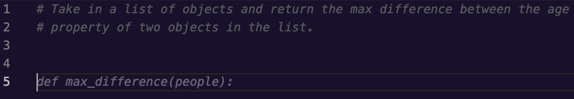
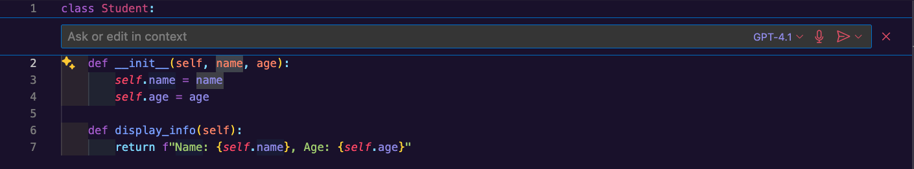
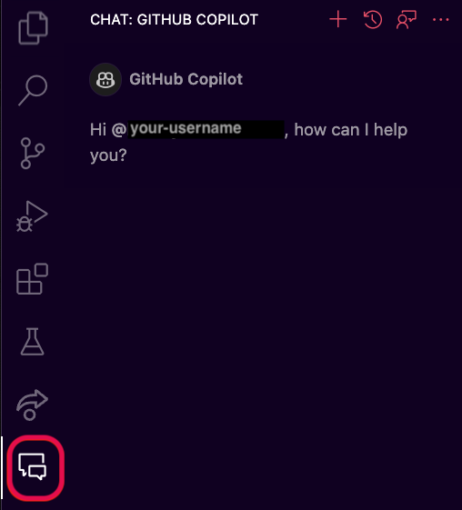
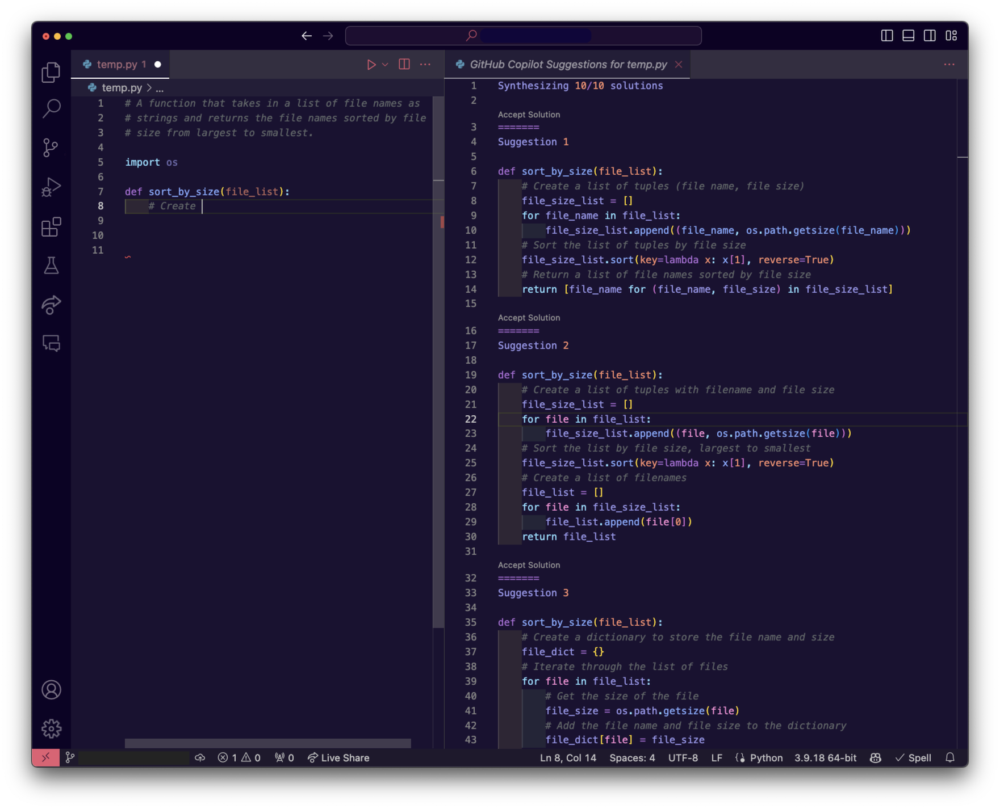
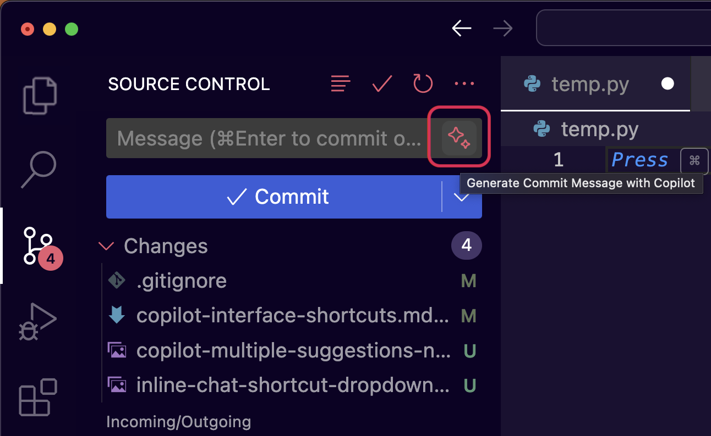

# Copilot Interface & Shortcuts

## Goals

We won't cover all of Copilot's capabilities and shortcuts in this lesson, but we want to share the ones that we think developers will use most when getting started. For more in-depth information check out GitHub's documentation on ["Configuring GitHub Copilot in your environment"](https://docs.github.com/en/copilot/configuring-github-copilot/configuring-github-copilot-in-your-environment?tool=vscode) or ["Getting started with GitHub Copilot"](https://docs.github.com/en/copilot/using-github-copilot/getting-started-with-github-copilot#seeing-alternative-suggestions-2)

Our goals for this lesson are to:
- Show multiple ways to prompt Copilot for suggestions
- Review helpful commands and shortcuts
- Generate our first suggestions

## Getting Suggestions

There are several ways we can solicit Copilot to start writing code. Feel free to open up a blank python file to try these out as we go. It can be helpful to experiment and learn how you prefer to get suggestions from Copilot!

### Starting with code

When Copilot is active, if we start typing a function definition in a code file, copilot will jump in and suggest the contents of the function in grey text. Let's type the following function definition into a python file to see what happens:
```
def convert_f_to_c(temp):
```
Copilot will suggest the body `return (temp - 32) * 5 / 9`, which in this case is exactly what we wanted. We can use `Tab` to accept the presented code, which moves it from a greyed-out suggestion to code in the file that we can navigate and edit.

  
*Fig. A function definition we wrote with a suggestion from Copilot in grey below*

### Using a comment as a prompt

We can also use natural language to describe the function we want in a comment and Copilot will suggest code to meet those requirements. In this case, the more information we include, the more likely that Copilot will be able to respond with what we're looking for. For example, if we know that we'll be sorting inputs and want to use a particular algorithm, we should mention that in our comment. If we don't, Copilot will make a best guess at what we want and may choose a slower or otherwise less optimal algorithm.

Let's try out another example to show off creating code from a comment. This time, we'll start with the prompt:
```
# Take in a list of objects and return the max difference between the age 
# property of two objects in the list.
```

If we expect to immediately see code, we might be a little surprised by how Copilot reacts. While our cursor is still on the line with the comment and when we create a new line, copilot will try adding more to our comment, typically to describe edge cases for our function description. Why might this be happening?  
  
*Fig. A comment describing a function where Copilot is suggesting to add more to the comment*

  
*Fig. A comment describing a function where Copilot is suggesting to add another commented line*

We're going to travel back in time to our first readings about LLMs. There, we learned that LLMs are, in many ways, incredibly powerful predictive text engines. When our cursor is on a line with a comment, Copilot has determined that the most likely thing we're going to do is continue writing the comment, so that's what it suggests. It isn't until we've created a few new lines from the comment that Copilot will reach a probability that we want code rather than descriptive information. Let's continue with this example until we see some code!

When we create another new line, copilot tries to generate example inputs and outputs for us as comments. These comment additions can be really handy for thinking about edge cases we missed or tests we may need to write, feel free to try it out and see what examples you get.   
  
*Fig. Copilot suggesting to add an example to the comment*

  
*Fig. An example input and output suggested by Copilot*

If we create yet one more new line, that is when copilot realizes we aren't trying to add any further description and provides us with a function definition. Once we press `Tab` to accept the function definition suggested, Copilot will suggest an implementation for the function.  
  
*Fig. A function definition suggested by Copilot for the function described in our comment*

  
*Fig. A function body suggested by Copilot for the function described in our comment*

### Asking in a chat

Copilot has a chat feature where you can write out questions or code prompts to Copilot, similarly to how we've interacted with ChatGPT for code. We'll see how we can use it to create a function, walk us through how the function works, and help us test it.

#### Starting a chat

There are 2 ways we can interact with the Copilot chat:

1. We can right click inside a file and select "Copilot > Start Inline Chat" or use the shortcut  `CMD + i` to open up a text box while we're still in a file. Note in the second image, that Copilot itself displays a warning that generated code may be inaccurate – which is a nice reminder for us to carefully review what it presents!   
     
   *Fig. The right-click menu in VS Code showing the Copilot options*

     
   *Fig. A blank python file with an empty inline Copilot chat showing*

2. We can open the Copilot chat pane from the chat tab on the left icon menu, from the Copilot icon in the bottom bar, or by using the shortcut `CTRL + CMD + i`   
     
   *Fig. Opening the Copilot chat pane from the left menu in VS Code*

     
   *Fig. Opening the Copilot chat pane from the Copilot Status Menu*

#### Using the Inline Chat

In an empty python file, let's bring up the inline chat then type in the prompt `Write a function that takes in a list of file names and returns the file names sorted by the sizes of the files.`  

  
*Fig. The inline Copilot chat with a prompt written but not submitted*

Copilot will fetch a response and we are given some tools in the UI that we may find similar to ChatGPT's response tools.

  
*Fig. The updated UI after submitting a prompt in the inline chat*

We can see that on the right side of the UI, we have thumbs up and down buttons for rating if the response was useful. On the left side, we have options to accept the response, discard the response, or regenerate it. If we don't want to use the response but we want to save it to look at later, the "Discard" button has us covered - pressing it will open a drop down with choices to discard the code from this file and save it to the clipboard or discard and paste the code in a new file.   

  
*Fig. The discard options after submitting a code prompt in the inline chat*

We'll go ahead and use the "Accept" button which will add the function to the file and dismiss the inline chat. 

#### Using the Chat Window

Using the chat window may feel a bit closer to working with ChatGPT because, rather than adding suggestions directly to a code file, the code is written and discussed inside the chat pane.

If we open the Copilot Chat window and use the same prompt as before: `Write a function that takes in a list of file names and returns the file names sorted by the sizes of the files.`, we get a very different response from the Inline Chat.

  
*Fig. Copilot's response for our prompt showing an implementation and explanation*

From here we can ask further questions in the chat, requesting changes or a deeper explanation, or copy and paste the suggested function into a code file and update it as desired. We'll look at examples of other ways we can use the chat later in this lesson.

## Accepting and Rejecting Suggestions

We've seen several ways that we can ask copilot to generate code, but what do we do once the suggestion is showing? With the inline chat there's an "Accept" button, but if we're just typing a function definition or a comment in a code file, how do we choose to keep some or all of the code presented to us?

It turns out that we have a lot of control! We can accept an entire suggestion, the next line of a suggestion, or we can go word-by-word. There are default shortcuts for accepting a whole suggestion (`Tab`) or the next word of a suggestion (`CMD + left arrow`), but if we want to accept suggestions line-by-line we need to either set up our own shortcut in VS Code or hover over the suggestion to bring up the suggestion menu. In the image below we've clicked on the '3 dots' icon at the right of the suggestion menu to show all the available options, which includes "Accept Line". 

  
*Fig. Copilot's suggestion options UI with the overflow menu open so we can see all options*

## Seeing alternate suggestions

We saw in the chat UIs that we had options to regenerate a response, similar to ChatGPT, but how do we see alternatives from a suggestion in a file?

When we're in a code file, Copilot will immediately gather multiple suggestions if it can. If we take a look at the image above, the first controls in the suggestion menu `< 1/3 >` tell us that we're looking at the first of 3 suggestions and the arrows buttons let us navigate back and forth through Copilot's suggestions. There are also shortcuts for viewing the next suggestion (`OPTION + ]`) or the previous suggestion (`OPTION + [`).

If we want to see all of the suggestions from Copilot next to each other for comparison, we can use the shortcut `CTRL + Enter`. This will open a new tab that Copilot will fill with suggestions, along with "Accept Solution" buttons above each suggestion that we can use to bring a specific suggestion back to our code file.

  
*Fig. Copilot's suggestions opened in a new tab*

## Other uses for Copilot Chat

Just like we saw with ChatGPT, if we bring up the inline chat or the chat tab and write out prompts like `Can you explain this code line by line?` or `Please help me generate test cases for the selected code, focusing on edge cases.` we can start a conversation and get guidance, providing more context and asking further questions as needed until we reach a satisfying answer. In addition to writing out prompts, Copilot chat has a few handy shortcuts for common actions. We can also use Copilot to help summarize code changes for our commit messages!

### !callout-info
## Copilot limitations

Copilot does have limitations and a knowledge cut off like ChatGPT, so languages or syntax that are very new may not be available in suggestions or Copilot may not have very useful results. However, when it comes to commonly used libraries and modules, Copilot is great at surfacing and explaining functions or syntax without having to leave our IDE.
### !end-callout  

### Shortcut Commands

If we open up a Copilot chat and type `/` we'll see a few shortcut options in a dropdown. We're focusing on 4 of them here, but feel free to follow your curiosity about the rest.

| Shortcut | Use |
| -------- | --- |
| /doc | Add documentation comments for the selected code |
| /explain | Explain the selected code. If invoked from the inline chat, this will open the chat tab. |
| /fix | Try to fix any problems detected in the selected code |
| /tests | Generate unit tests for the selected code. If a test file doesn't exist already, this will create a new file you can review and modify. |

  
*Fig. Shortcut options showing on an inline chat after entering `/`*

### Commit Messages

If you use the Source Control tab in VS Code to manage branches and commits, Copilot is already integrated there for us! The text box to write our commit message now has a button to the right with a sparkles icon – if we hover over it we'll see a message "Generate Commit Message with Copilot". If you click it, copilot will generate a summary based on the changed files that we can review and update as needed to fit our own or our team's standards.

  
*Fig. VS Code's Source Control tab with the Copilot commit message button circled*

## Summary

This has been a dash through the Copilot UI, focusing mostly on how we can generate and work with code suggestions and use the chat to our benefit. The biggest takeaway is that, like so much in coding, there are multiple ways we can perform most actions, and we need to explore and try things out to see what fits best with our workflow. If you're still a little unsure how or where you might apply Copilot, in our next lesson, we'll use a Unit 2 project as a practical example for generating new code and refactoring existing code with Copilot.

## Check for Understanding

<!-- Question 1 -->
<!-- prettier-ignore-start -->
### !challenge
* type: ordering
* id: 1ede5119-c503-4aa5-8833-bd39472ed25b
* title: Ordering Copilot Shortcuts

##### !question
Order the shortcuts so that they match the order of the actions listed below:

1. Open the inline chat
2. View the next suggestion
3. View the previous suggestion
4. Accept a code suggestion
##### !end-question

##### !answer
1. `CTRL + i`
2. `OPTION + ]`
3. `OPTION + [`
4. `TAB`
##### !end-answer

### !end-challenge
<!-- prettier-ignore-end -->

<!-- Question 2 -->
<!-- prettier-ignore-start -->
### !challenge
* type: checkbox
* id: 4b5135e4-1435-46ad-b010-fafef36c26fc
* title: Copilot's Limitations

##### !question
Select the actions below that Copilot would have trouble performing. 
##### !end-question

##### !options
* Surfacing syntax in well-used libraries
* Explaining functions or classes line by line
* Writing test cases for a brand new testing library
* Adding documentation to a function or class
* Suggesting code in a language released this year
##### !end-options

##### !answer
* Writing test cases for a brand new testing library
* Suggesting code in a language released this year
##### !end-answer

##### !explanation
Both `Writing test cases for a brand new testing library` and `Suggesting code in a language released this year` would require Copilot to have recent knowledge. Because of Copilot's training data cut off, it has no way to know about new languages or libraries and would have trouble performing these tasks.
##### !end-explanation

### !end-challenge
<!-- prettier-ignore-end -->