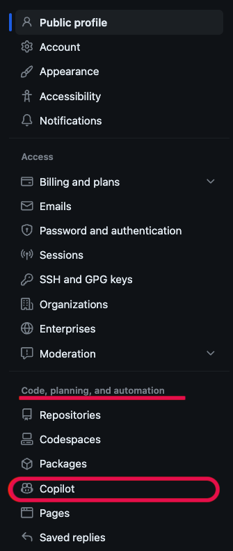
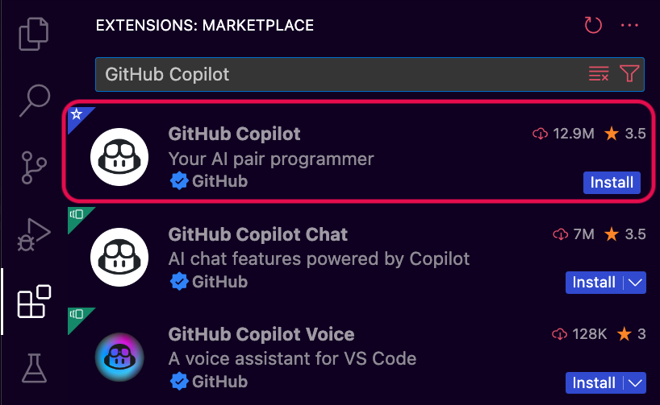

# Setting Up Github's Copilot

## Goals

We explored how LLM tools like ChatGPT can assist us with code, but what if we had an AI tool built specifically for coding that lives in our IDE where we work? In this lesson we'll get experience with Github's Copilot – one of several AI Assistant tools created to help developers write code more quickly by providing suggestions inside our development environments. 

Our goals for this lesson are to:
- Understand why we may want to use AI code assistants
- Get access to Copilot through the GitHub Student Developer Pack
- Set up the Copilot VS Code extension

## Copilot Supports Developers

As coding assistants like Copilot become more available and implemented in the industry, it can be helpful to have some experience with how to work with them and where they can be of the most use. But aside from "Because other folks are using them", why do we want to get familiar with these tools? 

The response from many developers is that these tools free us up to spend more time on the unique or complicated parts of our projects. We can spend less time looking up boilerplate code online or in a previous project if we can quickly describe what we need and have Copilot generate the code. If we're diving into a new code base, Copilot can help explain sections of code to us so that we can contribute faster. 

Like all AI tools, Copilot isn't infallible. When writing code, we still need to know the project and language well enough to understand what functions we'd like to write and how those functions should look. We need that knowledge base to consistently and effectively describe what we want in enough detail to get suggestions, then understand if the suggested code meets our requirements. 

## Accessing Copilot

Github's Copilot is a paid service that is free for students for a limited time through the Github Student Developer Pack. When redeeming the Student Developer Pack for any of the other benefits it provides, we also gain access to Copilot, but we need to turn on the service. To do so:

1. Check if your Student Developer Pack is currently active.
   - Look for a "PRO" status under "Highlights" in your profile on GitHub. In the upper-right corner of any page, click your profile photo, then click "Your Profile".  
     
   *Fig. "Highlights" section of a profile on GitHub*
   - If you have issues accessing or activating your Student Developer Pack, please file a ticket with [GitHub Education Support](https://support.github.com/contact/education). The linked support page also has a button to troubleshoot with GitHub's Virtual Agent in case it can provide immediate help. 

2. Go to the account settings screen by clicking your profile photo in the upper-right corner of any page, then click "Settings". Under the "Code, planning, and automation" section of the "Settings" sidebar, click "Copilot".  
     
   *Fig. "Copilot" option in the "Settings" menu*

3. Click “Enable Copilot”. A message will appear that we have access to Copilot for free, along with a new button “Continue to get access to Github Copilot” that we should click.

4. We will be taken to a preferences screen where we can choose some options about how Copilot will use public code and snippets it generates. Leaving the options on can help improve the overall quality of Copilot, but turning them off won't impact your ability to get recommendations.
   - Choose what you are most comfortable with, these choices can be updated at any time by navigating to "Settings" > "Copilot".

## Setting up Copilot in VS Code

We will be using Copilot exclusively from VS Code in this lesson. Feel free to follow your curiosity and look up whether plugins are available for any other IDEs in which you would like to try out Copilot. 

To add Copilot to VS Code, we need to install the Copilot extension:

1. Open VS Code, then click the Extensions tab.
 
2. In the Extensions tab, search for "GitHub Copilot"  
     
   *Fig. "GitHub Copilot" in the VS Code Extension search results*

3. We can install GitHub Copilot using the "Install" button directly on the entry in the results list or click the "GitHub Copilot" result to go to their extension page and click "Install" from there.
   - When we install the "GitHub Copilot" extension it will automatically install the "GitHub Copilot Chat" extension and vice versa. These are both required for Copilot to work. 

     
   *Fig. "GitHub Copilot"'s extension page in VS Code*

4. If you haven't previously authorized VS Code in your GitHub account, you will be asked to sign in to GitHub inside VS Code. If you've previously authorized Visual Studio Code in your GitHub account, GitHub Copilot should automatically be authorized.
   - In your browser, GitHub will request the necessary permissions for GitHub Copilot. To approve these permissions, click Authorize Visual Studio Code.
   - In Visual Studio Code, in the "Visual Studio Code" dialog box, click "Open" to confirm the authentication.

For instructions to set up the Copilot extension in VS Code written another way, check out GitHub's ["Getting started with GitHub Copilot"](https://docs.github.com/en/copilot/using-github-copilot/getting-started-with-github-copilot#installing-the-github-copilot-extension-in-visual-studio-code) documentation.

## Summary

We should now have Copilot turned on in GitHub, installed the Copilot VS Code extension, and authorized the extension with our GitHub account. If you ran into issues with any of these steps please reach out in #study-hall, come to office hours, or chat with another student or instructor to get yourself unstuck.

Keep going to the next lesson to dig into how we can start working with Copilot!

## Check for Understanding

<!-- prettier-ignore-start -->
### !challenge
* type: tasklist
* id: ef3343f5-b335-4306-9eec-9c3e49803437
* title: Setting Up Copilot
##### !question

Check off all the steps you've completed to get access to Copilot.

##### !end-question
##### !options

* Turned on Copilot access in your GitHub account's settings
* Installed the GitHub Copilot extension for VS Code
* Authorized the Copilot extension for VS Code with GitHub

##### !end-options
### !end-challenge
<!-- prettier-ignore-end -->