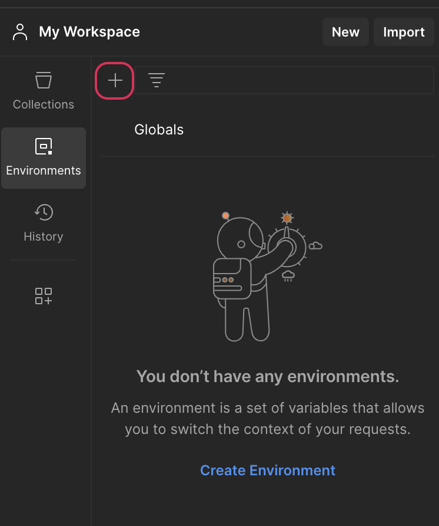
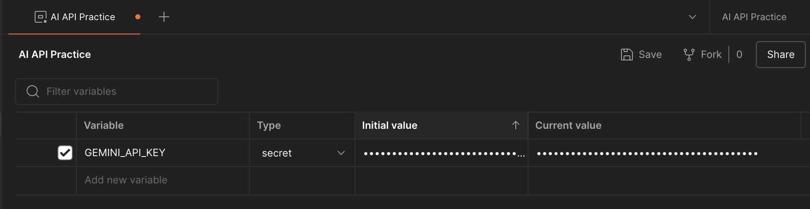
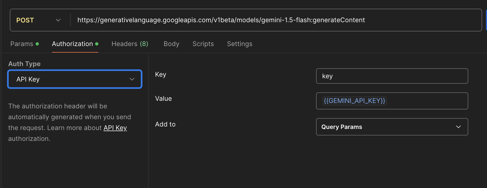
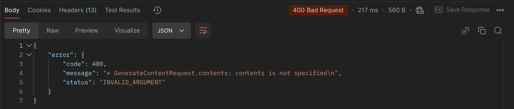
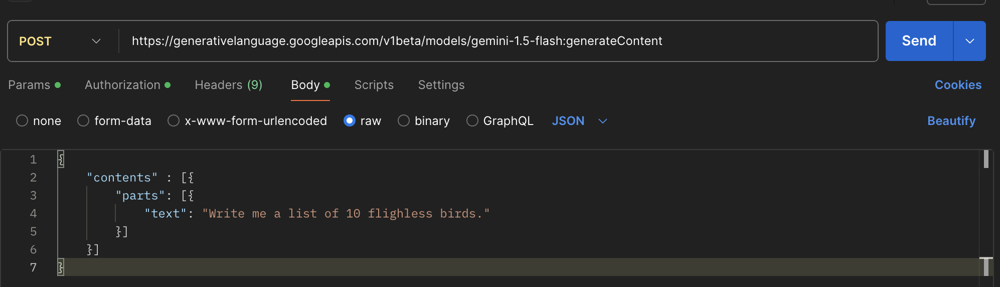
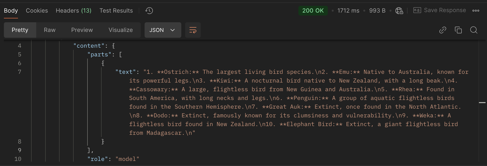

# Postman Environments and Practicing AI API Calls

## Goals
Now that we've learned a bit about 

Our goals for this lesson are to:
- Set up an environment in Postman with which to practice making some AI API requests
- Make our first request to an AI API.

## AI APIs and Postman

As a reminder, when we work with APIs, Postman is a great tool for testing our endpoints, making sure we are formatting our requests correctly, and ensuring that we are receiving the expected responses. 

In the past, when we worked with APIs that require authorization, we created an environment within our project using the .env file where we stored our environment variables such as our API key. To make testing out AI API endpoints in Postman just a bit easier, we can create an environment within Postman itself that includes our API key so that we don't have to manually attach it to each request. We can do that following the steps below.

### !callout-info

## How to Use this Guide

Where possible, the steps outlined below are going to be as generic as we can make them. When specific examples are needed, we will show how to use Google's Gemini API, but as technology continues to progress, the steps we use should be similar for whichever AI API you decide to use.


### !end-callout  

## Setting up an Environment in Postman

1. Create The Environment
- Open up Postman. Select the "Environments" tab in the menu to the left. Once selected, click the plus sign at the top to create a new environment. 
  
*Fig. Environment creation tab in Postman*

- When you click the plus sign, a window will open where you can start setting up your environment. This is the equivalent of setting up a `.env` file. There will be a place to give your environment a name. We've named ours "AI API Practice". There will also be a place to add variables to your environment. This is where you can add the API key for whichever AI API you are using. We've added a variable named "GEMINI_API_KEY". Make sure to change the type to "secret". Paste your key value in the columns labeled "Initial Value" and "current value".
 
*Fig. Creating an environment in Postman*

2. Make your first AI API Call
- Open up a new POST request. Copy over the endpoint you'll be using from whichever API you are working with. For our purposes, the endpoint we're using is: `https://generativelanguage.googleapis.com/v1beta/models/gemini-1.5-flash:generateContent`. Under the authorization tab, choose and set up the type of authorization your API requires. For Gemini, we'll use an API key. The key is `key` and the value is `{{GEMINI_API_KEY}}` which will grab the API key from our environment variables. We've also chosen to add the key to the query params. With some APIs, the key may be added to the header. 
 
*Fig. Adding a POST request to our Postman Environment*

- Feel free to make the request and see what happens. You will likely get an error because we haven't added anything to the request body. If the error does not mention the API key or authorization, that typically means the authorization has worked correctly!

*Fig. Error received when making a POST request with no body*

- Using the documentation provided for the API you use, add a request body to your request. We have elected to use raw JSON to do so. The body we have used is:
  
```py
{
    "contents" : [{
        "parts": [{
            "text": "Write me a list of 10 flighless birds."
        }]
    }]
}
```
- Once your body is complete, make the POST request and you should get a response generated by your AI API!

*Fig. POST request body in Postman*

*Fig. POST response body in Postman*

### !callout-warn

## API Calls in Postman Use Credits

Just a quick reminder that any API calls you make will count toward the API usage on your account. Make sure you are keeping track of your usage in your account to avoid being over billed!

### !end-callout  

## Check for Understanding

### !challenge

* type: tasklist
* id: 57e2724d-774f-4012-8dc9-25e9ed044e7f
* title: Setting up an AI API in Postman

##### !question

Before moving on to the next section, make sure you have completed the three setps below:

##### !end-question

##### !options

* Create a new Postman environment
* Add your API key to your new environment
* Make your first AI API call and make sure it works!

##### !end-options

### !end-challenge
