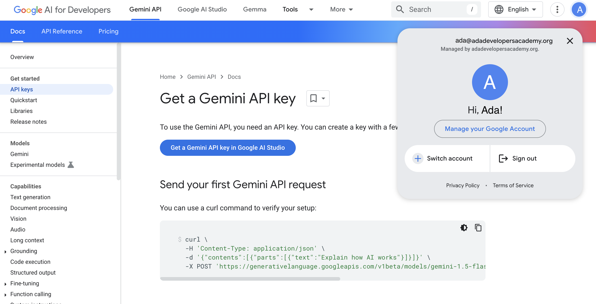
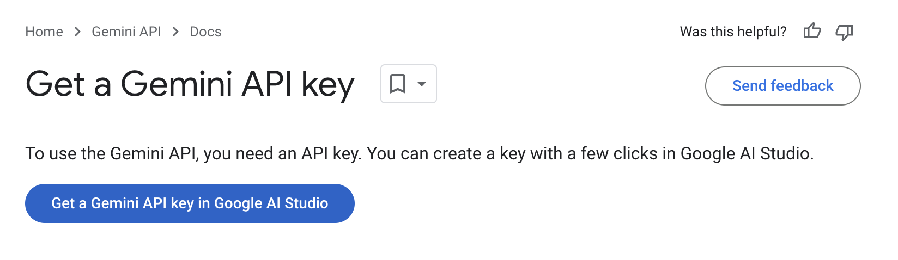
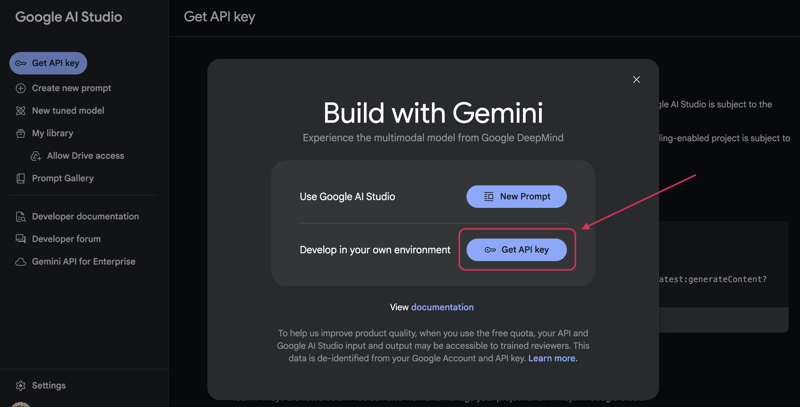
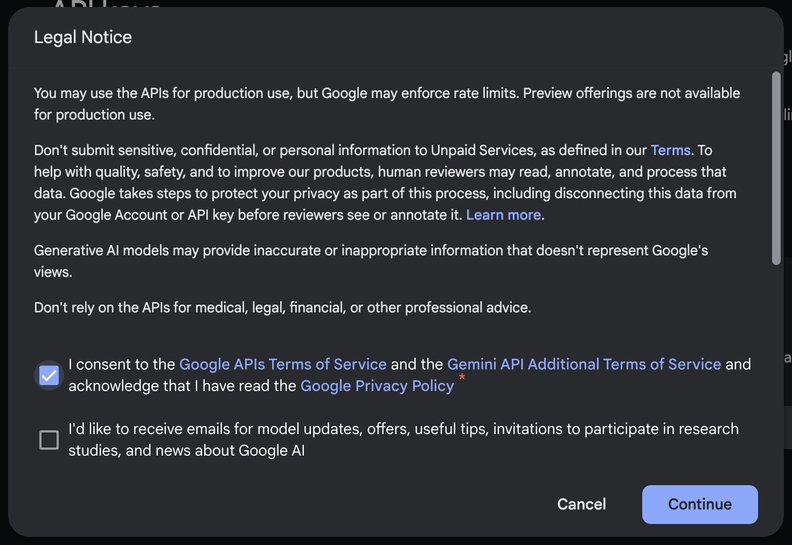
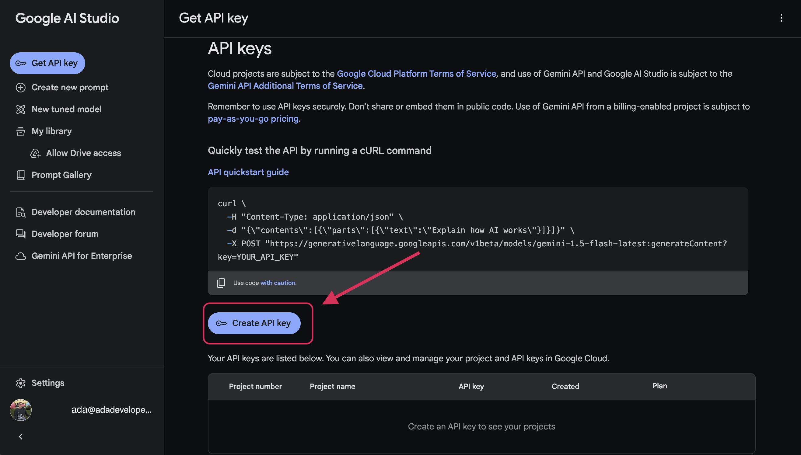
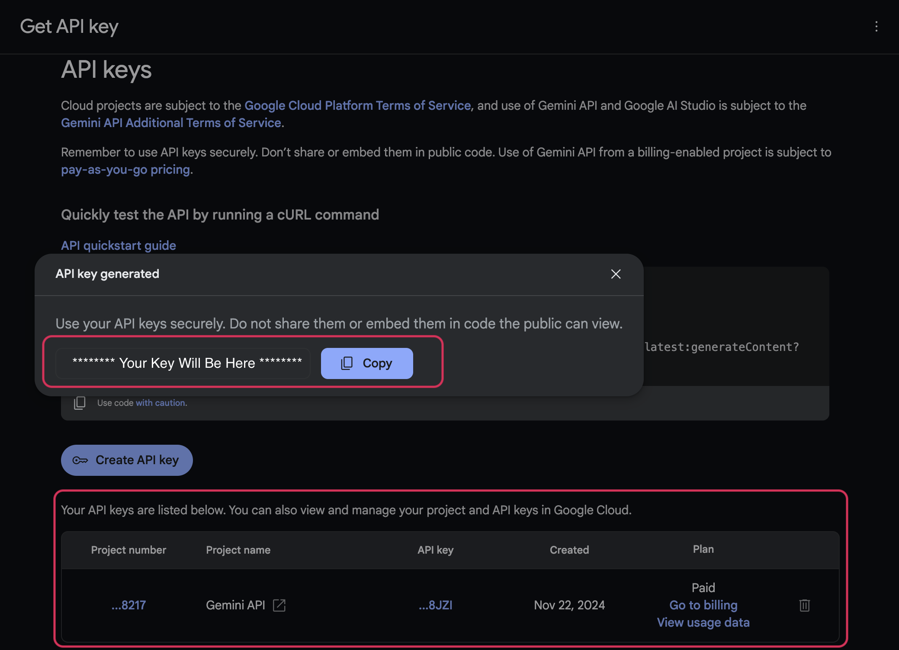
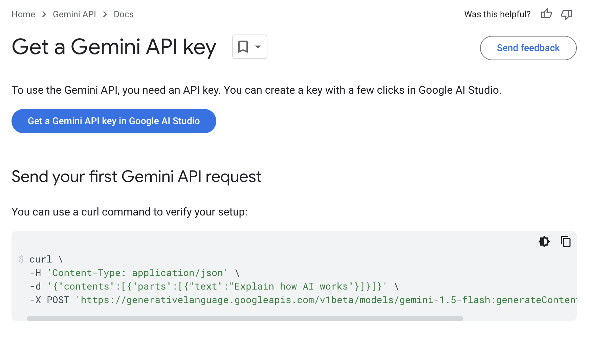

# Getting Ready to Use an AI API

## Goals
Now that we have a good idea of what AI APIs are and some of the ways we can use them, let's get set up to work with one of them: Google Gemini. We'll create an account if necessary, get the permissions we need, and then confirm that everything is working for us to start integrating the Gemini API into our projects!

Our goals for this lesson are to:
- Create an Google account and login if necessary
- Generate an API Key
- Verify that we can make a call to the Gemini API with our API key

## Creating a Google Account

We will need a Google account to create an API key for the Gemini API. If you do not already have a Google account:

1. Please visit this [Create a Google Account article](https://support.google.com/accounts/answer/27441)

2. Under "Step 1: Choose a Google Account type" press the "For myself" button.

3. A new tab will open with guided prompts to create your Google account. Please follow these until you get a success message. 
 
If you run into issues creating a Google account, please reach out in #study-hall on Slack or stop by office hours.

## Creating an API Key

As with most APIs, we are required to use an API key to authenticate calls to the Gemini API. Follow the steps below to create your API key.

1. Visit [Google Gemini's API key documentation](https://ai.google.dev/gemini-api/docs/api-key) and ensure you are signed in to your Google account by checking the upper right corner of the page. 
    
   *Fig. Google Gemini API Key documentation with signed in user showing ([Full Size Image](assets/setting-up-ai-api/api_key_docs_check_signed_in.png))*  

2. Press the button labeled "Get a Gemini API key in Google AI Studio" to open the Google AI Studio API Key website in a new tab. 
    
   *Fig. Close up on the "Get a Gemini API key in Google AI Studio" button ([Full Size Image](assets/setting-up-ai-api/get_api_key_docs.png))* 

   We want to leave the current browser tab with the Gemini API Key documentation open because we will come back here to test our API key at the end. 

3. When the Google AI Studio tab loads, we should see a pop up asking us to choose an environment. Since we want to make calls from Postman, VS Code, and maybe more, we will select "Get API key" next to "Develop in your own environment"   
    
   *Fig. Google AI Studio pop up ([Full Size Image](assets/setting-up-ai-api/api_key_choose_environment.png))* 

4. After this we will be shown and need to accept the Google Gemini API's Terms of Service before we can proceed.
    
   *Fig. Google AI Studio pop up showing the Google Gemini API Terms of Service ([Full Size Image](assets/setting-up-ai-api/api_key_legal_notice.png))* 

5. The pop up will dismiss and leave us on the Google AI Studio "Get API Key" page. We can now press the "Create API Key" button in the middle of the page to generate our Gemini API key. 
    
   *Fig. "Create API Key" button on the Google AI Studio "Get API Key" page ([Full Size Image](assets/setting-up-ai-api/create_api_key_button.png))* 

6. A pop up will be displayed with a spinner while the API key is generating. Once the API key is created the pop up will display the API key with an option to copy it. 

   The webpage will also have updated to show our new API key underneath the button we just used to create our key. We may create multiple keys if we implement different AI features in different projects. All of the Gemini API keys we create will be listed here.
    
   *Fig. Newly created API key showing in a pop up and listed on the page ([Full Size Image](assets/setting-up-ai-api/api_key_created.png))* 

## Verifying our API key

We want to see our API key in action before trying to use it from a project, so how can we check it out? We'll look at testing and customizing prompts from Postman in a following section, but we can do a test API call with even less set up just to see if our key is working.

1. Let's go back to the [Google Gemini's API key documentation](https://ai.google.dev/gemini-api/docs/api-key) page. Underneath the button we used to launch Google AI Studio, there's a section "Send your first Gemini API request" that contains a `curl` command that we can run from Terminal. 

    
   *Fig. Send your first Gemini API request section ([Full Size Image](assets/setting-up-ai-api/send_first_request_docs.png))*

2. We will need to edit the end of this command to add our API key. The text box on the page allows us to change the placeholder text at the end of the command to add our API key, then copy the entire command. 

    
   *Fig. Editable placeholder for your API key ([Full Size Image](assets/setting-up-ai-api/editable_api_key_placeholder.png))*

   Feel free to take a moment to read through the parts of the `curl` command and see what you can make sense of. We will talk more in-depth about the information we need to make requests to generate text with the Gemini API in following sections.

3. Next we will paste the whole `curl` command into Terminal and press `Enter` to run it. In the JSON response we will see a key `"text"` that holds a large text description of "How AI works" from our request, along with data about the model used and the request that was made.

   <br>
   <details>
      <summary>Open this section if you'd like to see the response we got when testing our API key</summary> 

   ```
   {
     "candidates": [
       {
         "content": {
           "parts": [
             {
               "text": "AI, or Artificial Intelligence, doesn't work in a single, unified way.  Instead, it's a broad field encompassing many different approaches, all aiming to create systems that can perform tasks that typically require human intelligence. These tasks include things like learning, problem-solving, decision-making, speech recognition, and visual perception.\n\nHere's a breakdown of some key approaches:\n\n**1. Machine Learning (ML):** This is arguably the most dominant approach to AI today.  Instead of being explicitly programmed with rules, ML algorithms learn from data.  They identify patterns, relationships, and insights within the data to make predictions or decisions.  There are several types of ML:\n\n* **Supervised Learning:** The algorithm is trained on a labeled dataset, meaning each data point is tagged with the correct answer.  The algorithm learns to map inputs to outputs based on this labeled data.  Examples include image classification (identifying cats vs. dogs) and spam detection.\n* **Unsupervised Learning:** The algorithm is trained on an unlabeled dataset. It aims to discover hidden patterns, structures, or groupings within the data without any predefined answers. Examples include clustering (grouping similar data points together) and dimensionality reduction (reducing the number of variables while retaining important information).\n* **Reinforcement Learning:** The algorithm learns through trial and error by interacting with an environment. It receives rewards for desirable actions and penalties for undesirable actions. The goal is to learn a policy that maximizes the cumulative reward over time.  Examples include game playing (like AlphaGo) and robotics.\n\n**2. Deep Learning (DL):** This is a subfield of ML that uses artificial neural networks with multiple layers (hence \"deep\").  These networks are inspired by the structure and function of the human brain.  Deep learning excels at tasks involving complex patterns and large amounts of data, such as image recognition, natural language processing, and speech recognition.\n\n**3. Expert Systems:** These systems mimic the decision-making ability of a human expert in a specific domain.  They use a knowledge base containing rules and facts, along with an inference engine to reason and draw conclusions based on the input data.  Expert systems are often used in areas like medical diagnosis and financial analysis.\n\n**4. Natural Language Processing (NLP):** This focuses on enabling computers to understand, interpret, and generate human language.  Techniques include text analysis, machine translation, and chatbot development.  NLP heavily relies on ML and DL techniques.\n\n**5. Computer Vision:** This involves enabling computers to \"see\" and interpret images and videos.  It uses techniques like image recognition, object detection, and image segmentation.  Like NLP, computer vision relies heavily on ML and DL.\n\n\n**How it all works (simplified):**\n\nMost AI systems today involve:\n\n1. **Data Collection:** Gathering large amounts of relevant data.\n2. **Data Preprocessing:** Cleaning, transforming, and preparing the data for the algorithm.\n3. **Model Selection:** Choosing an appropriate algorithm (e.g., a specific type of neural network).\n4. **Training:** Feeding the data to the algorithm, allowing it to learn patterns and relationships.  This often involves adjusting parameters within the algorithm to minimize errors.\n5. **Evaluation:** Assessing the performance of the trained model on new, unseen data.\n6. **Deployment:** Putting the trained model into use to make predictions or decisions.\n\nIt's important to note that AI is still a developing field.  Many challenges remain, including the need for more robust and explainable AI systems, addressing biases in data, and ensuring ethical considerations are addressed.  The explanations above provide a high-level overview; each component involves considerable complexity and sophistication.\n"
             }
           ],
           "role": "model"
         },
         "finishReason": "STOP",
         "avgLogprobs": -0.16841320450644762
       }
     ],
     "usageMetadata": {
       "promptTokenCount": 4,
       "candidatesTokenCount": 767,
       "totalTokenCount": 771
     },
     "modelVersion": "gemini-1.5-flash-002"
   }
   ```

   </details> 

   If you have an API key but are running into issues with this `curl` command, we recommend following along with the next lessons to see if you are able to make a request from Postman, then reach out in #study-hall or come by office hours with your findings to help get you unstuck.

## Check for Understanding

<!-- prettier-ignore-start -->
### !challenge

* type: tasklist
* id: f441202f-319a-4f15-8cf1-2bc6419b7a4f
* title: Setting up the Gemini API

##### !question

Before moving on to the next section, make sure you have completed the three steps below:

##### !end-question

##### !options

* Log into/Create an account
* Generate an API key
* Verify the key works

##### !end-options
### !end-challenge

<!-- prettier-ignore-end -->