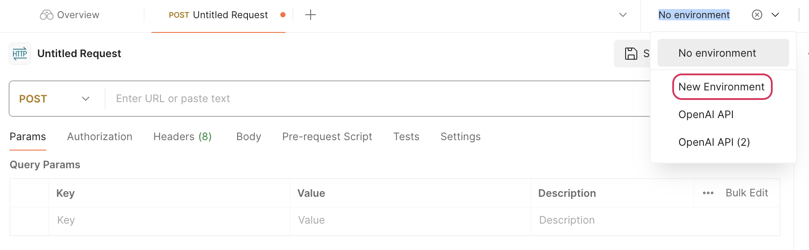
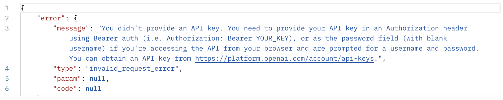
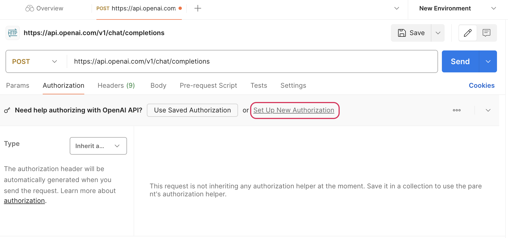
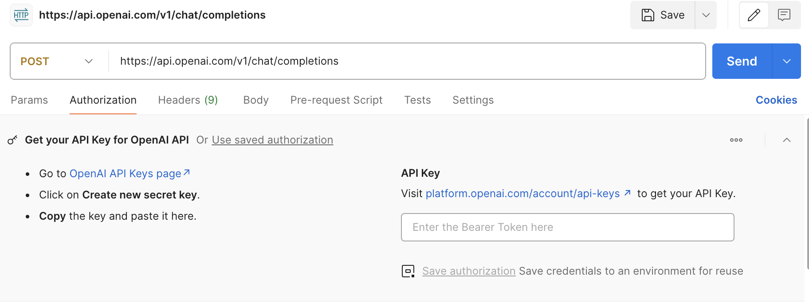
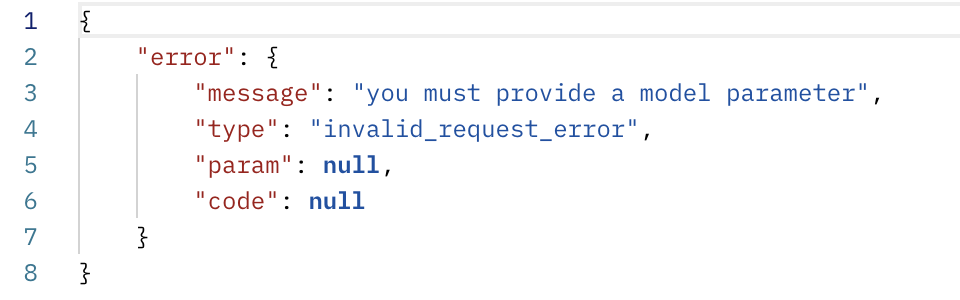
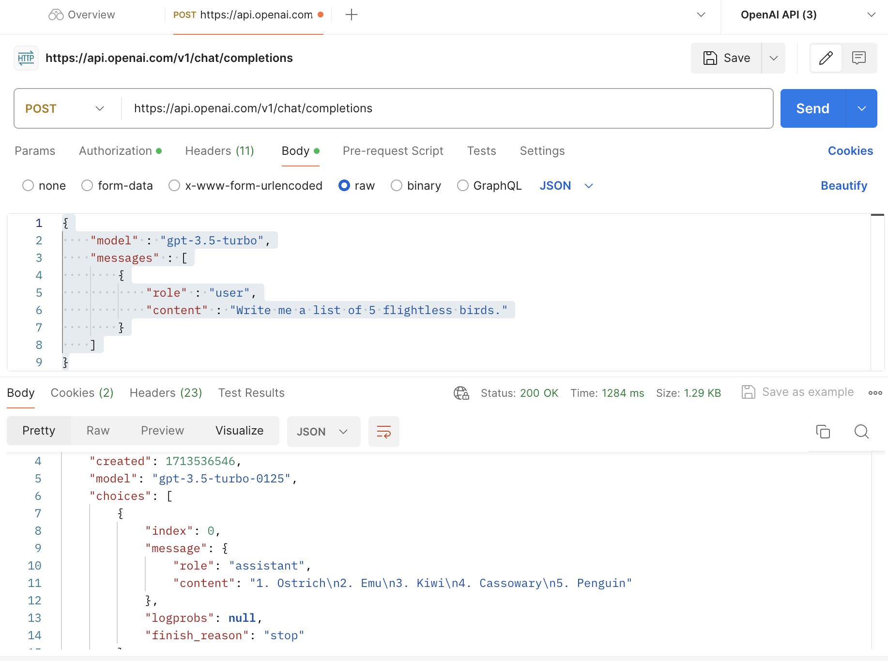

# Setting up the OpenAI API in Postman

## Goals
Now that we have our OpenAI account set up and verified, let's  get OpenAI set up in Postman and Python so we are prepared to start testing our API calls and bringing them into our project.

Our goals for this lesson are to:
- Set up an OpenAI environment in Postman
- Make our first Postman API 
- Learn how to set up the OpenAI library in Python

## The OpenAI API and Postman

As a reminder, when we work with APIs, Postman is a great tool to test our endpoints, make sure we are formatting our requests correctly and ensure that we are receiving the expected responses. 

In the past, when we worked with APIs that require authorization, we created an environment within our project using the .env file where we stored our environment variables such as our API key. To make testing out OpenAI endpoints in Postman just a bit easier, we can create an environment within Postman itself that includes our API key so that we don't have to manually attach it to each request. We can do that following the steps below.

## Setting up OpenAI in Postman

1. Open up an untitled POST request. Click the drop down for "No environment" and select "New Environment". Nothing will happen except what gets selected in the drop down.  
  
*Fig. Postman POST request with New Environment Selected*

2. Add the following request to Postman: https://api.openai.com/v1/chat/completions.   
We will talk more in the next lesson about what this request is and how it works, but for now, we will use it to verify that our environment is set up correctly. If you try and make the request now, you will get the following response body with an error that states you are missing an API key.  
  
*Fig. OpenAI Postman response body with Missing API Key Error*

3. Let's go ahead and add our authorization now. Open up the Authorization tab in Postman and you should see a pop up that asks if you need help authorizing the OpenAI API. Click "Set Up New Authorization"  
  
*Fig. OpenAI authorization tab with "Set Up New Authorization" circled*  

4. You will be taken to a window to enter your OpenAI API key. Enter your API key and press "Save authorization". 
  
*Fig. Tab to enter API key in Postman*

5. Now let's check to see if our API key is registered! If you send the request now, you will see the following error.  
  
*Fig. Model parameters needed error*  

If you get this error, it's a pretty sure sign your API key is working. However, let's add a request body to make sure we are able to get a working response.  Go ahead and navigate to the body tab and select "raw" with JSON as the format. Copy and paste the following request body into the window:

```py
{
    "model" : "gpt-3.5-turbo",
    "messages" : [
        {
            "role" : "user",
            "content" : "Write me a list of 5 flightless birds."
        }
    ]
}
```
You should now be able to submit your POST request and get a response more in line with what you are looking for. Your response may look slightly different, but a sample of what you could see can be seen below:  

 
*Fig. Successful OpenAI POST request with response body*  

If you've made it this far, congratulations! You now have Postman configured to practice the openAI requests that we will be going over in the next couple of lessons. If you saved your environment correctly, it should now exist as an option in Postman when you choose your environment. If for any reason your requests still aren't working, double check your work or reach out to an instructor for further assistance! 

### !callout-warn

## API Calls in Postman Use Credits

Just a quick reminder that any API calls you make to OpenAI will use credits. You can check your usage in your account online.


### !end-callout  

## Check for Understanding

### !challenge

* type: tasklist
* id: 57e2724d-774f-4012-8dc9-25e9ed044e7f
* title: Setting up OpenAI in Postman

##### !question

Before moving on to the next section, make sure you have completed the three setps below:

##### !end-question

##### !options

* Create a new Postman environment
* Add your API key to your new environment
* Make your first OpenAI API call and make sure it works!

##### !end-options

### !end-challenge
