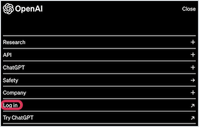
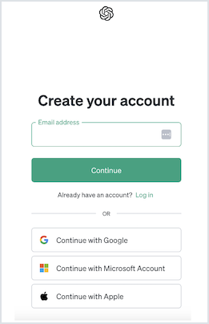
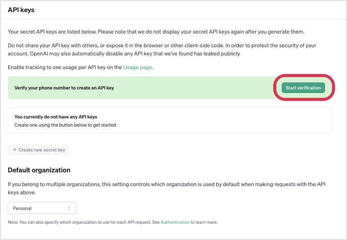
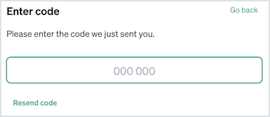

## Setting up the OpenAI API

## Goals
Now that we have a good idea of what the OpenAI API is and some of the ways we can use it, let's go ahead and get it set up. We'll set up our accounts and then set everything up for us to start integrating the OpenAI API into our projects!

Our goals for this lesson are to:
- Create an OpenAI API account and login
- Generate an API Key
- Verify credits have been granted to your account

### !callout-warning

## The OpenAI API is Not Free at this Time
Unfortunately, the OpenAI API is not currently a free API. It is priced according to which AI model you are using and how often you are using it. New users do currently get $5 worth of credits to begin experimenting which is tied to the phone number you provide when signing up. 

### !end-callout

## Creating Your OpenAI Account

1. Access [OpenAI](https://openai.com) and click "Log In" in the upper right corner. Alternatively, click "Menu" followed by "Log In".  
      
    *Fig. "Log In" section of the OpenAI Menu*

2. Log in using the login page. 
   - If you already have a ChatGPT account, you will be able to log in using your ChatGPT credentials.
   - If you do not already have a ChatGPT account, go ahead and create one here.    
      
    *Fig. Login page for OpenAI/ChatGPT*  
3. You will be taken to a screen that allows you to choose whether you would like to access ChatGPT or the API. Go ahead and choose the API.  
     
   *Fig. Screen that allows user to choose between ChatGPT or the OpenAI API*  
4. You should be in to the OpenAI API home page! Feel free to look around!  
      
    *Fig. OpenAI API home page welcoming user to the developer platform*

## Creating an API Key

As with most APIs, you will be required to use an API key to authenticate API calls. Follow the steps below to create your API key.

### !callout-info

## Connecting a Phone Number
When setting up your API key, you will be asked to verify a phone number. As mentioned earlier, $5.00 of free credits are added to each account verified with a new phone number. According to [OpenAI's Phone Verification FAQs:](https://help.openai.com/en/articles/6613520-phone-verification-faq)
- One phone number can be used to verify up to 3 accounts.
- Accounts cannot be verified with VoIP, Google Phone Numbers, Premium numbers or Landlines
- Once a phone number has been used to verify an account, it cannot be removed or changed.

### !end-callout

1. Hover over the leftmost side of the OpenAI home page and the OpenAI menu should appear. Click on the tab for "API keys".  
     
   *Fig. "API keys" section of the OpenAI sidebar menu*  
2. You will be taken to a page for API keys. If this is your first time creating an API key for the OpenAI API, you will be asked to verify your phone number before creating a key. Click the button that says "Start verification".    
    
   *Fig. OpenAI API keys page with phone verification highlighted*  
3. Verify your phone numer. Once you enter your phone number, a text with a code will be sent to you. Enter the code in the corresponding area.  
     
   *Fig. OpenAI Phone verification*  
     
   *Fig. OpenAI Phone verification code input*  

### !callout-warning

## Credits Warning

If your phone number has already been used to verify an OpenAI account, you will receive the following warning:  

  
*Fig. OpenAI credits warning*

### !end-callout

4. Verifying credits were added
   - If you did not receive a warning about credits, you can verify your credits have been added by navigating to the "Usage" tab in the menu on the left side of the page.  
     
   *Fig. OpenAI side menu with "usage" tab circled*  

   - You will be taken to a page and the panel on the right side will have a list of the credits you have recieved and the credits you have used. Here you can verify that credits have been added to your account.     
   
   *Fig. OpenAI usage page with lists of gredits granted and credits used.*  
   - If you do not see credits associated with your account, feel free to reach out to an instructor for assistance.

### !callout-info

## Credits Expiration

In the image above, you may notice that some of the credits have expired. The free credits granted from OpenAI expire after 3 months. You should have received $5.00 which will be more than enough to complete the coursework for the next few lessons with plenty left over to play around on your own. Information on the OpenAI pricing structure can be found [here](https://openai.com/pricing).

### !end-callout   

## Check for Understanding

<!-- prettier-ignore-start -->
### !challenge

* type: tasklist
* id: f441202f-319a-4f15-8cf1-2bc6419b7a4f
* title: Setting up the OpenAI API

##### !question

Before moving on to the next section, make sure you have completed the three setps below:

##### !end-question

##### !options

* Log into OpenAI/Create an account
* Generate API key
* Verify credits

##### !end-options
### !end-challenge

<!-- prettier-ignore-end -->